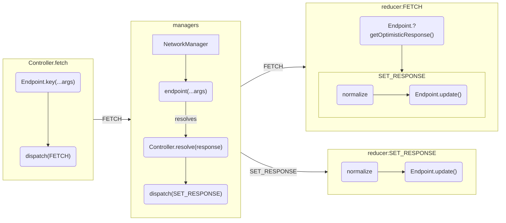
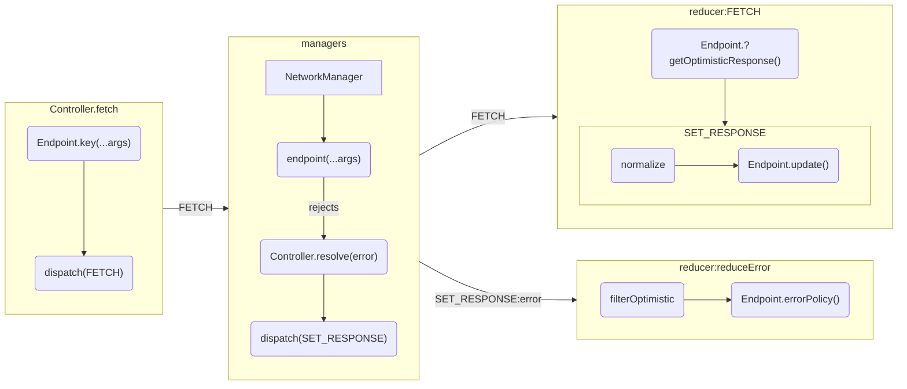

<!-- Generated by `yarn build:skills` from docs/rest/api/Endpoint.md (react). Edit the source doc, not this file. -->

# Endpoint

`Endpoint` are for any asynchronous function (one that returns a Promise).

`Endpoints` define a strongly typed standard interface of relevant metadata and lifecycles
useful for Reactive Data Client and other stores.

Package: [@data-client/endpoint](https://www.npmjs.com/package/@data-client/endpoint)

> **Tip**
>
> Endpoint is a protocol independent class. Try using the protocol specific patterns
> [REST](https://dataclient.io/rest/api/RestEndpoint), [GraphQL](https://dataclient.io/graphql/api/GQLEndpoint),
> or [getImage](https://dataclient.io/docs/guides/img-media#just-images) instead.

<details>

<summary>Interface</summary>

**Interface**

```typescript
export interface EndpointInterface<
  F extends FetchFunction = FetchFunction,
  S extends Schema | undefined = Schema | undefined,
  M extends true | undefined = true | undefined,
> extends EndpointExtraOptions<F> {
  (...args: Parameters<F>): InferReturn<F, S>;
  key(...args: Parameters<F>): string;
  readonly sideEffect?: M;
  readonly schema?: S;
}
```

**Class**

```typescript
class Endpoint<F extends (...args: any) => Promise<any>>
  implements EndpointInterface
{
  constructor(fetchFunction: F, options: EndpointOptions);

  key(...args: Parameters<F>): string;

  readonly sideEffect?: true;

  readonly schema?: Schema;

  fetch: F;

  extend(options: EndpointOptions): Endpoint;
}

export interface EndpointOptions extends EndpointExtraOptions {
  key?: (params: any) => string;
  sideEffect?: true | undefined;
  schema?: Schema;
}
```

**EndpointExtraOptions**

```typescript
export interface EndpointExtraOptions<F extends FetchFunction = FetchFunction> {
  /** Default data expiry length, will fall back to NetworkManager default if not defined */
  readonly dataExpiryLength?: number;
  /** Default error expiry length, will fall back to NetworkManager default if not defined */
  readonly errorExpiryLength?: number;
  /** Poll with at least this frequency in milliseconds */
  readonly pollFrequency?: number;
  /** Marks cached resources as invalid if they are stale */
  readonly invalidIfStale?: boolean;
  /** Enables optimistic updates for this request - uses return value as assumed network response */
  readonly getOptimisticResponse?: (
    snap: SnapshotInterface,
    ...args: Parameters<F>
  ) => ResolveType<F>;
  /** Determines whether to throw or fallback to */
  readonly errorPolicy?: (error: any) => 'soft' | undefined;
  /** User-land extra data to send */
  readonly extra?: any;
}
```

</details>

## Usage

`Endpoint` makes existing async functions usable in any Reactive Data Client context with full TypeScript enforcement.

```ts title="interface"
export interface Todo {
  id: number;
  userId: number;
  title: string;
  completed: boolean;
}
```

```ts title="api" {11}
import { Todo } from './interface';

const getTodoOriginal = (id: number): Promise<Todo> =>
  Promise.resolve({
    id,
    title: 'delectus aut autem ' + id,
    completed: false,
    userId: 1,
  });

export const getTodo = new Endpoint(getTodoOriginal);
```

```tsx title="React"
import { getTodo } from './api';

function TodoDetail() {
  const todo = useSuspense(getTodo, 1);
  return <div>{todo.title}</div>;
}
render(<TodoDetail />);
```

### Configuration sharing

Use [Endpoint.extend()](#extend) instead of `{...getTodo}` (spread)

```ts
const getTodoNormalized = getTodo.extend({ schema: Todo });
const getTodoUpdatingEveryFiveSeconds = getTodo.extend({ pollFrequency: 5000 });
```

## Lifecycle

### Success



### Error



## Endpoint Members

Members double as options (second constructor arg). While none are required, the first few
have defaults.

### key: (params) => string {#key}

Serializes the parameters. This is used to build a lookup key in global stores.

Default:

```typescript
`${this.name} ${JSON.stringify(params)}`;
```

> **Warning: Overrides**
>
> When overriding `key`, be sure to also include an updated [testKey](#testKey) if
> you intend on using that method.

### testKey(key): boolean {#testKey}

Returns `true` if the provided (fetch) [key](#key) matches this endpoint.

This is used for mock interceptors with with [\<MockResolver />](https://dataclient.io/docs/api/MockResolver)

### name: string {#name}

Used in [key](#key) to distinguish endpoints. Should be globally unique.

Defaults to `this.fetch.name`

> **Warning**
>
> This may break in production builds that change function names.
> This is often know as [function name mangling](https://terser.org/docs/api-reference#mangle-options).
>
> In these cases you can override `name` or disable function mangling.

### sideEffect: boolean {#sideeffect}

Used to indicate endpoint might have side-effects (non-idempotent). This restricts it
from being used with [useSuspense()](https://dataclient.io/docs/api/useSuspense) or [useFetch()](https://dataclient.io/docs/api/useFetch) as those can hit the
endpoint an unpredictable number of times.

### schema: Schema {#schema}

Declarative definition of how to [process responses](https://dataclient.io/rest/api/schema)

- [where](https://dataclient.io/rest/api/schema) to expect [Entities](https://dataclient.io/rest/api/Entity)
- Functions to [deserialize fields](https://dataclient.io/rest/guides/network-transform#deserializing-fields)

Not providing this option means no entities will be extracted.

```tsx
import { Entity } from '@data-client/normalizr';
import { Endpoint } from '@data-client/endpoint';

class User extends Entity {
  id = '';
  username = '';
}

const getUser = new Endpoint(
    ({ id }) ⇒ fetch(`/users/${id}`),
    { schema: User }
);
```

### dataExpiryLength?: number {#dataexpirylength}

Custom data cache lifetime for the fetched resource. Will override the value set in NetworkManager.

[Learn more about expiry time](https://dataclient.io/docs/concepts/expiry-policy#expiry-time)

### errorExpiryLength?: number {#errorexpirylength}

Custom data error lifetime for the fetched resource. Will override the value set in NetworkManager.

### errorPolicy?: (error: any) => 'soft' | undefined {#errorpolicy}

'soft' will use stale data (if exists) in case of error; undefined or not providing option will result
in error.

[Learn more about errorPolicy](https://dataclient.io/docs/concepts/error-policy)

```ts
errorPolicy(error) {
  return error.status >= 500 ? 'soft' : undefined;
}
```

### invalidIfStale: boolean {#invalidifstale}

Indicates stale data should be considered unusable and thus not be returned from the cache. This means
that useSuspense() will suspend when data is stale even if it already exists in cache.

### pollFrequency: number {#pollfrequency}

Frequency in millisecond to poll at. Requires using [useSubscription()](https://dataclient.io/docs/api/useSubscription) or
[useLive()](https://dataclient.io/docs/api/useLive) to have an effect.

### getOptimisticResponse: (snap, ...args) => expectedResponse {#getoptimisticresponse}

When provided, any fetches with this endpoint will behave as though the `expectedResponse` return value
from this function was a succesful network response. When the actual fetch completes (regardless
of failure or success), the optimistic update will be replaced with the actual network response.

`expectedResponse` is normalized with the endpoint's [schema](#schema), so TypeScript checks it like a
[Controller.set()](https://dataclient.io/docs/api/Controller#set) value: an [Entity](https://dataclient.io/rest/api/Entity) takes any of its fields, and a
[Collection](https://dataclient.io/rest/api/Collection) takes a list of them. When the endpoint resolves a specific type, like the return
of [process()](https://dataclient.io/rest/api/RestEndpoint#process), it must match that type instead.

```ts title="Post"
import { Entity, schema } from '@data-client/rest';

export class Post extends Entity {
  id = 0;
  author = { id: 0 };
  title = '';
  body = '';
  votes = 0;

  static key = 'Post';

  static schema = {
    author: EntityMixin(
      class User {
        id = 0;
      },
    ),
  };

  get img() {
    return `//loremflickr.com/96/72/kitten,cat?lock=${this.id % 16}`;
  }
}
```

```ts title="PostResource" {15-22}
import { resource } from '@data-client/rest';
import { Post } from './Post';

export { Post };

export const PostResource = resource({
  path: '/posts/:id',
  searchParams: {} as { userId?: string | number } | undefined,
  schema: Post,
}).extend('vote', {
  path: '/posts/:id/vote',
  method: 'POST',
  body: undefined,
  schema: Post,
  getOptimisticResponse(snapshot, { id }) {
    const post = snapshot.get(Post, { id });
    if (!post) throw snapshot.abort;
    return {
      id,
      votes: post.votes + 1,
    };
  },
});
```

```tsx title="PostItem" {7}
import { useController } from '@data-client/react';
import { PostResource, type Post } from './PostResource';

export default function PostItem({ post }: Props) {
  const ctrl = useController();
  const handleVote = () => {
    ctrl.fetch(PostResource.vote, { id: post.id });
  };
  return (
    <div>
      <div className="voteBlock">
        <small className="vote">
          <button className="up" onClick={handleVote}>
            &nbsp;
          </button>
          {post.votes}
        </small>
        
      </div>
      <div>
        <h4>{post.title}</h4>
        <p>{post.body}</p>
      </div>
    </div>
  );
}
interface Props {
  post: Post;
}
```

```tsx title="TotalVotes" {11}
import { Query } from '@data-client/rest';
import { useQuery } from '@data-client/react';
import { PostResource } from './PostResource';

const queryTotalVotes = new Query(
  PostResource.getList.schema,
  posts => posts.reduce((total, post) => total + post.votes, 0),
);

export default function TotalVotes({ userId }: Props) {
  const totalVotes = useQuery(queryTotalVotes, { userId });
  return (
    <center>
      <small>{totalVotes} votes total</small>
    </center>
  );
}
interface Props {
  userId: number;
}
```

```tsx title="PostList"
import { useSuspense } from '@data-client/react';
import { PostResource } from './PostResource';
import PostItem from './PostItem';
import TotalVotes from './TotalVotes';

function PostList() {
  const userId = 2;
  const posts = useSuspense(PostResource.getList, { userId });
  return (
    <div>
      {posts.map(post => (
        <PostItem key={post.pk()} post={post} />
      ))}
      <TotalVotes userId={userId} />
    </div>
  );
}
render(<PostList />);
```

[Optimistic update guide](https://dataclient.io/rest/guides/optimistic-updates)

### update() {#update}

```ts
(normalizedResponseOfThis, ...args) =>
  ({ [endpointKey]: (normalizedResponseOfEndpointToUpdate) => updatedNormalizedResponse) })
```

> **Tip**
>
> Try using [Collections](https://dataclient.io/rest/api/Collection) instead.
>
> They are much easier to use and more robust!

```ts title="UpdateType.ts"
type UpdateFunction<
  Source extends EndpointInterface,
  Updaters extends Record<string, any> = Record<string, any>,
> = (
  source: ResultEntry<Source>,
  ...args: Parameters<Source>
) => { [K in keyof Updaters]: (result: Updaters[K]) => Updaters[K] };
```

Simplest case:

```ts title="userEndpoint.ts"
const createUser = new RestEndpoint({
  path: '/user',
  method: 'POST',
  schema: User,
  update: (newUserId: string) => ({
    [userList.key()]: (users = []) => [newUserId, ...users],
  }),
});
```

More updates:

```typescript title="Component.tsx"
const allusers = useSuspense(userList);
const adminUsers = useSuspense(userList, { admin: true });
```

The endpoint below ensures the new user shows up immediately in the usages above.

```ts title="userEndpoint.ts"
const createUser = new RestEndpoint({
  path: '/user',
  method: 'POST',
  schema: User,
  update: (newUserId, newUser)  => {
    const updates = {
      [userList.key()]: (users = []) => [newUserId, ...users],
    ];
    if (newUser.isAdmin) {
      updates[userList.key({ admin: true })] = (users = []) => [newUserId, ...users];
    }
    return updates;
  },
});
```

### extend(options): Endpoint {#extend}

Can be used to further customize the endpoint definition

```typescript
const getUser = new Endpoint(({ id }) ⇒ fetch(`/users/${id}`));

const getUserNormalized = getUser.extend({ schema: User });
```

In addition to the members, `fetch` can be sent to override the fetch function.

## Examples

**Basic**

```typescript
import { Endpoint } from '@data-client/endpoint';

const UserDetail = new Endpoint(
  ({ id }) ⇒ fetch(`/users/${id}`).then(res => res.json())
);
```

**With Schema**

```typescript
import { Endpoint, Entity } from '@data-client/endpoint';

class User extends Entity {
  id = '';
  username = '';
}

const UserDetail = new Endpoint(
  ({ id }) ⇒ fetch(`/users/${id}`).then(res => res.json()),
  { schema: User }
);
```

**List**

```typescript
import { Endpoint, Entity } from '@data-client/endpoint';

class User extends Entity {
  id = '';
  username = '';
}

const UserList = new Endpoint(
  () ⇒ fetch(`/users/`).then(res => res.json()),
  { schema: [User] }
);
```

**React**

```tsx
function UserProfile() {
  const user = useSuspense(UserDetail, { id });
  const ctrl = useController();

  return <UserForm user={user} onSubmit={() => ctrl.fetch(UserDetail)} />;
}
```

**JS/Node Schema**

```typescript
const user = await UserDetail({ id: '5' });
console.log(user);
```

### Additional

- [Pagination](https://dataclient.io/rest/guides/pagination)
- [Mocking unfinished endpoints](https://dataclient.io/rest/guides/mocking-unfinished)
- [Optimistic updates](https://dataclient.io/rest/guides/optimistic-updates)

## Motivation

There is a distinction between

- What are networking API is
  - How to make a request, expected response fields, etc.
- How it is used
  - Binding data, polling, triggering imperative fetch, etc.

Thus, there are many benefits to creating a distinct seperation of concerns between
these two concepts.

With `TypeScript Standard Endpoints`, we define a standard for declaring in
TypeScript the definition of a networking API.

- Allows API authors to publish npm packages containing their API interfaces
- Definitions can be consumed by any supporting library, allowing easy consumption across libraries like Vue, React, Angular
- Writing codegen pipelines becomes much easier as the output is minimal
- Product developers can use the definitions in a multitude of contexts where behaviors vary
- Product developers can easily share code across platforms with distinct behaviors needs like React Native and React Web

### What's in an Endpoint

- A function that resolves the results
- A function to uniquely store those results
- Optional: information about how to store the data in a normalized cache
- Optional: whether the request could have side effects - to prevent repeat calls
