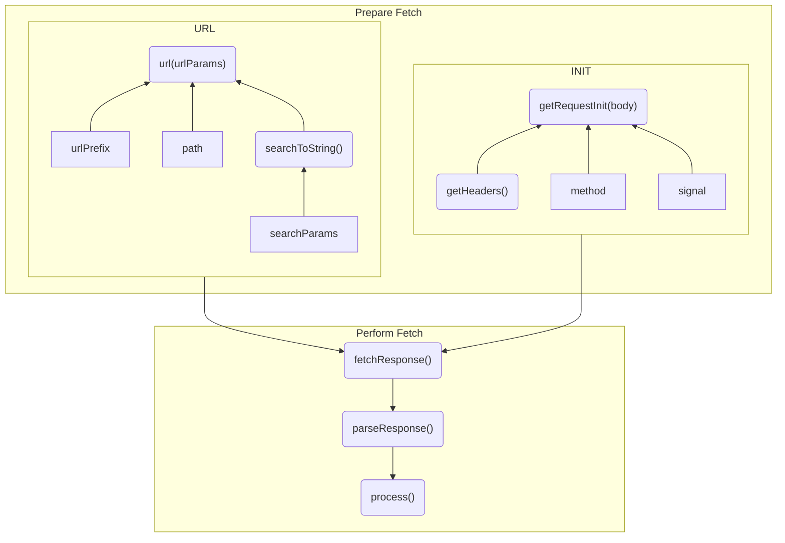

<!-- Generated by `yarn build:skills` from docs/rest/api/RestEndpoint.md (vue). Edit the source doc, not this file. -->

# RestEndpoint

`RestEndpoints` are for [HTTP](https://developer.mozilla.org/en-US/docs/Web/HTTP) based protocols like REST.

> **Info: extends**
>
> `RestEndpoint` extends [Endpoint](https://dataclient.io/rest/api/Endpoint)

<details>

<summary>Interface</summary>

**RestEndpoint**

```typescript
interface RestGenerics {
  readonly path: string;
  readonly schema?: Schema | undefined;
  readonly method?: string;
  readonly body?: any;
  readonly searchParams?: any;
  readonly paginationField?: string;
  readonly content?: 'json' | 'blob' | 'text' | 'arrayBuffer' | 'stream';
  process?(value: any, ...args: any): any;
}

export class RestEndpoint<O extends RestGenerics = any> extends Endpoint {
  /* Prepare fetch */
  readonly path: string;
  readonly urlPrefix: string;
  readonly requestInit: RequestInit;
  readonly method: string;
  readonly paginationField?: string;
  readonly content?: 'json' | 'blob' | 'text' | 'arrayBuffer' | 'stream';
  readonly signal: AbortSignal | undefined;
  url(...args: Parameters<F>): string;
  searchToString(searchParams: Record<string, any>): string;
  getRequestInit(
    this: any,
    body?: RequestInit['body'] | Record<string, unknown>,
  ): Promise<RequestInit> | RequestInit;
  getHeaders(headers: HeadersInit): Promise<HeadersInit> | HeadersInit;

  /* Perform/process fetch */
  fetchResponse(input: RequestInfo, init: RequestInit): Promise<Response>;
  parseResponse(response: Response): Promise<any>;
  process(value: any, ...args: Parameters<F>): any;

  testKey(key: string): boolean;
}
```

**Endpoint**

```typescript
class Endpoint<F extends (...args: any) => Promise<any>> {
  constructor(fetchFunction: F, options: EndpointOptions);

  key(...args: Parameters<F>): string;

  readonly sideEffect?: true;

  readonly schema?: Schema;

  /** Default data expiry length, will fall back to NetworkManager default if not defined */
  readonly dataExpiryLength?: number;
  /** Default error expiry length, will fall back to NetworkManager default if not defined */
  readonly errorExpiryLength?: number;
  /** Poll with at least this frequency in miliseconds */
  readonly pollFrequency?: number;
  /** Marks cached resources as invalid if they are stale */
  readonly invalidIfStale?: boolean;
  /** Enables optimistic updates for this request - uses return value as assumed network response */
  readonly getOptimisticResponse?: (
    snap: SnapshotInterface,
    ...args: Parameters<F>
  ) => ResolveType<F>;
  /** Determines whether to throw or fallback to */
  readonly errorPolicy?: (error: any) => 'soft' | undefined;

  testKey(key: string): boolean;
}
```

</details>

## Usage

All options are supported as arguments to the constructor, [extend](#extend), and as overrides when using [inheritance](#inheritance)

### Simplest retrieval

```ts
const getTodo = new RestEndpoint({
  path: '/todos/:id',
});
```

```ts
const todo = await getTodo({ id: 1 });
```

### Configuration sharing

Use [RestEndpoint.extend()](#extend) instead of `{...getTodo}` ([Object spread](https://developer.mozilla.org/en-US/docs/Web/JavaScript/Reference/Operators/Spread_syntax#spread_in_object_literals))

```ts
const updateTodo = getTodo.extend({ method: 'PUT' });
```

### Managing state

```ts path=Todo.ts
export class Todo extends Entity {
  id = '';
  title = '';
  completed = false;
}

export const getTodo = new RestEndpoint({
  urlPrefix: 'https://jsonplaceholder.typicode.com',
  path: '/todos/:id',
  schema: Todo,
});
export const updateTodo = getTodo.extend({ method: 'PUT' });
```

Using a [Schema](https://dataclient.io/rest/api/schema) enables [automatic data consistency](https://dataclient.io/vue/concepts/normalization) without the need to hurt performance with [refetching](https://dataclient.io/vue/api/Controller#expireAll).

### Typing

```ts title="Comment"
export class Comment extends Entity {
  id = '';
  title = '';
  body = '';
  postId = '';

  static key = 'Comment';
}
```

```ts title="Usage"
import { Comment } from './Comment';

const getComments = new RestEndpoint({
  path: '/posts/:postId/comments',
  schema: new Collection([Comment]),
  searchParams: {} as { sortBy?: 'votes' | 'recent' } | undefined,
});

// Hover your mouse over 'comments' to see its type
const comments = await useSuspense(getComments, {
  postId: '5',
  sortBy: 'votes',
});

const ctrl = useController();
const createComment = async data =>
  ctrl.fetch(getComments.push, { postId: '5' }, data);
```

#### Resolution/Return

[schema](#schema) determines the return value when used with data-binding composables like [useSuspense](https://dataclient.io/vue/api/useSuspense), [useDLE](https://dataclient.io/vue/api/useDLE), [useCache](https://dataclient.io/vue/api/useCache)
or when used with [Controller.fetch](https://dataclient.io/vue/api/Controller#fetch)

```ts title="Todo.ts"
export class Todo extends Entity {
  id = '';
  title = '';
  completed = false;

  static key = 'Todo';
}
```

```ts title="getTodo.ts"
import { Todo } from './Todo';

const getTodo = new RestEndpoint({ path: '/', schema: Todo });
// Hover your mouse over 'todo' to see its type
const todo = await useSuspense(getTodo);

async () => {
  const ctrl = useController();
  const todo2 = await ctrl.fetch(getTodo);
};
```

[process](#process) determines the resolution value when the endpoint is called directly. For
`RestEndpoints` without a schema, it also determines the return type of [composables](https://dataclient.io/vue/api/useSuspense) and [Controller.fetch](https://dataclient.io/vue/api/Controller#fetch).

```ts path="process.ts"
interface TodoInterface {
  title: string;
  completed: boolean;
}
const getTodo = new RestEndpoint({
  path: '/',
  process(value): TodoInterface {
    return value;
  },
});
async () => {
  // todo is TodoInterface
  const todo = await getTodo();

  const ctrl = useController();
  const todo2 = await ctrl.fetch(getTodo);
};
```

#### Function Parameters

[path](#path) used to construct the url determines the type of the first argument. If it has no patterns,
then the 'first' argument is skipped.

```ts
const getRoot = new RestEndpoint({ path: '/' });
getRoot();
const getById = new RestEndpoint({ path: '/:id' });
// both number and string types work as they are serialized into strings to construct the url
getById({ id: 5 });
getById({ id: '5' });
```

[method](#method) determines whether there is a second argument to be sent as the [body](https://developer.mozilla.org/en-US/docs/Web/API/Fetch_API/Using_Fetch#body).

```ts path=method.ts
export const update = new RestEndpoint({
  path: '/:id',
  method: 'PUT',
});
update({ id: 5 }, { title: 'updated', completed: true });
```

However, this is typed as 'any' so it won't catch typos.

[body](#body) can be used to type the argument after the url parameters. It is only used for typing so the
value sent does not matter. `undefined` value can be used to 'disable' the second argument.

```ts path=body.ts
export const update = new RestEndpoint({
  path: '/:id',
  method: 'PUT',
  body: {} as TodoInterface,
});
update({ id: 5 }, { title: 'updated', completed: true });
// `undefined` disables 'body' argument
const rpc = new RestEndpoint({
  path: '/:id',
  method: 'PUT',
  body: undefined,
});
rpc({ id: 5 });
```

[searchParams](#searchParams) can be used in a similar way to `body` to specify types extra parameters, used
for the GET searchParams/queryParams in a [url()](#url).

```ts
const getUsers = new RestEndpoint({
  path: '/:group/user/:id',
  searchParams: {} as { isAdmin?: boolean; sort: 'asc' | 'desc' },
});
getUsers.url({ group: 'big', id: '5', sort: 'asc' }) ===
  '/big/user/5?sort=asc';
getUsers.url({
  group: 'big',
  id: '5',
  sort: 'desc',
  isAdmin: true,
}) === '/big/user/5?isAdmin=true&sort=desc';
```

## Fetch Lifecycle

RestEndpoint adds to Endpoint by providing customizations for a provided fetch method using
[inheritance](#inheritance) or [.extend()](#extend).



```ts title="fetch implementation for RestEndpoint"
function fetch(...args) {
  const urlParams = this.#hasBody && args.length < 2 ? {} : args[0] || {};
  const body = this.#hasBody ? args[args.length - 1] : undefined;
  return this.fetchResponse(
    this.url(urlParams),
    await this.getRequestInit(body),
  )
    .then(response => this.parseResponse(response))
    .then(res => this.process(res, ...args));
}
```

## Prepare Fetch

Members double as options (second constructor arg). While none are required, the first few
have defaults.

### url(params): string {#url}

`urlPrefix` + `path template` + '?' + searchToString(`searchParams`)

`url()` uses the `params` to fill in the [path template](#path). Any unused `params` members are then used
as [searchParams](https://developer.mozilla.org/en-US/docs/Web/API/URL/searchParams) (aka 'GET' params - the stuff after `?`).

<details>

<summary>Implementation</summary>

```typescript
import { getUrlBase, getUrlTokens } from '@data-client/rest';

url(urlParams = {}) {
  const urlBase = getUrlBase(this.path)(urlParams);
  const tokens = getUrlTokens(this.path);
  const searchParams = {};
  Object.keys(urlParams).forEach(k => {
    if (!tokens.has(k)) {
      searchParams[k] = urlParams[k];
    }
  });
  if (Object.keys(searchParams).length) {
    return `${this.urlPrefix}${urlBase}?${this.searchToString(searchParams)}`;
  }
  return `${this.urlPrefix}${urlBase}`;
}
```

</details>

### searchToString(searchParams): string {#searchToString}

Constructs the [searchParams](https://developer.mozilla.org/en-US/docs/Web/API/URL/searchParams) component of [url](#url).

By default uses the standard [URLSearchParams](https://developer.mozilla.org/en-US/docs/Web/API/URLSearchParams) global.

[searchParams](https://developer.mozilla.org/en-US/docs/Web/API/URL/searchParams) (aka queryParams) are sorted to maintain determinism.

<details>

<summary>Implementation</summary>

```typescript
searchToString(searchParams) {
  const params = new URLSearchParams(searchParams);
  params.sort();
  return params.toString();
}
```

</details>

#### Using `qs` library

To encode complex objects in the searchParams, you can use the [qs](https://github.com/ljharb/qs) library.

```typescript
import { RestEndpoint, RestGenerics } from '@data-client/rest';
import qs from 'qs';

class QSEndpoint<O extends RestGenerics = any> extends RestEndpoint<O> {
  searchToString(searchParams) {
    return qs.stringify(searchParams);
  }
}
```

```typescript title="QSEndpoint" {7}
import { RestEndpoint, RestGenerics } from '@data-client/rest';
import qs from 'qs';

export default class QSEndpoint<
  O extends RestGenerics = any,
> extends RestEndpoint<O> {
  searchToString(searchParams) {
    return qs.stringify(searchParams);
  }
}
```

```typescript title="getFoo"
import QSEndpoint from './QSEndpoint';

const getFoo = new QSEndpoint({
  path: '/foo',
  searchParams: {} as { a: Record<string, string> },
});

getFoo({ a: { b: 'c' } });
```

### path: string {#path}

Uses [path-to-regexp v8](https://github.com/pillarjs/path-to-regexp) to build
urls using the parameters passed. This also informs the types so they are properly enforced.

#### Parameters

`:` prefixed words are parameter names. Both strings and numbers are accepted as values,
since they are serialized into the url string.

```ts
const getThing = new RestEndpoint({ path: '/:group/things/:id' });
getThing({ group: 'first', id: 77 });
```

#### Optional parameters

Wrap the optional segment (including its prefix) in `{}` to make it [optional](https://github.com/pillarjs/path-to-regexp?tab=readme-ov-file#optional).
The type of optional parameters becomes `string | number | undefined`.

```ts
const optional = new RestEndpoint({
  path: '/:group/things{/:number}',
});
optional({ group: 'first' });
optional({ group: 'first', number: 'fifty' });
```

Multiple optional segments can be chained with different prefixes:

```ts
const ep = new RestEndpoint({
  path: '{/:attr1}{-:attr2}{-:attr3}',
});

ep({ attr1: 'hi' });
ep({ attr2: 'hi' });
ep({ attr1: 'hi', attr3: 'ho' });
```

#### Wildcards (repeating parameters)

`*name` matches one-or-more path segments. Wrap in `{}` to make it zero-or-more (optional).
Wildcard parameters are typed as `string[]` (arrays), since they represent multiple path segments.

```ts
const files = new RestEndpoint({ path: '/files/*path' });
files({ path: ['documents', 'reports', 'q4'] });
// URL: /files/documents/reports/q4

const optionalFiles = new RestEndpoint({ path: '/files{/*path}' });
optionalFiles({});
// URL: /files
optionalFiles({ path: ['documents'] });
// URL: /files/documents
```

#### Quoted parameter names

Parameter names must be valid JavaScript identifiers. Names containing special characters
like `-` or `.` must be quoted with double quotes:

```ts
const ep = new RestEndpoint({ path: '/:"with-dash"/:"my.param"' });
ep({ 'with-dash': 'hello', 'my.param': 'world' });
```

#### Escaping special characters

Characters `{}()*:` and `\\` are special in path-to-regexp and must be escaped with `\\` when used as literals.

```ts
const getSite = new RestEndpoint({
  path: 'https\\://site.com/:slug',
});
getSite({ slug: 'first' });
```

`?` and `+` are **not** special in path-to-regexp v8 and do not need escaping.
This means query strings can be embedded in the path without escaping `?`:

```ts
const search = new RestEndpoint({
  path: '/search?{q=:q}{&page=:page}',
});
search({ q: 'test', page: 1 });
// URL: /search?q=test&page=1
```

> **Info**
>
> Types are inferred automatically from `path`.
>
> Additional parameters can be specified with [searchParams](#searchParams)
> and [body](#body).

### searchParams {#searchParams}

`searchParams` can be to specify types extra parameters, used for the GET searchParams/queryParams in a [url()](#url).

The actual **value is not used** in any way - this only determines [typing](#typing).

```typescript title="getFoo"
const getReactSite = new RestEndpoint({
  path: 'https\\://site.com/:slug',
  searchParams: {} as { isReact: boolean },
});

getReactSite({ slug: 'cool', isReact: true });
```

### body {#body}

`body` can be used to set a second argument for mutation endpoints. The actual **value is not
used** in any way - this only determines [typing](#typing).

This is only used by endpoings with a method that uses body: 'POST', 'PUT', 'PATCH'.

```ts {4}
const updateSite = new RestEndpoint({
  path: 'https\\://site.com/:slug',
  method: 'POST',
  body: {} as { url: string },
});

updateSite({ slug: 'cool' }, { url: '/' });
```

### paginationField

If specified, will add [getPage](#getpage) method on the `RestEndpoint`. [Pagination guide](https://dataclient.io/rest/guides/pagination). Schema
must also contain a [Collection](https://dataclient.io/rest/api/Collection).

### urlPrefix: string = '' {#urlPrefix}

Prepends this to the compiled [path](#path)

#### Inheritance defaults

```typescript
export class MyEndpoint<
  O extends RestGenerics = any,
> extends RestEndpoint<O> {
  // this allows us to override the prefix in production environments, with a dev fallback
  urlPrefix = process.env.API_SERVER ?? 'http://localhost:8000';
}
```

[Learn more about inheritance patterns](#inheritance) for RestEndpoint

#### Instance overrides

```typescript
export const getTicker = new RestEndpoint({
  urlPrefix: 'https://api.exchange.coinbase.com',
  path: '/products/:product_id/ticker',
  schema: Ticker,
});
```

#### Dynamic prefix

> **Tip**
>
> For a dynamic prefix, try overriding the url() method instead:
>
> ```ts
> const getTodo = new RestEndpoint({
>   path: '/todo/:id',
>   url(...args) {
>     return dynamicPrefix() + super.url(...args);
>   },
> });
> ```

### method: string = 'GET' {#method}

[Method](https://developer.mozilla.org/en-US/docs/Web/API/Request/method) is part of the HTTP protocol.
REST protocols use these to indicate the type of operation. Because of this RestEndpoint uses this
to inform `sideEffect` and whether the endpoint should use a `body` payload. Setting
`sideEffect` explicitly will override this behavior, allowing for non-standard API designs.

`GET` is 'readonly', other methods imply sideEffects.

`GET` and `DELETE` both default to no `body`.

> **Tip: How method affects function Parameters**
>
> `method` only influences parameters in the RestEndpoint constructor and _not_ [.extend()](#extend).
> This allows non-standard method-body combinations.
>
> `body` will default to `any`. You can always set body explicitly to take full control. `undefined` can be used
> to indicate there is no body.
>
> ```ts
> (id: string, myPayload: Record<string, unknown>) => {
>   const standardCreate = new RestEndpoint({
>     path: '/:id',
>     method: 'POST',
>   });
>   standardCreate({ id }, myPayload);
>   const nonStandardEndpoint = new RestEndpoint({
>     path: '/:id',
>     method: 'POST',
>     body: undefined,
>   });
>   // no second 'body' argument, because body was set to 'undefined'
>   nonStandardEndpoint({ id });
> };
> ```

### getRequestInit(body): RequestInit {#getRequestInit}

Prepares [RequestInit](https://developer.mozilla.org/en-US/docs/Web/API/WindowOrWorkerGlobalScope/fetch) used in fetch.
This is sent to [fetchResponse](#fetchResponse)

> **Tip: async**
>
> ```ts
> import { RestEndpoint, RestGenerics } from '@data-client/rest';
>
> export default class AuthdEndpoint<
>   O extends RestGenerics = any,
> > extends RestEndpoint<O> {
>   async getRequestInit(body) {
>     return {
>       ...(await super.getRequestInit(body)),
>       method: await getMethod(),
>     };
>   }
> }
>
> async function getMethod() {
>   return 'GET';
> }
> ```

### getHeaders(headers: HeadersInit): HeadersInit {#getHeaders}

Called by [getRequestInit](#getRequestInit) to determine [HTTP Headers](https://developer.mozilla.org/en-US/docs/Web/API/Request/headers)

This is often useful for [authentication](./auth.vue.md)

> **Warning**
>
> Don't use composables here. If you need to use composables, try using [hookifyResource](./hookifyResource.vue.md)

> **Tip: async**
>
> ```ts
> import { RestEndpoint, RestGenerics } from '@data-client/rest';
>
> export default class AuthdEndpoint<
>   O extends RestGenerics = any,
> > extends RestEndpoint<O> {
>   async getHeaders(headers: HeadersInit) {
>     return {
>       ...headers,
>       'Access-Token': await getAuthToken(),
>     };
>   }
> }
>
> async function getAuthToken() {
>   return 'example';
> }
> ```

## Handle fetch

### fetchResponse(input, init): Promise {#fetchResponse}

Performs the [fetch(input, init)](https://developer.mozilla.org/en-US/docs/Web/API/Fetch_API) call. When
[response.ok](https://developer.mozilla.org/en-US/docs/Web/API/Response/ok) is not `true` (like 404),
will throw a NetworkError.

### content {#content}

Controls how the [Response](https://developer.mozilla.org/en-US/docs/Web/API/Response) body is parsed.
When set, the return type is inferred automatically, and `schema` is constrained to `undefined`
for non-JSON content types.

| Value           | Parses via                                                                                      | Return type                  |
| --------------- | ----------------------------------------------------------------------------------------------- | ---------------------------- |
| `'json'`        | [response.json()](https://developer.mozilla.org/en-US/docs/Web/API/Response/json)               | `any`                        |
| `'blob'`        | [response.blob()](https://developer.mozilla.org/en-US/docs/Web/API/Response/blob)               | `Blob`                       |
| `'text'`        | [response.text()](https://developer.mozilla.org/en-US/docs/Web/API/Response/text)               | `string`                     |
| `'arrayBuffer'` | [response.arrayBuffer()](https://developer.mozilla.org/en-US/docs/Web/API/Response/arrayBuffer) | `ArrayBuffer`                |
| `'stream'`      | `response.body`                                                                                 | `ReadableStream<Uint8Array>` |
| _unset_         | Auto-detect from Content-Type header                                                            | `any`                        |

When `content` is not set, `parseResponse` auto-detects the response type from the
`Content-Type` header: JSON types call `.json()`, binary types (images, `application/octet-stream`,
PDFs, etc.) call `.blob()`, and text-like types call `.text()`.

#### File downloads {#file-download}

For file downloads, set `content: 'blob'`. The return type is `Blob` and `schema` must be
`undefined` (binary data cannot be normalized). Use `dataExpiryLength: 0` to avoid caching
large blobs in memory.

```ts
const downloadFile = new RestEndpoint({
  path: '/files/:id/download',
  content: 'blob',
  dataExpiryLength: 0,
});
```

To extract the filename from the `Content-Disposition` header, override `parseResponse`:

```ts
const downloadFile = new RestEndpoint({
  path: '/files/:id/download',
  content: 'blob',
  dataExpiryLength: 0,
  async parseResponse(response) {
    const blob = await response.blob();
    const disposition = response.headers.get('Content-Disposition');
    const filename =
      disposition?.match(/filename="?(.+?)"?$/)?.[1] ?? 'download';
    return { blob, filename };
  },
  process(value): { blob: Blob; filename: string } {
    return value;
  },
});
```

See [file download guide](https://dataclient.io/rest/guides/network-transform#file-download) for complete usage with browser download trigger.

### parseResponse(response): Promise {#parseResponse}

Takes the [Response](https://developer.mozilla.org/en-US/docs/Web/API/Response) and parses the body.

When [`content`](#content) is set, it controls parsing directly. Otherwise, auto-detection runs
based on the [`Content-Type` header](https://developer.mozilla.org/en-US/docs/Web/HTTP/Headers/Content-Type):
JSON types call [.json()](https://developer.mozilla.org/en-US/docs/Web/API/Response/json), binary
types call [.blob()](https://developer.mozilla.org/en-US/docs/Web/API/Response/blob), and text-like
types call [.text()](https://developer.mozilla.org/en-US/docs/Web/API/Response/text).

If `status` is 204, resolves as `null`.

Override this for advanced cases like extracting headers alongside the body.

### process(value, ...args): any {#process}

Perform any transforms with the parsed result. Defaults to identity function (do nothing).

`args` are the arguments the endpoint was called with. In [extend()](#extend), they are typed from the
resulting endpoint's [path](#path), [searchParams](#searchParams) and [body](#body).

```ts
const getUser = new RestEndpoint({ path: '/users/:id' });

const getUserWithId = getUser.extend({
  process(value, params) {
    // params is { id: string | number }
    return { ...value, id: `${params.id}` };
  },
});
```

> **Tip**
>
> The return type of process can be used to set the return type of the endpoint fetch:
>
> ```ts title="getTodo.ts" {4}
> export const getTodo = new RestEndpoint({
>   path: '/todos/:id',
>   // The identity function is the default value; so we aren't changing any runtime behavior
>   process(value): TodoInterface {
>     return value;
>   },
> });
>
> interface TodoInterface {
>   id: string;
>   title: string;
>   completed: boolean;
> }
> ```
>
> ```ts title="useTodo.ts"
> import { getTodo } from './getTodo';
>
> async (id: string) => {
>   // hover title to see it is a string
>   // see TS autocomplete by deleting `.title` and retyping the `.`
>   const title = (await getTodo({ id })).title;
> };
> ```

## Endpoint Lifecycle

### schema?: Schema {#schema}

[Declarative data lifecycle](https://dataclient.io/rest/api/schema)

- Global data consistency and performance with [DRY](https://www.plutora.com/blog/understanding-the-dry-dont-repeat-yourself-principle) state: [where](https://dataclient.io/rest/api/schema) to expect [Entities](https://dataclient.io/rest/api/Entity)
- Functions to [deserialize fields](https://dataclient.io/rest/guides/network-transform#deserializing-fields)
- [Race condition handling](https://dataclient.io/rest/api/Entity#shouldreorder)
- [Validation](https://dataclient.io/rest/api/Entity#validate)

```tsx
import { Entity, RestEndpoint } from '@data-client/rest';

class User extends Entity {
  id = '';
  username = '';
}

const getUser = new RestEndpoint({
  path: '/users/:id',
  schema: User,
});
```

### key(urlParams): string {#key}

Serializes the parameters. This is used to build a lookup key in global stores.

Default:

```typescript
`${this.method} ${this.url(urlParams)}`;
```

### testKey(key): boolean {#testKey}

Returns `true` if the provided (fetch) [key](#key) matches this endpoint.

This is used for mock interceptors with with [\<MockResolver />](https://dataclient.io/docs/api/MockResolver),
[Controller.expireAll()](https://dataclient.io/vue/api/Controller#expireAll), and [Controller.invalidateAll()](https://dataclient.io/vue/api/Controller#invalidateAll).

### dataExpiryLength?: number {#dataexpirylength}

Custom data cache lifetime for the fetched resource. Will override the value set in NetworkManager.

[Learn more about expiry time](https://dataclient.io/vue/concepts/expiry-policy#expiry-time)

### errorExpiryLength?: number {#errorexpirylength}

Custom data error lifetime for the fetched resource. Will override the value set in NetworkManager.

### errorPolicy?: (error: any) => 'soft' | undefined {#errorpolicy}

'soft' will use stale data (if exists) in case of error; undefined or not providing option will result
in error.

[Learn more about errorPolicy](https://dataclient.io/vue/concepts/error-policy)

```ts
errorPolicy(error) {
  return error.status >= 500 ? 'soft' : undefined;
}
```

### invalidIfStale: boolean {#invalidifstale}

Indicates stale data should be considered unusable and thus not be returned from the cache. This means
that useSuspense() will suspend when data is stale even if it already exists in cache.

### pollFrequency: number {#pollfrequency}

Frequency in millisecond to poll at. Requires using [useSubscription()](https://dataclient.io/vue/api/useSubscription) or
[useLive()](https://dataclient.io/vue/api/useLive) to have an effect.

### getOptimisticResponse: (snap, ...args) => expectedResponse {#getoptimisticresponse}

When provided, any fetches with this endpoint will behave as though the `expectedResponse` return value
from this function was a succesful network response. When the actual fetch completes (regardless
of failure or success), the optimistic update will be replaced with the actual network response.

`expectedResponse` is normalized with the endpoint's [schema](#schema), so TypeScript checks it like a
[Controller.set()](https://dataclient.io/vue/api/Controller#set) value: an [Entity](https://dataclient.io/rest/api/Entity) takes any of its fields, and a
[Collection](https://dataclient.io/rest/api/Collection) takes a list of them. When the endpoint resolves a specific type, like the return
of [process()](./RestEndpoint.vue.md#process), it must match that type instead.

```ts title="Post"
import { Entity, schema } from '@data-client/rest';

export class Post extends Entity {
  id = 0;
  author = { id: 0 };
  title = '';
  body = '';
  votes = 0;

  static key = 'Post';

  static schema = {
    author: EntityMixin(
      class User {
        id = 0;
      },
    ),
  };

  get img() {
    return `//loremflickr.com/96/72/kitten,cat?lock=${this.id % 16}`;
  }
}
```

```ts title="PostResource" {15-22}
import { resource } from '@data-client/rest';
import { Post } from './Post';

export { Post };

export const PostResource = resource({
  path: '/posts/:id',
  searchParams: {} as { userId?: string | number } | undefined,
  schema: Post,
}).extend('vote', {
  path: '/posts/:id/vote',
  method: 'POST',
  body: undefined,
  schema: Post,
  getOptimisticResponse(snapshot, { id }) {
    const post = snapshot.get(Post, { id });
    if (!post) throw snapshot.abort;
    return {
      id,
      votes: post.votes + 1,
    };
  },
});
```

```html title="PostItem.vue" {9}
<script setup lang="ts">
  import { useController } from '@data-client/vue';
  import { PostResource, type Post } from './PostResource';

  const props = defineProps<{ post: Post }>();
  const ctrl = useController();

  const handleVote = () => {
    ctrl.fetch(PostResource.vote, { id: props.post.id });
  };
</script>

<template>
  <div>
    <div class="voteBlock">
      <small class="vote">
        <button class="up" @click="handleVote">&nbsp;</button>
        {{ post.votes }}
      </small>
      
    </div>
    <div>
      <h4>{{ post.title }}</h4>
      <p>{{ post.body }}</p>
    </div>
  </div>
</template>
```

```html title="TotalVotes.vue" {13}
<script setup lang="ts">
  import { Query } from '@data-client/rest';
  import { useQuery } from '@data-client/vue';
  import { PostResource } from './PostResource';

  const queryTotalVotes = new Query(
    PostResource.getList.schema,
    posts => posts.reduce((total, post) => total + post.votes, 0),
  );

  const props = defineProps<{ userId: number }>();
  const totalVotes = useQuery(queryTotalVotes, () => ({ userId: props.userId }));
</script>

<template>
  <center>
    <small>{{ totalVotes }} votes total</small>
  </center>
</template>
```

```html title="PostList.vue"
<script setup lang="ts">
  import { useSuspense } from '@data-client/vue';
  import { PostResource } from './PostResource';
  import PostItem from './PostItem.vue';
  import TotalVotes from './TotalVotes.vue';

  const userId = 2;
  const posts = await useSuspense(PostResource.getList, { userId });
</script>

<template>
  <div>
    <PostItem v-for="post in posts" :key="post.pk()" :post="post" />
    <TotalVotes :userId="userId" />
  </div>
</template>
```

[Optimistic update guide](https://dataclient.io/rest/guides/optimistic-updates)

### update() {#update}

```ts
(normalizedResponseOfThis, ...args) =>
  ({ [endpointKey]: (normalizedResponseOfEndpointToUpdate) => updatedNormalizedResponse) })
```

> **Tip**
>
> Try using [Collections](https://dataclient.io/rest/api/Collection) instead.
>
> They are much easier to use and more robust!

```ts title="UpdateType.ts"
type UpdateFunction<
  Source extends EndpointInterface,
  Updaters extends Record<string, any> = Record<string, any>,
> = (
  source: ResultEntry<Source>,
  ...args: Parameters<Source>
) => { [K in keyof Updaters]: (result: Updaters[K]) => Updaters[K] };
```

Simplest case:

```ts title="userEndpoint.ts"
const createUser = new RestEndpoint({
  path: '/user',
  method: 'POST',
  schema: User,
  update: (newUserId: string) => ({
    [userList.key()]: (users = []) => [newUserId, ...users],
  }),
});
```

More updates:

```typescript title="Component.vue"
// start both fetches in parallel
useFetch(userList);
useFetch(userList, { admin: true });
const allusers = await useSuspense(userList);
const adminUsers = await useSuspense(userList, { admin: true });
```

The endpoint below ensures the new user shows up immediately in the usages above.

```ts title="userEndpoint.ts"
const createUser = new RestEndpoint({
  path: '/user',
  method: 'POST',
  schema: User,
  update: (newUserId, newUser)  => {
    const updates = {
      [userList.key()]: (users = []) => [newUserId, ...users],
    ];
    if (newUser.isAdmin) {
      updates[userList.key({ admin: true })] = (users = []) => [newUserId, ...users];
    }
    return updates;
  },
});
```

## extend(options): RestEndpoint {#extend}

Can be used to further customize the endpoint definition

```typescript
const getUser = new RestEndpoint({ path: '/users/:id' });

const UserDetailNormalized = getUser.extend({
  schema: User,
  getHeaders(headers: HeadersInit): HeadersInit {
    return {
      ...headers,
      'Access-Token': getAuth(),
    };
  },
});
```

## Specialized extenders

These convenience accessors create new endpoints for common [Collection](https://dataclient.io/rest/api/Collection) operations.
They only work when the `RestEndpoint`'s schema contains a [Collection](https://dataclient.io/rest/api/Collection).

### push

Creates a POST endpoint that places newly created Entities at the _end_ of a [Collection](https://dataclient.io/rest/api/Collection).

Returns a new RestEndpoint with [method](#method): 'POST' and schema: [Collection.push](https://dataclient.io/rest/api/Collection#push)

```tsx
const getTodos = new RestEndpoint({
  path: '/todos',
  searchParams: {} as { userId?: string },
  schema: new Collection([Todo]),
});

// POST /todos - adds new Todo to the end of the list
const newTodo = await ctrl.fetch(
  getTodos.push,
  { userId: '1' },
  { title: 'Buy groceries' },
);
```

```tsx
const UserResource = resource({
  path: '/groups/:group/users/:id',
  schema: User,
});

// POST /groups/five/users - adds new User to the end of the list
const newUser = await ctrl.fetch(
  UserResource.getList.push,
  { group: 'five' },
  { username: 'newuser', email: 'new@example.com' },
);
```

### unshift

Creates a POST endpoint that places newly created Entities at the _start_ of a [Collection](https://dataclient.io/rest/api/Collection).

Returns a new RestEndpoint with [method](#method): 'POST' and schema: [Collection.unshift](https://dataclient.io/rest/api/Collection#unshift)

```tsx
const getTodos = new RestEndpoint({
  path: '/todos',
  searchParams: {} as { userId?: string },
  schema: new Collection([Todo]),
});

// POST /todos - adds new Todo to the beginning of the list
const newTodo = await ctrl.fetch(
  getTodos.unshift,
  { userId: '1' },
  { title: 'Urgent task' },
);
```

```tsx
const UserResource = resource({
  path: '/groups/:group/users/:id',
  schema: User,
});

// POST /groups/five/users - adds new User to the start of the list
const newUser = await ctrl.fetch(
  UserResource.getList.unshift,
  { group: 'five' },
  { username: 'priorityuser', email: 'priority@example.com' },
);
```

### assign

Creates a POST endpoint that merges Entities into a [Values](https://dataclient.io/rest/api/Values) [Collection](https://dataclient.io/rest/api/Collection).

Returns a new RestEndpoint with [method](#method): 'POST' and schema: [Collection.assign](https://dataclient.io/rest/api/Collection#assign)

```tsx
const getStats = new RestEndpoint({
  path: '/products/stats',
  schema: new Collection(new Values(Stats)),
});

// POST /products/stats - add/update entries in the Values collection
await ctrl.fetch(getStats.assign, {
  'BTC-USD': { product_id: 'BTC-USD', volume: 1000 },
  'ETH-USD': { product_id: 'ETH-USD', volume: 500 },
});
```

```tsx
const StatsResource = resource({
  urlPrefix: 'https://api.exchange.example.com',
  path: '/products/:product_id/stats',
  schema: Stats,
}).extend({
  getList: {
    path: '/products/stats',
    schema: new Collection(new Values(Stats)),
  },
});

// POST /products/stats - add/update entries
await ctrl.fetch(StatsResource.getList.assign, {
  'BTC-USD': { product_id: 'BTC-USD', volume: 1000 },
});
```

### remove

Creates a PATCH endpoint that removes Entities from a [Collection](https://dataclient.io/rest/api/Collection) and updates them with the response.

Returns a new RestEndpoint with [method](#method): 'PATCH' and schema: [Collection.remove](https://dataclient.io/rest/api/Collection#remove)

```tsx
const getTodos = new RestEndpoint({
  path: '/todos',
  schema: new Collection([Todo]),
});

// PATCH /todos - removes Todo from collection AND updates the entity
await ctrl.fetch(getTodos.remove, {}, { id: '123', completed: true });
```

```tsx
const UserResource = resource({
  path: '/groups/:group/users/:id',
  schema: User,
});

// PATCH /groups/five/users - removes user from 'five' group list
// AND updates the user entity with response data (e.g., new group)
await ctrl.fetch(
  UserResource.getList.remove,
  { group: 'five' },
  { id: '2', group: 'newgroup' },
);
```

To use the remove schema with a different endpoint (e.g., DELETE):

```ts
const deleteAndRemove = MyResource.delete.extend({
  schema: MyResource.getList.schema.remove,
});
```

### move

Creates a PATCH endpoint that moves Entities between [Collections](https://dataclient.io/rest/api/Collection). It removes from
collections matching the entity's existing state and adds to collections matching the new values
(from the body/last arg).

Returns a new RestEndpoint with [method](#method): 'PATCH' and schema: [Collection.move](https://dataclient.io/rest/api/Collection#move)

```ts title="TaskResource"
import { Entity, resource } from '@data-client/rest';

export class Task extends Entity {
  id = '';
  title = '';
  status = 'backlog';
  pk() { return this.id; }
  static key = 'Task';
}
export const TaskResource = resource({
  path: '/tasks/:id',
  searchParams: {} as { status: string },
  schema: Task,
  optimistic: true,
});
```

```html title="TaskCard.vue" {7-16}
<script setup lang="ts">
  import { useController } from '@data-client/vue';
  import { TaskResource, type Task } from './TaskResource';

  const props = defineProps<{ task: Task }>();
  const ctrl = useController();
  const handleMove = () =>
    ctrl.fetch(
      TaskResource.getList.move,
      { id: props.task.id },
      {
        id: props.task.id,
        status:
          props.task.status === 'backlog' ? 'in-progress' : 'backlog',
      },
    );
</script>

<template>
  <div class="listItem">
    <span style="flex: 1">{{ task.title }}</span>
    <button @click="handleMove">
      {{ task.status === 'backlog' ? '\u25bc' : '\u25b2' }}
    </button>
  </div>
</template>
```

```html title="TaskBoard.vue"
<script setup lang="ts">
  import { useFetch, useSuspense } from '@data-client/vue';
  import { TaskResource } from './TaskResource';
  import TaskCard from './TaskCard.vue';

  // start both fetches in parallel before awaiting
  useFetch(TaskResource.getList, { status: 'backlog' });
  useFetch(TaskResource.getList, { status: 'in-progress' });
  const backlog = await useSuspense(TaskResource.getList, {
    status: 'backlog',
  });
  const inProgress = await useSuspense(TaskResource.getList, {
    status: 'in-progress',
  });
</script>

<template>
  <div>
    <div class="boardColumn">
      <h4>Backlog</h4>
      <TaskCard v-for="task in backlog" :key="task.pk()" :task="task" />
    </div>
    <div class="boardColumn">
      <h4>Active</h4>
      <TaskCard v-for="task in inProgress" :key="task.pk()" :task="task" />
    </div>
  </div>
</template>
```

The remove filter is based on the entity's **existing** values in the store.
The add filter is based on the merged entity values (existing + body).
This uses the same [createCollectionFilter](https://dataclient.io/rest/api/Collection#createcollectionfilter) logic as push/remove.

```tsx
const UserResource = resource({
  path: '/groups/:group/users/:id',
  schema: User,
});

// PATCH /groups/five/users/5 - moves user 5 from 'five' group to 'ten' group
await ctrl.fetch(
  UserResource.getList.move,
  { group: 'five', id: '2' },
  { id: '2', group: 'ten' },
);
```

### getPage

An endpoint to retrieve the next page using [paginationField](#paginationfield) as the searchParameter key. Schema
must also contain a [Collection](https://dataclient.io/rest/api/Collection)

```html
<script lang="ts">
  const getTodos = new RestEndpoint({
    path: '/todos',
    schema: Todo,
    paginationField: 'page',
  });
</script>

<script setup lang="ts">
  const todos = await useSuspense(getTodos);
  const ctrl = useController();
  // fetches url `/todos?page=${nextPage}`
  const fetchNextPage = () =>
    ctrl.fetch(getTodos.getPage, { page: nextPage });
</script>

<template>
  <PaginatedList :items="todos" :fetchNextPage="fetchNextPage" />
</template>
```

See [pagination guide](https://dataclient.io/rest/guides/pagination) for more info.

### paginated(paginationfield) {#paginated}

Creates a new endpoint with an extra `paginationfield` string that will be used to find the specific
page, to append to this endpoint. See [Infinite Scrolling Pagination](https://dataclient.io/rest/guides/pagination#infinite-scrolling) for more info.

```ts
const getNextPage = getList.paginated('cursor');
```

Schema must also contain a [Collection](https://dataclient.io/rest/api/Collection)

### paginated(removeCursor) {#paginated-function}

```typescript
function paginated<E, A extends any[]>(
  this: E,
  removeCursor: (...args: A) => readonly [...Parameters<E>],
): PaginationEndpoint<E, A>;
```

The function form allows any argument processing. This is the equivalent of sending `cursor` string like above.

```ts
const getNextPage = getList.paginated(
  ({ cursor, ...rest }: { cursor: string | number }) =>
    (Object.keys(rest).length ? [rest] : []) as any,
);
```

`removeCusor` is a function that takes the arguments sent in fetch of `getNextPage` and returns
the arguments to update `getList`.

Schema must also contain a [Collection](https://dataclient.io/rest/api/Collection)

## Inheritance

Make sure you use `RestGenerics` to keep types working.

```ts
import { RestEndpoint, type RestGenerics } from '@data-client/rest';

class GithubEndpoint<
  O extends RestGenerics = any,
> extends RestEndpoint<O> {
  urlPrefix = 'https://api.github.com';

  getHeaders(headers: HeadersInit): HeadersInit {
    return {
      ...headers,
      'Access-Token': getAuth(),
    };
  }
}
```
