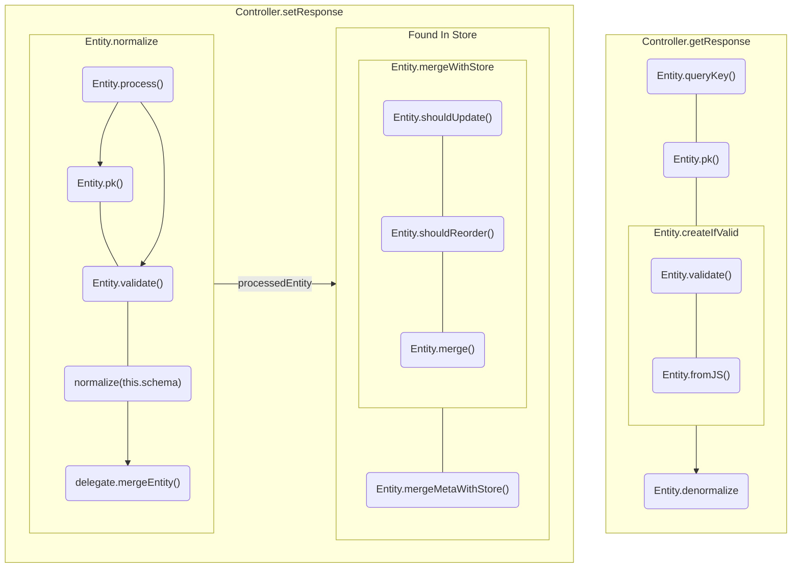

<!-- Generated by `yarn build:skills` from docs/rest/api/Entity.md (vue). Edit the source doc, not this file. -->

# Entity

```ts
{
  Article: {
    '1': {
      id: '1',
      title: 'Entities define data',
    }
  }
}
```

`Entity` defines a single _unique_ object.

[Entity.key](#key) + [Entity.pk()](#pk) (primary key) enable a [flat lookup table](https://react.dev/learn/choosing-the-state-structure#principles-for-structuring-state) store, enabling high
performance, data consistency and atomic mutations.

`Entities` enable customizing the data processing lifecycle by defining its static members like [schema](#schema)
and overriding its [lifecycle methods](#lifecycle).

## Usage

```typescript title="User"
import { Entity } from '@data-client/rest';

export class User extends Entity {
  id = '';
  username = '';

  static key = 'User';
  pk() {
    return this.id;
  }
}
```

```typescript title="Article"
import { Entity } from '@data-client/rest';
import { User } from './User';

export class Article extends Entity {
  id = '';
  title = '';
  content = '';
  author = User.fromJS();
  tags: string[] = [];
  createdAt = Temporal.Instant.fromEpochMilliseconds(0);

  static key = 'Article';
  pk() {
    return this.id;
  }

  static schema = {
    author: User,
    createdAt: Temporal.Instant.from,
  };
}
```

[static schema](#schema) is a declarative definition of fields to process.
In this case, `author` is another `Entity` to be extracted, and `createdAt` will be converted
from a string to a [Date](https://developer.mozilla.org/en-US/docs/Web/JavaScript/Reference/Global_Objects/Date)
object.

> **Tip**
>
> Entities are bound to Endpoints using [resource.schema](./resource.vue.md#schema) or
> [RestEndpoint.schema](./RestEndpoint.vue.md#schema)

> **Tip**
>
> If you already have your classes defined, [EntityMixin](https://dataclient.io/rest/api/EntityMixin) can also be
> used to make Entities.

Other static members overrides allow customizing the data lifecycle as seen below.

## Members

### pk(parent?, key?, args?): string | number | undefined {#pk}

pk stands for [_primary key_](https://www.postgresql.org/docs/current/ddl-constraints.html#DDL-CONSTRAINTS-PRIMARY-KEYS), uniquely identifying an `Entity` instance.
By default this returns the an Entity's `id` field.

Override this method to use other fields, or to for other cases like
multicolumn primary keys.

#### undefined value

A `undefined` can be used as a default to indicate the entity has not been created yet.
This is useful when initializing a creation form using [Entity.fromJS()](#fromJS)
directly. If `pk()` returns `undefined` it is considered not persisted to the server,
and thus will not be kept in the cache.

#### Other uses

Since `pk()` is unique, it provides a consistent way of defining [`v-for` keys](https://vuejs.org/guide/essentials/list.html#maintaining-state-with-key)

```html
<template>
  <div>
    <TheThing
      v-for="result in results"
      :key="result.pk()"
      :thing="result"
    />
  </div>
</template>
```

#### Composite Primary Keys

When a single field isn't enough to uniquely identify an entity, you can combine multiple
fields into a composite key. This is common for nested resources or resources with
multi-part identifiers.

```typescript
export class Issue extends Entity {
  number = 0;
  owner = '';
  repo = '';
  repositoryUrl = '';
  title = '';

  pk() {
    // Composite key from owner, repo, and issue number
    return `${this.owner}/${this.repo}/${this.number}`;
  }

  static key = 'Issue';
}
```

When entity data doesn't include all key parts directly, you can extract them from related
fields or endpoint arguments using [Entity.process()](#process):

```typescript
export class Issue extends Entity {
  number = 0;
  owner = '';
  repo = '';
  repositoryUrl = ''; // Contains: https://api.github.com/repos/{owner}/{repo}
  title = '';

  pk() {
    // Use owner/repo from process() which extracts from repositoryUrl
    return `${this.owner}/${this.repo}/${this.number}`;
  }

  static key = 'Issue';

  static process(input: any, parent: any, key: string, args: any[]) {
    // Extract owner and repo from the repositoryUrl
    const match = input.repositoryUrl?.match(/repos\/([^/]+)\/([^/]+)/);
    const owner = args[0]?.owner ?? match?.[1];
    const repo = args[0]?.repo ?? match?.[2];
    return { ...input, owner, repo };
  }
}
```

#### Singleton Entities

What if there is only ever once instance of a Entity for your entire application? You
don't really need to distinguish between each instance, so likely there was no `id` or
similar field defined in the API. In these cases you can just return a literal like
'the\_only\_one'.

```typescript
pk() {
  return 'the_only_one';
}
```

In case you have

```typescript
const get = new RestEndpoint({
  path: '/options',
  schema: OptionsEntity,
});
export const OptionsResource = {
  get,
  partialUpdate: get.extend({ method: 'PATCH' }),
};
```

### static key: string {#key}

This defines the key for the Entity kind, rather than an instance. This needs to be a globally
unique value.

> **Warning**
>
> This defaults to `this.name`; however this may break in production builds that change class names.
> This is often know as [class name mangling](https://terser.org/docs/api-reference#mangle-options).
>
> In these cases you can override `key` or disable class name mangling.

```ts
class User extends Entity {
  id = '';
  username = '';

  pk() {
    return this.id;
  }
  static key = 'User';
}
```

### static schema: { \[k: keyof this]: Schema } {#schema}

Defines [related entity](https://dataclient.io/rest/guides/relational-data) members, or
[field deserialization](./network-transform.vue.md#deserializing-fields) like Date and BigNumber.

```ts title="User"
import { Entity } from '@data-client/rest';

export class User extends Entity {
  id = '';
  name = '';

  pk() {
    return this.id;
  }
  static key = 'User';
}
```

```ts title="Post" {16-20}
import { Entity } from '@data-client/rest';
import { User } from './User';

export class Post extends Entity {
  id = '';
  author = User.fromJS();
  createdAt = Temporal.Instant.fromEpochMilliseconds(0);
  content = '';
  title = '';

  pk() {
    return this.id;
  }
  static key = 'Post';

  static schema = {
    author: User,
    createdAt: Temporal.Instant.from,
  };
}
```

```html title="PostPage.vue"
<script lang="ts">
  import { RestEndpoint } from '@data-client/rest';
  import { Post } from './Post';

  const getPost = new RestEndpoint({
    path: '/posts/:id',
    schema: Post,
  });
</script>

<script setup lang="ts">
  import { useSuspense } from '@data-client/vue';

  const post = await useSuspense(getPost, { id: '123' });
</script>

<template>
  <div>
    <p>{{ post.content }} - <cite>{{ post.author.name }}</cite></p>
    <time>
      {{ post.createdAt.toLocaleString('en-US', { dateStyle: 'medium' }) }}
    </time>
  </div>
</template>
```

#### Optional members

Entities references here whose default values in the Record definition itself are
considered 'optional'

```typescript
class User extends Entity {
  friend: User | null = null; // this field is optional
  lastUpdated = Temporal.Instant.fromEpochMilliseconds(0);

  static schema = {
    friend: User,
    lastUpdated: Temporal.Instant.from,
  };
}
```

### static indexes?: (keyof this)\[] {#indexes}

Indexes enable increased performance when doing lookups based on those parameters. Add
fieldnames (like `slug`, `username`) to the list that you want to send as params to lookup
later.

> **Note**
>
> Don't add your primary key like `id` to the indexes list, as that will already be optimized.

#### useSuspense()

With [useSuspense()](https://dataclient.io/vue/api/useSuspense) this will eagerly infer the results from entities table if possible,
rendering without needing to complete the fetch. This is typically helpful when the entities
cache has already been populated by another request like a list request.

```typescript
export class User extends Entity {
  id: number | undefined = undefined;
  username = '';
  email = '';
  isAdmin = false;

  static indexes = ['username' as const];
}
export const UserResource = resource({
  path: '/user/:id',
  schema: User,
});
```

```ts
const user = await useSuspense(UserResource.get, { username: 'bob' });
```

#### useQuery()

With [useQuery()](https://dataclient.io/vue/api/useQuery), this enables accessing results retrieved inside other requests - even
if there is no endpoint it can be fetched from.

```typescript
class LatestPrice extends Entity {
  id = '';
  symbol = '';
  price = '0.0';

  static indexes = ['symbol' as const];
}
```

```typescript
class Asset extends Entity {
  id = '';
  price = '';

  static schema = {
    price: LatestPrice,
  };
}
const getAssets = new RestEndpoint({
  path: '/assets',
  schema: [Asset],
});
```

Some top level component:

```ts
const assets = await useSuspense(getAssets);
```

Nested below:

```tsx
const price = useQuery(LatestPrice, { symbol: 'BTC' });
```

### static maxEntityDepth?: number {#maxEntityDepth}

Limits entity nesting depth during denormalization to prevent stack overflow
in large bidirectional entity graphs. **Default: 64**

When bidirectional relationships create chains with many unique entities
(e.g., `Department → Building → Department → ...`), denormalization can recurse
thousands of levels deep. `maxEntityDepth` truncates resolution at the specified
depth — entities beyond the limit are returned with nested foreign keys left as
unresolved ids rather than fully denormalized objects.

```typescript
class Department extends Entity {
  id = '';
  name = '';
  buildings: Building[] = [];

  pk() {
    return this.id;
  }
  static key = 'Department';
  static maxEntityDepth = 16;

  static schema = {
    buildings: [Building],
  };
}
```

> **Tip**
>
> Set this on entities that participate in deep or wide bidirectional relationships.
> Normal entity graphs (depth < 10) never approach the default limit.
>
> For relationships that don't need eager denormalization, [Lazy](https://dataclient.io/rest/api/Lazy)
> skips resolution entirely and lets you resolve on demand via [useQuery](https://dataclient.io/vue/api/useQuery).

## Lifecycle



### static fromJS(props): Entity {#fromJS}

Factory method that copies props to a new instance. Use this instead of `new MyEntity()`,
to ensure default props are overridden.

### static process(input, parent, key, args): processedEntity {#process}

Run at the start of normalization for this entity. Return value is saved in store
and sent to [pk()](#pk).

**Defaults** to simply copying the response (`{...input}`)

How to override to [build reverse-lookups for relational data](https://dataclient.io/rest/guides/relational-data#reverse-lookups)

#### Case of the missing id

```ts
class Stream extends Entity {
  username = '';
  title = '';
  game = '';
  currentViewers = 0;
  live = false;

  pk() {
    return this.username;
  }
  static key = 'Stream';

  static process(value, parent, key, args) {
    // super.process creates a copy of value
    const processed = super.process(value, parent, key, args);
    processed.username = args[0]?.username;
    return processed;
  }
}
```

#### Dynamic Invalidation

Returning `undefined` from [Entity.process](#process)
will cause the `Entity` to be [invalidated](./expiry-policy.vue.md#invalidate-entity).
This this allows us to invalidate dynamically; based on the particular response data.

```ts
class PriceLevel extends Entity {
  price = 0;
  amount = 0;

  pk() {
    return this.price;
  }

  static process(
    input: [number, number],
    parent: any,
    key: string | undefined,
  ): any {
    const [price, amount] = input;
    if (amount === 0) return undefined;
    return { price, amount };
  }
}
```

### static mergeWithStore(existingMeta, incomingMeta, existing, incoming): mergedValue {#mergeWithStore}

```typescript
static mergeWithStore(
  existingMeta: {
    date: number;
    fetchedAt: number;
  },
  incomingMeta: { date: number; fetchedAt: number },
  existing: any,
  incoming: any,
) {
  const shouldUpdate = this.shouldUpdate(
    existingMeta,
    incomingMeta,
    existing,
    incoming,
  );

  if (shouldUpdate) {
    // distinct types are not mergeable (like delete symbol), so just replace
    if (typeof incoming !== typeof existing) {
      return incoming;
    } else {
      return this.shouldReorder(
        existingMeta,
        incomingMeta,
        existing,
        incoming,
      )
        ? this.merge(incoming, existing)
        : this.merge(existing, incoming);
    }
  } else {
    return existing;
  }
}
```

`mergeWithStore()` is called during normalization when a processed entity is already found in the store.

This calls [shouldUpdate()](#shouldupdate), [shouldReorder()](#shouldreorder) and potentially [merge()](#merge)

### static shouldUpdate(existingMeta, incomingMeta, existing, incoming): boolean {#shouldupdate}

```typescript
static shouldUpdate(
  existingMeta: { date: number; fetchedAt: number },
  incomingMeta: { date: number; fetchedAt: number },
  existing: any,
  incoming: any,
) {
  return existingMeta.fetchedAt <= incomingMeta.fetchedAt;
}
```

#### Preventing updates

shouldUpdate can also be used to short-circuit an entity update.

```typescript
import deepEqual from 'deep-equal';

class Article extends Entity {
  id = '';
  title = '';
  content = '';
  published = false;

  static shouldUpdate(
    existingMeta: { date: number; fetchedAt: number },
    incomingMeta: { date: number; fetchedAt: number },
    existing: any,
    incoming: any,
  ) {
    return !deepEqual(incoming, existing);
  }
}
```

### static shouldReorder(existingMeta, incomingMeta, existing, incoming): boolean {#shouldreorder}

```typescript
static shouldReorder(
  existingMeta: { date: number; fetchedAt: number },
  incomingMeta: { date: number; fetchedAt: number },
  existing: any,
  incoming: any,
) {
  return incomingMeta.fetchedAt < existingMeta.fetchedAt;
}
```

`true` return value will reorder incoming vs in-store entity argument order in merge. With
the default merge, this will cause the fields of existing entities to override those of incoming,
rather than the other way around.

#### Example

```typescript
class LatestPriceEntity extends Entity {
  id = '';
  updatedAt = 0;
  price = '0.0';
  symbol = '';

  pk() {
    return this.id;
  }

  static shouldReorder(
    existingMeta: { date: number; fetchedAt: number },
    incomingMeta: { date: number; fetchedAt: number },
    existing: { updatedAt: number },
    incoming: { updatedAt: number },
  ) {
    return incoming.updatedAt < existing.updatedAt;
  }
}
```

Example app: [coin-app](https://github.com/reactive/data-client/tree/master/examples/coin-app) ([`src/resources/Ticker.ts`](https://github.com/reactive/data-client/blob/master/examples/coin-app/src/resources/Ticker.ts))

### static merge(existing, incoming): mergedValue {#merge}

```typescript
static merge(existing: any, incoming: any) {
  return {
    ...existing,
    ...incoming,
  };
}
```

Merge is used to handle cases when an incoming entity is already found. This is called directly
when the same entity is found in one response. By default it is also called when [mergeWithStore()](#mergeWithStore)
determines the incoming entity should be merged with an entity already persisted in the Reactive Data Client store.

How to override to [build reverse-lookups for relational data](https://dataclient.io/rest/guides/relational-data#reverse-lookups)

### static mergeMetaWithStore(existingMeta, incomingMeta, existing, incoming): meta {#mergeMetaWithStore}

```typescript
static mergeMetaWithStore(
  existingMeta: {
    expiresAt: number;
    date: number;
    fetchedAt: number;
  },
  incomingMeta: { expiresAt: number; date: number; fetchedAt: number },
  existing: any,
  incoming: any,
) {
  return this.shouldReorder(existingMeta, incomingMeta, existing, incoming)
    ? existingMeta
    : incomingMeta;
}
```

`mergeMetaWithStore()` is called during normalization when a processed entity is already found in the store.

### static queryKey(args, queryKey, getEntity, getIndex): pk? {#queryKey}

This method enables `Entities` to be [Queryable](./schema.vue.md#queryable) - allowing store access without an endpoint.

Overriding can allow customization or disabling of this behavior altogether.

Returning `undefined` will disallow this behavior.

Returning `pk` string will attempt to lookup this entity and use in the response.

When used, expiry policy is computed based on the entity's own meta data.

By **default** uses the first argument to lookup in [pk()](#pk) and [indexes](./Entity.vue.md#indexes)

#### getEntity(key, pk?)

Gets all entities of a type with one argument, or a single entity with two

```ts title="One argument"
const entitiesEntry = getEntity(this.schema.key);
if (entitiesEntry === undefined) return INVALID;
return Object.values(entitiesEntry).map(
  entity => entity && this.schema.pk(entity),
);
```

```ts title="Two arguments"
if (getEntity(this.key, id)) return id;
```

#### getIndex(key, indexName, value)

Returns the index entry (value->pk map)

```ts
const value = args[0][indexName];
return getIndex(schema.key, indexName, value)[value];
```

### static createIfValid(processedEntity): Entity | undefined {#createIfValid}

Called when denormalizing an entity. This will create an instance of this class
if it is deemed 'valid'.

`undefined` return will result in [Invalid expiry status](./expiry-policy.vue.md#expiry-status),
like [Invalidate](https://dataclient.io/rest/api/Invalidate).

[`Invalid`](./expiry-policy.vue.md#expiry-status) expiry generally means composables will enter a loading state and attempt a new fetch.

```ts
static createIfValid(props): AbstractInstanceType<this> | undefined {
  if (this.validate(props)) {
    return undefined as any;
  }
  return this.fromJS(props);
}
```

### static validate(processedEntity): errorMessage? {#validate}

Runs during both normalize and denormalize. Returning a string indicates an error (the string is the message).

During normalization a validation failure will result in an error for that fetch.

During denormalization a validation failure will mark that result as 'invalid' and thus
will block on fetching a result.

By **default** does some basic field existence checks in development mode only. Override to
disable or customize.

[Using validation for endpoints with incomplete fields](https://dataclient.io/rest/guides/partial-entities)
