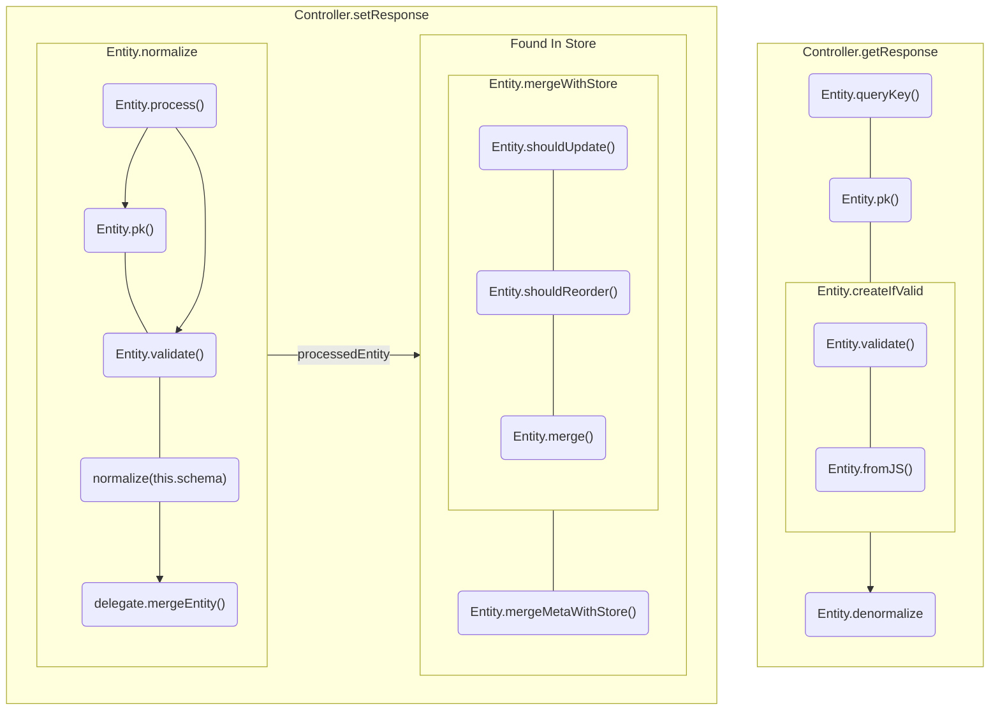

<!-- Generated by `yarn build:skills` from docs/rest/api/EntityMixin.md (vue). Edit the source doc, not this file. -->

# EntityMixin

`Entity` defines a single _unique_ object.

If you already have classes for your data-types, `EntityMixin` may be for you.

```typescript {10}
import { EntityMixin } from '@data-client/rest';

export class Article {
  id = '';
  title = '';
  content = '';
  tags: string[] = [];
}

export class ArticleEntity extends EntityMixin(Article) {}
```

## Options

The second argument to the mixin can be used to conveniently customize construction. If not specified the `Base`
class' static members will be used. Alternatively, just like with [Entity](./Entity.vue.md), you can always specify
these as static members of the final class.

```typescript
class User {
  username = '';
  createdAt = Temporal.Instant.fromEpochMilliseconds(0);
}
class UserEntity extends EntityMixin(User, {
  pk: 'username',
  key: 'User',
  schema: { createdAt: Temporal.Instant.from },
}) {}
```

### pk: string | (value, parent?, key?, args?) => string | number | undefined = 'id' {#pk}

Specifies the [Entity.pk](./Entity.vue.md#pk)

A `string` indicates the field to use for pk.

A `function` is used just like [Entity.pk](./Entity.vue.md#pk), but the first argument (`value`) is `this`

Defaults to 'id'; which means pk is a required option _unless_ the `Base` class has a serializable `id` member.

```typescript title="multi-column primary key"
class Thread {
  forum = '';
  slug = '';
  content = '';
}
class ThreadEntity extends EntityMixin(Thread, {
  pk(value) {
    return [value.forum, value.slug].join(',');
  },
}) {}
```

### key: string  {#key}

Specifies the [Entity.key](./Entity.vue.md#key)

### schema: {\[k\:string]: Schema}  {#schema}

Specifies the [Entity.schema](./Entity.vue.md#schema)

## const vs class

If you don't need to further customize the entity, you can use a `const` declaration instead
of `extend` to another class.

There is a subtle difference when referring to the `class token` in TypeScript - as
`class` declarations will refer to the instance type; whereas `const tokens` refer to the value, so you
must use `typeof`, but additionally typeof gives the class type, so you must layer `InstanceType`
on top.

```typescript
import { schema } from '@data-client/rest';

export class Article {
  id = '';
  title = '';
  content = '';
  tags: string[] = [];
}

export class ArticleEntity extends EntityMixin(Article) {}
export const ArticleEntity2 = EntityMixin(Article);

const article: ArticleEntity = ArticleEntity.fromJS();
const articleFails: ArticleEntity2 = ArticleEntity2.fromJS();
const articleWorks: InstanceType<typeof ArticleEntity2> =
  ArticleEntity2.fromJS();
```

## Lifecycle



To override lifecycle methods like [process()](#process), you must use the `class ... extends EntityMixin(...) {}` form.
The `EntityMixin()` options only include [pk](#pk), [key](#key), and [schema](#schema)—lifecycle overrides live on the class itself.

```typescript
import { EntityMixin } from '@data-client/rest';

export class Article {
  id = '';
  title = '';
  content = '';
  tags: string[] = [];
}

// ❌ Not supported (lifecycle methods are not EntityMixin options)
// export const ArticleEntity = EntityMixin(Article, {
//   process(input) {
//     return input;
//   },
// });

// ✅ Use a class when adding lifecycle methods
export class ArticleEntity extends EntityMixin(Article) {
  static process(input: any, parent: any, key: string | undefined, args: any[]) {
    const processed = super.process(input, parent, key, args);
    processed.tags ??= [];
    return processed;
  }
}
```

### static fromJS(props): Entity {#fromJS}

Factory method that copies props to a new instance. Use this instead of `new MyEntity()`,
to ensure default props are overridden.

### static process(input, parent, key, args): processedEntity {#process}

Run at the start of normalization for this entity. Return value is saved in store
and sent to [pk()](#pk).

**Defaults** to simply copying the response (`{...input}`)

How to override to [build reverse-lookups for relational data](./relational-data.vue.md#reverse-lookups)

#### Case of the missing id

```ts
import { EntityMixin } from '@data-client/rest';

class Stream {
  username = '';
  title = '';
  game = '';
  currentViewers = 0;
  live = false;
}

class StreamEntity extends EntityMixin(Stream) {
  static key = 'Stream';

  static process(value, parent, key, args) {
    // super.process creates a copy of value
    const processed = super.process(value, parent, key, args);
    processed.username = args[0]?.username;
    return processed;
  }
}
```

#### Dynamic Invalidation

Returning `undefined` from [Entity.process](#process)
will cause the `Entity` to be [invalidated](https://dataclient.io/vue/concepts/expiry-policy#invalidate-entity).
This this allows us to invalidate dynamically; based on the particular response data.

```ts
import { EntityMixin } from '@data-client/rest';

class PriceLevel {
  price = 0;
  amount = 0;
}

class PriceLevelEntity extends EntityMixin(PriceLevel) {
  static process(
    input: [number, number],
    parent: any,
    key: string | undefined,
  ): any {
    const [price, amount] = input;
    if (amount === 0) return undefined;
    return { price, amount };
  }
}
```

### static mergeWithStore(existingMeta, incomingMeta, existing, incoming): mergedValue {#mergeWithStore}

```typescript
static mergeWithStore(
  existingMeta: {
    date: number;
    fetchedAt: number;
  },
  incomingMeta: { date: number; fetchedAt: number },
  existing: any,
  incoming: any,
) {
  const shouldUpdate = this.shouldUpdate(
    existingMeta,
    incomingMeta,
    existing,
    incoming,
  );

  if (shouldUpdate) {
    // distinct types are not mergeable (like delete symbol), so just replace
    if (typeof incoming !== typeof existing) {
      return incoming;
    } else {
      return this.shouldReorder(
        existingMeta,
        incomingMeta,
        existing,
        incoming,
      )
        ? this.merge(incoming, existing)
        : this.merge(existing, incoming);
    }
  } else {
    return existing;
  }
}
```

`mergeWithStore()` is called during normalization when a processed entity is already found in the store.

This calls [shouldUpdate()](#shouldupdate), [shouldReorder()](#shouldreorder) and potentially [merge()](#merge)

### static shouldUpdate(existingMeta, incomingMeta, existing, incoming): boolean {#shouldupdate}

```typescript
static shouldUpdate(
  existingMeta: { date: number; fetchedAt: number },
  incomingMeta: { date: number; fetchedAt: number },
  existing: any,
  incoming: any,
) {
  return existingMeta.fetchedAt <= incomingMeta.fetchedAt;
}
```

#### Preventing updates

shouldUpdate can also be used to short-circuit an entity update.

```typescript
import deepEqual from 'deep-equal';
import { EntityMixin } from '@data-client/rest';

class Article {
  id = '';
  title = '';
  content = '';
  published = false;
}

class ArticleEntity extends EntityMixin(Article) {
  static shouldUpdate(
    existingMeta: { date: number; fetchedAt: number },
    incomingMeta: { date: number; fetchedAt: number },
    existing: any,
    incoming: any,
  ) {
    return !deepEqual(incoming, existing);
  }
}
```

### static shouldReorder(existingMeta, incomingMeta, existing, incoming): boolean {#shouldreorder}

```typescript
static shouldReorder(
  existingMeta: { date: number; fetchedAt: number },
  incomingMeta: { date: number; fetchedAt: number },
  existing: any,
  incoming: any,
) {
  return incomingMeta.fetchedAt < existingMeta.fetchedAt;
}
```

`true` return value will reorder incoming vs in-store entity argument order in merge. With
the default merge, this will cause the fields of existing entities to override those of incoming,
rather than the other way around.

#### Example

```typescript
import { EntityMixin } from '@data-client/rest';

class LatestPrice {
  id = '';
  updatedAt = 0;
  price = '0.0';
  symbol = '';
}

class LatestPriceEntity extends EntityMixin(LatestPrice) {
  static shouldReorder(
    existingMeta: { date: number; fetchedAt: number },
    incomingMeta: { date: number; fetchedAt: number },
    existing: { updatedAt: number },
    incoming: { updatedAt: number },
  ) {
    return incoming.updatedAt < existing.updatedAt;
  }
}
```

Example app: [coin-app](https://github.com/reactive/data-client/tree/master/examples/coin-app) ([`src/resources/Ticker.ts`](https://github.com/reactive/data-client/blob/master/examples/coin-app/src/resources/Ticker.ts))

### static merge(existing, incoming): mergedValue {#merge}

```typescript
static merge(existing: any, incoming: any) {
  return {
    ...existing,
    ...incoming,
  };
}
```

Merge is used to handle cases when an incoming entity is already found. This is called directly
when the same entity is found in one response. By default it is also called when [mergeWithStore()](#mergeWithStore)
determines the incoming entity should be merged with an entity already persisted in the Reactive Data Client store.

How to override to [build reverse-lookups for relational data](./relational-data.vue.md#reverse-lookups)

### static mergeMetaWithStore(existingMeta, incomingMeta, existing, incoming): meta {#mergeMetaWithStore}

```typescript
static mergeMetaWithStore(
  existingMeta: {
    expiresAt: number;
    date: number;
    fetchedAt: number;
  },
  incomingMeta: { expiresAt: number; date: number; fetchedAt: number },
  existing: any,
  incoming: any,
) {
  return this.shouldReorder(existingMeta, incomingMeta, existing, incoming)
    ? existingMeta
    : incomingMeta;
}
```

`mergeMetaWithStore()` is called during normalization when a processed entity is already found in the store.

### static queryKey(args, queryKey, getEntity, getIndex): pk? {#queryKey}

This method enables `Entities` to be [Queryable](./schema.vue.md#queryable) - allowing store access without an endpoint.

Overriding can allow customization or disabling of this behavior altogether.

Returning `undefined` will disallow this behavior.

Returning `pk` string will attempt to lookup this entity and use in the response.

When used, expiry policy is computed based on the entity's own meta data.

By **default** uses the first argument to lookup in [pk()](#pk) and [indexes](./Entity.vue.md#indexes)

#### getEntity(key, pk?)

Gets all entities of a type with one argument, or a single entity with two

```ts title="One argument"
const entitiesEntry = getEntity(this.schema.key);
if (entitiesEntry === undefined) return INVALID;
return Object.values(entitiesEntry).map(
  entity => entity && this.schema.pk(entity),
);
```

```ts title="Two arguments"
if (getEntity(this.key, id)) return id;
```

#### getIndex(key, indexName, value)

Returns the index entry (value->pk map)

```ts
const value = args[0][indexName];
return getIndex(schema.key, indexName, value)[value];
```

### static createIfValid(processedEntity): Entity | undefined {#createIfValid}

Called when denormalizing an entity. This will create an instance of this class
if it is deemed 'valid'.

`undefined` return will result in [Invalid expiry status](https://dataclient.io/vue/concepts/expiry-policy#expiry-status),
like [Invalidate](./Invalidate.vue.md).

[`Invalid`](https://dataclient.io/vue/concepts/expiry-policy#expiry-status) expiry generally means composables will enter a loading state and attempt a new fetch.

```ts
static createIfValid(props): AbstractInstanceType<this> | undefined {
  if (this.validate(props)) {
    return undefined as any;
  }
  return this.fromJS(props);
}
```

### static validate(processedEntity): errorMessage? {#validate}

Runs during both normalize and denormalize. Returning a string indicates an error (the string is the message).

During normalization a validation failure will result in an error for that fetch.

During denormalization a validation failure will mark that result as 'invalid' and thus
will block on fetching a result.

By **default** does some basic field existence checks in development mode only. Override to
disable or customize.

[Using validation for endpoints with incomplete fields](./partial-entities.vue.md)
