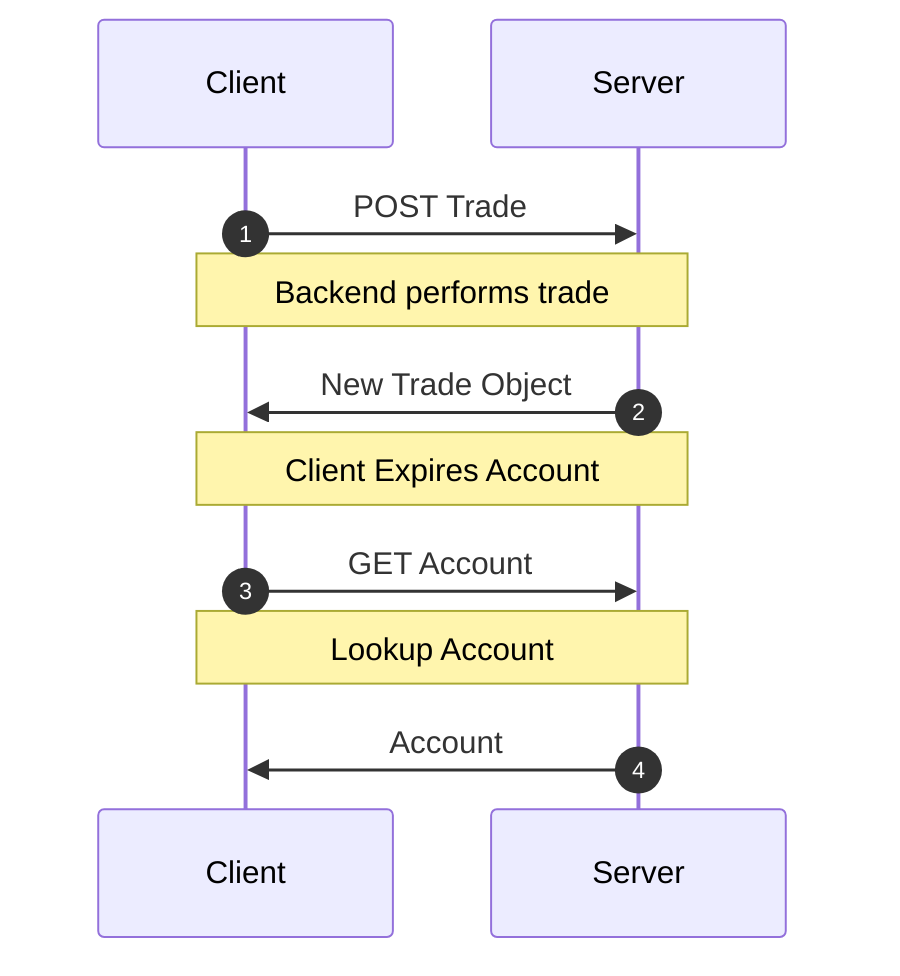
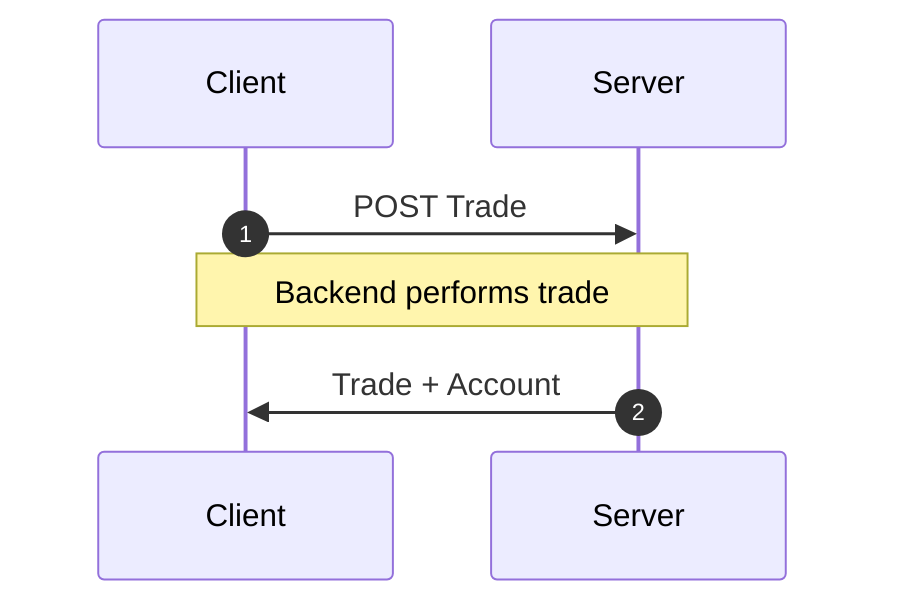

<!-- Generated by `yarn build:skills` from docs/rest/guides/side-effects.md (vue). Edit the source doc, not this file. -->

# Mutation Side-Effects

When mutations update more than one resource, it may be tempting to simply
[expire all](https://dataclient.io/vue/api/Controller#expireAll) the other resources.

However, we can still achieve the high performance atomic mutations if we
simply bundle _all_ updated resources in the mutation response, we can
avoid this slow networking cascade.

Network Cascade



&#x20;Response Bundling



## Example

You're running a crypto trading platform called `dogebase`. Every time
a user creates a trade, you need to update some balance information
in their accounts object. So upon `POST`ing to the `/trade/` endpoint,
you nest both the updated accounts object along with the trade you just
created.

```json title="POST /trade/"
{
  "trade": {
    "id": 2893232,
    "user": 1,
    "amount": "50.2335324",
    "coin": "doge",
    "created_at": ""
  },
  "account": {
    "id": 899,
    "user": 1,
    "balance": "1337.00",
    "coin_value": "3.50"
  }
}
```

To handle this, we just need to update the `schema` to include the custom
endpoint.

```typescript title="resources/Trade.ts"
import { resource, Entity } from '@data-client/rest';
import { Account } from './Account';

export class Trade extends Entity {
  id = 0;
  user = 0;
  amount = '0';
  coin = '';
  created_at = '';
}

export const TradeResource = resource({
  path: '/trade/:id',
  schema: Trade,
}).extend(Base => ({
  create: Base.getList.push.extend({
    schema: {
      trade: Base.getList.push.schema,
      account: Account,
    },
  }),
}));
```

Now if when we use the [getList.push](https://dataclient.io/rest/api/resource#push) Endpoint generator method,
we will be happy knowing both the trade and account information will
be updated in the cache after the `POST` request is complete.

```html title="CreateTrade.vue"
<script setup lang="ts">
  import { useController } from '@data-client/vue';
  import { TradeResource } from './resources/Trade';

  const ctrl = useController();
  const handleSubmit = payload =>
    ctrl.fetch(TradeResource.create, payload);
  //...
</script>
```

> **Note**
>
> Feel free to create completely new [RestEndpoint](https://dataclient.io/rest/api/RestEndpoint) methods for any custom
> endpoints you have. This endpoint tells `Reactive Data Client` how to process any
> request.
