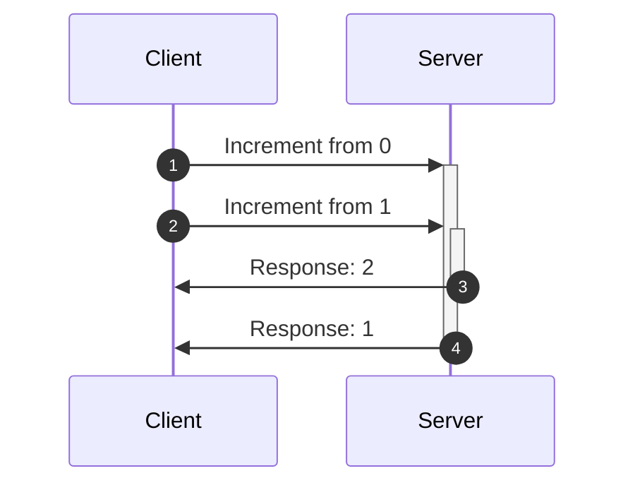

<head>
  <meta name="docsearch:pagerank" content="40"/>
</head>

import AcidUpdate from '../shared/\_acidUpdate.mdx';
import AcidCreate from '../shared/\_acidCreate.mdx';
import AcidDelete from '../shared/\_acidDelete.mdx';
import AcidRollback from '../shared/\_acidRollback.mdx';
import AcidSideEffects from '../shared/\_acidSideEffects.mdx';
import AcidIdentity from '../shared/\_acidIdentity.mdx';
import AcidCollections from '../shared/\_acidCollections.mdx';
import AcidQuery from '../shared/\_acidQuery.mdx';
import AcidValidate from '../shared/\_acidValidate.mdx';
import AcidTransports from '../shared/\_acidTransports.mdx';
import AcidFetchOrder from '../shared/\_acidFetchOrder.mdx';
import AcidSnapshot from '../shared/\_acidSnapshot.mdx';
import AcidRest from '../shared/\_acidRest.mdx';

# ACID for frontend data

Users expect **clear cause and effect**: actions have consequences, and those
consequences are obvious. Things should not appear, disappear, or change
on their own. A user's time is valuable — don't lose their work.

[Relational databases](https://en.wikipedia.org/wiki/ACID) call these guarantees
ACID. The frontend store is that database for interactive data — but every
durable write is [asynchronous](https://developer.mozilla.org/en-US/docs/Learn/JavaScript/Asynchronous).

Reactive Data Client applies the same guarantees so every view agrees without
[refetching](../api/Controller.md#expireAll), mutations don't flash torn state, and
crashes don't lose data that reached a durable store like a REST server or
[IndexedDB](./managers.md#persistence).

[Normalization](./normalization.md) is what makes this possible.

## Atomicity

A mutation is a single unit: it succeeds completely or fails completely.
Other components never observe it halfway. That prevents *temporal data
tearing* — flashes of inconsistent state as usages update one by one.

### Update

[Resource.update](/rest/api/resource#update) and
[Resource.partialUpdate](/rest/api/resource#partialupdate) merge the response
into the one copy of that entity. Every consumer of that [pk](/rest/api/Entity#pk)
updates together. [Read more about defining other update endpoints](/rest/guides/side-effects).

Toggle a todo. Both lists update at once — no flash of one list lagging.

<AcidUpdate />

### Create

Created entities are immediately available. They are added to existing
[Collections](/rest/api/Collection) with
[.push](/rest/api/RestEndpoint#push),
[.unshift](/rest/api/RestEndpoint#unshift), or
[.assign](/rest/api/RestEndpoint#assign).

Add a todo. It appears in both lists together — never invisible, never an
orphan, never a list hole.

<AcidCreate />

### Delete

[schema.Invalidate](/rest/api/Invalidate) removes the entity.
[Resource.delete](/rest/api/resource#delete) provides such an endpoint.

Delete a todo. It disappears from both lists in the same commit.

<AcidDelete />

### Rollback

Optimistic updates apply as that same snapshot. If the network fails, they
roll back as that snapshot.

Click add. The todo appears immediately, then vanishes when the server errors.

<AcidRollback />

### Side effects

When a mutation changes more than one resource, include every changed entity
in the response. That is one commit. [Invalidating](../api/Controller.md#expireAll)
and refetching the others can fail partway — a flash of torn state.

[See mutation side-effects](/rest/guides/side-effects) for the full pattern.

Add a todo. The list and the user's count update together.

<AcidSideEffects />

## Consistency

A write takes the store from one valid state to another. Invariants hold:
one copy of each entity, relationships join, invalid data is rejected.
That prevents *data tearing* — the same todo showing two different values.

### Identity

[Entity.pk()](/rest/api/Entity#pk) is the unique index. The same todo from
[getList](/rest/api/resource#getlist) and [get](/rest/api/resource#get) is the
**same object** — the same value, wherever it is embedded.

Select a todo, then toggle it. `fromList === get` stays true.

<AcidIdentity />

### Collections

When [Collection.argsKey](/rest/api/Collection#argskey) and
[Collection.nestKey](/rest/api/Collection#nestkey) return the same shape, a nested
list and a top-level list are the **same array**.

Toggle a todo. `user.todos === getList` stays true, and both columns update.

<AcidCollections />

### Query

[Query](/rest/api/Query) derived values stay consistent for the same reason —
they read the entity table, not a copy.

Toggle todos. The remaining count updates without refetching.

<AcidQuery />

### Validation

[Entity.validate()](./validation.md) is the check constraint. Invalid responses
are not committed.

Switch between payloads. Only the valid article renders.

<AcidValidate />

### Transports

The same entity is the same value whether it arrived from fetch, initial
load, [Controller.set()](../api/Controller.md#set), or a
[websocket](./managers.md#data-stream).

Click simulate websocket. Both lists update — no copy left behind.

<AcidTransports />

## Isolation

Concurrent work leaves the store as if it ran in sequence. A slower
response cannot confuse a newer local edit.

### Fetch order

Overlapping fetches complete in any order. Reactive Data Client pairs each
[optimistic update](/rest/guides/optimistic-updates) with its own request and
commits in [fetchedAt](/docs/api/Snapshot#fetchedat) order. A late response cannot
clobber a newer commit.



With other libraries this would show 0, then 2, then 1. Reactive Data Client
keeps 0, 1, 2.

Click increment several times quickly.

<AcidFetchOrder />

[Optimistic updates](/rest/guides/optimistic-updates) amplify these races;
Reactive Data Client handles them automatically.

### Snapshots

All hooks in one render read the same snapshot, so the tree never paints mixed
old and new values.

Toggle a todo. `list` and `query` in that row always agree.

<AcidSnapshot />

## Durability

Once work is committed, it stays committed through a crash or a closed
tab. Storing in memory is not enough — mutations must reach an async API.
Later retrievals reflect those updates.

### REST

`ctrl.fetch` is the commit path. Saving as you go (a toggle, an inline
edit) commits to the server. Use a form when the friction is the point —
publish, purchase.

Toggle some todos, then simulate a crash. Data Client refetches from the
server and the work is still there. The local-only note is gone.

<AcidRest />

In-flight optimistic updates are not the durable commit — the `fetch` is.

### IndexedDB

A [persist Manager](./managers.md#persistence) can replicate confirmed state to
[IndexedDB](https://developer.mozilla.org/en-US/docs/Web/API/IndexedDB_API)
for offline reloads. Restore it with
[DataProvider's initialState](../api/DataProvider.md#initialState). Drop
in-flight optimistic updates — they are not cloneable, and they are not the ack.

```typescript
import type { Manager, Middleware } from '@data-client/react';
import { set } from 'idb-keyval';

export default class PersistManager implements Manager {
  declare protected timer?: ReturnType<typeof setTimeout>;

  middleware: Middleware = controller => next => async action => {
    await next(action);
    clearTimeout(this.timer);
    this.timer = setTimeout(() => {
      const state = { ...controller.getState(), optimistic: [] };
      set('data-client', state);
    }, 1000);
  };

  cleanup() {
    clearTimeout(this.timer);
  }
}
```

```tsx
import { get } from 'idb-keyval';

const initialState = await get('data-client');

createRoot(document.body).render(
  <DataProvider initialState={initialState} managers={managers}>
    <App />
  </DataProvider>,
);
```

:::info[Reactivity]

ACID makes writes trustworthy. [useLive()](../api/useLive.md),
[polling](/rest/api/Endpoint#pollfrequency), and
[push](./managers.md#data-stream) keep the UI a live function of the store.
Reactivity is how you watch the durable store; it is not a substitute for
reaching it.

:::
