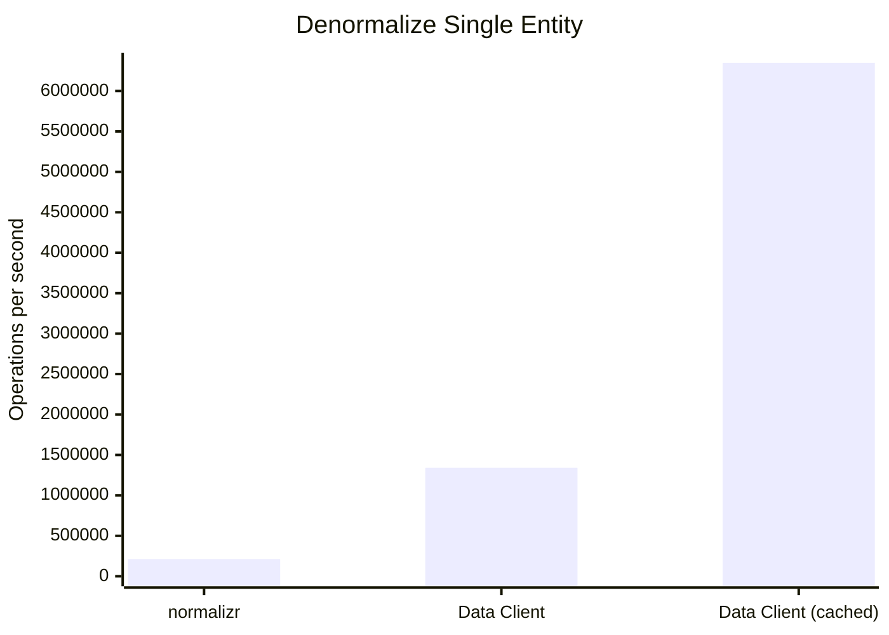
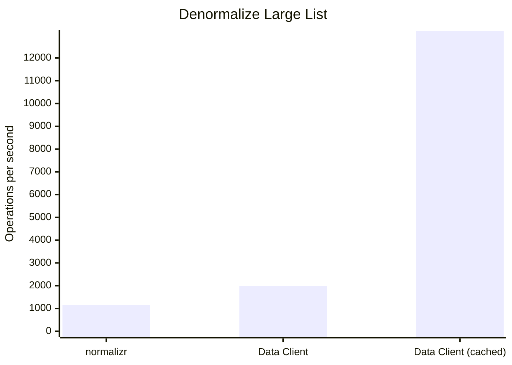

<head>
  <meta name="docsearch:pagerank" content="40"/>
</head>

import Tabs from '@theme/Tabs';
import TabItem from '@theme/TabItem';
import LanguageTabs from '@site/src/components/LanguageTabs';
import Link from '@docusaurus/Link';
import SchemaTable from '../shared/\_schema_table.mdx';
import Grid from '@site/src/components/Grid';

[Entities](/rest/api/Entity) have a primary key. This enables easy access via a lookup table.
This makes it easy to find, update, create, or delete the same data - no matter what
endpoint it was used in.

<!--
<LanguageTabs>

```ts
import { Entity } from '@data-client/endpoint';

class Todo extends Entity {
  readonly id: number = 0;
  readonly userId: number = 0;
  readonly title: string = '';
  readonly completed: boolean = false;
}
```

```js
import { Entity } from '@data-client/endpoint';

class Todo extends Entity {
}
```

</LanguageTabs>
-->

<Tabs
defaultValue="State"
values={[
{ label: 'State', value: 'State' },
{ label: 'Response', value: 'Response' },
{ label: 'Endpoint', value: 'Endpoint' },
{ label: 'Entity', value: 'Entity' },
{ label: 'React', value: 'React' },
]}>
<TabItem value="State">


</TabItem>
<TabItem value="Response">

```json
[
  { "id": 1, "title": "this is an entity" },
  { "id": 2, "title": "this is the second entity" }
]
```

</TabItem>
<TabItem value="Endpoint">

```typescript
const getPresentations = new Endpoint(
  () => fetch(`/presentations`).then(res => res.json()),
  { schema: new Collection([Presentation]) },
);
```

</TabItem>
<TabItem value="Entity">

```typescript
class Presentation extends Entity {
  id = '';
  title = '';

  static key = 'Presentation';
}
```

</TabItem>
<TabItem value="React">

```tsx
export function PresentationsPage() {
  const presentation = useSuspense(getPresentations);
  return presentation.map(presentation => (
    <div key={presentation.pk()}>{presentation.title}</div>
  ));
}
```

</TabItem>
</Tabs>

Extracting entities from a response is known as `normalization`. Accessing a response reverses
the process via `denormalization`.

:::info Global Referential Equality

Using entities expands Reactive Data Client' global referential equality guarantee beyond the granularity of
an entire endpoint response.

:::

## Mutations and Dynamic Data

When an endpoint changes data, this is known as a [side effect](/rest/guides/side-effects). Marking an endpoint with [sideEffect: true](/rest/api/Endpoint#sideeffect)
tells Reactive Data Client that this endpoint is not idempotent, and thus should not be allowed in hooks
that may call the endpoint an arbitrary number of times like [useSuspense()](../api/useSuspense.md) or [useFetch()](../api/useFetch.md)

By including the changed data in the endpoint's response, Reactive Data Client is able to able to update
any entities it extracts by specifying the schema.

<Tabs
defaultValue="Create"
values={[
{ label: 'Create', value: 'Create' },
{ label: 'Update', value: 'Update' },
{ label: 'Delete', value: 'Delete' },
]}>
<TabItem value="Create">

```typescript
import { RestEndpoint, schema } from '@data-client/rest';

const todoCreate = new RestEndpoint({
  urlPrefix: 'https://jsonplaceholder.typicode.com',
  path: '/todos',
  method: 'POST',
  schema: new Collection([Todo]).push,
});
```

<details>
<summary><b>Example Usage</b></summary>

```tsx
import { useController } from '@data-client/react';

export default function NewTodoForm() {
  const ctrl = useController();
  return (
    <Form
      onSubmit={e => ctrl.fetch(todoCreate, new FormData(e.target))}
    >
      <FormField name="title" />
    </Form>
  );
}
```

</details>

</TabItem>
<TabItem value="Update">

```typescript
import { RestEndpoint } from '@data-client/rest';

const todoUpdate = new RestEndpoint({
  urlPrefix: 'https://jsonplaceholder.typicode.com',
  path: '/todos/:id',
  method: 'PUT',
  schema: Todo,
});
```

<details>
<summary><b>Example Usage</b></summary>

```tsx
import { useController } from '@data-client/react';

export default function UpdateTodoForm({ id }: { id: number }) {
  const todo = useSuspense(todoDetail, { id });
  const ctrl = useController();
  return (
    <Form
      onSubmit={e =>
        ctrl.fetch(todoUpdate, { id }, new FormData(e.target))
      }
      initialValues={todo}
    >
      <FormField name="title" />
    </Form>
  );
}
```

</details>

</TabItem>
<TabItem value="Delete">

```typescript
import { Invalidate, RestEndpoint } from '@data-client/rest';

const todoDelete = new RestEndpoint({
  urlPrefix: 'https://jsonplaceholder.typicode.com',
  path: '/todos/:id',
  method: 'DELETE',
  schema: new Invalidate(Todo),
});
```

<details>
<summary><b>Example Usage</b></summary>

```tsx
import { useController } from '@data-client/react';

export default function TodoWithDelete({ todo }: { todo: Todo }) {
  const ctrl = useController();
  return (
    <div>
      {todo.title}
      <button onClick={() => ctrl.fetch(todoDelete, { id: todo.id })}>
        Delete
      </button>
    </div>
  );
}
```

</details>

</TabItem>
</Tabs>

:::info

Mutations automatically update the normalized cache, resulting in consistent and fresh data.

:::

## Schema

Schemas are a declarative definition of how to [process responses](/rest/api/schema)

- [where](/rest/api/schema) to expect [Entities](/rest/api/Entity)
- Functions to [deserialize fields](/rest/guides/network-transform#deserializing-fields)

```typescript
import { RestEndpoint, Collection } from '@data-client/rest';

const getTodoList = new RestEndpoint({
  urlPrefix: 'https://jsonplaceholder.typicode.com',
  path: '/todos',
  // highlight-next-line
  schema: new Collection([Todo]),
});
```

Placing our [Entity](/rest/api/Entity) `Todo` in an array [Collection](/rest/api/Collection), allows us to easly
[push](/rest/api/RestEndpoint#push) or [unshift](/rest/api/RestEndpoint#unshift) new `Todos` on it.

Aside from array, there are a few more 'schemas' provided for various patterns. The first two (Object and Array)
have shorthands of using object and array literals.

<SchemaTable/>

[Learn more](/rest/api/schema)

### Nesting

Additionally, [Entities](/rest/api/Entity) themselves can specify [nested schemas](/rest/guides/relational-data)
by specifying a [static schema](/rest/api/Entity#schema) member.

<Tabs
defaultValue="Entity"
values={[
{ label: 'Entity', value: 'Entity' },
{ label: 'Response', value: 'Response' },
]}>
<TabItem value="Entity">

```typescript
import { Entity } from '@data-client/endpoint';

class Todo extends Entity {
  id = 0;
  user = User.fromJS();
  title = '';
  completed = false;

  static key = 'Todo';

  // highlight-start
  static schema = {
    user: User,
  };
  // highlight-end
}

class User extends Entity {
  id = 0;
  username = '';

  static key = 'User';
}
```

</TabItem>
<TabItem value="Response">

```json
{
  "id": 5,
  "user": {
    "id": 10,
    "username": "bob"
  },
  "title": "Write some Entities",
  "completed": false
}
```

</TabItem>
</Tabs>

[Learn more](/rest/guides/relational-data)

### Data Representations

Additionally, functions can be [used as a schema](/rest/guides/network-transform#deserializing-fields). This will be called during denormalization.
This might be useful with representations like [bignumber](https://mikemcl.github.io/bignumber.js/) or [temporal instant](https://tc39.es/proposal-temporal/docs/instant.html)

```ts
import { Entity } from '@data-client/endpoint';

class Todo extends Entity {
  id = 0;
  user = User.fromJS();
  title = '';
  completed = false;
  // highlight-next-line
  dueDate = Temporal.Instant.fromEpochMilliseconds(0);

  static key = 'Todo';

  static schema = {
    user: User,
    // highlight-next-line
    dueDate: Temporal.Instant.from,
  };
}
```

:::info

Due to the global referential equality guarantee - construction of members only occurs once
per update.

:::

## Store Inspection (debugging)

[DevTools browser extension](https://chrome.google.com/webstore/detail/redux-devtools/lmhkpmbekcpmknklioeibfkpmmfibljd?hl=en)
can be installed to inspect and [debug the store](../getting-started/debugging.md).


<center>

<Link className="button button--secondary" to="../getting-started/debugging">Data Client Debugging Guide »</Link>

</center>


## Benchmarks

Here we compare denormalization performance with the legacy [normalizr](https://github.com/paularmstrong/normalizr)
library, which has less features, but similar schema definitions.

Memoization is done at every entity level - no matter how nested, ensuring global referential equality guarantees
and up to 20x performance even after [mutation operations](../getting-started/mutations.md) like Create, Update and Delete.

<center>

<Grid>





</Grid>

[View benchmark](https://github.com/reactive/data-client/blob/master/examples/benchmark)

</center>