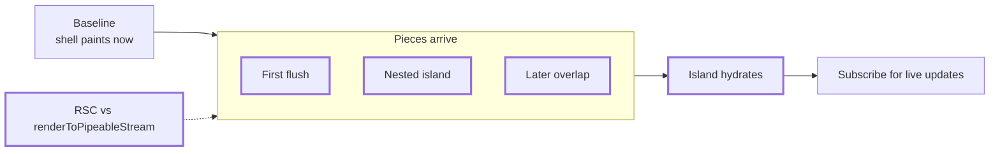
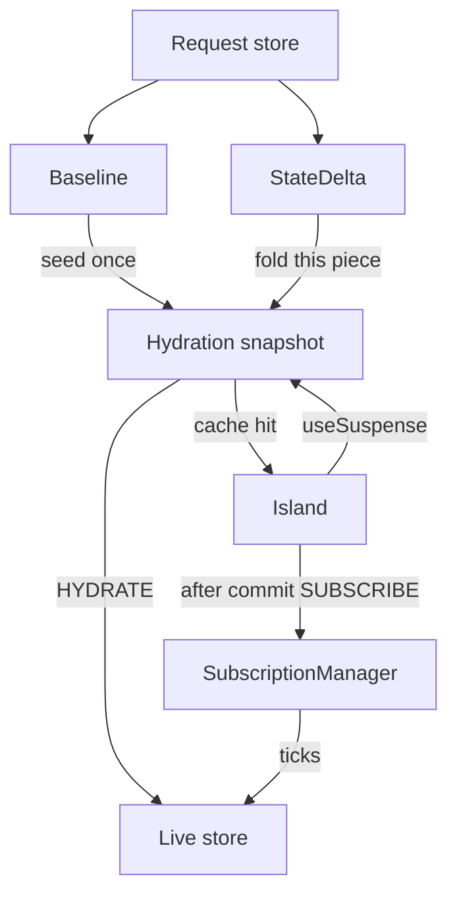
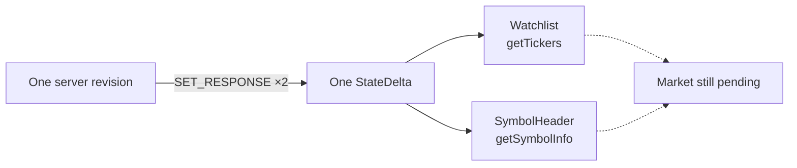
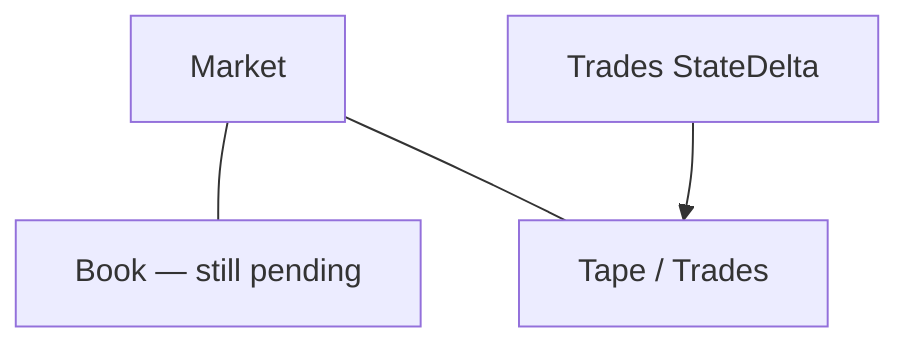
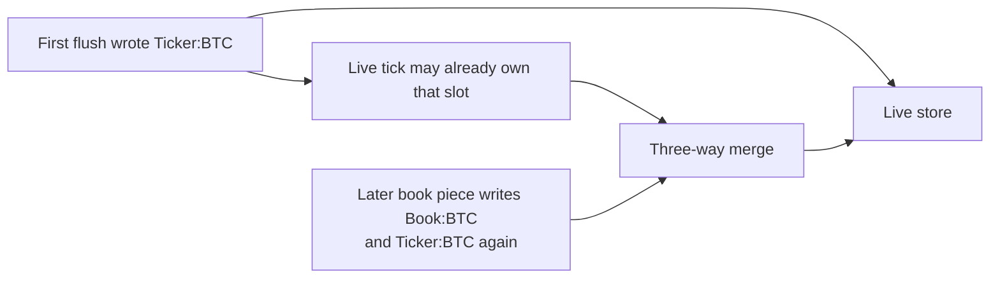
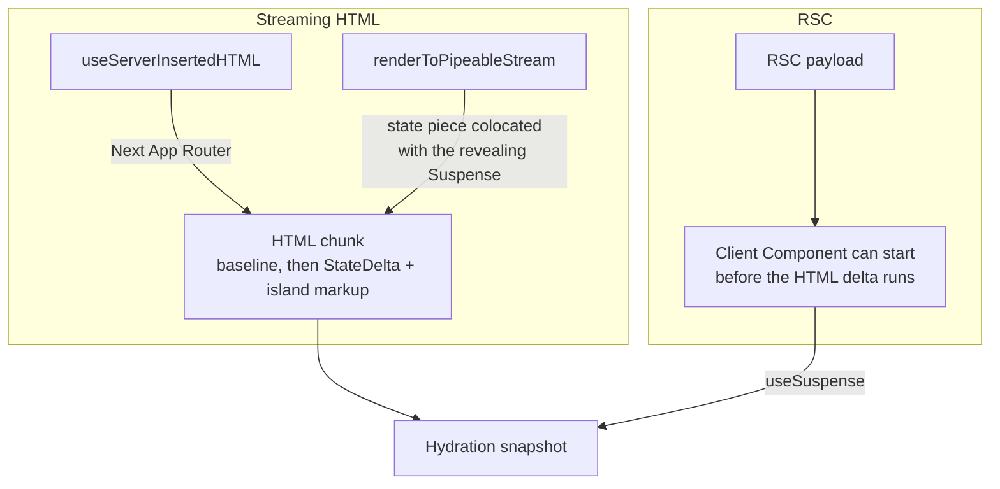

Thick-border nodes on the overview are black boxes. Each zoom opens **one** box.

| Piece | Server revision | Endpoints in the piece | Entities | Who hydrates from it |
| --- | --- | --- | --- | --- |
| **Baseline** | empty request store | — | — | nobody; shell only |
| **First flush** | one flush, two islands | `getTickers`, `getSymbolInfo(BTC)` | `Ticker:BTC`, `Ticker:ETH`, `Symbol:BTC` | Watchlist + SymbolHeader |
| **Nested island** | nested child first | `getTrades(BTC)` | `Trade:…` | Tape, before parent Book exists |
| **Later overlap** | disjoint parent later | `getOrderBook(BTC)` | `Book:BTC`, plus `Ticker:BTC` again (constructed nested ticker) | Book; live three-way merge vs tick |

### Island hydrates

Opens **Island hydrates**. Shared path for every piece.

### First flush

Opens **First flush**. One server revision, two islands, one `StateDelta`.

### Nested island

Opens **Nested island**. Tree order is not stream order.

### Later overlap

Opens **Later overlap**. A later disjoint piece writes an entity the first flush already put in the store.

### RSC vs renderToPipeableStream

Opens **RSC vs renderToPipeableStream**. Two clocks, not two products.

| Wire | Host | How a piece gets on the wire | What it cannot promise |
| --- | --- | --- | --- |
| **Streaming HTML + RSC** | `@data-client/react/nextjs` | `useServerInsertedHTML()` writes the inert baseline, then a `StateDelta` script per flush, into the **HTML** stream | It cannot order that script against **RSC**. A Client Component may start before the delta that describes it has executed. |
| **`renderToPipeableStream`** | `@data-client/react/ssr` (Express, Anansi) | Intended: a state-piece colocated in the revealing Suspense/island so React emits the delta and the dependent markup as one ordered subtree | Not shipped in this release — generic `/ssr` remains a one-shot snapshot. Parser/hydration order is still not a contract. |

The figures are the **intended** client clock. This release does not throw per-key waiters or fold independently of the receiver layout effect.
