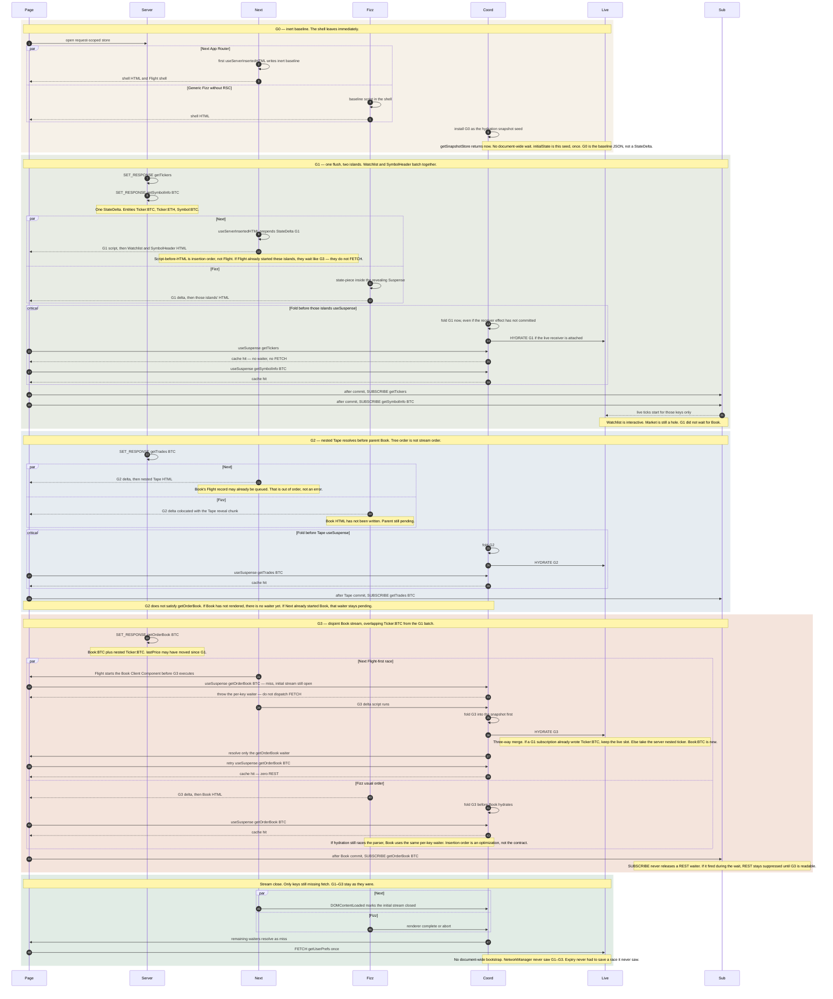

| Generation | Server revision | Endpoints in the piece | Entities | Who hydrates from it |
| --- | --- | --- | --- | --- |
| **G0** | empty request store | — | — | nobody; shell only |
| **G1** | one flush, two islands | `getTickers`, `getSymbolInfo(BTC)` | `Ticker:BTC`, `Ticker:ETH`, `Symbol:BTC` | Watchlist + SymbolHeader |
| **G2** | nested child first | `getTrades(BTC)` | `Trade:…` | Tape, before parent Book exists |
| **G3** | disjoint parent later | `getOrderBook(BTC)` | `Book:BTC`, plus `Ticker:BTC` again (constructed nested ticker) | Book; live three-way merge vs tick |

| Lane | Host | How a piece gets on the wire | What it cannot promise |
| --- | --- | --- | --- |
| **Next / RSC** | `@data-client/react/nextjs` | `useServerInsertedHTML()` writes the inert baseline, then a `StateDelta` script per flush, into the **HTML** stream | It cannot order that script against **Flight**. Flight may start a Client Component before the delta that describes it has executed. |
| **Generic Fizz** | `@data-client/react/ssr` (Express, Anansi, `renderToPipeableStream`) | Intended: a state-piece colocated in the revealing Suspense/island so React emits the delta and the dependent markup as one ordered subtree | Not shipped in this release — generic `/ssr` remains a one-shot snapshot. Parser/hydration order would still need the same intended coordinator and per-key waiter. |

The sequence is the **intended** client clock. This release does not throw per-key waiters or fold independently of the receiver layout effect.

