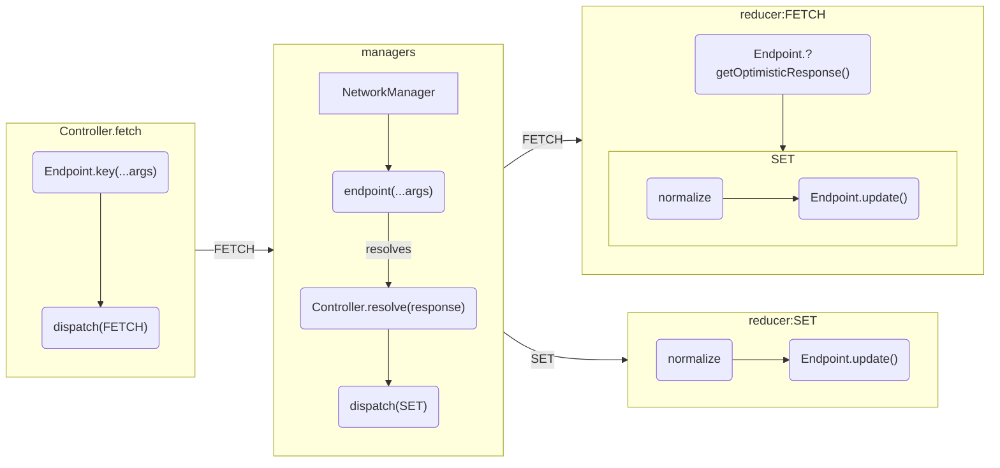

```mermaid
flowchart LR
  subgraph Controller.fetch
    direction TB
    key("Endpoint.key(...args)")--->dispatch("dispatch(FETCH)")
  end
  subgraph managers
    NetworkManager-->endpoint("endpoint(...args)")
    endpoint--resolves-->Controller.resolve
    Controller.resolve("Controller.resolve(response)")-->dispatchR("dispatch(SET)")
  end
  managers--FETCH-->reducer:FETCH
  Controller.fetch--FETCH-->managers
  subgraph reducer:FETCH
    optimistic("Endpoint.?getOptimisticResponse()")-->SET
    subgraph SET
      normalize(normalize)-->update("Endpoint.update()")
    end
  end
  subgraph reducer:SET
    direction LR
    normalize2(normalize)-->update2("Endpoint.update()")
  end
  managers--SET-->reducer:SET
  click key "/rest/api/Endpoint#key"
  click NetworkManager "/docs/api/NetworkManager"
  click optimistic "/rest/api/Endpoint#getoptimisticresponse"
  click update "/rest/api/Endpoint#update"
  click update2 "/rest/api/Endpoint#update"
```
