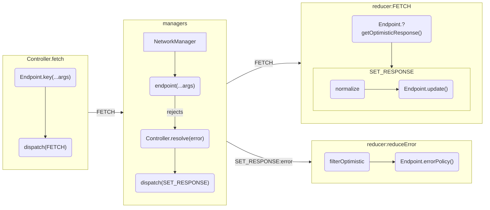

```mermaid
flowchart LR
  subgraph Controller.fetch
    direction TB
    key("Endpoint.key(...args)")--->dispatch("dispatch(FETCH)")
  end
  subgraph managers
    NetworkManager-->endpoint("endpoint(...args)")
    endpoint--rejects-->Controller.resolve
    Controller.resolve("Controller.resolve(error)")-->dispatchR("dispatch(SET_RESPONSE)")
  end
  managers--FETCH-->reducer:FETCH
  Controller.fetch--FETCH-->managers
  subgraph reducer:FETCH
    optimistic("Endpoint.?getOptimisticResponse()")-->SET_RESPONSE
    subgraph SET_RESPONSE
      normalize(normalize)-->update("Endpoint.update()")
    end
  end
  subgraph reducer:reduceError
    direction LR
    filterOptimistic(filterOptimistic)-->errorPolicy("Endpoint.errorPolicy()")
  end
  managers--SET_RESPONSE:error-->reducer:reduceError
  click key "/rest/api/Endpoint#key"
  click optimistic "/rest/api/Endpoint#getoptimisticresponse"
  click update "/rest/api/Endpoint#update"
  click errorPolicy "/rest/api/Endpoint#errorpolicy"
  click NetworkManager "/docs/api/NetworkManager"
  click dispatch "/docs/api/Actions#fetch"
  click dispatchR "/docs/api/Actions#set_response"
```
