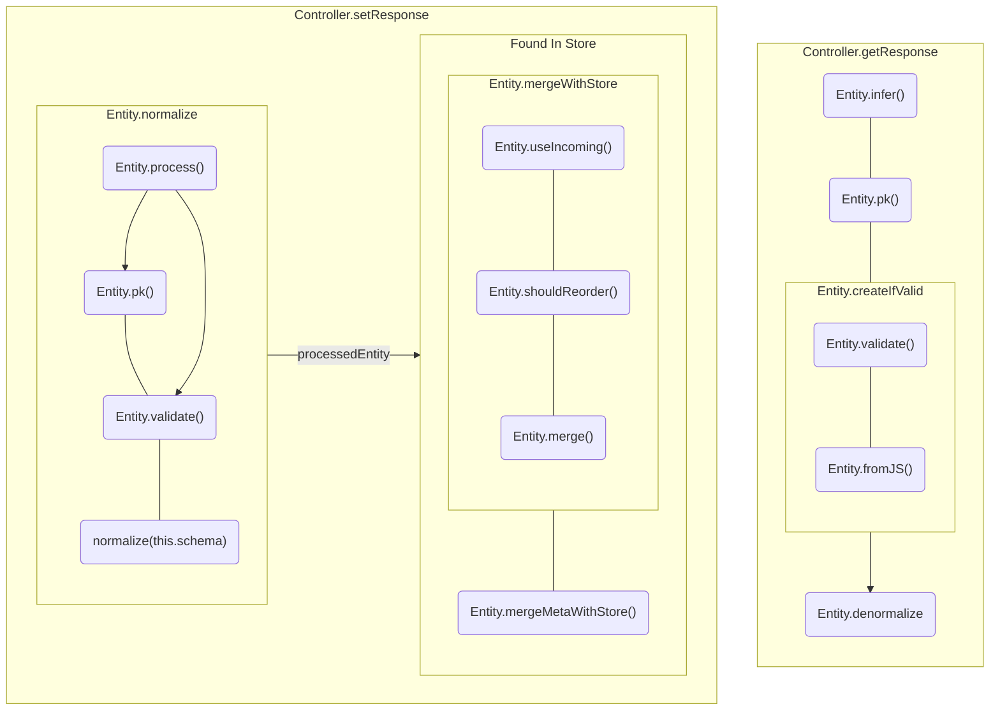

```mermaid
flowchart BT
  subgraph Controller.getResponse
    infer("Entity.infer()")---pk2
    pk2("Entity.pk()")---Entity.createIfValid
    subgraph Entity.createIfValid
      direction TB
      validate2("Entity.validate()")---fromJS("Entity.fromJS()")
    end
    Entity.createIfValid-->denormNest("Entity.denormalize")
  end
  subgraph Controller.setResponse
    direction LR
    subgraph Entity.normalize
      direction TB
      process("Entity.process()")-->pk("Entity.pk()")
      pk---validate("Entity.validate()")
      process-->validate
      validate---normNest("normalize(this.schema)")
    end
    Entity.normalize--processedEntity-->INSTORE
    subgraph INSTORE["Found In Store"]
      subgraph Entity.mergeWithStore
        direction TB
        useincoming("Entity.useIncoming()")---shouldreorder("Entity.shouldReorder()")
        shouldreorder---merge("Entity.merge()")
      end
      Entity.mergeWithStore---mergeMetaWithStore("Entity.mergeMetaWithStore()")
    end
  end
  click process "/rest/api/Entity#process"
  click pk "/rest/api/Entity#pk"
  click pk2 "/rest/api/Entity#pk"
  click fromJS "/rest/api/Entity#fromJS"
  click validate "/rest/api/Entity#validate"
  click validate2 "/rest/api/Entity#validate"
  click mergeMetaWithStore "/rest/api/Entity#mergeMetaWithStore"
  click useincoming "/rest/api/Entity#useincoming"
  click shouldreorder "/rest/api/Entity#shouldreorder"
  click mergewithstore "/rest/api/Entity#mergeWithStore"
  click merge "/rest/api/Entity#merge"
  click infer "/rest/api/Entity#infer"
```
