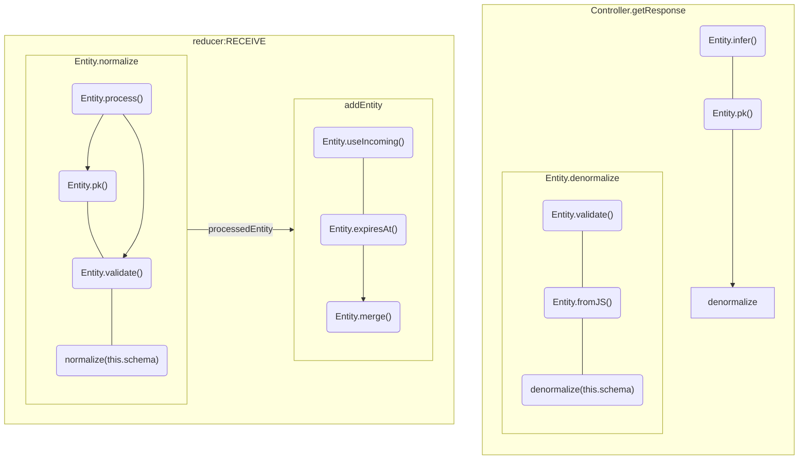

```mermaid
flowchart BT
  subgraph Controller.getResponse
    infer("Entity.infer()")---pk2
    pk2("Entity.pk()")-->denormalize
    subgraph Entity.denormalize
      direction TB
      validate2("Entity.validate()")---fromJS("Entity.fromJS()")
      fromJS---denormNest("denormalize(this.schema)")
    end
  end
  subgraph reducer:RECEIVE
    direction LR
    subgraph Entity.normalize
      direction TB
      process("Entity.process()")-->pk("Entity.pk()")
      pk---validate("Entity.validate()")
      process-->validate
      validate---normNest("normalize(this.schema)")
    end
    Entity.normalize--processedEntity-->addEntity
    subgraph addEntity
      useincoming("Entity.useIncoming()")---expiresAt("Entity.expiresAt()")
      expiresAt-->merge("Entity.merge()")
    end
  end
  click process "/rest/api/Entity#process"
  click pk "/rest/api/Entity#pk"
  click pk2 "/rest/api/Entity#pk"
  click fromJS "/rest/api/Entity#fromJS"
  click validate "/rest/api/Entity#validate"
  click validate2 "/rest/api/Entity#validate"
  click expiresAt "/rest/api/Entity#expiresat"
  click useincoming "/rest/api/Entity#useincoming"
  click merge "/rest/api/Entity#merge"
  click infer "/rest/api/Entity#infer"
```
