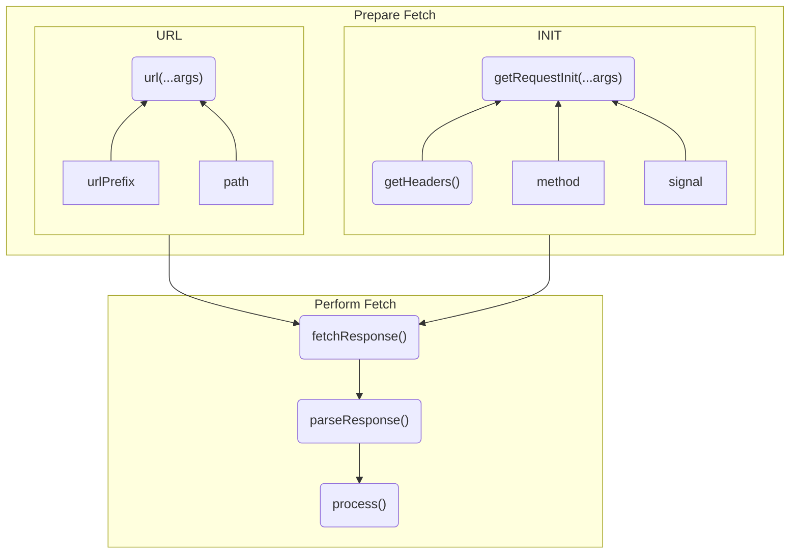

```mermaid
flowchart TB
    URL-->response
    INIT-->response
    subgraph Prepare Fetch
      subgraph URL
        direction BT
        urlPrefix-->url("url(...args)")
        path-->url
      end
      subgraph INIT
      direction BT
        getHeaders("getHeaders()")-->reqinit("getRequestInit(...args)")
        method-->reqinit
        signal-->reqinit
      end
    end
    subgraph Perform Fetch
    response("fetchResponse()")-->parse("parseResponse()")
    parse-->process("process()")
    end
    click url "/rest/api/RestEndpoint#url"
    click urlPrefix "/rest/api/RestEndpoint#urlPrefix"
    click path "/rest/api/RestEndpoint#path"
    click getHeaders "/rest/api/RestEndpoint#getHeaders"
    click method "/rest/api/RestEndpoint#method"
    click signal "https://developer.mozilla.org/en-US/docs/Web/API/AbortSignal"
    click reqinit "/rest/api/RestEndpoint#getRequestInit"
    click response "/rest/api/RestEndpoint#fetchResponse"
    click parse "/rest/api/RestEndpoint#parseResponse"
    click process "/rest/api/RestEndpoint#process"
```
