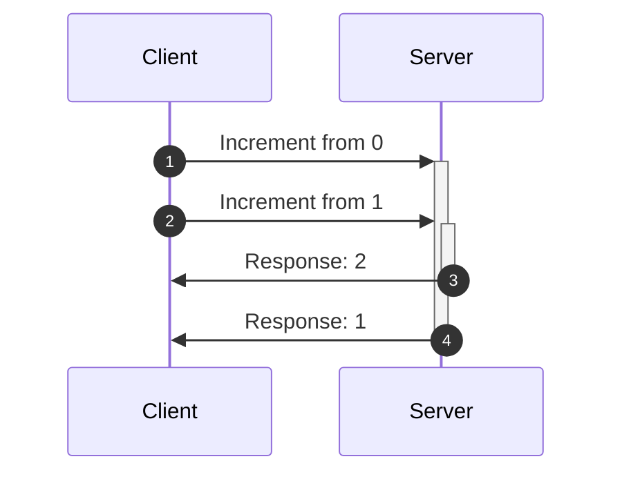
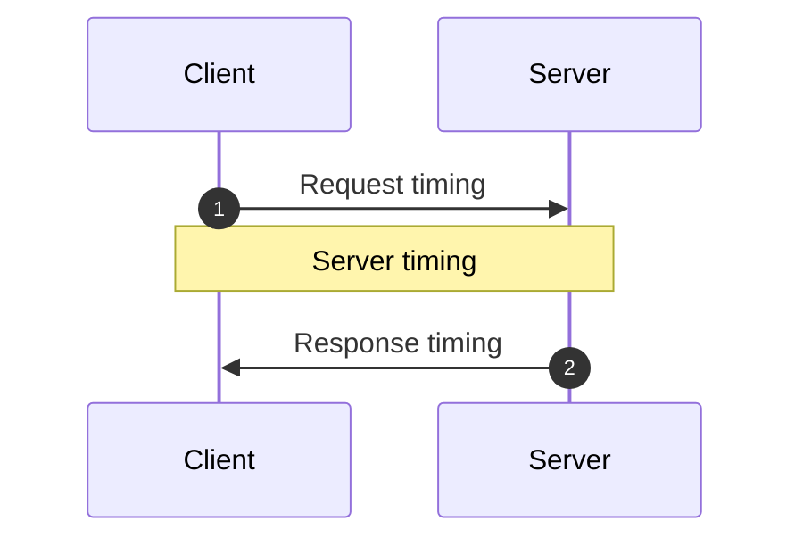

<head>
  <title>Making React 100x faster with Optimistic Updates</title>
  <meta name="docsearch:pagerank" content="40"/>
</head>

import HooksPlayground from '@site/src/components/HooksPlayground';
import {RestEndpoint} from '@data-client/rest';
import { todoFixtures } from '@site/src/fixtures/todos';

Optimistic updates enable highly responsive and fast interfaces by avoiding network wait times.
An update is optimistic by assuming the network is successful.

Doing this amplifies and creates new race conditions; thankfully Reactive Data Client automatically
handles these for you.

## Resources

[createResource()](../api/createResource.md) can be configured by setting [optimistic: true](../api/createResource.md#optimistic).

<HooksPlayground defaultOpen="n" row fixtures={todoFixtures}>

```ts title="TodoResource" {18}
import { Entity, createResource } from '@data-client/rest';

export class Todo extends Entity {
  id = 0;
  userId = 0;
  title = '';
  completed = false;
  pk() {
    return `${this.id}`;
  }
  static key = 'Todo';
}
export const TodoResource = createResource({
  urlPrefix: 'https://jsonplaceholder.typicode.com',
  path: '/todos/:id',
  searchParams: {} as { userId?: string | number } | undefined,
  schema: Todo,
  optimistic: true,
});
```

```tsx title="TodoItem" collapsed
import { useController } from '@data-client/react';
import { TodoResource, type Todo } from './TodoResource';

export default function TodoItem({ todo }: { todo: Todo }) {
  const ctrl = useController();
  const handleChange = e =>
    ctrl.fetch(
      TodoResource.partialUpdate,
      { id: todo.id },
      { completed: e.currentTarget.checked },
    );
  const handleDelete = () =>
    ctrl.fetch(TodoResource.delete, {
      id: todo.id,
    });
  return (
    <div className="listItem nogap">
      <label>
        <input
          type="checkbox"
          checked={todo.completed}
          onChange={handleChange}
        />
        {todo.completed ? <strike>{todo.title}</strike> : todo.title}
      </label>
      <CancelButton onClick={handleDelete} />
    </div>
  );
}
```

```tsx title="CreateTodo" collapsed
import { v4 as uuid } from 'uuid';
import { useController } from '@data-client/react';
import { TodoResource } from './TodoResource';

export default function CreateTodo({ userId }: { userId: number }) {
  const ctrl = useController();
  const handleKeyDown = async e => {
    if (e.key === 'Enter') {
      ctrl.fetch(TodoResource.getList.push, {
        userId,
        title: e.currentTarget.value,
      });
      e.currentTarget.value = '';
    }
  };
  return (
    <div className="listItem nogap">
      <label>
        <input type="checkbox" name="new" checked={false} disabled />
        <input type="text" onKeyDown={handleKeyDown} />
      </label>
      <CancelButton />
    </div>
  );
}
```

```tsx title="TodoList" collapsed
import { useSuspense } from '@data-client/react';
import { TodoResource } from './TodoResource';
import TodoItem from './TodoItem';
import CreateTodo from './CreateTodo';

function TodoList() {
  const userId = 1;
  const todos = useSuspense(TodoResource.getList, { userId });
  return (
    <div>
      {todos.map(todo => (
        <TodoItem key={todo.pk()} todo={todo} />
      ))}
      <CreateTodo userId={userId} />
    </div>
  );
}
render(<TodoList />);
```

</HooksPlayground>

This makes all mutations optimistic using some sensible default implementations that handle most cases.

### update/getList.push/getList.unshift

```ts
function optimisticUpdate(
  snap: SnapshotInterface,
  params: any,
  body: any,
) {
  return {
    ...params,
    ...ensureBodyPojo(body),
  };
}

function ensureBodyPojo(body: any) {
  return body instanceof FormData
    ? Object.fromEntries((body as any).entries())
    : body;
}
```

For creates (push/unshift) this typically results in no `id` in the response to compute a pk.
RDC will create a random `pk` to make this work.

Until the object is actually created, doing mutations on that object generally does not work.
Therefore, it may be prudent in these cases to disable further mutations until the actual
`POST` is completed. One way to determine this is to simply look for the existance of
a real `id` in the entity.

### partialUpdate

```ts
function optimisticPartial(
  getEndpoint: GetEndpoint<{ path: ResourcePath; schema: any }>,
) {
  return function (snap: SnapshotInterface, params: any, body: any) {
    const { data } = snap.getResponse(getEndpoint, params);
    if (!data) throw new AbortOptimistic();
    return {
      ...params,
      ...data,
      // even tho we don't always have two arguments, the extra one will simply be undefined which spreads fine
      ...ensureBodyPojo(body),
    };
  };
}
```

Partial updates do not send the entire body, so we can use the entity from
the store to compute the expected response. [Snapshots](/docs/api/Snapshot)
give us safe access to the existing store value that is robust against any
race conditions.

### delete

```ts
function optimisticDelete(snap: SnapshotInterface, params: any) {
  return params;
}
```

In case you do not want all endpoints to be optimistic, or if you have unusual API designs,
you can set [getOptimisticResponse()](../api/RestEndpoint.md#getoptimisticresponse) using
[Resource.extend()](../api/createResource.md#extend)

## Optimistic Transforms

Sometimes user actions should result in data transformations that are dependent on the previous state of data.
The simplest examples of this are toggling a boolean, or incrementing a counter; but the same principal applies to
more complicated transforms. To make it more obvious we're using a simple counter here.

<HooksPlayground fixtures={[
{
endpoint: new RestEndpoint({path: '/api/count'}),
args: [],
response: { count: 0 }
},
{
endpoint: new RestEndpoint({
path: '/api/count/increment',
method: 'POST',
body: undefined,
}),
response() {
return ({
"count": (this.count = this.count + 1),
});
},
delay: () => 500 + Math.random() * 4500,
}
]}
getInitialInterceptorData={() => ({count: 0})}
row
>

```ts title="count" collapsed
export class CountEntity extends Entity {
  count = 0;

  pk() {
    return `SINGLETON`;
  }
}
export const getCount = new RestEndpoint({
  path: '/api/count',
  schema: CountEntity,
  name: 'get',
});
```

```ts title="increment" {9-15}
import { CountEntity, getCount } from './count';

export const increment = new RestEndpoint({
  path: '/api/count/increment',
  method: 'POST',
  body: undefined,
  name: 'increment',
  schema: CountEntity,
  getOptimisticResponse(snap) {
    const { data } = snap.getResponse(getCount);
    if (!data) throw new AbortOptimistic();
    return {
      count: data.count + 1,
    };
  },
});
```

```tsx title="CounterPage" collapsed
import { useLoading } from '@data-client/hooks';
import { getCount } from './count';
import { increment } from './increment';

function CounterPage() {
  const ctrl = useController();
  const { count } = useSuspense(getCount);
  const [stateCount, setStateCount] = React.useState(0);
  const [responseCount, setResponseCount] = React.useState(0);
  const [clickHandler, loading, error] = useLoading(async () => {
    setStateCount(stateCount + 1);
    const val = await ctrl.fetch(increment);
    setResponseCount(val.count);
    setStateCount(val.count);
  });
  return (
    <div className="vote">
      <p>
        Click the button multiple times quickly to trigger the race
        condition
      </p>
      <table>
        <thead>
          <td></td>
          <td><small>Optimistic</small></td>
          <td><small>Normal</small></td>
        </thead>
        <tbody>
          <tr>
            <th><abbr title="Reactive Data Client">RDC</abbr>:</th>
            <td>{count}</td>
            <td></td>
          </tr>
          <tr>
            <th><abbr title="Other libraries like React Query">Other</abbr>:</th>
            <td>{stateCount}</td>
            <td>{responseCount}</td>
          </tr>
        </tbody>
      </table>
      <button className="up" onClick={clickHandler}>
        &nbsp;
      </button>
      <p>{loading ? ' ...loading' : ''}</p>
    </div>
  );
}
render(<CounterPage />);
```

</HooksPlayground>

Reactive Data Client automatically handles all race conditions due to network timings. Reactive Data Client both tracks
fetch timings, pairs responses with their respective optimistic update and rollsback in case of resolution or
rejection/failure.

You can see how this is problematic for other libraries even without optimistic updates;
but optimistic updates make it even worse.

### Example race condition

Here's an example of the race condition. Here we request an increment twice; but the first response comes back to
client after the second response.



With other libraries and no optimistic updates this would result in showing 0, then, 2, then 1.

If the other library does have optimistic updates, it should show 0, 1, 2, 2, then 1.

In both cases we end up showing an incorrect state, and along the way see weird janky state updates.

### Compensating for Server timing variations {#server-timings}



There are three timings which can vary in an async mutation.

1. Request timing
1. Server timing
1. Response timing

Reactive Data Client is able to automatically handling the network timings, aka request and response timing. Typically this
is sufficient, as servers tend to process requests received first before others. However, in case persist order
varies from request order in the server this could cause another race condition.

This can be be solved by maintaining a [total order](https://en.wikipedia.org/wiki/Total_order). Because the
servers and clients can potentially has different times, we will need to track time from a consistent perspective.
Since we are performing optimistic updates this means we must use the client's clock. This means we will send the request
timing to the server in an `updatedAt` header via [getRequestInit()](../api/RestEndpoint.md#getRequestInit). The server should then ensure processing based on that order, and
then store this `updatedAt` in the entity to return in any request.

Overriding [shouldReorder](api/Entity.md#shouldreorder), we can reorder out-of-order responses based on the
server timestamp.

We use [snap.fetchedAt](/docs/api/Snapshot#fetchedat) in our [getOptimisticResponse](api/RestEndpoint.md#getoptimisticresponse). This respresents the moment the fetch is triggered, which will be the same time the `updatedAt` header is computed.

<HooksPlayground fixtures={[
{
endpoint: new RestEndpoint({path: '/api/count'}),
args: [],
response: { count: 0, updatedAt: Date.now() }
},
{
endpoint: new RestEndpoint({
path: '/api/count/increment',
method: 'POST',
body: undefined,
}),
fetchResponse(input, init) {
return ({
"count": (this.count = this.count + 1),
"updatedAt": JSON.parse(init.body).updatedAt,
});
},
delay: () => 200 + Math.random() * 4500,
delayCollapse:true,
}
]}
getInitialInterceptorData={() => ({ count: 0 })}
row
>

```ts title="count" {9-11} collapsed
export class CountEntity extends Entity {
  count = 0;
  updatedAt = 0;

  pk() {
    return `SINGLETON`;
  }

  static shouldReorder(existingMeta, incomingMeta, existing, incoming) {
    return incoming.updatedAt < existing.updatedAt;
  }
}
export const getCount = new RestEndpoint({
  path: '/api/count',
  schema: CountEntity,
  name: 'get',
});
```

```ts title="increment" {9-15,21}
import { getCount, CountEntity } from './count';

export const increment = new RestEndpoint({
  path: '/api/count/increment',
  method: 'POST',
  body: undefined,
  name: 'increment',
  schema: CountEntity,
  getRequestInit() {
    // this is a substitute for super.getRequestInit()
    // since we aren't in a class context
    return RestEndpoint.prototype.getRequestInit.call(this, {
      updatedAt: Date.now(),
    });
  },
  getOptimisticResponse(snap) {
    const { data } = snap.getResponse(getCount);
    if (!data) throw new AbortOptimistic();
    return {
      count: data.count + 1,
      updatedAt: snap.fetchedAt,
    };
  },
});
```

```tsx title="CounterPage" collapsed
import { useLoading } from '@data-client/hooks';
import { getCount } from './count';
import { increment } from './increment';

function CounterPage() {
  const ctrl = useController();
  const { count } = useSuspense(getCount);
  const [n, setN] = React.useState(count);
  const [clickHandler, loading, error] = useLoading(() => {
    setN(n => n + 1);
    return ctrl.fetch(increment);
  });
  return (
    <div>
      <p>
        Click the button multiple times quickly to trigger the
        potential race condition. This time our vector clock protects
        us.
      </p>
      <div>
        RDC: {count} Should be: {n}
        <br />
        <button onClick={clickHandler}>+</button>
        {loading ? ' ...loading' : ''}
      </div>
    </div>
  );
}
render(<CounterPage />);
```

</HooksPlayground>
