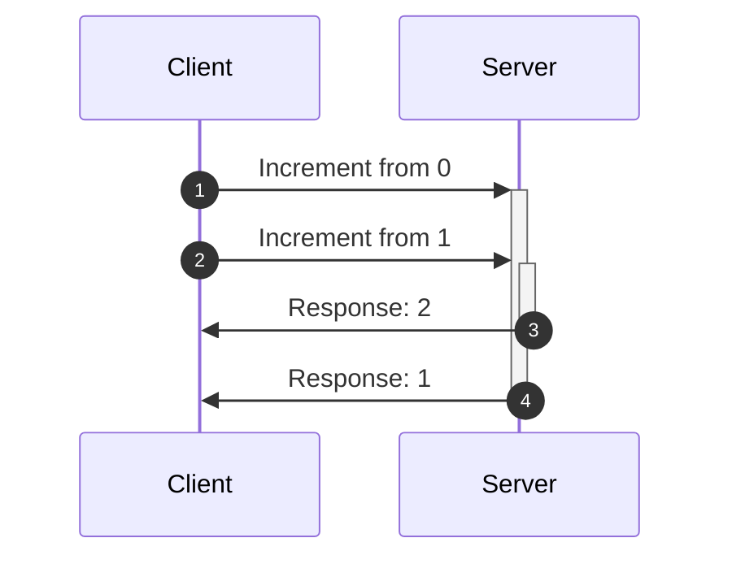
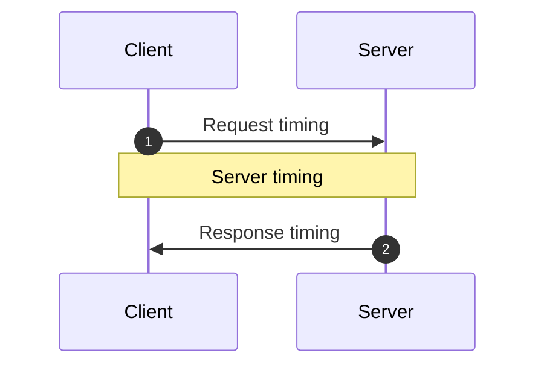

<head>
  <title>Making React apps 100x faster with Optimistic Updates</title>
  <meta name="docsearch:pagerank" content="40"/>
</head>

import HooksPlayground from '@site/src/components/HooksPlayground';
import {RestEndpoint} from '@data-client/rest';

Optimistic updates enable highly responsive and fast interfaces by avoiding network wait times.
An update is optimistic by assuming the network is successful. In the case of any errors, Rest
Hooks will then roll back any changes in a way that deals with all possible race conditions.

## Partial updates

One common use case is for quick toggles. Here we demonstrate a publish button for an
article. Note that we need to include the primary key (`id` in this case) in the response
body to ensure the normalized cache gets updated correctly.

```typescript title="api/Article.ts"
import { Entity, createResource } from '@data-client/rest';

export class Article extends Entity {
  readonly id: string | undefined = undefined;
  readonly title: string = '';
  readonly content: string = '';
  readonly published: boolean = false;

  pk() {
    return this.id;
  }
}

export const ArticleResource = createResource({
  path: '/articles/:id',
  schema: Article,
}).extend({
  partialUpdate: {
    // highlight-start
    getOptimisticResponse(snap, { id }, body) {
      return {
        // we absolutely need the id for primary key here,
        // but won't be a member of body
        id,
        ...body,
      };
    },
    // highlight-end
  },
});
```

```typescript title="PublishButton.tsx"
import { useController } from '@data-client/react';
import { ArticleResource } from 'api/Article';

export default function PublishButton({ id }: { id: string }) {
  const controller = useController();

  return (
    <button
      onClick={() =>
        controller.fetch(
          ArticleResource.partialUpdate,
          { id },
          { published: true },
        )
      }
    >
      Publish
    </button>
  );
}
```

## Optimistic create with instant updates

Optimistic updates can also be combined with [atomic mutations](/docs/concepts/atomic-mutations), enabling updates to
other endpoints instantly. This is most commonly seen when creating new items
while viewing a list of them.

Here we demonstrate what could be used in a list of articles with a modal
to create a new article. On submission of the form it would instantly
add to the list of articles the newly created article - without waiting on a network response.

```typescript title="api/Article.ts"
import { Entity, createResource } from '@data-client/rest';
import { v4 as uuid } from 'uuid';

export class Article extends Entity {
  id: string | undefined = undefined;
  title = '';
  content = '';
  published = false;

  pk() {
    return this.id;
  }
}

export const ArticleResource = createResource({
  path: '/articles/:id',
  schema: Article,
}).extend({
  getList: {
    // used in mutable derivatives like getList.push, getList.unshift or getList.assign
    getOptimisticResponse(snap, body) {
      return body;
    },
  },
});
```

Since the actual `id` of the article is created on the server, we will need to fill
in a temporary fake `id` here, so the `primary key` can be generated. This is needed
to properly normalize the article to be looked up in the cache.

Since [getOptimisticResponse()](../api/RestEndpoint.md#getoptimisticresponse) uses its arguments, we
must modify the arguments when we push.

Once the network responds, it will have a different `id`, which will replace the existing
data. This is often seamless, but care should be taken if the fake `id` is used in any
renders - like to issue subsequent requests. We recommend disabling `edit` type features
that rely on the `primary key` until the network fetch completes.

```typescript title="CreateArticle.tsx"
import { useController } from '@data-client/react';
import { ArticleResource } from 'api/Article';

export default function CreateArticle() {
  const ctrl = useController();
  const submitHandler = useCallback(
    data => ctrl.fetch(ArticleResource.getList.push, { id: uuid(), ...data }),
    [create],
  );

  return <Form onSubmit={submitHandler}>{/* rest of form */}</Form>;
}
```

## Optimistic Deletes

Since deletes [automatically update the cache correctly](/docs/concepts/atomic-mutations#delete) upon fetch success,
making your delete endpoint do this optimistically is as easy as adding the [getOptimisticResponse](api/RestEndpoint.md#getoptimisticresponse)
function to your options.

We return an empty string because that's the response we expect from the server. Although by
default, the server response is ignored.

```typescript title="api/Article.ts"
import { Entity, createResource } from '@data-client/rest';

export class Article extends Entity {
  readonly id: string | undefined = undefined;
  readonly title: string = '';
  readonly content: string = '';
  readonly published: boolean = false;

  pk() {
    return this.id;
  }
}

export const ArticleResource = createResource({
  path: '/articles/:id',
  schema: Article,
}).extend({
  delete: {
    // highlight-start
    getOptimisticResponse(snap, params, body) {
      return params;
    },
    // highlight-end
  },
});
```

## Optimistic Transforms

Sometimes user actions should result in data transformations that are dependent on the previous state of data.
The simplest examples of this are toggling a boolean, or incrementing a counter; but the same principal applies to
more complicated transforms. To make it more obvious we're using a simple counter here.

<HooksPlayground fixtures={[
{
endpoint: new RestEndpoint({path: '/api/count'}),
args: [],
response: { count: 0 }
},
{
endpoint: new RestEndpoint({
path: '/api/count/increment',
method: 'POST',
body: undefined,
}),
response() {
return ({
"count": (this.count = this.count + 1),
});
},
delay: () => 500 + Math.random() * 4500,
}
]}
getInitialInterceptorData={() => ({count: 0})}
>

```ts title="api/Count.ts" {19-25}
export class CountEntity extends Entity {
  count = 0;

  pk() {
    return `SINGLETON`;
  }
}
export const getCount = new RestEndpoint({
  path: '/api/count',
  schema: CountEntity,
  name: 'get',
});
export const increment = new RestEndpoint({
  path: '/api/count/increment',
  method: 'POST',
  body: undefined,
  name: 'increment',
  schema: CountEntity,
  getOptimisticResponse(snap) {
    const { data } = snap.getResponse(getCount);
    if (!data) throw new AbortOptimistic();
    return {
      count: data.count + 1,
    };
  },
});
```

```tsx title="CounterPage.tsx" collapsed
import { useLoading } from '@data-client/hooks';
import { getCount, increment } from './api/Count';

function CounterPage() {
  const ctrl = useController();
  const { count } = useSuspense(getCount);
  const [stateCount, setStateCount] = React.useState(0);
  const [responseCount, setResponseCount] = React.useState(0);
  const [clickHandler, loading, error] = useLoading(async () => {
    setStateCount(stateCount + 1);
    const val = await ctrl.fetch(increment);
    setResponseCount(val.count);
    setStateCount(val.count);
  });
  return (
    <div>
      <p>
        Click the button multiple times quickly to trigger the race condition
      </p>
      <div>
        Reactive Data Client: {count}
        <br />
        Other Libraries: {responseCount}; with optimistic: {stateCount}
        <br />
        <button onClick={clickHandler}>+</button>
        {loading ? ' ...loading' : ''}
      </div>
    </div>
  );
}
render(<CounterPage />);
```

</HooksPlayground>

Reactive Data Client automatically handles all race conditions due to network timings. Reactive Data Client both tracks
fetch timings, pairs responses with their respective optimistic update and rollsback in case of resolution or
rejection/failure.

You can see how this is problematic for other libraries even without optimistic updates;
but optimistic updates make it even worse.

### Example race condition

Here's an example of the race condition. Here we request an increment twice; but the first response comes back to
client after the second response.



With other libraries and no optimistic updates this would result in showing 0, then, 2, then 1.

If the other library does have optimistic updates, it should show 0, 1, 2, 2, then 1.

In both cases we end up showing an incorrect state, and along the way see weird janky state updates.

### Compensating for Server timing variations {#server-timings}



There are three timings which can vary in an async mutation.

1. Request timing
1. Server timing
1. Response timing

Reactive Data Client is able to automatically handling the network timings, aka request and response timing. Typically this
is sufficient, as servers tend to process requests received first before others. However, in case persist order
varies from request order in the server this could cause another race condition.

This can be be solved by maintaining a [total order](https://en.wikipedia.org/wiki/Total_order). Because the
servers and clients can potentially has different times, we will need to track time from a consistent perspective.
Since we are performing optimistic updates this means we must use the client's clock. This means we will send the request
timing to the server in an `updatedAt` header via [getRequestInit()](../api/RestEndpoint.md#getRequestInit). The server should then ensure processing based on that order, and
then store this `updatedAt` in the entity to return in any request.

Overriding our [useIncoming](api/Entity.md#useincoming), we can check which data is newer, and disregard old data
that resolves out of order.

We use [snap.fetchedAt](/docs/api/Snapshot#fetchedat) in our [getOptimisticResponse](api/RestEndpoint.md#getoptimisticresponse). This respresents the moment the fetch is triggered, which will be the same time the `updatedAt` header is computed.

<HooksPlayground fixtures={[
{
endpoint: new RestEndpoint({path: '/api/count'}),
args: [],
response: { count: 0, updatedAt: Date.now() }
},
{
endpoint: new RestEndpoint({
path: '/api/count/increment',
method: 'POST',
body: undefined,
}),
fetchResponse(input, init) {
return ({
"count": (this.count = this.count + 1),
"updatedAt": JSON.parse(init.body).updatedAt,
});
},
delay: () => 500 + Math.random() * 4500,
}
]}
getInitialInterceptorData={() => ({ count: 0 })}
>

```ts title="api/Count.ts" {24-29,35}
export class CountEntity extends Entity {
  count = 0;
  updatedAt = 0;

  pk() {
    return `SINGLETON`;
  }

  static useIncoming(existingMeta, incomingMeta, existing, incoming) {
    return existing.updatedAt <= incoming.updatedAt;
  }
}
export const getCount = new RestEndpoint({
  path: '/api/count',
  schema: CountEntity,
  name: 'get',
});
export const increment = new RestEndpoint({
  path: '/api/count/increment',
  method: 'POST',
  body: undefined,
  name: 'increment',
  schema: CountEntity,
  getRequestInit() {
    // this is a substitute for super.getRequestInit() since we aren't in a class context
    return RestEndpoint.prototype.getRequestInit.call(this, {
      updatedAt: Date.now(),
    });
  },
  getOptimisticResponse(snap) {
    const { data } = snap.getResponse(getCount);
    if (!data) throw new AbortOptimistic();
    return {
      count: data.count + 1,
      updatedAt: snap.fetchedAt,
    };
  },
});
```

```tsx title="CounterPage.tsx" collapsed
import { useLoading } from '@data-client/hooks';
import { getCount, increment } from './api/Count';

function CounterPage() {
  const ctrl = useController();
  const { count } = useSuspense(getCount);
  const [n, setN] = React.useState(count);
  const [clickHandler, loading, error] = useLoading(() => {
    setN(n => n + 1);
    return ctrl.fetch(increment);
  });
  return (
    <div>
      <p>
        Click the button multiple times quickly to trigger the potential race
        condition. This time our vector clock protects us.
      </p>
      <div>
        Network: {count} Should be: {n}
        <br />
        <button onClick={clickHandler}>+</button>
        {loading ? ' ...loading' : ''}
      </div>
    </div>
  );
}
render(<CounterPage />);
```

</HooksPlayground>
