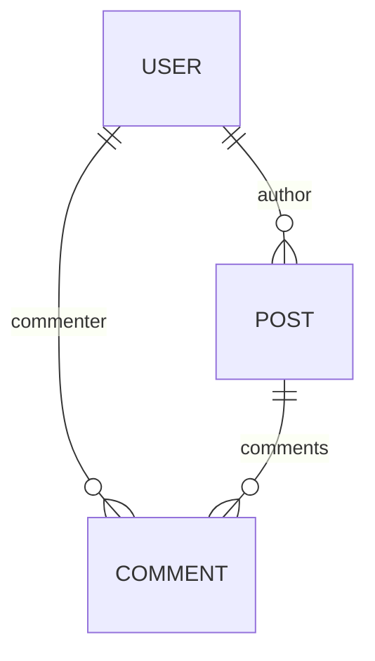

import HooksPlayground from '@site/src/components/HooksPlayground';
import { Collection, RestEndpoint } from '@data-client/rest';
import StackBlitz from '@site/src/components/StackBlitz';

# Relational data

Reactive Data Client handles one-to-one, many-to-one and many-to-many relationships on [entities][1]
using [Entity.schema][3]

## Nesting

Nested members are hoisted during normalization when [Entity.schema][3] is defined.
They are then rejoined during denormalization

<details>
<summary><b>Diagram</b></summary>

<div style={{float:'left'}}>



</div>
<div style={{clear: 'both'}}>&nbsp;</div>
</details>

<HooksPlayground groupId="schema" defaultOpen="y" fixtures={[
{
endpoint: new RestEndpoint({ path: '/posts' }),
response: [
{
"id": "1",
"title": "My first post!",
"author": {
"id": "123",
"name": "Paul"
},
"comments": [
{
"id": "249",
"content": "Nice post!",
"commenter": {
"id": "245",
"name": "Jane"
}
},
{
"id": "250",
"content": "Thanks!",
"commenter": {
"id": "123",
"name": "Paul"
}
}
]
},
{
"id": "2",
"title": "This other post",
"author": {
"id": "123",
"name": "Paul"
},
"comments": [
{
"id": "251",
"content": "Your other post was nicer",
"commenter": {
"id": "245",
"name": "Jane"
}
},
{
"id": "252",
"content": "I am a spammer!",
"commenter": {
"id": "246",
"name": "Spambot5000"
}
}
]
}
],
delay: 150,
},
]}>

```typescript title="resources/Post"
import { Collection, Entity } from '@data-client/rest';

export class User extends Entity {
  id = '';
  name = '';
}

export class Comment extends Entity {
  id = '';
  content = '';
  commenter = User.fromJS();

  static schema = {
    commenter: User,
  };
}

export class Post extends Entity {
  id = '';
  title = '';
  author = User.fromJS();
  comments: Comment[] = [];

  static schema = {
    author: User,
    comments: new Collection([Comment], {
      nestKey: (parent, key) => ({
        postId: parent.id,
      }),
    }),
  };
}

export const PostResource = resource({
  path: '/posts/:id',
  schema: Post,
});
```

```tsx title="PostPage" collapsed
import { PostResource } from './resources/Post';

function PostPage() {
  const posts = useSuspense(PostResource.getList);
  return (
    <div>
      {posts.map(post => (
        <div key={post.pk()}>
          <h4>
            {post.title} - <cite>{post.author.name}</cite>
          </h4>
          <ul>
            {post.comments.map(comment => (
              <li key={comment.pk()}>
                {comment.content}{' '}
                <small>
                  <cite>
                    {comment.commenter.name}
                    {comment.commenter === post.author ? ' [OP]' : ''}
                  </cite>
                </small>
              </li>
            ))}
          </ul>
        </div>
      ))}
    </div>
  );
}
render(<PostPage />);
```

</HooksPlayground>

## Client side joins

Nesting data when your endpoint doesn't.

Even if the network responses don't nest data, we can perform client-side joins by specifying
the relationship in [Entity.schema](../api/Entity.md#schema)

<HooksPlayground>

```ts title="resources/User" collapsed
export class User extends Entity {
  id = 0;
  username = '';
  name = '';
  email = '';
  website = '';
}
export const UserResource = resource({
  urlPrefix: 'https://jsonplaceholder.typicode.com',
  path: '/users/:id',
  schema: User,
});
```

```ts title="resources/Todo"
import { User } from './User';

export class Todo extends Entity {
  id = 0;
  userId = 0;
  user? = User.fromJS();
  title = '';
  completed = false;
  static schema = {
    user: User,
  };
  static process(todo) {
    return { ...todo, user: todo.userId };
  }
}
export const TodoResource = resource({
  urlPrefix: 'https://jsonplaceholder.typicode.com',
  path: '/todos/:id',
  schema: Todo,
});
```

```tsx title="TodoJoined" collapsed
import { TodoResource } from './resources/Todo';
import { UserResource } from './resources/User';

function TodosPage() {
  useFetch(UserResource.getList);
  const todos = useSuspense(TodoResource.getList);
  return (
    <div>
      {todos.slice(17, 24).map(todo => (
        <div key={todo.pk()}>
          {todo.title} by <small>{todo.user?.name}</small>
        </div>
      ))}
    </div>
  );
}
render(<TodosPage />);
```

</HooksPlayground>

### Key-based joins

For more complex scenarios where related entities are fetched separately, use [Entity.process()](/rest/api/Entity#process)
to create a reference key that links to another Entity. This is useful when:

- Related data comes from different API endpoints
- You want to avoid over-fetching nested data
- The relationship is optional or varies by context

```typescript
import { Entity, resource } from '@data-client/rest';

class Stats extends Entity {
  product_id = '';
  volume = 0;
  price = 0;

  pk() {
    return this.product_id;
  }

  static key = 'Stats';
}

class Currency extends Entity {
  id = '';
  name = '';
  // Default value allows Currency to exist without Stats loaded
  stats = Stats.fromJS();

  pk() {
    return this.id;
  }

  static key = 'Currency';

  // Create a reference key that links to Stats entity
  static process(input: any, parent: any, key: string, args: any[]) {
    // The stats field becomes a reference to Stats with pk `${id}-USD`
    return { ...input, stats: `${input.id}-USD` };
  }

  static schema = {
    // Stats will be looked up by the key from process()
    stats: Stats,
  };
}
```

When both `CurrencyResource.getList` and `StatsResource.getList` are fetched, the `stats`
field will automatically resolve to the matching `Stats` entity.

### Crypto price example

Here we want to sort `Currencies` by their trade volume. However, trade volume is only available in the `Stats`
Entity. Even though `CurrencyResource.getList` fetch does not include `Stats` in the response, we can additionally
call `StatsResource.getList`, while adding it to our `Currency's` [Entity.schema](../api/Entity.md#schema) - enabling
`Stats` inclusion in our `Currency` Entity, which enables sorting with:

```ts
entries.sort((a, b) => {
  return b?.stats?.volume_usd - a?.stats?.volume_usd;
});
```

<StackBlitz app="coin-app" file="src/pages/Home/CurrencyList.tsx,src/resources/Stats.ts,src/resources/Currency.ts" height="700" view="editor" />

## Reverse lookups

Nesting data when your endpoint doesn't (part 2).

Even though a response may only nest in one direction, Reactive Data Client can handle reverse relationships
by overriding [Entity.process](../api/Entity.md#process). Additionally, [Entity.merge](../api/Entity.md#merge)
may need overriding to ensure deep merging of those expected fields.

This allows you to traverse the relationship after processing only one fetch request, rather than having to fetch
each time you want access to a different view.

<HooksPlayground groupId="schema" defaultOpen="y" fixtures={[
{
endpoint: new RestEndpoint({ path: '/posts' }),
response: [
{
"id": "1",
"title": "My first post!",
"author": {
"id": "123",
"name": "Paul"
},
"comments": [
{
"id": "249",
"content": "Nice post!",
"commenter": {
"id": "245",
"name": "Jane"
}
},
{
"id": "250",
"content": "Thanks!",
"commenter": {
"id": "123",
"name": "Paul"
}
}
]
},
{
"id": "2",
"title": "This other post",
"author": {
"id": "123",
"name": "Paul"
},
"comments": [
{
"id": "251",
"content": "Your other post was nicer",
"commenter": {
"id": "245",
"name": "Jane"
}
},
{
"id": "252",
"content": "I am a spammer!",
"commenter": {
"id": "246",
"name": "Spambot5000"
}
}
]
}
],
delay: 150,
},
]}>

```typescript title="resources/Post"
import { Collection, Entity } from '@data-client/rest';

export class User extends Entity {
  id = '';
  name = '';
  posts: Post[] = [];
  comments: Comment[] = [];

  static merge(existing, incoming) {
    return {
      ...existing,
      ...incoming,
      posts: [...(existing.posts || []), ...(incoming.posts || [])],
      comments: [
        ...(existing.comments || []),
        ...(incoming.comments || []),
      ],
    };
  }

  static process(value, parent, key) {
    switch (key) {
      case 'author':
        return { ...value, posts: [parent.id] };
      case 'commenter':
        return { ...value, comments: [parent.id] };
      default:
        return { ...value };
    }
  }
}

export class Comment extends Entity {
  id = '';
  content = '';
  commenter = User.fromJS();
  post = Post.fromJS();

  static schema: Record<string, Schema> = {
    commenter: User,
  };
  static process(value, parent, key) {
    return { ...value, post: parent.id };
  }
}

export class Post extends Entity {
  id = '';
  title = '';
  author = User.fromJS();
  comments: Comment[] = [];

  static schema = {
    author: User,
    comments: [Comment],
  };
}

// with cirucular dependencies we must set schema after they are all defined
User.schema = {
  posts: [Post],
  comments: [Comment],
};
Comment.schema = {
  ...Comment.schema,
  post: Post,
};

export const PostResource = resource({
  path: '/posts/:id',
  schema: Post,
  dataExpiryLength: Infinity,
});
export const UserResource = resource({
  path: '/users/:id',
  schema: User,
});
```

```tsx title="UserPage" collapsed
import { UserResource } from './resources/Post';

export default function UserPage({ setRoute, id }) {
  const user = useSuspense(UserResource.get, { id });
  return (
    <div>
      <h4>
        <a onClick={() => setRoute('page')} style={{ cursor: 'pointer' }}>
          &lt;
        </a>{' '}
        {user.name}
      </h4>
      {user.posts.length ? (
        <>
          <h5>Posts</h5>
          <ul>
            {user.posts.map(post => (
              <li>{post.title}</li>
            ))}
          </ul>
        </>
      ) : null}
      <h5>Comments</h5>
      <ul>
        {user.comments.map(comment => (
          <li>{comment.content}</li>
        ))}
      </ul>
    </div>
  );
}
```

```tsx title="PostPage" collapsed
import { PostResource } from './resources/Post';

export default function PostPage({ setRoute }) {
  const posts = useSuspense(PostResource.getList);
  return (
    <div>
      {posts.map(post => (
        <div key={post.pk()}>
          <h4>
            {post.title} -{' '}
            <cite
              onClick={() => setRoute(`user/${post.author.id}`)}
              style={{ cursor: 'pointer', textDecoration: 'underline' }}
            >
              {post.author.name}
            </cite>
          </h4>
          <ul>
            {post.comments.map(comment => (
              <li key={comment.pk()}>
                {comment.content}{' '}
                <small>
                  <cite
                    onClick={() =>
                      setRoute(`user/${comment.commenter.id}`)
                    }
                    style={{
                      cursor: 'pointer',
                      textDecoration: 'underline',
                    }}
                  >
                    {comment.commenter.name}
                    {comment.commenter === post.author ? ' [OP]' : ''}
                  </cite>
                </small>
              </li>
            ))}
          </ul>
        </div>
      ))}
    </div>
  );
}
```

```tsx title="Navigation" collapsed
import PostPage from './PostPage';
import UserPage from './UserPage';

function Navigation() {
  const [route, setRoute] = React.useState('posts');
  if (route.startsWith('user'))
    return <UserPage setRoute={setRoute} id={route.split('/')[1]} />;

  return <PostPage setRoute={setRoute} />;
}
render(<Navigation />);
```

</HooksPlayground>

### Circular dependencies

Because circular imports and circular class definitions are not allowed, sometimes it
will be necessary to define the [schema][3] after the [Entities][1] definition.

```typescript title="resources/Post"
import { Collection, Entity } from '@data-client/rest';
import { User } from './User';

export class Post extends Entity {
  id = '';
  title = '';
  author = User.fromJS();

  static schema = {
    author: User,
  };
}

// both User and Post are now defined, so it's okay to refer to both of them
// highlight-start
User.schema = {
  // ensure we keep the 'createdAt' member
  ...User.schema,
  posts: [Post],
};
// highlight-end
```

```typescript title="resources/User"
import { Collection, Entity } from '@data-client/rest';
import type { Post } from './Post';
// we can only import the type else we break javascript imports
// thus we change the schema of UserResource above

export class User extends Entity {
  id = '';
  name = '';
  posts: Post[] = [];
  createdAt = Temporal.Instant.fromEpochMilliseconds(0);

  static schema: Record<string, Schema | Date> = {
    createdAt: Temporal.Instant.from,
  };
}
```

[1]: ../api/Entity.md
[2]: /docs/api/useCache
[3]: ../api/Entity.md#schema
