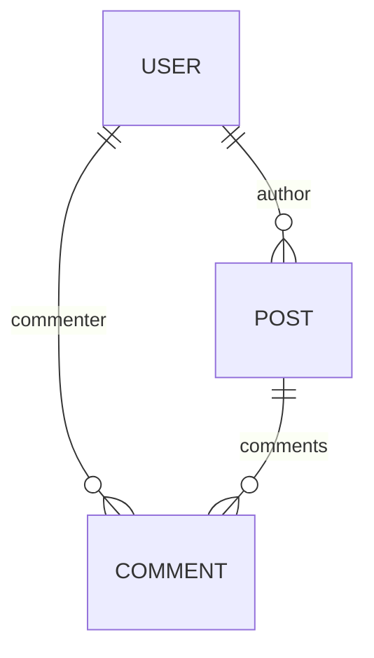

<head>
  <title>Simplified relational data rendering in React</title>
</head>

import HooksPlayground from '@site/src/components/HooksPlayground';
import { RestEndpoint } from '@rest-hooks/rest';

Reactive Data Client handles one-to-one, many-to-one and many-to-many relationships on [entities][1]
using [Entity.schema][3]

## Nesting

Nested members are hoisted during normalization when [Entity.schema][3] is defined.
They are then rejoined during denormalization

<details>
<summary><b>Diagram</b></summary>

<div style={{float:'left'}}>



</div>
<div style={{clear: 'both'}}>&nbsp;</div>
</details>

<HooksPlayground groupId="schema" defaultOpen="y" fixtures={[
{
endpoint: new RestEndpoint({ path: '/posts' }),
response: [
{
"id": "1",
"title": "My first post!",
"author": {
"id": "123",
"name": "Paul"
},
"comments": [
{
"id": "249",
"content": "Nice post!",
"commenter": {
"id": "245",
"name": "Jane"
}
},
{
"id": "250",
"content": "Thanks!",
"commenter": {
"id": "123",
"name": "Paul"
}
}
]
},
{
"id": "2",
"title": "This other post",
"author": {
"id": "123",
"name": "Paul"
},
"comments": [
{
"id": "251",
"content": "Your other post was nicer",
"commenter": {
"id": "245",
"name": "Jane"
}
},
{
"id": "252",
"content": "I am a spammer!",
"commenter": {
"id": "246",
"name": "Spambot5000"
}
}
]
}
],
delay: 150,
},
]}>

```typescript title="api/Post"
import { Entity } from '@rest-hooks/rest';

export class User extends Entity {
  id = '';
  name = '';

  pk() {
    return this.id;
  }
}

export class Comment extends Entity {
  id = '';
  content = '';
  commenter = User.fromJS();

  pk() {
    return this.id;
  }

  static schema = {
    commenter: User,
  };
}

export class Post extends Entity {
  id = '';
  title = '';
  author = User.fromJS();
  comments: Comment[] = [];

  pk() {
    return this.id;
  }

  static schema = {
    author: User,
    comments: [Comment],
  };
}

export const PostResource = createResource({
  path: '/posts/:id',
  schema: Post,
});
```

```tsx title="PostPage" collapsed
import { PostResource } from './api/Post';

function PostPage() {
  const posts = useSuspense(PostResource.getList);
  return (
    <div>
      {posts.map(post => (
        <div>
          <h4>
            {post.title} - <cite>{post.author.name}</cite>
          </h4>
          <ul>
            {post.comments.map(comment => (
              <li>
                {comment.content}{' '}
                <small>
                  <cite>
                    {comment.commenter.name}
                    {comment.commenter === post.author ? ' [OP]' : ''}
                  </cite>
                </small>
              </li>
            ))}
          </ul>
        </div>
      ))}
    </div>
  );
}
render(<PostPage />);
```

</HooksPlayground>

## Client side joins

Even if the network responses don't nest data, we can perform client-side joins by specifying
the relationship in [Entity.schema](./Entity.md#schema)

<HooksPlayground>

```ts title="api/User.ts" collapsed
export class User extends Entity {
  id = 0;
  name = '';
  email = '';
  website = '';
  pk() {
    return `${this.id}`;
  }
}
export const UserResource = createResource({
  urlPrefix: 'https://jsonplaceholder.typicode.com',
  path: '/users/:id',
  schema: User,
});
```

```ts title="api/Todo.ts" collapsed
import { User } from './User';

export class Todo extends Entity {
  id = 0;
  userId = User.fromJS({});
  title = '';
  completed = false;
  pk() {
    return `${this.id}`;
  }
  static schema = {
    userId: User,
  };
}
export const TodoResource = createResource({
  urlPrefix: 'https://jsonplaceholder.typicode.com',
  path: '/todos/:id',
  schema: Todo,
});
```

```tsx title="TodoJoined.tsx"
import { TodoResource } from './api/Todo';
import { UserResource } from './api/User';


function TodosPage() {
  useFetch(UserResource.getList);
  const todos = useSuspense(TodoResource.getList);
  return (
    <div>
      {todos.slice(17,24).map(todo => (
        <div key={todo.pk()}>
          {todo.title} by <small>{todo.userId?.name}</small>
        </div>
      ))}
    </div>
  );
}
render(<TodosPage />);
```

</HooksPlayground>


## Reverse lookups

Even though a response may only nest in one direction, Reactive Data Client can handle reverse relationships
by overriding [Entity.process](../api/Entity.md#process). Additionally, [Entity.merge](../api/Entity.md#merge)
may need overriding to ensure deep merging of those expected fields.

This allows you to traverse the relationship after processing only one fetch request, rather than having to fetch
each time you want access to a different view.

<HooksPlayground groupId="schema" defaultOpen="y" fixtures={[
{
endpoint: new RestEndpoint({ path: '/posts' }),
response: [
{
"id": "1",
"title": "My first post!",
"author": {
"id": "123",
"name": "Paul"
},
"comments": [
{
"id": "249",
"content": "Nice post!",
"commenter": {
"id": "245",
"name": "Jane"
}
},
{
"id": "250",
"content": "Thanks!",
"commenter": {
"id": "123",
"name": "Paul"
}
}
]
},
{
"id": "2",
"title": "This other post",
"author": {
"id": "123",
"name": "Paul"
},
"comments": [
{
"id": "251",
"content": "Your other post was nicer",
"commenter": {
"id": "245",
"name": "Jane"
}
},
{
"id": "252",
"content": "I am a spammer!",
"commenter": {
"id": "246",
"name": "Spambot5000"
}
}
]
}
],
delay: 150,
},
]}>

```typescript title="api/Post"
import { Entity } from '@rest-hooks/rest';

export class User extends Entity {
  id = '';
  name = '';
  posts: Post[] = [];
  comments: Comment[] = [];

  pk() {
    return this.id;
  }

  static merge(existing, incoming) {
    return {
      ...existing,
      ...incoming,
      posts: [...(existing.posts || []), ...(incoming.posts || [])],
      comments: [...(existing.comments || []), ...(incoming.comments || [])],
    };
  }

  static process(value, parent, key) {
    switch (key) {
      case 'author':
        return { ...value, posts: [parent.id] };
      case 'commenter':
        return { ...value, comments: [parent.id] };
      default:
        return { ...value };
    }
  }
}

export class Comment extends Entity {
  id = '';
  content = '';
  commenter = User.fromJS();
  post = Post.fromJS();

  pk() {
    return this.id;
  }

  static schema: Record<string, Schema> = {
    commenter: User,
  };
  static process(value, parent, key) {
    return { ...value, post: parent.id };
  }
}

export class Post extends Entity {
  id = '';
  title = '';
  author = User.fromJS();
  comments: Comment[] = [];

  pk() {
    return this.id;
  }

  static schema = {
    author: User,
    comments: [Comment],
  };
}

// with cirucular dependencies we must set schema after they are all defined
User.schema = {
  posts: [Post],
  comments: [Comment],
};
Comment.schema = {
  ...Comment.schema,
  post: Post,
};

export const PostResource = createResource({
  path: '/posts/:id',
  schema: Post,
  dataExpiryLength: Infinity,
});
export const UserResource = createResource({
  path: '/users/:id',
  schema: User,
});
```

```tsx title="UserPage" collapsed
import { UserResource } from './api/Post';

export default function UserPage({ setRoute, id }) {
  const user = useSuspense(UserResource.get, { id });
  return (
    <div>
      <h4>
        <a onClick={() => setRoute('page')} style={{ cursor: 'pointer' }}>
          &lt;
        </a>{' '}
        {user.name}
      </h4>
      {user.posts.length ? (
        <>
          <h5>Posts</h5>
          <ul>
            {user.posts.map(post => (
              <li>{post.title}</li>
            ))}
          </ul>
        </>
      ) : null}
      <h5>Comments</h5>
      <ul>
        {user.comments.map(comment => (
          <li>{comment.content}</li>
        ))}
      </ul>
    </div>
  );
}
```

```tsx title="PostPage" collapsed
import { PostResource } from './api/Post';

export default function PostPage({ setRoute }) {
  const posts = useSuspense(PostResource.getList);
  return (
    <div>
      {posts.map(post => (
        <div>
          <h4>
            {post.title} -{' '}
            <cite
              onClick={() => setRoute(`user/${post.author.id}`)}
              style={{ cursor: 'pointer', textDecoration: 'underline' }}
            >
              {post.author.name}
            </cite>
          </h4>
          <ul>
            {post.comments.map(comment => (
              <li>
                {comment.content}{' '}
                <small>
                  <cite
                    onClick={() => setRoute(`user/${comment.commenter.id}`)}
                    style={{ cursor: 'pointer', textDecoration: 'underline' }}
                  >
                    {comment.commenter.name}
                    {comment.commenter === post.author ? ' [OP]' : ''}
                  </cite>
                </small>
              </li>
            ))}
          </ul>
        </div>
      ))}
    </div>
  );
}
```

```tsx title="Navigation" collapsed
import PostPage from './PostPage';
import UserPage from './UserPage';

function Navigation() {
  const [route, setRoute] = React.useState('posts');
  if (route.startsWith('user'))
    return <UserPage setRoute={setRoute} id={route.split('/')[1]} />;

  return <PostPage setRoute={setRoute} />;
}
render(<Navigation />);
```

</HooksPlayground>

### Circular dependencies

Because circular imports and circular class definitions are not allowed, sometimes it
will be necessary to define the [schema][3] after the [Entities][1] definition.

```typescript title="api/Post.ts"
import { Entity } from '@rest-hooks/rest';
import { User } from './User';

export class Post extends Entity {
  id = '';
  title = '';
  author = User.fromJS();

  pk() {
    return this.id;
  }

  static schema = {
    author: User,
  };
}

// both User and Post are now defined, so it's okay to refer to both of them
// highlight-start
User.schema = {
  // ensure we keep the 'createdAt' member
  ...User.schema,
  posts: [Post],
};
// highlight-end
```

```typescript title="api/User.ts"
import { Entity } from '@rest-hooks/rest';
import type { Post } from './Post';
// we can only import the type else we break javascript imports
// thus we change the schema of UserResource above

export class User extends Entity {
  id = '';
  name = '';
  posts: Post[] = [];
  createdAt = new Date(0);

  pk() {
    return this.id;
  }

  static schema: Record<string, Schema | Date> = {
    createdAt: Date,
  };
}
```

[1]: ../api/Entity.md
[2]: /docs/api/useCache
[3]: ../api/Entity.md#schema
