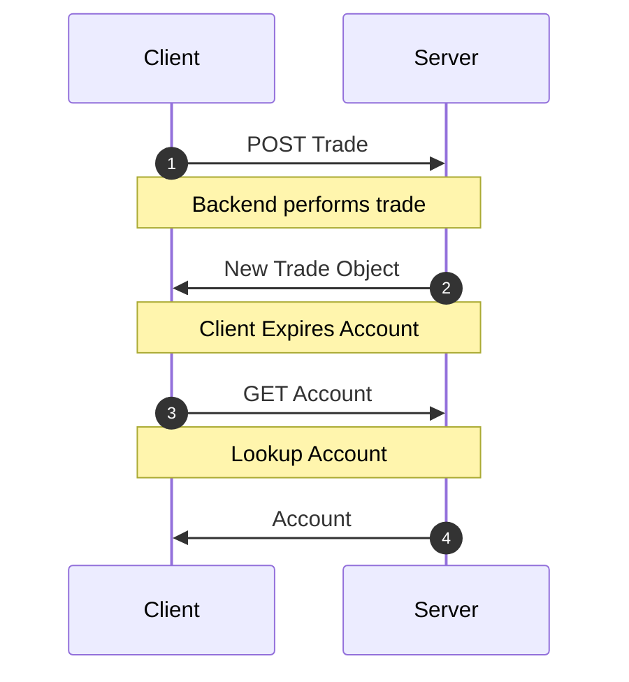
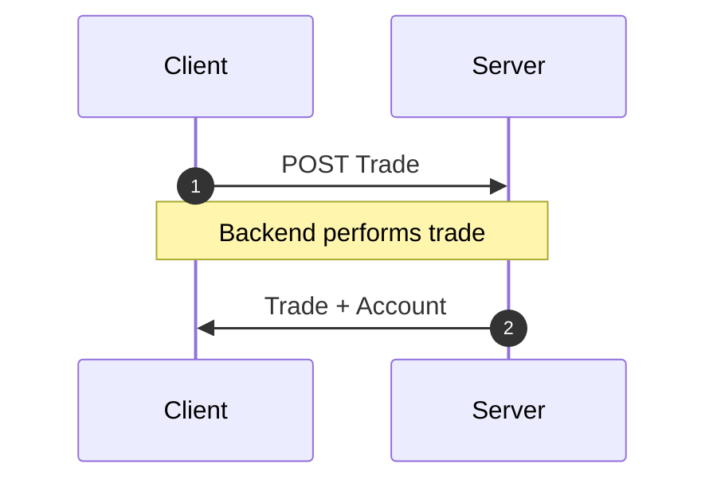

When mutations update more than one resource, it may be tempting to simply
[expire all](/docs/api/Controller#expireAll) the other resources.

However, we can still achieve the high performance atomic mutations if we
simply bundle *all* updated resources in the mutation response, we can
avoid this slow networking cascade.

<div style={{display: 'grid', gridTemplateColumns: '1fr 1fr', columnGap: '15px'}}>

<div>
<h4 style={{textAlign: 'center'}}>Network Cascade</h4>


</div>
<div>
<h4 style={{textAlign: 'center'}}> Response Bundling</h4>


</div>

</div>

## Example

You're running a crypto trading platform called `dogebase`. Every time
a user creates a trade, you need to update some balance information
in their accounts object. So upon `POST`ing to the `/trade/` endpoint,
you nest both the updated accounts object along with the trade you just
created.

```json title="POST /trade/"
{
  "trade": {
    "id": 2893232,
    "user": 1,
    "amount": "50.2335324",
    "coin": "doge",
    "created_at": ""
  },
  "account": {
    "id": 899,
    "user": 1,
    "balance": "1337.00",
    "coin_value": "3.50"
  }
}
```

To handle this, we just need to update the `schema` to include the custom
endpoint.

```typescript title="resources/TradeResource.ts"
import { resource } from '@data-client/rest';

export const TradeResource = resource({
  path: '/trade/:id',
  schema: Trade,
}).extend(Base => ({
  create: Base.getList.push.extend({
    schema: {
      trade: Base.getList.push.schema,
      account: Account,
    },
  }),
}));
```

Now if when we use the [getList.push](../api/resource.md#push) Endpoint generator method,
we will be happy knowing both the trade and account information will
be updated in the cache after the `POST` request is complete.

```typescript title="CreateTrade.tsx"
export default function CreateTrade() {
  const ctrl = useController();
  const handleSubmit = payload => ctrl.fetch(TradeResource.create, payload);
  //...
}
```

:::note

Feel free to create completely new [RestEndpoint](../api/RestEndpoint.md) methods for any custom
endpoints you have. This endpoint tells `Reactive Data Client` how to process any
request.

:::
