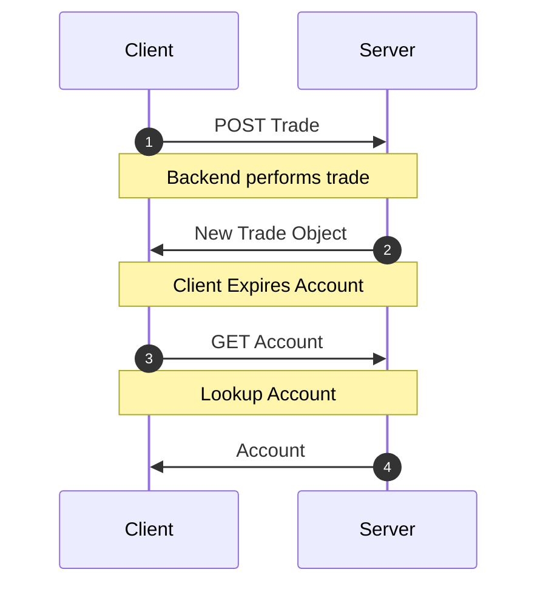
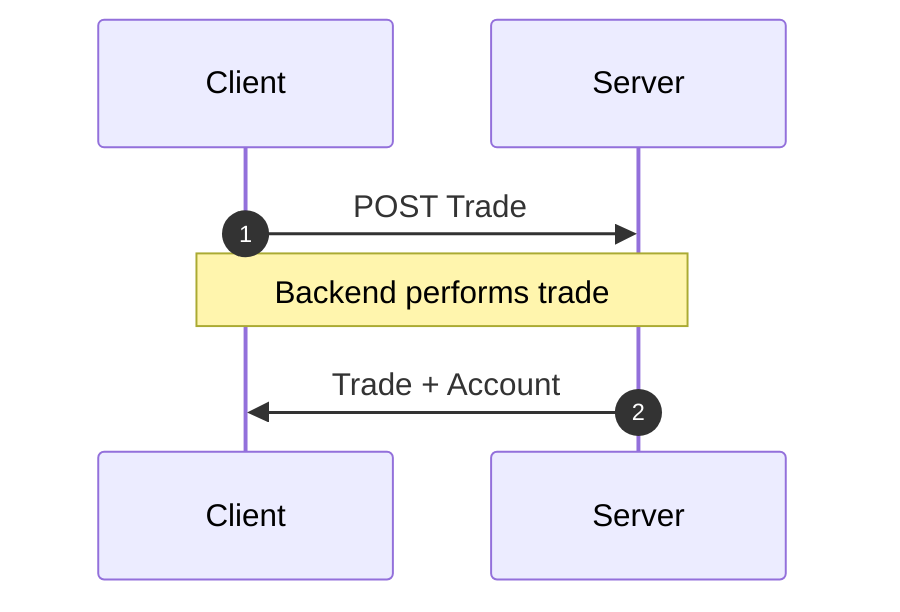

When a mutation changes more than one resource, do not [expire](/docs/api/Controller#expireAll) the other
resources. Expiring them causes a slow cascade of refetches. Instead, include _all_ changed resources in the mutation
response. The mutation stays atomic and needs one request.

<div style={{display: 'grid', gridTemplateColumns: '1fr 1fr', columnGap: '15px'}}>

<div>
<h4 style={{textAlign: 'center'}}>Network Cascade</h4>


```mermaid
sequenceDiagram
    autonumber
    participant Client
    participant Server
    Client->>Server: POST Trade
    Note over Client,Server: Backend performs trade
    Server->>Client: New Trade Object
    Note over Client,Server: Client Expires Account
    Client->>Server: GET Account
    Note over Client,Server: Lookup Account
    Server->>Client: Account
```

</div>
<div>
<h4 style={{textAlign: 'center'}}> Response Bundling</h4>


```mermaid
sequenceDiagram
    autonumber
    participant Client
    participant Server
    Client->>Server: POST Trade
    Note over Client,Server: Backend performs trade
    Server->>Client: Trade + Account
```

</div>

</div>

## Example

A crypto trading platform updates the user's account balance with each trade. So `POST /trade/` returns the new
trade and the updated account.

```json title="POST /trade/"
{
  "trade": {
    "id": 2893232,
    "user": 1,
    "amount": "50.2335324",
    "coin": "doge",
    "created_at": ""
  },
  "account": {
    "id": 899,
    "user": 1,
    "balance": "1337.00",
    "coin_value": "3.50"
  }
}
```

Add the account to the endpoint's `schema`.

```typescript title="resources/Trade.ts"
import { resource, Entity } from '@data-client/rest';
import { Account } from './Account';

export class Trade extends Entity {
  id = 0;
  user = 0;
  amount = '0';
  coin = '';
  created_at = '';
}

export const TradeResource = resource({
  path: '/trade/:id',
  schema: Trade,
}).extend(Base => ({
  create: Base.getList.push.extend({
    schema: {
      trade: Base.getList.push.schema,
      account: Account,
    },
  }),
}));
```

`create` extends [getList.push](../api/resource.md#push). When the `POST` completes, the store updates both the new
trade and the account.

:::react

```typescript title="CreateTrade.tsx"
export default function CreateTrade() {
  const ctrl = useController();
  const handleSubmit = payload =>
    ctrl.fetch(TradeResource.create, payload);
  //...
}
```

:::

:::vue

```html title="CreateTrade.vue"
<script setup lang="ts">
  import { useController } from '@data-client/vue';
  import { TradeResource } from './resources/Trade';

  const ctrl = useController();
  const handleSubmit = payload =>
    ctrl.fetch(TradeResource.create, payload);
  //...
</script>
```

:::

:::note

Define a new [RestEndpoint](../api/RestEndpoint.md) for any custom endpoint. Its `schema` tells Data Client how to
store the response.

:::
