import Grid from '@site/src/components/Grid';
import Link from '@docusaurus/Link';

Besides the performance and data integrity benefits of [normalizing the state](https://react.dev/learn/choosing-the-state-structure),
we get the added benefit of being able to safely access and query the store directly.

In this release we tune and simplify this functionality by unifying around the concepts of [Querable Schemas](/docs/api/useQuery#queryable). These include
[Entity](/rest/api/Entity), [All](/rest/api/All), [Collection](/rest/api/Collection), [Query](/rest/api/Query),
and [Union](/rest/api/Union)

The biggest impact of this change is the introduction of a new hook [useQuery()](/blog/2024/04/08/v0.11-queries-querable-usequery#usequery), which allows direct store lookups
using the [Querable Schemas](/docs/api/useQuery#queryable).

```ts
class User extends Entity {
  username = '';
  id = '';
  groupId = '';
  pk() {
    return this.id;
  }
  static index = ['username' as const];
}

const bob = useQuery(User, { username: 'bob' });
const bob = useQuery(User, { id: '5' });
```

Similarly, we can lookup Querables with controller and snapshot using the [controller.get](/blog/2024/04/08/v0.11-queries-querable-usequery#controllerget)

```ts
const bob = snapshot.get(User, { username: 'bob' });
```

Additionally, we have invested in further [performance improvements](/blog/2024/04/08/v0.11-queries-querable-usequery#performance), resulting in around a 2x performance increase
for most operations and [Queries](/rest/api/Query) being 16x faster.

<center>

<Link className="button button--secondary" to="/blog/2024/04/08/v0.11-queries-querable-usequery#migration-guide">Migration guide</Link>

</center>

**Breaking Changes:**

- [useCache(new Index(MyEntity)) -> useQuery(MyEntity)](/blog/2024/04/08/v0.11-queries-querable-usequery#removed-index)
- [new Query -> new schema.Query](/blog/2024/04/08/v0.11-queries-querable-usequery#query-migration)
  - useCache(myQuery) -> useQuery(myQuery)
- [new AbortOptimistic() -> snapshot.abort](/blog/2024/04/08/v0.11-queries-querable-usequery#snap.abort)
- [Entity.useIncoming → Entity.shouldUpdate](/blog/2024/04/08/v0.11-queries-querable-usequery#shouldupdate)

[**Other Highlights:**](/blog/2024/04/08/v0.11-queries-querable-usequery#other-improvements)

- useCache() accepts Endpoints with sideEffects (like [Resource.update](/rest/api/createResource#update))
- Allow Entity.pk() to return numbers.
- 2-16x [performance improvements](/blog/2024/04/08/v0.11-queries-querable-usequery#performance)

<!--truncate-->

import TypeScriptEditor from '@site/src/components/TypeScriptEditor';
import DiffEditor from '@site/src/components/DiffEditor';

### Querable

[Queryable](/rest/api/schema#queryable) schemas require an `queryKey()` method that returns something. These include
[Entity](/rest/api/Entity), [All](/rest/api/All), [Collection](/rest/api/Collection), [Query](/rest/api/Query),
and [Union](/rest/api/Union).

```ts
interface Queryable {
  queryKey(
    args: readonly any[],
    queryKey: (...args: any) => any,
    getEntity: GetEntity,
    getIndex: GetIndex,
    // `{}` means non-void
  ): {};
}
```

### schema.Query

`Query` was previously implemented as an Endpoint. Since we now have methods of retrieving Queryable
schemas directly, we can simply make Query another Queryable schema itself. It should be basically the same,
allowing arbitrary computation on the value from a store. [#2921](https://github.com/reactive/data-client/pull/2921)

```ts
const getUserCount = new schema.Query(
  new schema.All(User),
  (entries, { isAdmin } = {}) => {
    if (isAdmin !== undefined)
      return entries.filter(user => user.isAdmin === isAdmin).length;
    return entries.length;
  },
);

const userCount = useQuery(getUserCount);
const adminCount = useQuery(getUserCount, { isAdmin: true });
```

schema.Query disallows non-Queryable schemas now.

<TypeScriptEditor>

```ts
const getBob = new schema.Query(
  // Array is not Queryable
  new schema.Array({ bob: '' }),
  thing => {
    return thing;
  },
);
```

</TypeScriptEditor>

### controller.get / snapshot.get {#controllerget}

We can now [access the store](/docs/api/Controller#get) with just a Queryable Schema - we no longer need an entire Endpoint.
[#2921](https://github.com/reactive/data-client/pull/2921)

<DiffEditor>

```ts title="Before"
getOptimisticResponse(snapshot, { id }) {
  // highlight-next-line
  const { data: post } = snapshot.getResponse(Base.get, { id });
  if (!post) throw snapshot.abort;
  return {
    id,
    votes: post.votes + 1,
  };
}
```

```ts title="After"
getOptimisticResponse(snapshot, { id }) {
  // highlight-next-line
  const post = snapshot.get(Post, { id });
  if (!post) throw snapshot.abort;
  return {
    id,
    votes: post.votes + 1,
  };
}
```
</DiffEditor>

Since we no longer need to access other [Resource members](/rest/api/createResource#members) to get `Post`, we
can use the much simpler [Resource.extend()](/rest/api/createResource#extend-new) overload.

<DiffEditor>

```ts title="Before"
export const PostResource = createResource({
  path: '/posts/:id',
  schema: Post,
// highlight-next-line
}).extend(Base => ({
  vote: new RestEndpoint({
    path: '/posts/:id/vote',
    method: 'POST',
    body: undefined,
    schema: Post,
    getOptimisticResponse(snapshot, { id }) {
      const { data: post } = snapshot.getResponse(Base.get, { id });
      if (!post) throw snapshot.abort;
      return {
        id,
        votes: post.votes + 1,
      };
    },
  }),
}));
```

```ts title="After"
export const PostResource = createResource({
  path: '/posts/:id',
  schema: Post,
// highlight-next-line
}).extend('vote', {
  path: '/posts/:id/vote',
  method: 'POST',
  body: undefined,
  schema: Post,
  getOptimisticResponse(snapshot, { id }) {
    const post = snapshot.get(Post, { id });
    if (!post) throw snapshot.abort;
    return {
      id,
      votes: post.votes + 1,
    };
  },
});
```

</DiffEditor>

### useQuery

Renders any [Queryable Schema](/rest/api/schema#queryable) from the store.
[Queries](/rest/api/Query) are a great companion to efficiently render aggregate computations like those that use [groupBy](https://developer.mozilla.org/en-US/docs/Web/JavaScript/Reference/Global_Objects/Object/groupBy#browser_compatibility),
[map](https://developer.mozilla.org/en-US/docs/Web/JavaScript/Reference/Global_Objects/Array/map), [reduce](https://developer.mozilla.org/en-US/docs/Web/JavaScript/Reference/Global_Objects/Array/reduce), and [filter](https://developer.mozilla.org/en-US/docs/Web/JavaScript/Reference/Global_Objects/Array/filter). [#2921](https://github.com/reactive/data-client/pull/2921)

```ts
class User extends Entity {
  username = '';
  id = '';
  groupId = '';
  pk() {
    return this.id;
  }
  static index = ['username' as const];
}

const bob = useQuery(User, { username: 'bob' });
```

```ts
const getUserCount = new schema.Query(
  new schema.All(User),
  (entries, { isAdmin } = {}) => {
    if (isAdmin !== undefined)
      return entries.filter(user => user.isAdmin === isAdmin).length;
    return entries.length;
  },
);

const userCount = useQuery(getUserCount);
const adminCount = useQuery(getUserCount, { isAdmin: true });
```

```ts
const UserCollection = new schema.Collection([User], {
  argsKey: (urlParams: { groupId?: string }) => ({
    ...urlParams,
  }),
});

const usersInGroup = useQuery(UserCollection, { groupId: '5' });
```

## Performance

Further optimizations of both the caching system, and all critical code paths has given a
decent boost of 2x to the most common operations. With the addition of [query caching capability](https://github.com/reactive/data-client/pull/2978), we see an even more impressive 16x improvement to our Query sorting benchmark.

These adds to the existing (up to 23x) [lead over the legacy normalizr](/docs/concepts/normalization#benchmarks) library.

```mermaid
xychart-beta
    title "Performance vs v0.10"
    x-axis ["get large", "get small", "get Query", "get (null args)", "set large"]
    y-axis "Percentage gain" 0 --> 1600
    bar [163, 177, 1571, 295, 182]
    bar [100, 100, 100, 100, 100]
```



<center>

[Benchmarks over time](https://reactive.github.io/data-client/dev/bench/) | [View benchmark](https://github.com/reactive/data-client/tree/master/examples/benchmark)

</center>

## Other improvements

- useCache() accepts Endpoints with sideEffects (like [Resource.update](/rest/api/createResource#update)) [#2963](https://github.com/reactive/data-client/pull/2963)
  ```ts
  const lastCreated = useCache(MyResource.getList.push);
  ```
- Allow pk to return numbers [#2961](https://github.com/reactive/data-client/pull/2961)
  <DiffEditor>
  ```ts title="Before"
  class MyEntity extends Entity {
    id = 0;
    pk() {
      // highlight-next-line
      return `${this.id}`;
    }
  }
  ```
  ```ts title="After"
  class MyEntity extends Entity {
    id = 0;
    pk() {
      // highlight-next-line
      return this.id;
    }
  }
  ```
  </DiffEditor>
- Typing
  - Improve .extend() typing when using [loose null checks](https://www.typescriptlang.org/tsconfig#strictNullChecks) and no body parameter [#2962](https://github.com/reactive/data-client/pull/2962)
    ```ts
    Parameters<typeof new RestEndpoint({ path: '/test' }).extend({ path: '/test2' })> === []
    ```
  - Default Collection Args type is: [8377e](https://github.com/reactive/data-client/commit/8377e0a157419f0f4c237c392a895fec1772854d)
    ```ts
    | []
    | [urlParams: Record<string, any>]
    | [urlParams: Record<string, any>, body: any]
    ```
- Fixes
  - schema.All denormalize INVALID case should also work when class name mangling is performed in production builds [#2954](https://github.com/reactive/data-client/pull/2954)
    - `unvisit()` always returns `undefined` with `undefined` as input.
    - `All` returns INVALID from `queryKey()` to invalidate what was previously a special case in `unvisit()` (when there is no table entry for the given entity)
  - Missing nested entities should appear once they are present [#2956](https://github.com/reactive/data-client/pull/2956), [#2961](https://github.com/reactive/data-client/pull/2961)

## Migration guide

import PkgTabs from '@site/src/components/PkgTabs';

This upgrade requires updating all package versions simultaneously.

<PkgTabs pkgs="@data-client/react@^0.11.0 @data-client/rest@^0.11.0 @data-client/test@^0.11.0 @data-client/img@^0.11.0 @data-client/hooks@^0.11.0" upgrade />

### Removed Index

Just use Entities directly in [useQuery](/docs/api/useQuery)

<DiffEditor>

```tsx title="Before"
const UserIndex = new Index(User);

const bob = useCache(UserIndex, { username: 'bob' });
```

```tsx title="After"
const bob = useQuery(User, { username: 'bob' });
```
</DiffEditor>

### new Query -> new schema.Query {#query-migration}

[Query](/rest/api/Query) is now a schema; used with [useQuery](/docs/api/useQuery)

<DiffEditor>

```tsx title="Before"
// highlight-next-line
const getUserCount = new Query(
  new schema.All(User),
  (entries, { isAdmin } = {}) => {
    if (isAdmin !== undefined)
      return entries.filter(user => user.isAdmin === isAdmin).length;
    return entries.length;
  },
);

const userCount = useCache(getUserCount);
const adminCount = useCache(getUserCount, { isAdmin: true });
```

```tsx title="After"
// highlight-next-line
const getUserCount = new schema.Query(
  new schema.All(User),
  (entries, { isAdmin } = {}) => {
    if (isAdmin !== undefined)
      return entries.filter(user => user.isAdmin === isAdmin).length;
    return entries.length;
  },
);

const userCount = useQuery(getUserCount);
const adminCount = useQuery(getUserCount, { isAdmin: true });
```
</DiffEditor>

### new AbortOptimistic() -> snapshot.abort {#snap.abort}

[snapshot.abort](https://dataclient.io/docs/api/Snapshot#abort) removes the need to import AbortOptimistic [#2957](https://github.com/reactive/data-client/pull/2957)

<DiffEditor>

```ts title="Before"
getOptimisticResponse(snapshot, { id }) {
  const { data } = snapshot.getResponse(Base.get, { id });
  // highlight-next-line
  if (!data) throw new AbortOptimistic();
  return {
    id,
    votes: data.votes + 1,
  };
}
```

```ts title="After"
getOptimisticResponse(snapshot, { id }) {
  const { data } = snapshot.getResponse(Base.get, { id });
  // highlight-next-line
  if (!data) throw snapshot.abort;
  return {
    id,
    votes: data.votes + 1,
  };
}
```
</DiffEditor>

### Entity.useIncoming → Entity.shouldUpdate {#shouldupdate}

Make [Entity.shouldUpdate](/rest/api/Entity#shouldupdate) name consistent with [Entity.shouldReorder](/rest/api/Entity#shouldreorder) [#2972](https://github.com/reactive/data-client/pull/2972)

<DiffEditor>

```ts title="Before"
class MyEntity extends Entity {
  // highlight-next-line
  static useIncoming(
    existingMeta: { date: number },
    incomingMeta: { date: number },
    existing: any,
    incoming: any,
  ) {
    return !deepEquals(existing, incoming);
  }
}
```

```ts title="After"
class MyEntity extends Entity {
  // highlight-next-line
  static shouldUpdate(
    existingMeta: { date: number },
    incomingMeta: { date: number },
    existing: any,
    incoming: any,
  ) {
    return !deepEquals(existing, incoming);
  }
}
```
</DiffEditor>

### useDLE() reactive native focus handling

Like [useSuspense()](/docs/api/useSuspense) and [useFetch()](/docs/api/useFetch); [useDLE()](/docs/api/useDLE) will
now potentially revalidate data on focus events.

When using React Navigation, useDLE() will trigger fetches on focus if the data is considered
stale.

This could result in more fetches than occured previously.

### Potential, but unlikely breaking changes

#### Schema.infer() -> Schema.queryKey() [#2977](https://github.com/reactive/data-client/pull/2977)

Most people have not overridden the `infer()` method. In this case you need to rename to `queryKey()`,
as well as update the parameter list.

<DiffEditor>

```ts title="Before"
class MyEntity extends Entity {
  // highlight-start
  static infer(
    args: readonly any[],
    indexes: NormalizedIndex,
    recurse: any,
    entities: any,
  ): any {
    // highlight-end
    if (SILLYCONDITION) return undefined;
    if (entities[this.key]?.[someId]) return someId;
    return super.infer(args, indexes, recurse, entities);
  }
}
```

```ts title="After"
class MyEntity extends Entity {
  // highlight-start
  static queryKey(
    args: readonly any[],
    queryKey: (...args: any) => any,
    getEntity: GetEntity,
    getIndex: GetIndex,
  ): any {
    // highlight-end
    if (SILLYCONDITION) return undefined;
    if (getEntity(this.key, someId)) return someId;
    return super.queryKey(args, queryKey, getEntity, getIndex);
  }
}
```
</DiffEditor>

##### getEntity(key, pk?)

Gets all entities of a type with one argument, or a single entity with two

```ts title="One argument"
const entitiesEntry = getEntity(this.schema.key);
if (entitiesEntry === undefined) return INVALID;
return Object.values(entitiesEntry).map(
  entity => entity && this.schema.pk(entity),
);
```

```ts title="Two arguments"
if (getEntity(this.key, id)) return id;
```

##### getIndex(key, indexName, value)

Returns the index entry (value->pk map)

```ts
const value = args[0][indexName];
return getIndex(schema.key, indexName, value)[value];
```

#### Always normalize pk to string type [#2961](https://github.com/reactive/data-client/pull/2961)

Subtle change into what will be in the store. This will likely only matter when using [@data-client/normalizr](https://www.npmjs.com/package/@data-client/normalizr)
directly.

<DiffEditor>

```json title="Before"
{
  "Article": {
    "123": {
      // highlight-next-line
      "author": 8472,
      "id": 123,
      "title": "A Great Article"
    }
  },
  "User": {
    "8472": {
      "id": 8472,
      "name": "Paul"
    }
  }
}
```

```json title="After"
{
  "Article": {
    "123": {
      // highlight-next-line
      "author": "8472",
      "id": 123,
      "title": "A Great Article"
    }
  },
  "User": {
    "8472": {
      "id": 8472,
      "name": "Paul"
    }
  }
}
```
</DiffEditor>

#### state.results -> state.endpoints [#2971](https://github.com/reactive/data-client/pull/2971)

This will only likely matter when consuming [@data-client/core](https://www.npmjs.com/package/@data-client/core) directly as internal state is structure
is opaque to [@data-client/react](https://www.npmjs.com/package/@data-client/react).

<DiffEditor>

```json "Before"
{
  "entities": {
    "Article": {
      "5": {
        "content": "more things here",
        "id": 5,
        "title": "hi"
      }
    }
  },
  // highlight-next-line
  "results": {
    "GET http://test.com/articles/5": "5"
  }
}
```

```json "After"
{
  "entities": {
    "Article": {
      "5": {
        "content": "more things here",
        "id": 5,
        "title": "hi"
      }
    }
  },
  // highlight-next-line
  "endpoints": {
    "GET http://test.com/articles/5": "5"
  }
}
```
</DiffEditor>

#### inferResults() -> memo.buildQueryKey() [#2977](https://github.com/reactive/data-client/pull/2977), [#2978](https://github.com/reactive/data-client/pull/2978)

These methods are exported in [@data-client/core](https://www.npmjs.com/package/@data-client/core) and [@data-client/normalizr](https://www.npmjs.com/package/@data-client/normalizr).

#### denormalizeCached() -> memo.denormalize() [#2978](https://github.com/reactive/data-client/pull/2978)

Exported in [@data-client/normalizr](https://www.npmjs.com/package/@data-client/normalizr)

<DiffEditor>

```ts title="Before"
const endpointCache = new WeakEntityMap();
const entityCache = {};
denormalizeCached(
  input,
  schema,
  state.entities,
  entityCache,
  endpointCache,
  args,
);
```

```ts title="After"
const memo = new MemoCached();
memo.denormalize(
  input,
  schema,
  state.entities,
  args,
);
```
</DiffEditor>

#### WeakEntityMap -> WeakDependencyMap [#2978](https://github.com/reactive/data-client/pull/2978)

Exported in [@data-client/normalizr](https://www.npmjs.com/package/@data-client/normalizr)

We generalize this data type so it can be used with other dependencies.

<DiffEditor>

```ts title="Before"
new WeakEntityMap();
```

```ts title="After"
new WeakDependencyMap<EntityPath>();
```
</DiffEditor>

### Upgrade support

As usual, if you have any troubles or questions, feel free to join our [](https://discord.gg/wXGV27xm6t) or [file a bug](https://github.com/reactive/data-client/issues/new/choose)
