import Link from '@docusaurus/Link';

Platforms:
- NextJS App Router
- ExpoGo
- Redux

**Other Improvements**

- React 19 support
- Added [controller.set(Todo, \{ id }, \{ id, completed: false })](/blog/2024/06/17/v0.13-nextjs-app-router-expogo-native#controllerset)
- RestEndpoint.path [supports +, * and \{}](/blog/2024/06/17/v0.13-nextjs-app-router-expogo-native#path-strings)
- Fixed [controller.fetch() return value for Unions](/blog/2024/06/17/v0.13-nextjs-app-router-expogo-native#ctrlfetch-and-unions)

[**Breaking Changes:**](/blog/2024/06/17/v0.13-nextjs-app-router-expogo-native#migration-guide)

- actionTypes.SET_TYPE -> actionTypes.SET_RESPONSE_TYPE
- SetAction -> SetResponseAction
- Min React version 16.8.4 -> 16.14

:::note

Version 0.12 was skipped due to a publishing mishap.

:::

<!--truncate-->

import Grid from '@site/src/components/Grid';
import TypeScriptEditor from '@site/src/components/TypeScriptEditor';
import DiffEditor from '@site/src/components/DiffEditor';

## Platforms

### NextJS App Router

NextJS 12 includes a [new way of routing in the '/app' directory](https://nextjs.org/docs/app). This allows further performance improvements, as well as dynamic and nested routing. This makes NextJS a viable platform to build rich dynamic applications, rather
than just static websites.

While [other fetching methods](https://nextjs.org/docs/app/building-your-application/data-fetching/fetching#fetching-data-on-the-client)
require slow client-side fetching; Reactive Data Client provides the best of both <abbr title="Single Page Application">SPA</abbr> and
<abbr title="Multi Page Application">MPA</abbr>. [#3074](https://github.com/reactive/data-client/pull/3074), [#3093](https://github.com/reactive/data-client/pull/3093)

<abbr title="Reactive Data Client">Data Client</abbr> performs streaming SSR of the HTML, streamlining the initial
application load experience. Uniquely, <abbr title="Reactive Data Client">Data Client</abbr> is then immediately interactive

```mermaid
xychart-beta
    title "Performance vs Client Fetch"
    x-axis ["LCP", "Mutation", "list->detail navigation"]
    y-axis "Miliseconds (lower is better)" 0 --> 1810
    bar [1200, 1810, 310]
    bar [400, 3, 46]
```

with 0 client side fetches. This is achieved by initializing the [Client Store](/docs/getting-started/debugging#state-inspection)
with [normalized data](/docs/concepts/normalization) during the SSR phase.

<center>
<div style={{maxWidth:'500px'}}>



</div></center>


#### Usage

Render [DataProvider](/docs/api/DataProvider) from the [/nextjs entrypoint](https://dataclient.io/docs/guides/ssr#app-router) in your [root layout](https://nextjs.org/docs/app/building-your-application/routing/pages-and-layouts#root-layout-required).


```tsx title="app/layout.tsx"
import { DataProvider } from '@data-client/react/nextjs';
import { AsyncBoundary } from '@data-client/react';

export default function RootLayout({ children }) {
  return (
    <html>
      <body>
        // highlight-next-line
        <DataProvider>
          <header>Title</header>
          <AsyncBoundary>{children}</AsyncBoundary>
          <footer></footer>
          // highlight-next-line
        </DataProvider>
      </body>
    </html>
  );
}
```

#### Client Components

To keep your data fresh and performant, you can use [client components](https://react.dev/reference/rsc/use-client) and [useSuspense()](../api/useSuspense.md)

```tsx title="app/todos/page.tsx"
'use client';
import { useSuspense } from '@data-client/react';
import { TodoResource } from '../../resources/Todo';

export default function InteractivePage() {
  const todos = useSuspense(TodoResource.getList);
  return <TodoList todos={todos} />;
}
```

#### Server Components

However, if your data never changes, you can slightly decrease the javascript bundle sent, by
using a [server component](https://react.dev/reference/rsc/server-components). Simply `await` the endpoint:

```tsx title="app/todos/page.tsx"
import { TodoResource } from '../../resources/Todo';

export default async function StaticPage() {
  const todos = await TodoResource.getList();
  return <TodoList todos={todos} />;
}
```

#### Demo

<StackBlitz app="nextjs" file="components/todo/TodoList.tsx,app/layout.tsx" view="both" />

<iframe src="https://coin-app-lake.vercel.app/" width="100%" height="400" />

<p style={{ textAlign: 'center' }}>
  <Link className="button button--secondary button--sm" to="https://coin-app-lake.vercel.app/" target="_blank">Open in new tab</Link>&nbsp;
  <Link className="button button--secondary button--sm" to="https://github.com/reactive/coin-app" target="_blank">Github</Link>
</p>

#### Other SSR

Add [/ssr entrypoint](/docs/guides/ssr#express-js-ssr) - eliminating the need for @data-client/ssr package completely [`d1b9e96`](https://github.com/reactive/data-client/commit/d1b9e96dffe69527f9ce0ebff4727f0b1226c9d5)

<DiffEditor>

```tsx title="Before"
import {
  createPersistedStore,
  createServerDataComponent,
} from '@data-client/ssr';
```

```tsx title="After"
import {
  createPersistedStore,
  createServerDataComponent,
} from '@data-client/react/ssr';
```

</DiffEditor>

### ExpoGo


### React 19

We now support React 19. [#3071](https://github.com/reactive/data-client/pull/3071)

This required dropping support for versions less than 16.14, as we must use the jsx runtime
exported from React itself. This has the added benefit of reducing the bundle size.

### Redux

Add [@data-client/react/redux](/docs/guides/redux) [#3099](https://github.com/reactive/data-client/pull/3099)

<DiffEditor>

```tsx title="Before"
import {
  ExternalDataProvider,
  PromiseifyMiddleware,
  applyManager,
  initialState,
  createReducer,
  prepareStore,
} from '@data-client/redux';
```

```tsx title="After"
import {
  ExternalDataProvider,
  PromiseifyMiddleware,
  applyManager,
  initialState,
  createReducer,
  prepareStore,
} from '@data-client/react/redux';
```

</DiffEditor>

Add middlewares argument to prepareStore() [#3099](https://github.com/reactive/data-client/pull/3099)

```tsx
const { store, selector, controller } = prepareStore(
  initialState,
  managers,
  Controller,
  otherReducers,
  // highlight-next-line
  extraMiddlewares,
);
```

## controller.set()

[controller.set()](/docs/api/Controller#set) updates any [Queryable](/rest/api/schema#queryable) [Schema](/rest/api/schema#schema-overview). [#3105](https://github.com/reactive/data-client/pull/3105), [#3129](https://github.com/reactive/data-client/pull/3129)

```ts
ctrl.set(
  Todo,
  { id: '5' },
  { id: '5', title: 'tell me friends how great Data Client is' },
);
```

Functions can be used in the value when derived data is used. This [prevents race conditions](https://react.dev/reference/react/useState#updating-state-based-on-the-previous-state).

```ts
const id = '2';
ctrl.set(Article, { id }, article => ({ id, votes: article.votes + 1 }));
```

:::note

The response must include values sufficient to compute Entity.pk()

:::

This makes it more straightforward to manipulate the store with [Managers](/docs/concepts/managers).
For example we can directly set our `Ticker` entity when receiving websocket messages:

import StackBlitz from '@site/src/components/StackBlitz';

<StackBlitz app="coin-app" file="src/getManagers.ts,src/resources/Ticker.ts,src/pages/AssetDetail/AssetPrice.tsx,src/resources/StreamManager.ts" height="600" view="editor" />

## Type improvements

- Improve [controller](/docs/api/Controller) type matching for its methods [#3043](https://github.com/reactive/data-client/pull/3043)

- Improve [useFetch()](/docs/api/useFetch) argtype matching similar to [useSuspense()](/docs/api/useSuspense) [#3043](https://github.com/reactive/data-client/pull/3043)

## REST changes

### path strings

Support + and \* and \{} in [RestEndpoint.path](/rest/api/RestEndpoint#path). [`a6b4f4a`](https://github.com/reactive/data-client/commit/a6b4f4aabbfd06f5106a96e809a6c1a5e7045172)

  ```ts
  const getThing = new RestEndpoint({
    path: '/:attr1?{-:attr2}?{-:attr3}?',
  });

  getThing({ attr1: 'hi' });
  getThing({ attr2: 'hi' });
  getThing({ attr3: 'hi' });
  getThing({ attr1: 'hi', attr3: 'ho' });
  getThing({ attr2: 'hi', attr3: 'ho' });
  ```

### ctrl.fetch() and Unions

[Unions](/rest/api/Union) values in [ctrl.fetch()](/docs/api/Controller#fetch) return value are now an instance of their Entity class. [#3063](https://github.com/reactive/data-client/pull/3063)

<TypeScriptEditor>

```ts title="Feed" collapsed
export abstract class FeedItem extends Entity {
  id = 0;
  declare type: 'link' | 'post';
}
export class Link extends FeedItem {
  readonly type = 'link';
  url = '';
  title = '';

  get anchor() {
    return `<a href="${this.url}">${this.title}</a>`;
  }
}
export class Post extends FeedItem {
  readonly type = 'post';
  content = '';
}
export const getFeed = new RestEndpoint({
  path: '/feed',
  schema: [new schema.Union(
    {
      link: Link,
      post: Post,
    },
    'type',
  )],
});
```

```ts title="useFeed"
import { getFeed } from './Feed';

function useFeedHandler() {
  const ctrl = useController();

  const handleSomething = async () => {
    const feed = await ctrl.fetch(getFeed);
    return feed.map(item => {
      if (item.type == 'link') {
        // we can use class defined getter
        return item.anchor;
      }
    });
  }
  return handleSomething;
}
```

</TypeScriptEditor>

## Migration guide

import PkgTabs from '@site/src/components/PkgTabs';

This upgrade requires updating all package versions simultaneously.

<PkgTabs pkgs="@data-client/react@^0.13.0 @data-client/rest@^0.13.0 @data-client/test@^0.13.0 @data-client/img@^0.13.0" upgrade />

### actionTypes.SET_TYPE -> actionTypes.SET_RESPONSE_TYPE {#set_response_type}

If you wrote a custom Manager that handled `actionTypes.SET_TYPE`, you'll need
to rename it [actionTypes.SET_RESPONSE_TYPE](/docs/api/Actions#set_response).

<DiffEditor>

```tsx title="Before"
import type { Manager, Middleware } from '@data-client/react';
import { actionTypes } from '@data-client/react';

export default class LoggingManager implements Manager {
  middleware: Middleware = controller => next => async action => {
    switch (action.type) {
      case actionTypes.SET_TYPE:
        console.info(
          `${action.endpoint.name} ${JSON.stringify(action.response)}`,
        );
        return next(action);
      // actions must be explicitly passed to next middleware
      default:
        return next(action);
    }
  };

  cleanup() {}
}
```

```tsx title="After"
import type { Manager, Middleware } from '@data-client/react';
import { actionTypes } from '@data-client/react';

export default class LoggingManager implements Manager {
  middleware: Middleware = controller => next => async action => {
    switch (action.type) {
      case actionTypes.SET_RESPONSE_TYPE:
        console.info(
          `${action.endpoint.name} ${JSON.stringify(action.response)}`,
        );
        return next(action);
      // actions must be explicitly passed to next middleware
      default:
        return next(action);
    }
  };

  cleanup() {}
}
```

</DiffEditor>

### SetAction -> SetResponseAction {#set-action}

### React 16.14+ {#react-version}

Changes the minimum React version from 16.8.4 -> 16.14. This has no breaking changes.

<PkgTabs pkgs="react@16.14 react-dom@16.14" upgrade />


### CacheProvider -> DataProvider {#data-provider}

Move to [DataProvider](/docs/api/DataProvider) for future version compatibility. It is also
exported as `CacheProvider` so this is not a breaking change. [#3095](https://github.com/reactive/data-client/pull/3095)

<DiffEditor>

```tsx title="Before"
import { CacheProvider } from '@data-client/react';
import ReactDOM from 'react-dom';

ReactDOM.createRoot(document.body)
  .render(
  <CacheProvider>
    <App />
  </CacheProvider>,
);
```

```tsx title="Before"
import { DataProvider } from '@data-client/react';
import ReactDOM from 'react-dom';

ReactDOM.createRoot(document.body)
  .render(
  <DataProvider>
    <App />
  </DataProvider>,
);
```

</DiffEditor>

### Upgrade support

As usual, if you have any troubles or questions, feel free to join our [](https://discord.gg/wXGV27xm6t) or [file a bug](https://github.com/reactive/data-client/issues/new/choose)
