**Managers:**

Manager APIs have been streamlined—flatter action shapes reduce code complexity and improve performance by minimizing distinct inline cache entries, while simpler configuration APIs make customization more delightful.

- [Simplified action shapes](/blog/2024/07/13/v0.14-release-announcement#action-shapes)
- [Manager.middleware](/blog/2024/07/13/v0.14-release-announcement#manager-middleware) property
- [getDefaultManagers()](/blog/2024/07/13/v0.14-release-announcement#getdefaultmanagers) configuration

**Performance:**
- [Immediate fetch calls](/blog/2024/07/13/v0.14-release-announcement#immediate-fetching) - no more waiting for idle
- [30% smaller bundles](/blog/2024/07/13/v0.14-release-announcement#bundle-size) by removing unnecessary polyfills
- [10% faster normalization, 32% faster denormalization](/blog/2024/07/13/v0.14-release-announcement#normalization-performance)

**Schema/Data Modeling:**
- [Query joins](/blog/2024/07/13/v0.14-release-announcement#query-joins) with Object Schemas
- [EntityMixin](/blog/2024/07/13/v0.14-release-announcement#entitymixin) for composing Entity behavior
- [Entity.pk() default](/blog/2024/07/13/v0.14-release-announcement#entity-pk-default) uses `id`
- [Dynamic invalidation](/blog/2024/07/13/v0.14-release-announcement#dynamic-invalidation) via Entity.process()

**Testing:**
- [renderDataHook()](/blog/2024/07/13/v0.14-release-announcement#renderdatahook) for simpler testing

**Garbage Collection:**
- [GCPolicy](/blog/2024/07/13/v0.14-release-announcement#gcpolicy) - automatic garbage collection of stale data

**[Breaking Changes:](/blog/2024/07/13/v0.14-release-announcement#migration-guide)**

- [NetworkManager fetches immediately](/blog/2024/07/13/v0.14-release-announcement#networkmanager)
- [action.payload -> action.response](/blog/2024/07/13/v0.14-release-announcement#action-response)
- [action.meta.args -> action.args](/blog/2024/07/13/v0.14-release-announcement#action-args)

<!-- truncate -->

import DiffEditor from '@site/src/components/DiffEditor';

## Managers

Manager APIs have been streamlined—flatter action shapes reduce code complexity and improve performance by minimizing distinct inline cache entries, while simpler configuration APIs make customization more delightful.

### Action Shapes

Action shapes are simplified and more consistent. [#3143](https://github.com/reactive/data-client/pull/3143), [#3139](https://github.com/reactive/data-client/pull/3139)

- `action.meta.args` -> `action.args`
- `action.meta.key` -> `action.key`
- `action.meta.nm` removed (unused)
- `action.payload` -> `action.response` (for SET_RESPONSE)


<DiffEditor>
```json title="Before"
{
  "type": "rdc/setresponse",
  "meta": {
    "key": "PATCH https://jsonplaceholder.typicode.com/todos/1",
    "payload": {
      "userId": 1,
      "id": 1,
      "title": "delectus aut autem",
      "completed": true
    },
    "args": [
      { "id": 1 },
      { "completed": true }
    ],
    "nm": true,
    "endpoint": {
      "name": "Todo.partialUpdate",
      "schema": {
        "key": "Todo",
        "schema": {}
      },
      "sideEffect": true,
    },
    "fetchedAt": "12:44:24.206 PM",
    "date": "12:44:24.334 PM",
    "expiresAt": "1:44:24.334 PM"
  },
  "error": false
}
```

```json title="After"
{
  "type": "rdc/setresponse",
  "key": "PATCH https://jsonplaceholder.typicode.com/todos/1",
  "response": {
    "userId": 1,
    "id": 1,
    "title": "delectus aut autem",
    "completed": true
  },
  "args": [
    { "id": 1 },
    { "completed": true }
  ],
  "endpoint": {
    "name": "Todo.partialUpdate",
    "schema": {
      "key": "Todo",
      "schema": {}
    },
    "sideEffect": true,
  },
  "meta": {
    "fetchedAt": "12:44:24.206 PM",
    "date": "12:44:24.334 PM",
    "expiresAt": "1:44:24.334 PM"
  },
  "error": false
}
```
</DiffEditor>


### Manager.middleware {#manager-middleware}

Managers can now use a `middleware` property instead of `getMiddleware()` method. [#3164](https://github.com/reactive/data-client/pull/3164)

<DiffEditor>

```ts title="Before"
class MyManager implements Manager {
  getMiddleware = (): Middleware => controller => next => async action => {
    // handle action
    return next(action);
  };

  cleanup() {}
}
```

```ts title="After"
class MyManager implements Manager {
  middleware: Middleware = controller => next => async action => {
    // handle action
    return next(action);
  };

  cleanup() {}
}
```

</DiffEditor>

:::tip
`getMiddleware()` still works for backward compatibility.
:::

### actionTypes without _TYPE suffix

Cleaner action type names are now available (not breaking - we keep the old names as well). [#3244](https://github.com/reactive/data-client/pull/3244)

<DiffEditor>

```ts title="Before"
import type { Manager, Middleware } from '@data-client/react';
import { actionTypes } from '@data-client/react';

export default class LoggingManager implements Manager {
  middleware: Middleware = controller => next => async action => {
    switch (action.type) {
      case actionTypes.SET_RESPONSE_TYPE:
        console.info(
          `${action.endpoint.name} ${JSON.stringify(action.response)}`,
        );
      default:
        return next(action);
    }
  };

  cleanup() {}
}
```

```ts title="After"
import type { Manager, Middleware } from '@data-client/react';
import { actionTypes } from '@data-client/react';

export default class LoggingManager implements Manager {
  middleware: Middleware = controller => next => async action => {
    switch (action.type) {
      case actionTypes.SET_RESPONSE:
        console.info(
          `${action.endpoint.name} ${JSON.stringify(action.response)}`,
        );
      default:
        return next(action);
    }
  };

  cleanup() {}
}
```

</DiffEditor>

### getDefaultManagers()

[getDefaultManagers()](/docs/api/getDefaultManagers) now accepts configuration options. [#3161](https://github.com/reactive/data-client/pull/3161)

```ts
import { getDefaultManagers } from '@data-client/react';

// Remove DevToolsManager
const managers = getDefaultManagers({ devToolsManager: null });

// Configure DevToolsManager
const managers = getDefaultManagers({
  devToolsManager: {
    latency: 1000,
    predicate: (state, action) => action.type !== actionTypes.SET_RESPONSE,
  },
});

// Use custom NetworkManager
const managers = getDefaultManagers({
  networkManager: new IdlingNetworkManager(),
});
```

### NetworkManager Constructor

[NetworkManager](/docs/api/NetworkManager) constructor now uses keyword arguments for clarity.

<DiffEditor>

```ts title="Before"
new NetworkManager(42, 7);
```

```ts title="After"
new NetworkManager({ dataExpiryLength: 42, errorExpiryLength: 7 });
```

</DiffEditor>

## Performance

React 18+ concurrent mode and automatic batching change how we should optimize. Waiting for idle callbacks is no longer optimal—fetching immediately now provides better results. Internal changes leverage closures and `Map` data structures for faster normalization and lookup, while removing bloated polyfill dependencies shrinks bundles significantly.

### Immediate Fetching

[NetworkManager](/docs/api/NetworkManager) now fetches immediately rather than waiting for idle callbacks. [#3146](https://github.com/reactive/data-client/pull/3146)

This results in faster data loading, especially for applications with complex render trees.

`IdlingNetworkManager` remains available for those who prefer the previous behavior:

```ts
import { IdlingNetworkManager, getDefaultManagers } from '@data-client/react';

const managers = getDefaultManagers({
  networkManager: new IdlingNetworkManager(),
});
```

### Bundle Size

Packages are now **30% smaller** after removing bloated polyfill packages. [#3384](https://github.com/reactive/data-client/pull/3384)

Additionally, polyfills no longer pollute the global scope. [#3353](https://github.com/reactive/data-client/pull/3353)

### Normalization Performance

Internal schema interface changes provide a **10% normalization performance boost**. [#3134](https://github.com/reactive/data-client/pull/3134)

Using `Map` instead of plain objects for entity storage provides up to **32% faster lookups** for large datasets. [#3390](https://github.com/reactive/data-client/pull/3390)

```mermaid
xychart-beta
    title "Performance vs v0.13"
    x-axis ["normalize", "denormalize (large)", "denormalize (small)"]
    y-axis "Percentage gain" 0 --> 140
    bar [110, 132, 115]
    bar [100, 100, 100]
```

<center>
<div style={{maxWidth:'500px'}}>



</div>

[Benchmarks over time](https://reactive.github.io/data-client/dev/bench/) | [View benchmark](https://github.com/reactive/data-client/tree/master/examples/benchmark)

</center>

## Schema/Data Modeling

Schema APIs reduce boilerplate for common patterns while enabling more advanced use cases. Client-side joins now work across arbitrary entities (not just nested relationships), dynamic invalidation handles server-only deletion logic, and sensible defaults like `Entity.pk()` using `id` eliminate repetitive code.

### Query Joins

[Query](/rest/api/Query) can now take [Object Schemas](/rest/api/Object), enabling joins across multiple entity types. [#3165](https://github.com/reactive/data-client/pull/3165)

```ts
class Ticker extends Entity {
  product_id = '';
  price = 0;
  pk() { return this.product_id; }
}

class Stats extends Entity {
  product_id = '';
  last = 0;
  pk() { return this.product_id; }
}

// Join Ticker and Stats by product_id
const queryPrice = new schema.Query(
  { ticker: Ticker, stats: Stats },
  ({ ticker, stats }) => ticker?.price ?? stats?.last,
);

// Use in components
const price = useQuery(queryPrice, { product_id: 'BTC-USD' });
```

### EntityMixin

New [EntityMixin](/rest/api/EntityMixin) for composing Entity behavior with existing classes. [#3243](https://github.com/reactive/data-client/pull/3243)

```ts
import { EntityMixin } from '@data-client/rest';

// Your existing class
export class Article {
  id = '';
  title = '';
  content = '';
  tags: string[] = [];
}

// Add Entity behavior
export class ArticleEntity extends EntityMixin(Article) {}
```

### Entity.pk() Default {#entity-pk-default}

[Entity.pk()](/rest/api/Entity#pk) now defaults to `this.id`. [#3188](https://github.com/reactive/data-client/pull/3188)

<DiffEditor>

```ts title="Before"
class Todo extends Entity {
  id = '';
  title = '';
  completed = false;

  pk() {
    return this.id;
  }
}
```

```ts title="After"
class Todo extends Entity {
  id = '';
  title = '';
  completed = false;
}
```

</DiffEditor>

### Dynamic Invalidation

Return `undefined` from [Entity.process()](/rest/api/Entity#process) to dynamically [invalidate](/docs/concepts/expiry-policy#invalidate-entity) entities based on response data. [#3407](https://github.com/reactive/data-client/pull/3407)

```ts
class PriceLevel extends Entity {
  price = 0;
  amount = 0;

  pk() { return `${this.price}`; }

  static process(input: [number, number], parent: any, key: string | undefined) {
    const [price, amount] = input;
    // Invalidate when amount is 0
    // highlight-next-line
    if (amount === 0) return undefined;
    return { price, amount };
  }
}
```

### resource()

`createResource()` renamed to `resource()` for brevity. [#3158](https://github.com/reactive/data-client/pull/3158)

<DiffEditor>

```ts
import { createResource } from '@data-client/rest';

const TodoResource = createResource({
  path: '/todos/:id',
  schema: Todo,
});
```

```ts
import { resource } from '@data-client/rest';

const TodoResource = resource({
  path: '/todos/:id',
  schema: Todo,
});
```

</DiffEditor>

:::note
`createResource` remains exported for backward compatibility.
:::

## Testing

Testing should be simple. New helpers use sensible defaults to eliminate boilerplate for common test scenarios.

### renderDataHook()

New [renderDataHook()](/docs/api/renderDataHook) uses the default [DataProvider](/docs/api/DataProvider), eliminating boilerplate. [#3238](https://github.com/reactive/data-client/pull/3238)

Additionally, `makeRenderDataClient()` has been renamed to [makeRenderDataHook()](/docs/api/makeRenderDataHook) for consistency (old name still works).

```ts
import { renderDataHook } from '@data-client/test';

const { result } = renderDataHook(
  () => useSuspense(ArticleResource.get, { id: 5 }),
  {
    initialFixtures: [
      {
        endpoint: ArticleResource.get,
        args: [{ id: 5 }],
        response: { id: 5, title: 'Test' },
      },
    ],
  },
);
```

## Garbage Collection

Long-running applications accumulate stale data in memory. New garbage collection policies automatically clean expired entries using reference counting to track which data is actively bound to components.

### GCPolicy

GCPolicy enables automatic garbage collection of stale data. [#3343](https://github.com/reactive/data-client/pull/3343)

```tsx
import { GCPolicy, DataProvider } from '@data-client/react';

// Run GC sweep every 10 minutes
<DataProvider gcPolicy={new GCPolicy({ intervalMS: 60 * 1000 * 10 })}>
  {children}
</DataProvider>
```

Configure expiry behavior:

```ts
new GCPolicy({
  intervalMS: 60 * 1000 * 5,  // How often to run GC
  expiryMultiplier: 2,        // How many stale lifetimes before GC
})
```

Use `ImmortalGCPolicy` to disable garbage collection (previous default behavior):

```tsx
import { ImmortalGCPolicy, DataProvider } from '@data-client/react';

<DataProvider gcPolicy={new ImmortalGCPolicy()}>
  {children}
</DataProvider>
```

## Other Improvements

- Collections work with polymorphic schemas like Union [#3151](https://github.com/reactive/data-client/pull/3151)
- Collections work with nested args (qs library compatibility) [#3281](https://github.com/reactive/data-client/pull/3281)
- Interceptors work on manager-dispatched actions [#3365](https://github.com/reactive/data-client/pull/3365)
- NetworkError messages include URL for better debugging
- React Native: `InteractionManager.runAfterInteractions` for reduced frame drops [#3127](https://github.com/reactive/data-client/pull/3127)
- React Native: `react-native` entry in package.json exports [#3371](https://github.com/reactive/data-client/pull/3371)
- Improved React 19 compatibility [#3279](https://github.com/reactive/data-client/pull/3279)

## Migration guide

import PkgTabs from '@site/src/components/PkgTabs';

This upgrade requires updating all package versions simultaneously.

<PkgTabs pkgs="@data-client/react@^0.14.0 @data-client/rest@^0.14.0 @data-client/test@^0.14.0 @data-client/img@^0.14.0" upgrade />

### For all users

#### NetworkManager fetches immediately {#networkmanager}

[NetworkManager](/docs/api/NetworkManager) now fetches immediately rather than waiting for idle. This improves performance with React 18+. [#3146](https://github.com/reactive/data-client/pull/3146)

To keep the previous behavior, use `IdlingNetworkManager`:

```ts
import { IdlingNetworkManager, getDefaultManagers } from '@data-client/react';

const managers = getDefaultManagers({
  networkManager: new IdlingNetworkManager(),
});
```

### For custom Manager authors {#custom-managers}

Skip this section if you don't have custom [Managers](/docs/concepts/managers).

#### action.payload -> action.response {#action-response}

For custom [Managers](/docs/concepts/managers) handling [SET_RESPONSE](/docs/api/Actions#set_response): [#3141](https://github.com/reactive/data-client/pull/3141)

  <DiffEditor>

  ```ts title="Before"
  import {
    SET_RESPONSE_TYPE,
    type Manager,
    type Middleware,
  } from '@data-client/react';

  export default class MyManager implements Manager {
    getMiddleware = (): Middleware => controller => next => async action => {
      switch (action.type) {
        case SET_RESPONSE_TYPE:
          console.log('Resolved with value', action.payload);
          return next(action);
        default:
          return next(action);
      }
    };

    cleanup() {}
  }
  ```

  ```ts title="After"
  import {
    SET_RESPONSE_TYPE,
    type Manager,
    type Middleware,
  } from '@data-client/react';

  export default class MyManager implements Manager {
    getMiddleware = (): Middleware => controller => next => async action => {
      switch (action.type) {
        case SET_RESPONSE_TYPE:
          console.log('Resolved with value', action.response);
          return next(action);
        default:
          return next(action);
      }
    };

    cleanup() {}
  }
  ```

  </DiffEditor>

#### fetchAction.payload removed {#fetch-payload}

For custom [Managers](/docs/concepts/managers) handling [FETCH](/docs/api/Actions#fetch): [#3141](https://github.com/reactive/data-client/pull/3141)

  <DiffEditor>

  ```ts title="Before"
  import {
    FETCH_TYPE,
    type Manager,
    type Middleware,
  } from '@data-client/react';

  export default class MyManager implements Manager {
    getMiddleware = (): Middleware => controller => next => async action => {
      switch (action.type) {
        case FETCH_TYPE:
          // consume fetch, and print the resolution
          action.payload().then(response => console.log(response));
        default:
          return next(action);
      }
    };

    cleanup() {}
  }
  ```

  ```ts title="After"
  import {
    FETCH_TYPE,
    type Manager,
    type Middleware,
  } from '@data-client/react';

  export default class MyManager implements Manager {
    getMiddleware = (): Middleware => controller => next => async action => {
      switch (action.type) {
        case FETCH_TYPE:
          // consume fetch, and print the resolution
          action
          .endpoint(...action.args)
            .then(response => console.log(response));
        default:
          return next(action);
      }
    };

    cleanup() {}
  }
  ```

  </DiffEditor>

#### action.meta.args -> action.args {#action-args}

Action arguments moved from `meta` to top level. [#3143](https://github.com/reactive/data-client/pull/3143)

<DiffEditor>

```ts title="Before"
const { args, key } = action.meta;
```

```ts title="After"
const { args, key } = action;
```

</DiffEditor>

### For custom Schema authors {#custom-schemas}

Skip this section if you don't have custom schemas implementing `normalize()` or `denormalize()`.

#### Schema interface changes {#schema-interface}

The `normalize()` and `denormalize()` interfaces have changed. [#3134](https://github.com/reactive/data-client/pull/3134)

This provides a 10% performance boost for all users.

#### Schema.normalize visit()

The `visit()` interface now removes non-contextual arguments:

```ts
/** Visits next data + schema while recurisvely normalizing */
export interface Visit {
  (schema: any, value: any, parent: any, key: any, args: readonly any[]): any;
  creating?: boolean;
}
```

<DiffEditor>

```ts title="Before"
processedEntity[key] = visit(
  processedEntity[key],
  processedEntity,
  key,
  this.schema[key],
  addEntity,
  visitedEntities,
  storeEntities,
  args,
);
```

```ts title="After"
processedEntity[key] = visit(
  this.schema[key],
  processedEntity[key],
  processedEntity,
  key,
  args,
);
```

</DiffEditor>

The information needed from these arguments are provided by [closing](<https://en.wikipedia.org/wiki/Closure_(computer_programming)>) `visit()` around them.

#### Schema.normalize interface

Changed from direct data access to using functions like `getEntity`:

```ts
interface SchemaSimple {
  normalize(
    input: any,
    parent: any,
    key: any,
    args: any[],
    visit: (
      schema: any,
      value: any,
      parent: any,
      key: any,
      args: readonly any[],
    ) => any,
    addEntity: (...args: any) => any,
    getEntity: (...args: any) => any,
    checkLoop: (...args: any) => any,
  ): any;
}
```

We also add `checkLoop()`, which moves some logic in [Entity](/rest/api/Entity)
to the core normalize algorithm.

```ts
/** Returns true if a circular reference is found */
export interface CheckLoop {
  (entityKey: string, pk: string, input: object): boolean;
}
```

#### Schema.denormalize unvisit()

The `unvisit` argument now takes [schema](/rest/api/schema) argument first:

```ts
interface SchemaSimple {
  denormalize(
    input: {},
    args: readonly any[],
    unvisit: (schema: any, input: any) => any,
  ): T;
}
```

### Upgrade support

As usual, if you have any troubles or questions, feel free to join our [](https://discord.gg/wXGV27xm6t) or [file a bug](https://github.com/reactive/data-client/issues/new/choose)
