import Link from '@docusaurus/Link';

**New Platforms:**
- [Vue 3](/blog/2026/01/10/v0.15-vue-support-collection-remove#vue-3-support) with full composables: useSuspense, useCache, useDLE, useController, useQuery

**New Features:**
- [Collection.remove](/blog/2026/01/10/v0.15-vue-support-collection-remove#collectionremove) for removing items from collections
- [RestEndpoint.remove](/blog/2026/01/10/v0.15-vue-support-collection-remove#restendpointremove) for combined PATCH + collection removal
- [Unions can query() without type discriminator](/blog/2026/01/10/v0.15-vue-support-collection-remove#union-queries)
- [Invalidate supports Unions](/blog/2026/01/10/v0.15-vue-support-collection-remove#invalidate-unions) for polymorphic delete operations
- [mockInitialState()](/blog/2026/01/10/v0.15-vue-support-collection-remove#mockinitialstate) for simpler test setup

**Performance:**
- [10-20% improvement](/blog/2026/01/10/v0.15-vue-support-collection-remove#performance) for get/denormalize operations

**[Breaking Changes:](/blog/2026/01/10/v0.15-vue-support-collection-remove#migration-guide)**

- [useDebounce() returns [val, isPending]](/blog/2026/01/10/v0.15-vue-support-collection-remove#usedebounce)
- [ImmutableJS support moved to /imm exports](/blog/2026/01/10/v0.15-vue-support-collection-remove#immutablejs)
- [Schema delegate interface consolidation](/blog/2026/01/10/v0.15-vue-support-collection-remove#schema-delegate)

<!-- truncate -->

import DiffEditor from '@site/src/components/DiffEditor';

## Vue 3 Support

The new [`@data-client/vue`](https://www.npmjs.com/package/@data-client/vue) package brings the full power of Reactive Data Client to Vue 3 with native composables. [#3549](https://github.com/reactive/data-client/pull/3549), [#3585](https://github.com/reactive/data-client/pull/3585)

### Installation

```bash
npm install @data-client/vue @data-client/rest
```

### Setup

```ts title="main.ts"
import { createApp } from 'vue';
import { DataClientPlugin } from '@data-client/vue';

const app = createApp(App);
app.use(DataClientPlugin);
app.mount('#app');
```

### Composables

All the familiar hooks are available as Vue composables:

```html title="ArticleDetail.vue"
<script setup lang="ts">
import { useSuspense } from '@data-client/vue';
import { ArticleResource } from './resources';

const props = defineProps<{ id: string }>();

const article = await useSuspense(
  ArticleResource.get,
  computed(() => ({ id: props.id })),
);
</script>

<template>
  <article>
    <h1>{{ article.title }}</h1>
    <p>{{ article.content }}</p>
  </article>
</template>
```

Available composables:
- [`useSuspense()`](/docs/api/useSuspense) - Suspense-enabled data fetching
- [`useCache()`](/docs/api/useCache) - Read from cache without fetching
- [`useDLE()`](/docs/api/useDLE) - Data/Loading/Error pattern without Suspense [#3592](https://github.com/reactive/data-client/pull/3592)
- [`useController()`](/docs/api/useController) - Access controller for mutations
- [`useQuery()`](/docs/api/useQuery) - Direct schema queries

### Testing with MockPlugin

```ts title="test setup"
import { createApp } from 'vue';
import { DataClientPlugin } from '@data-client/vue';
import { MockPlugin } from '@data-client/vue/test';

const app = createApp(App);
app.use(DataClientPlugin);
app.use(MockPlugin, {
  fixtures: [
    {
      endpoint: MyResource.get,
      args: [{ id: 1 }],
      response: { id: 1, name: 'Test' },
    },
  ],
});
```

<p style={{ textAlign: 'center' }}>
  <Link className="button button--primary" to="/docs/getting-started/vue">Full Vue Guide</Link>
</p>

## Collection.remove

New schema for removing items from [Collections](/rest/api/Collection) without deleting the entity itself. [#3560](https://github.com/reactive/data-client/pull/3560)

```ts
import { schema } from '@data-client/rest';

const TodoCollection = new schema.Collection([Todo]);
const TodoResource = resource({
  path: '/todos/:id',
  schema: Todo,
}).extend({
  getList: { schema: TodoCollection },
});

// Remove from collection without deleting
ctrl.set(TodoResource.getList.schema.remove, { id: '123' });
```

This is useful when an item should be removed from a list view but still exist elsewhere:

```ts
// Remove user from a specific group list
ctrl.set(UserResource.getList.schema.remove, { id: userId, group: 'admins' });
```

## RestEndpoint.remove

[RestEndpoint.remove](/rest/api/RestEndpoint#remove) combines PATCH update with collection removal - perfect for "archive" or "move" operations. [#3623](https://github.com/reactive/data-client/pull/3623)

```ts
const getTodos = new RestEndpoint({
  path: '/todos',
  schema: new schema.Collection([Todo]),
});

// Removes Todo from collection AND updates it with new data
await ctrl.fetch(
  getTodos.remove,
  {},
  { id: '123', title: 'Done', completed: true, archived: true }
);
```

```ts
// Move user between groups
await ctrl.fetch(
  UserResource.getList.remove,
  { group: 'team-a' },
  { id: 2, username: 'bob', group: 'team-b' }
);
// User removed from 'team-a' list AND entity updated with group: 'team-b'
```

## Union Queries

[Unions](/rest/api/Union) can now be queried without specifying the type discriminator. [#3558](https://github.com/reactive/data-client/pull/3558)

<DiffEditor>

```tsx title="Before"
// Type discriminator required
// @ts-expect-error - missing 'type'
const event = useQuery(EventUnion, { id });
// event is undefined

const newsEvent = useQuery(EventUnion, { id, type: 'news' });
// newsEvent is found
```

```tsx title="After"
// Works without type discriminator
const event = useQuery(EventUnion, { id });
// event is found!

const newsEvent = useQuery(EventUnion, { id, type: 'news' });
// newsEvent is also found
```

</DiffEditor>

## Invalidate supports Unions {#invalidate-unions}

[schema.Invalidate](/rest/api/Invalidate) now accepts [Union](/rest/api/Union) schemas for polymorphic delete operations. [#3559](https://github.com/reactive/data-client/pull/3559)

```ts
const FeedUnion = new schema.Union(
  { posts: Post, comments: Comment },
  'type',
);

// Delete endpoint handles any feed item type
const deleteFeedItem = new RestEndpoint({
  path: '/feed/:id',
  method: 'DELETE',
  schema: new schema.Invalidate(FeedUnion),
});

await ctrl.fetch(deleteFeedItem, { id: '123' });
```

## Testing Utilities

### mockInitialState()

New utility for creating pre-populated state in tests. [`a4092a1`](https://github.com/reactive/data-client/commit/a4092a1499)

```ts
import { mockInitialState } from '@data-client/react/mock';
import { ArticleResource } from './resources';

const state = mockInitialState([
  {
    endpoint: ArticleResource.get,
    args: [{ id: 5 }],
    response: { id: 5, title: 'Hello', content: 'World' },
  },
]);
```

### @data-client/core/mock

New mock entrypoint with utilities for building custom mock implementations:

```ts
import { 
  MockController,
  collapseFixture,
  createFixtureMap,
} from '@data-client/core/mock';
```

- `MockController` - Controller wrapper for mocking endpoints
- `collapseFixture` - Resolves fixture responses (handles function responses)
- `createFixtureMap` - Separates fixtures into static map and interceptors

## Performance

Removing ImmutableJS auto-detection overhead and optimizing denormalization code paths provides a **10-20% improvement** for get/denormalize operations. [#3421](https://github.com/reactive/data-client/pull/3421), [#3468](https://github.com/reactive/data-client/pull/3468)

```mermaid
xychart-beta
    title "Performance vs v0.14"
    x-axis ["get large", "get small", "denormalize"]
    y-axis "Percentage gain" 0 --> 125
    bar [120, 115, 110]
    bar [100, 100, 100]
```

<center>
<div style={{maxWidth:'500px'}}>



</div>

[Benchmarks over time](https://reactive.github.io/data-client/dev/bench/) | [View benchmark](https://github.com/reactive/data-client/tree/master/examples/benchmark)

</center>

## Other Improvements

- Fix `getPage` types when paginationField is in body  
- Fix [schema.All()](/rest/api/All) polymorphic handling of Invalidated entities
- Fix [controller.get](/docs/api/Controller#get) and controller.getQueryMeta 'state' argument types

## Migration guide

import PkgTabs from '@site/src/components/PkgTabs';

This upgrade requires updating all package versions simultaneously.

<PkgTabs pkgs="@data-client/react@^0.15.0 @data-client/rest@^0.15.0 @data-client/test@^0.15.0 @data-client/img@^0.15.0" upgrade />

### useDebounce() returns [val, isPending] {#usedebounce}

[useDebounce()](/docs/api/useDebounce) now returns a tuple with pending state, matching patterns from React 19's `useTransition`. [#3459](https://github.com/reactive/data-client/pull/3459)

<DiffEditor>

```tsx title="Before"
import { useDebounce } from '@data-client/react';

const debouncedQuery = useDebounce(query, 100);
```

```tsx title="After"
import { useDebounce } from '@data-client/react';

const [debouncedQuery] = useDebounce(query, 100);
// Or use the pending state
const [debouncedQuery, isPending] = useDebounce(query, 100);
```

</DiffEditor>

:::tip

The previous signature is still available via `@data-client/react/next` for gradual migration.

:::

### ImmutableJS moved to /imm exports {#immutablejs}

ImmutableJS support is no longer auto-detected. Use explicit `/imm` exports for ImmutableJS state handling. [#3421](https://github.com/reactive/data-client/pull/3421), [#3468](https://github.com/reactive/data-client/pull/3468)

<DiffEditor>

```ts title="Before"
import { MemoCache, denormalize } from '@data-client/normalizr';

const memo = new MemoCache();
// Auto-detected ImmutableJS
```

```ts title="After"
import { MemoCache } from '@data-client/normalizr';
import { MemoPolicy, denormalize, normalize } from '@data-client/normalizr/imm';

const memo = new MemoCache(MemoPolicy);
```

</DiffEditor>

The `/imm` entrypoint now includes both `normalize()` and `denormalize()` for complete ImmutableJS state handling:

```ts
import { normalize } from '@data-client/normalizr/imm';
import { fromJS } from 'immutable';

const result = normalize(Article, responseData, args, {
  entities: fromJS({}),
  indexes: fromJS({}),
  entitiesMeta: fromJS({}),
});
// result.entities is an ImmutableJS Map
```

This change provides a 10-20% performance improvement by removing ImmutableJS detection overhead for users not using it.

### Schema delegate interface changes {#schema-delegate}

If you have custom schemas that override `normalize()` or `queryKey()`, the callback arguments have been consolidated into a `delegate` object. [#3449](https://github.com/reactive/data-client/pull/3449)

#### normalize()

<DiffEditor>

```ts title="Before"
normalize(
  input: any,
  parent: any,
  key: string | undefined,
  args: any[],
  visit: (...args: any) => any,
  addEntity: any,
  getEntity: any,
  checkLoop: any,
): string {
  addEntity(this, processedEntity, id);
}
```

```ts title="After"
normalize(
  input: any,
  parent: any,
  key: string | undefined,
  args: any[],
  visit: (...args: any) => any,
  delegate: INormalizeDelegate,
): string {
  delegate.mergeEntity(this, id, processedEntity);
}
```

</DiffEditor>

#### queryKey()

<DiffEditor>

```ts title="Before"
queryKey(args, queryKey, getEntity, getIndex) {
  getIndex(schema.key, indexName, value)[value];
  getEntity(this.key, id);
  return queryKey(this.schema, args, getEntity, getIndex);
}
```

```ts title="After"
queryKey(args, unvisit, delegate) {
  delegate.getIndex(schema.key, indexName, value);
  delegate.getEntity(this.key, id);
  return unvisit(this.schema, args);
}
```

</DiffEditor>

#### delegate.getEntity → delegate.getEntities [#3501](https://github.com/reactive/data-client/pull/3501)

When iterating over all entities of a type, use `delegate.getEntities()` which returns a restricted interface with `keys()` and `entries()` iterator methods:

<DiffEditor>

```ts title="Before"
const entities = delegate.getEntity(this.key);
if (entities)
  Object.keys(entities).forEach(collectionPk => {
    if (!filterCollections(JSON.parse(collectionPk))) return;
    delegate.mergeEntity(this, collectionPk, normalizedValue);
  });
```

```ts title="After"
const entities = delegate.getEntities(this.key);
if (entities)
  for (const collectionKey of entities.keys()) {
    if (!filterCollections(JSON.parse(collectionKey))) continue;
    delegate.mergeEntity(this, collectionKey, normalizedValue);
  }
```

</DiffEditor>

### INVALID symbol removed {#invalid-removed}

The `INVALID` symbol is no longer exported. Use delegate methods instead. [#3461](https://github.com/reactive/data-client/pull/3461)

<DiffEditor>

```ts title="Before"
import { INVALID } from '@data-client/endpoint';

normalize(..., delegate) {
  delegate.setEntity(this, pk, INVALID);
}

queryKey(args, unvisit, delegate) {
  if (!found) return INVALID;
}
```

```ts title="After"
normalize(..., delegate) {
  delegate.invalidate({ key: this.key }, pk);
}

queryKey(args, unvisit, delegate) {
  if (!found) return delegate.INVALID;
}
```

</DiffEditor>

### state.entityMeta -> state.entitiesMeta {#entitiesmeta}

Internal state property renamed for consistency. This only affects direct store access. [#3451](https://github.com/reactive/data-client/pull/3451)

### NetworkManager data structure changes {#networkmanager}

[NetworkManager](/docs/api/NetworkManager) `fetched`, `rejectors`, `resolvers`, `fetchedAt` 
have been consolidated into `fetching`. [#3394](https://github.com/reactive/data-client/pull/3394)

<DiffEditor>

```ts title="Before"
if (action.key in this.fetched)
```

```ts title="After"
if (this.fetching.has(action.key))
```

</DiffEditor>

### MemoCache API changes (normalizr) {#memocache}

For direct [@data-client/normalizr](https://www.npmjs.com/package/@data-client/normalizr) users:

#### MemoCache.query() and buildQueryKey() take state as one argument [#3372](https://github.com/reactive/data-client/pull/3372)

<DiffEditor>

```ts title="Before"
this.memo.buildQueryKey(schema, args, state.entities, state.indexes, key);
this.memo.query(schema, args, state.entities, state.indexes);
```

```ts title="After"
this.memo.buildQueryKey(schema, args, state, key);
this.memo.query(schema, args, state);
```

</DiffEditor>

#### MemoCache.query() returns \{ data, paths \}

```ts
const { data } = this.memo.query(schema, args, state);
return typeof data === 'symbol' ? undefined : (data as any);
```

### Upgrade support

As usual, if you have any troubles or questions, feel free to join our [](https://discord.gg/wXGV27xm6t) or [file a bug](https://github.com/reactive/data-client/issues/new/choose)

