import useBaseUrl from '@docusaurus/useBaseUrl';
import AutoPlayVideo from '@site/src/components/AutoPlayVideo';
import DiffEditor from '@site/src/components/DiffEditor';
import StackBlitz from '@site/src/components/StackBlitz';

**New APIs:**

- [Controller.set() with Array schemas](/blog/2026/10/03/v0.19-batch-set#batch-set) - Write many entities in one store update with `ctrl.set([Entity], rows)`, [up to 95x faster](/blog/2026/10/03/v0.19-batch-set#batch-set-performance) than one `set()` per row

**Other Improvements:**

- Fix TypeScript 7 module resolution for package `exports`; imports now resolve to declaration files ([#4019](https://github.com/reactive/data-client/pull/4019))
- [renderDataHook()](/docs/api/renderDataHook) runs provider mount effects when the first render suspends ([#4099](https://github.com/reactive/data-client/pull/4099))
- Vue [useSuspense()](/vue/api/useSuspense) and [useLive()](/vue/api/useLive) keep the previous data while new arguments load, instead of returning `undefined` ([#4131](https://github.com/reactive/data-client/pull/4131))
- Vue [useSuspense()](/vue/api/useSuspense) and [useLive()](/vue/api/useLive) send fetch errors after arguments change to `onErrorCaptured()` instead of an unhandled promise rejection ([#4135](https://github.com/reactive/data-client/pull/4135))
- Vue [useSuspense()](/vue/api/useSuspense), [useDLE()](/vue/api/useDLE) and [useFetch()](/vue/api/useFetch) no longer refetch stale data on every store update, so a `controller.set()` is not overwritten ([#4134](https://github.com/reactive/data-client/pull/4134))
- Vue [useDLE()](/vue/api/useDLE) and [useCache()](/vue/api/useCache) keep expired `invalidIfStale` data through unrelated store updates instead of getting stuck loading ([#4142](https://github.com/reactive/data-client/pull/4142))
- Vue `DataClientPlugin` installs on Vue versions before 3.5 instead of throwing `app.onUnmount is not a function` ([#4146](https://github.com/reactive/data-client/pull/4146))
- Vue composables accept [getter arguments](/blog/2026/10/03/v0.19-batch-set#vue-getter-args) like `() => ({ id: props.id })`; they were typed to allow them but passed the function itself to the endpoint ([#4115](https://github.com/reactive/data-client/pull/4115))
- Fix `Cannot find name 'NoInfer'` and `export type` errors on TypeScript 4.x with `skipLibCheck` off ([#4138](https://github.com/reactive/data-client/pull/4138))
- Fix `Entity`, `Endpoint`, `Union` and `RestEndpoint` type errors on TypeScript 4.0–4.5 with `skipLibCheck` off ([#4140](https://github.com/reactive/data-client/pull/4140))
- [Entity](/rest/api/Entity) classes can be used where an `EntityInterface` is expected ([#4149](https://github.com/reactive/data-client/pull/4149)); [prepare `pk()` overrides](/blog/2026/10/03/v0.19-batch-set#entity-pk-args) for a future release
- [useCache()](/docs/api/useCache) and [useDLE()](/docs/api/useDLE) return `undefined` for a deleted entity whose refetch failed, instead of a truthy `Symbol` that slipped past `if (!data)` checks; [remove any workarounds](/blog/2026/10/03/v0.19-batch-set#deleted-entity-undefined) ([#4150](https://github.com/reactive/data-client/pull/4150))
- Vue [useFetch()](/vue/api/useFetch) keeps its data from being garbage collected while mounted, like [useSuspense()](/vue/api/useSuspense), so a configured `gcPolicy` no longer evicts prefetched data that components read later ([#4152](https://github.com/reactive/data-client/pull/4152))

**Breaking Changes:**

- TypeScript 4.0 or later is required; the TypeScript 3.x declarations are removed ([#4151](https://github.com/reactive/data-client/pull/4151))

{/* truncate */}

## Batch Controller.set() {#batch-set}

[Controller.set()](/docs/api/Controller#set-array) now accepts an [Array](/rest/api/Array) schema, so a list of rows
is normalized in one store update. Each row merges with its stored entity, and entities not in the list are untouched.

```ts
// Before: TypeScript error on [Ticker], so batches became one set() per row
for (const row of rows) {
  ctrl.set(Ticker, { product_id: row.product_id }, row);
}

// After: one store update
ctrl.set([Ticker], rows);
```

This works at runtime before v0.19, but only typechecked for single entities, which pushed code toward a `set()` call
per row or a push-only endpoint with `setResponse()`. Array schemas take no `args` and no updater function.
[#4103](https://github.com/reactive/data-client/pull/4103)

Rows are typed by the Entity's fields. Use a [Union](/rest/api/Union) for lists that mix Entity types,
[Invalidate](/rest/api/Invalidate#batch-invalidation) to delete many entities at once, and [Values](/rest/api/Values)
for rows keyed by id.

```ts
const Message = new schema.Union({ ticker: Ticker, trade: Trade }, 'type');
ctrl.set([Message], messages);
ctrl.set([new schema.Invalidate(Ticker)], [{ product_id: 'BTC-USD' }]);
ctrl.set(new schema.Values(Ticker), { 'BTC-USD': row });
```

### Performance {#batch-set-performance}

Each `set()` is a separate store update, and every store update copies that entity type's table. Writing rows one
at a time repeats that copy for every row, so the cost grows with both the batch size and the store size. A batch
pays it once: **20x** faster for 50 rows and **95x** faster for 500 rows, into a store holding 500 entities.
[#4103](https://github.com/reactive/data-client/pull/4103)

<center>

<div style={{maxWidth:'500px'}}>



</div>

```mermaid
xychart-beta
    title "Writing rows into a 500-entity store"
    x-axis ["50 rows", "500 rows"]
    y-axis "Milliseconds (lower is better)" 0 --> 105
    bar [10.8, 103]
    bar [0.54, 1.08]
```

One `set()` per row vs one `set([Ticker], rows)`. This measures the store update only; a batch also notifies
subscribers once instead of once per row.

[Benchmarks over time](https://reactive.github.io/data-client/dev/bench/) | [View benchmark](https://github.com/reactive/data-client/tree/master/examples/benchmark)

</center>

This is most useful in [Managers](/docs/concepts/managers) that receive high-frequency streams or large snapshots.
Buffer incoming messages and flush each batch with one `set()`, as described in
[Batching high-frequency updates](/docs/concepts/managers#batching). The coin app's `StreamManager` now
flushes Coinbase ticker messages this way.

<AutoPlayVideo
  src={useBaseUrl('/videos/blog/batch-set-devtools.webm')}
  type="video/webm"
  width="100%"
  alt="Redux DevTools for two copies of the coin app's StreamManager receiving three bursts of 500 ticker messages. Calling set() for each message logs 1,500 set actions, while buffering messages and flushing them with set([Ticker], rows) logs 3."
/>

```ts title="StreamManager.ts"
handleMessage(msg: any) {
  if (msg.type in this.entities) {
    (this.buffer[msg.type] ??= {})[msg.product_id] = msg;
    this.flushTimeout ??= setTimeout(this.flush, 50);
  }
}

flush = () => {
  const buffer = this.buffer;
  this.buffer = {};
  this.flushTimeout = undefined;
  for (const type in buffer) {
    this.controller.set([this.entities[type]], Object.values(buffer[type]));
  }
};
```

<StackBlitz app="coin-app" file="src/resources/StreamManager.ts,src/getManagers.ts,src/resources/Ticker.ts" height="600" view="editor" />

:::tip

If you filter [DevToolsManager](/docs/api/DevToolsManager) actions by schema, a batched write's `action.schema`
is the Array schema, so match `action.schema[0]` for `[Ticker]` rather than the Entity itself.

:::

## Other improvements

### Vue getter arguments {#vue-getter-args}

Vue composables like [useSuspense()](/vue/api/useSuspense) and [useLive()](/vue/api/useLive) were typed to accept a
getter function as an argument, but they passed the function itself to the endpoint instead of calling it. Getters now
work the same as refs and `computed`, and the composable refetches when anything the getter reads changes
([#4115](https://github.com/reactive/data-client/pull/4115)). Drop the `computed()` wrapper if you only used it to make
arguments reactive:

<DiffEditor>

```ts title="Before"
import { computed } from 'vue';

const props = defineProps<{ id: number }>();
const article = await useSuspense(
  ArticleResource.get,
  computed(() => ({ id: props.id })),
);
```

```ts title="After"
const props = defineProps<{ id: number }>();
const article = await useSuspense(ArticleResource.get, () => ({
  id: props.id,
}));
```

</DiffEditor>

This applies to every composable that takes endpoint arguments: [useSuspense()](/vue/api/useSuspense),
[useLive()](/vue/api/useLive), [useCache()](/vue/api/useCache), [useDLE()](/vue/api/useDLE),
[useFetch()](/vue/api/useFetch), [useQuery()](/vue/api/useQuery) and [useSubscription()](/vue/api/useSubscription).

### Entity pk() args {#entity-pk-args}

[Entity.pk()](/rest/api/Entity#pk) now types its `args` parameter as `readonly any[]`, so Entity classes can be passed
where an `EntityInterface` is expected ([#4149](https://github.com/reactive/data-client/pull/4149)).

```ts
import type { EntityInterface } from '@data-client/react';

const schema: EntityInterface = User;
```

:::tip

Overrides of `static pk()` that annotate `args` as a mutable array still compile, but a future breaking release
will require `readonly`. Update them now:

```ts
class User extends Entity {
  // highlight-next-line
  static pk(value: any, parent?: any, key?: string, args?: readonly any[]) {
    return `${value.id}-${args?.[0]?.org}`;
  }
}
```

:::

### Deleted entities read as undefined {#deleted-entity-undefined}

When an entity was deleted and its refetch failed, [useCache()](/docs/api/useCache) and [useDLE()](/docs/api/useDLE)
(React and Vue) returned an internal `Symbol` as data. A `Symbol` is truthy, so the usual "not loaded yet" guard let it
through and the component rendered as if it had an entity
([#4150](https://github.com/reactive/data-client/pull/4150)):

```tsx
function TodoDetail({ id }: { id: number }) {
  const todo = useCache(TodoResource.get, { id });
  // a deleted todo used to get past this guard, so todo.title.trim() threw
  if (!todo) return <TodoPlaceholder />;
  return <h3>{todo.title.trim()}</h3>;
}
```

Now `data` is `undefined`, matching its type and [Controller.get()](/docs/api/Controller#get). The same applies to
[Controller.getResponse()](/docs/api/Controller#getResponse) and
[Controller.fetchIfStale()](/docs/api/Controller#fetchIfStale), for example in custom [Managers](/docs/api/Manager).

If you worked around this, the workaround can go. A plain truthiness check is enough:

<DiffEditor>

```tsx title="Before"
function TodoDetail({ id }: { id: number }) {
  const todo = useCache(TodoResource.get, { id });
  if (!todo || typeof todo === 'symbol') return <TodoPlaceholder />;
  return <h3>{todo.title.trim()}</h3>;
}
```

```tsx title="After"
function TodoDetail({ id }: { id: number }) {
  const todo = useCache(TodoResource.get, { id });
  if (!todo) return <TodoPlaceholder />;
  return <h3>{todo.title.trim()}</h3>;
}
```

</DiffEditor>

To show something specific when the refetch failed (for example a 404 after deletion), read `error` from
[useDLE()](/docs/api/useDLE) rather than inspecting `data`.
