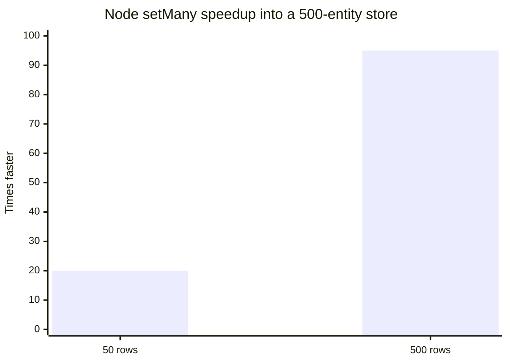
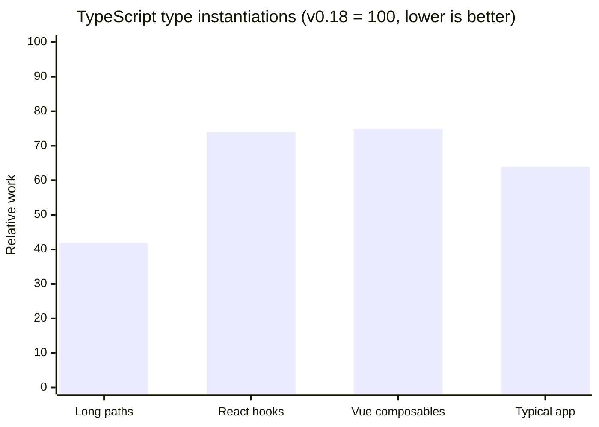

v0.19 lets a [Manager](/docs/concepts/managers) write a whole batch of streamed rows in one store update, and fixes a
round of TypeScript and Vue issues.

**New APIs:**

- [Controller.set() with Array schemas](/blog/2026/10/03/v0.19-batch-set#batch-set) - Write many entities in one store update with `ctrl.set([Entity], rows)`, [up to 95x faster](/blog/2026/10/03/v0.19-batch-set#batch-set-performance) than one `set()` per row

**Other Improvements:**

- Fix TypeScript 7 module resolution for package `exports`; imports now resolve to declaration files ([#4019](https://github.com/reactive/data-client/pull/4019))
- [renderDataHook()](/docs/api/renderDataHook) runs provider mount effects when the first render suspends ([#4099](https://github.com/reactive/data-client/pull/4099))
- [Faster TypeScript checking](/blog/2026/10/03/v0.19-batch-set#faster-types) for [RestEndpoint](/rest/api/RestEndpoint), [resource()](/rest/api/resource) and `.extend()`: up to half the check time and memory, with the same errors reported ([#4173](https://github.com/reactive/data-client/pull/4173))
- [Controller.set() values are typed by the schema](/blog/2026/10/03/v0.19-batch-set#typed-set), so `ctrl.set(new schema.All(Todo), 42)` is a TypeScript error ([#4133](https://github.com/reactive/data-client/pull/4133))
- Vue [useSuspense()](/vue/api/useSuspense) and [useLive()](/vue/api/useLive) keep the previous data while new arguments load, instead of returning `undefined` ([#4131](https://github.com/reactive/data-client/pull/4131))
- Vue [useSuspense()](/vue/api/useSuspense) and [useLive()](/vue/api/useLive) send fetch errors after arguments change to `onErrorCaptured()` instead of an unhandled promise rejection ([#4135](https://github.com/reactive/data-client/pull/4135))
- Vue [useSuspense()](/vue/api/useSuspense), [useDLE()](/vue/api/useDLE) and [useFetch()](/vue/api/useFetch) no longer refetch stale data on every store update, so a `controller.set()` is not overwritten ([#4134](https://github.com/reactive/data-client/pull/4134))
- Vue [useDLE()](/vue/api/useDLE) and [useCache()](/vue/api/useCache) keep expired `invalidIfStale` data through unrelated store updates instead of getting stuck loading ([#4142](https://github.com/reactive/data-client/pull/4142))
- Vue `DataClientPlugin` installs on Vue versions before 3.5 instead of throwing `app.onUnmount is not a function` ([#4146](https://github.com/reactive/data-client/pull/4146))
- Vue composables accept [getter arguments](/blog/2026/10/03/v0.19-batch-set#vue-getter-args) like `() => ({ id: props.id })`; they were typed to allow them but passed the function itself to the endpoint ([#4115](https://github.com/reactive/data-client/pull/4115))
- Fix `Cannot find name 'NoInfer'` and `export type` errors on TypeScript 4.x with `skipLibCheck` off ([#4138](https://github.com/reactive/data-client/pull/4138))
- Fix `Entity`, `Endpoint`, `Union` and `RestEndpoint` type errors on TypeScript 4.0–4.5 with `skipLibCheck` off ([#4140](https://github.com/reactive/data-client/pull/4140))
- [Entity](/rest/api/Entity) classes can be used where an `EntityInterface` is expected ([#4149](https://github.com/reactive/data-client/pull/4149)); [prepare `pk()` overrides](/blog/2026/10/03/v0.19-batch-set#entity-pk-args) for a future release
- [useCache()](/docs/api/useCache) and [useDLE()](/docs/api/useDLE) return `undefined` for a deleted entity whose refetch failed, instead of a truthy `Symbol` that slipped past `if (!data)` checks; [remove any workarounds](/blog/2026/10/03/v0.19-batch-set#deleted-entity-undefined) ([#4150](https://github.com/reactive/data-client/pull/4150))
- Vue [useFetch()](/vue/api/useFetch) keeps its data from being garbage collected while mounted, like [useSuspense()](/vue/api/useSuspense), so a configured `gcPolicy` no longer evicts prefetched data that components read later ([#4152](https://github.com/reactive/data-client/pull/4152))
- Vue [useFetch()](/vue/api/useFetch) is typed as the read-only `Ref` it returns, so `promise.resolved` (always `undefined`) is now a TypeScript error; read `promise.value.resolved` instead ([#4114](https://github.com/reactive/data-client/pull/4114))

**[Breaking Changes:](/blog/2026/10/03/v0.19-batch-set#migration-guide)**

- [TypeScript 4.0 or later is required](/blog/2026/10/03/v0.19-batch-set#typescript-4) - the TypeScript 3.x declarations are removed ([#4151](https://github.com/reactive/data-client/pull/4151))

{/* truncate */}

import DiffEditor from '@site/src/components/DiffEditor';
import HooksPlayground from '@site/src/components/HooksPlayground';
import StackBlitz from '@site/src/components/StackBlitz';
import TypeScriptEditor from '@site/src/components/TypeScriptEditor';

## Batch Controller.set() {#batch-set}

A [Manager](/docs/concepts/managers) that receives a stream of rows (like price tickers over a websocket) can now write
them all with one [Controller.set()](/docs/api/Controller#set-array) by passing an [Array](/rest/api/Array) schema.
Before v0.19, `[Ticker]` was a TypeScript error, so the usual workaround was a `set()` per row:

<DiffEditor>

```ts title="Before"
ws.onmessage = event => {
  const rows = JSON.parse(event.data);
  for (const row of rows) {
    ctrl.set(Ticker, { product_id: row.product_id }, row);
  }
};
```

```ts title="After"
ws.onmessage = event => {
  const rows = JSON.parse(event.data);
  ctrl.set([Ticker], rows);
};
```

</DiffEditor>

Each row merges with its stored entity, and entities not in the list are untouched. Array schemas take no `args` and
no updater function. To batch mixed Entity types, deletes, or rows keyed by id, pass a [Union](/rest/api/Union),
[Invalidate](/rest/api/Invalidate#batch-invalidation), or [Values](/rest/api/Values) schema; see
[Controller.set()](/docs/api/Controller#set-array) for examples.
[#4103](https://github.com/reactive/data-client/pull/4103)

Try both buttons below. This browser check starts from an empty store and times `Promise.all` of 500 `set()`
calls against one batch `set()`. Both paths are one React commit, and each writes 500 new prices.

<HooksPlayground row>

```ts title="Ticker" collapsed
import { Entity } from '@data-client/rest';

export class Ticker extends Entity {
  product_id = '';
  price = 0;

  pk() {
    return this.product_id;
  }
  static key = 'Ticker';
}

export const newPrices = () =>
  Array.from({ length: 500 }, (_, i) => ({
    product_id: `COIN-${i}`,
    price: Math.round(Math.random() * 10000) / 100,
  }));
```

```tsx title="PriceStream"
import { useController, useQuery } from '@data-client/react';
import { Ticker, newPrices } from './Ticker';

function PriceStream() {
  const ctrl = useController();
  const [timing, setTiming] = React.useState('');
  const first = useQuery(Ticker, { product_id: 'COIN-0' });

  const time = async (
    label: string,
    write: (rows: ReturnType<typeof newPrices>) => Promise<unknown>,
  ) => {
    const rows = newPrices();
    const start = performance.now();
    await write(rows);
    setTiming(`${label}: ${(performance.now() - start).toFixed(1)} ms`);
  };
  const perRow = () =>
    time('500 set() calls', rows =>
      Promise.all(
        rows.map(row => ctrl.set(Ticker, { product_id: row.product_id }, row)),
      ),
    );
  // highlight-next-line
  const batch = () => time('1 batch set()', rows => ctrl.set([Ticker], rows));

  return (
    <div>
      <button onClick={perRow}>set() per row</button>{' '}
      <button onClick={batch}>batch set()</button>
      <p>COIN-0: {first ? `$${first.price}` : 'no data yet'}</p>
      <p>{timing}</p>
    </div>
  );
}
render(<PriceStream />);
```

</HooksPlayground>

### Performance {#batch-set-performance}

Each `set()` is a separate store update, and every store update copies that entity type's table. Writing rows one
at a time repeats that copy for every row, so the cost grows with both the batch size and the store size. A batch
pays that copy once.

The chart is the node `setMany` benchmark in
[examples/benchmark/core.js](https://github.com/reactive/data-client/blob/master/examples/benchmark/core.js):
a store that already holds 500 entities, then a synchronous `set()` per row against one `set([Ticker], rows)`.
It measures the store update: **20x** faster for 50 rows (10.8 ms to 0.54 ms) and **95x** faster for 500 rows
(103 ms to 1.08 ms).
[#4103](https://github.com/reactive/data-client/pull/4103)

<center>

<div style={{maxWidth:'500px'}}>



</div>

[Benchmarks over time](https://reactive.github.io/data-client/dev/bench/) | [View setMany benchmark](https://github.com/reactive/data-client/blob/master/examples/benchmark/core.js)

</center>

In a [Manager](/docs/concepts/managers), buffer incoming messages and flush each batch with one `set()`, as described in
[Batching high-frequency updates](/docs/concepts/managers#batching). The coin app's `StreamManager` now
flushes Coinbase ticker messages this way.

<StackBlitz app="coin-app" file="src/resources/StreamManager.ts,src/getManagers.ts,src/resources/Ticker.ts" height="600" view="editor" />

:::tip

If you filter [DevToolsManager](/docs/api/DevToolsManager) actions by schema, a batched write's `action.schema`
is the Array schema, so match `action.schema[0]` for `[Ticker]` rather than the Entity itself.

:::

## Other improvements

### Faster TypeScript checking {#faster-types}

Your editor and `tsc` now check code that defines or calls endpoints with much less type work. TypeScript still
reports exactly the same errors.

We measured stress tests that each use one pattern many times:

- **Endpoints with long paths:** 150 [RestEndpoints](/rest/api/RestEndpoint), each with a long path, `.extend()` and
  `.paginated()`, check in about half the time (3.4s to 1.7s on TypeScript 6) and memory (365MB to 211MB).
- **Resources with hooks:** 40 [resource()](/rest/api/resource) definitions called through every React hook, or
  every Vue composable, do about 25% less type work.
- **A typical app:** a few resources with `.extend()` and `.paginated()` do 36% less type work.

<center>

<div style={{maxWidth:'500px'}}>



</div>

</center>

On TypeScript 5.x and earlier, methods passed to `.extend()`, like `process()`, now get their parameter types from
the endpoint instead of failing with "implicitly has an 'any' type" under `strict`
([#4173](https://github.com/reactive/data-client/pull/4173)).

### Typed set() values {#typed-set}

[Controller.set()](/docs/api/Controller#set) previously accepted any value for a schema, so a typo or a wrong
field type only surfaced as bad data at runtime. Values are now typed by the schema: an
[Entity](/rest/api/Entity) takes its fields, while a [Collection](/rest/api/Collection), [All](/rest/api/All) or
Array takes a list of rows. Every field is optional, since `set()` merges into what is already stored, and
numbers and strings are interchangeable just like in API responses.
[#4133](https://github.com/reactive/data-client/pull/4133)

Hover the red underlines to see each error.

<TypeScriptEditor>

```ts title="Todo" collapsed
import { Entity, resource } from '@data-client/rest';

export class Todo extends Entity {
  id = 0;
  userId = 0;
  title = '';
  completed = false;

  static key = 'Todo';
}

export const TodoResource = resource({
  urlPrefix: 'https://jsonplaceholder.typicode.com',
  path: '/todos/:id',
  schema: Todo,
});
```

```ts title="updateTodos"
import type { Controller } from '@data-client/react';
import { schema } from '@data-client/rest';
import { Todo, TodoResource } from './Todo';

export function updateTodos(ctrl: Controller) {
  // ✅ rows are partial Todos; ids may be strings or numbers
  ctrl.set(TodoResource.getList.schema, [{ id: '5', completed: true }]);
  ctrl.set(Todo, { id: 5 }, todo => ({ completed: !todo.completed }));
  ctrl.set([Todo], [{ id: 1, title: 'first' }, { id: 2 }]);

  // ❌ All takes a list of rows
  ctrl.set(new schema.All(Todo), 42);
  // ❌ completed is a boolean
  ctrl.set(Todo, { id: 5 }, { id: 5, completed: 'yes' });
  // ❌ Todo has no done field
  ctrl.set(TodoResource.getList.schema, [{ id: 5, done: true }]);
  // ❌ updaters must return Todo fields
  ctrl.set(Todo, { id: 5 }, todo => ({ title: todo.completed }));
}
```

</TypeScriptEditor>

A [Query](/rest/api/Query) takes the input of the schema it wraps, since `set()` normalizes that schema rather than
reversing `process()`. To keep type checking fast for large [Unions](/rest/api/Union), a Union row is checked
against the combined fields of all its members, so a row mixing fields from different members is not an error; see
[type checking limits](/docs/api/Controller#set).

If code that previously compiled now fails here, it was writing data its schema doesn't describe. Fix the value,
or widen the Entity's field types if the data really can take that shape.

### Vue getter arguments {#vue-getter-args}

Vue composables like [useSuspense()](/vue/api/useSuspense) and [useLive()](/vue/api/useLive) were typed to accept a
getter function as an argument, but they passed the function itself to the endpoint instead of calling it. Getters now
work the same as refs and `computed`, and the composable refetches when anything the getter reads changes
([#4115](https://github.com/reactive/data-client/pull/4115)). Drop the `computed()` wrapper if you only used it to make
arguments reactive:

<DiffEditor>

```ts title="Before"
import { computed } from 'vue';

const props = defineProps<{ id: number }>();
const article = await useSuspense(
  ArticleResource.get,
  computed(() => ({ id: props.id })),
);
```

```ts title="After"
const props = defineProps<{ id: number }>();
const article = await useSuspense(ArticleResource.get, () => ({
  id: props.id,
}));
```

</DiffEditor>

This applies to every composable that takes endpoint arguments: [useSuspense()](/vue/api/useSuspense),
[useLive()](/vue/api/useLive), [useCache()](/vue/api/useCache), [useDLE()](/vue/api/useDLE),
[useFetch()](/vue/api/useFetch), [useQuery()](/vue/api/useQuery) and [useSubscription()](/vue/api/useSubscription).

### Entity classes typecheck as EntityInterface {#entity-pk-args}

Helpers typed to accept any Entity with `EntityInterface` rejected Entity classes, because
[Entity.pk()](/rest/api/Entity#pk) typed its `args` as a mutable array. It is now `readonly any[]`, so this
typechecks ([#4149](https://github.com/reactive/data-client/pull/4149)):

<TypeScriptEditor>

```ts
import { Entity } from '@data-client/rest';
import type { EntityInterface } from '@data-client/react';

class User extends Entity {
  id = '';
  name = '';
}

function entityName(schema: EntityInterface) {
  return schema.key;
}

entityName(User);
```

</TypeScriptEditor>

If you override `static pk()` and type `args` as a mutable array, it still compiles, but a future breaking release
will require `readonly`. Update it now:

<DiffEditor>

```ts title="Before"
class User extends Entity {
  static pk(value: any, parent?: any, key?: string, args?: any[]) {
    return `${value.id}-${args?.[0]?.org}`;
  }
}
```

```ts title="After"
class User extends Entity {
  static pk(value: any, parent?: any, key?: string, args?: readonly any[]) {
    return `${value.id}-${args?.[0]?.org}`;
  }
}
```

</DiffEditor>

### Deleted entities read as undefined {#deleted-entity-undefined}

When an entity was deleted and its refetch failed, [useCache()](/docs/api/useCache) and [useDLE()](/docs/api/useDLE)
(React and Vue) returned an internal `Symbol` as data. A `Symbol` is truthy, so the usual "not loaded yet" guard let it
through and the component rendered as if it had an entity
([#4150](https://github.com/reactive/data-client/pull/4150)):

```tsx
function TodoDetail({ id }: { id: number }) {
  const todo = useCache(TodoResource.get, { id });
  // a deleted todo used to get past this guard, so todo.title.trim() threw
  if (!todo) return <TodoPlaceholder />;
  return <h3>{todo.title.trim()}</h3>;
}
```

Now `data` is `undefined`, matching its type and [Controller.get()](/docs/api/Controller#get). The same applies to
[Controller.getResponse()](/docs/api/Controller#getResponse) and
[Controller.fetchIfStale()](/docs/api/Controller#fetchIfStale), for example in custom [Managers](/docs/api/Manager).

If you worked around this, the workaround can go. A plain truthiness check is enough:

<DiffEditor>

```tsx title="Before"
function TodoDetail({ id }: { id: number }) {
  const todo = useCache(TodoResource.get, { id });
  if (!todo || typeof todo === 'symbol') return <TodoPlaceholder />;
  return <h3>{todo.title.trim()}</h3>;
}
```

```tsx title="After"
function TodoDetail({ id }: { id: number }) {
  const todo = useCache(TodoResource.get, { id });
  if (!todo) return <TodoPlaceholder />;
  return <h3>{todo.title.trim()}</h3>;
}
```

</DiffEditor>

To show something specific when the refetch failed (for example a 404 after deletion), read `error` from
[useDLE()](/docs/api/useDLE) rather than inspecting `data`.

## Migration guide

import PkgTabs from '@site/src/components/PkgTabs';

This upgrade requires updating all package versions simultaneously.

<PkgTabs pkgs="@data-client/react@^0.19.0 @data-client/rest@^0.19.0 @data-client/endpoint@^0.19.0 @data-client/core@^0.19.0 @data-client/vue@^0.19.0 @data-client/test@^0.19.0 @data-client/img@^0.19.0" upgrade />

### TypeScript 4.0 or later {#typescript-4}

Skip this section if you already use TypeScript 4.0 or later.

The TypeScript 3.x declarations are removed, since they no longer typechecked on any TypeScript 3.x version. Bump
`typescript` to `^4.0.0` or later in your `devDependencies`. [#4151](https://github.com/reactive/data-client/pull/4151)

### Upgrade support

As usual, if you have any troubles or questions, feel free to join our [](https://discord.gg/wXGV27xm6t) or [file a bug](https://github.com/reactive/data-client/issues/new/choose)
