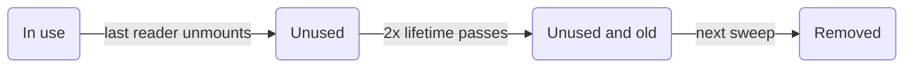

v0.19 lets a [Manager](/docs/concepts/managers) write a whole batch of streamed rows in one store update, type-checks
endpoint code about 2x faster, and fixes a round of TypeScript and Vue issues.

**New APIs:**

- [Controller.set() with Array schemas](/blog/2026/10/03/v0.19-batch-set#batch-set) - Write many entities in one store update with `ctrl.set([Entity], rows)`, [up to 95x faster](/blog/2026/10/03/v0.19-batch-set#batch-set-performance) than one `set()` per row

**Performance:**

- [Faster TypeScript](/blog/2026/10/03/v0.19-batch-set#faster-types) - Editors and `tsc` check [RestEndpoint](/rest/api/RestEndpoint) and [resource()](/rest/api/resource) code [about 2x faster with 40% less memory](/blog/2026/10/03/v0.19-batch-set#faster-types-results), catching every error they caught before

**Other Improvements:**

- Fix TypeScript 7 module resolution for package `exports`; imports now resolve to declaration files ([#4019](https://github.com/reactive/data-client/pull/4019))
- [renderDataHook()](/docs/api/renderDataHook) runs provider mount effects when the first render suspends ([#4099](https://github.com/reactive/data-client/pull/4099))
- [Controller.set() values are typed by the schema](/blog/2026/10/03/v0.19-batch-set#typed-set), so `ctrl.set(new schema.All(Todo), 42)` is a TypeScript error ([#4133](https://github.com/reactive/data-client/pull/4133))
- [Controller.set() deletes one entity with an Invalidate schema](/blog/2026/10/03/v0.19-batch-set#set-invalidate) without the one-row batch workaround ([#4230](https://github.com/reactive/data-client/pull/4230))
- [process() gets typed params](/blog/2026/10/03/v0.19-batch-set#extend-process-params) in `new RestEndpoint()`, `.extend()` and `resource().extend()`, so a wrong path parameter is a TypeScript error instead of `undefined` at runtime ([#4183](https://github.com/reactive/data-client/pull/4183), [#4184](https://github.com/reactive/data-client/pull/4184))
- Vue [useSuspense()](/vue/api/useSuspense) and [useLive()](/vue/api/useLive) keep the previous data while new arguments load, instead of returning `undefined` ([#4131](https://github.com/reactive/data-client/pull/4131))
- Vue [useSuspense()](/vue/api/useSuspense) and [useLive()](/vue/api/useLive) send fetch errors after arguments change to `onErrorCaptured()` instead of an unhandled promise rejection ([#4135](https://github.com/reactive/data-client/pull/4135))
- Vue [useSuspense()](/vue/api/useSuspense), [useDLE()](/vue/api/useDLE) and [useFetch()](/vue/api/useFetch) no longer refetch stale data on every store update, so a `controller.set()` is not overwritten ([#4134](https://github.com/reactive/data-client/pull/4134))
- Vue [useSuspense()](/vue/api/useSuspense) [shows stale data on mount](/blog/2026/10/03/v0.19-batch-set#vue-stale-while-revalidate) and refetches in the background, like React, instead of showing the `<Suspense>` fallback until the refetch finishes ([#4169](https://github.com/reactive/data-client/pull/4169))
- Vue [useDLE()](/vue/api/useDLE) and [useCache()](/vue/api/useCache) keep expired `invalidIfStale` data through unrelated store updates instead of getting stuck loading ([#4142](https://github.com/reactive/data-client/pull/4142))
- Vue `DataClientPlugin` installs on Vue versions before 3.5 instead of throwing `app.onUnmount is not a function` ([#4146](https://github.com/reactive/data-client/pull/4146))
- Vue [DataClientPlugin](/vue/api/DataClientPlugin#gcPolicy) garbage collects by default, matching React's [DataProvider](/docs/api/DataProvider), so you no longer need to pass `gcPolicy`; [how it decides what to remove](/blog/2026/10/03/v0.19-batch-set#vue-gc) ([#4148](https://github.com/reactive/data-client/pull/4148))
- Vue composables accept [getter arguments](/blog/2026/10/03/v0.19-batch-set#vue-getter-args) like `() => ({ id: props.id })`; they were typed to allow them but passed the function itself to the endpoint ([#4115](https://github.com/reactive/data-client/pull/4115))
- Fix `Cannot find name 'NoInfer'` and `export type` errors on TypeScript 4.x with `skipLibCheck` off ([#4138](https://github.com/reactive/data-client/pull/4138))
- Fix `Entity`, `Endpoint`, `Union` and `RestEndpoint` type errors on TypeScript 4.0–4.5 with `skipLibCheck` off ([#4140](https://github.com/reactive/data-client/pull/4140))
- Fix `',' expected` errors importing `@data-client/react/redux`, `@data-client/react/nextjs` or `@data-client/test` on TypeScript 4.0–4.4 ([#4232](https://github.com/reactive/data-client/pull/4232))
- [Entity](/rest/api/Entity) classes can be used where an `EntityInterface` is expected ([#4149](https://github.com/reactive/data-client/pull/4149)); [prepare `pk()` overrides](/blog/2026/10/03/v0.19-batch-set#entity-pk-args) for a future release
- [useCache()](/docs/api/useCache) and [useDLE()](/docs/api/useDLE) return `undefined` for a deleted entity whose refetch failed, instead of a truthy `Symbol` that slipped past `if (!data)` checks; [remove any workarounds](/blog/2026/10/03/v0.19-batch-set#deleted-entity-undefined) ([#4150](https://github.com/reactive/data-client/pull/4150))
- Vue [useFetch()](/vue/api/useFetch) keeps its data from being garbage collected while mounted, like [useSuspense()](/vue/api/useSuspense), so a configured `gcPolicy` no longer evicts prefetched data that components read later ([#4152](https://github.com/reactive/data-client/pull/4152))
- Apps with [Redux DevTools](/docs/getting-started/debugging) open no longer stutter in development on large stores or frequent updates; each update [serializes 40-60x faster](/blog/2026/10/03/v0.19-batch-set#devtools-perf) ([#4163](https://github.com/reactive/data-client/pull/4163))
- [resource().extend()](/rest/api/resource#extend) with an object of endpoint overrides keeps endpoints added earlier with `.extend('name', options)` in its type, so using them is no longer a TypeScript error ([#4184](https://github.com/reactive/data-client/pull/4184))
- [RestEndpoint.push](/blog/2026/10/03/v0.19-batch-set#query-collection-push), `unshift` and `remove` accept the Entity's fields as the body when a [Query](/rest/api/Query) or [Lazy](/rest/api/Lazy) wraps the [Collection](/rest/api/Collection), instead of only `FormData` ([#4226](https://github.com/reactive/data-client/pull/4226))
- Vue [useFetch()](/vue/api/useFetch) is typed as the read-only `Ref` it returns, so `promise.resolved` (always `undefined`) is now a TypeScript error; read `promise.value.resolved` instead ([#4114](https://github.com/reactive/data-client/pull/4114))
- A `Controller` subclass passed to [DataProvider](/docs/api/DataProvider#Controller) or [DataClientPlugin](/vue/api/DataClientPlugin#Controller) no longer needs a cast to type-check ([#4228](https://github.com/reactive/data-client/pull/4228))
- [resource().create accepts FormData](/blog/2026/10/03/v0.19-batch-set#create-formdata) without a cast, like `update`, `partialUpdate` and `getList.push` ([#4235](https://github.com/reactive/data-client/pull/4235))
- Vue `createDataClient()` is deprecated, since it's internal to [DataClientPlugin](/vue/api/DataClientPlugin); install the plugin with `app.use(DataClientPlugin, options)` instead of calling it directly ([#4193](https://github.com/reactive/data-client/pull/4193))
- Vue `renderDataCompose()`'s `waitForNextUpdate()` is deprecated, since it gives up silently after 1 second and lets a test pass while still suspended; `await result` instead, or `await allSettled()` after a change, which now also waits for fetches a prop change starts ([unit testing composables](/vue/guides/unit-testing-composables#renderdatacompose-api), [#4221](https://github.com/reactive/data-client/pull/4221))

**[Breaking Changes:](/blog/2026/10/03/v0.19-batch-set#migration-guide)**

- [TypeScript 4.0 or later is required](/blog/2026/10/03/v0.19-batch-set#typescript-4) - the TypeScript 3.x declarations are removed ([#4151](https://github.com/reactive/data-client/pull/4151))

**[Get ready for future releases:](/blog/2026/10/03/v0.19-batch-set#future-releases)**

- [Type `args` as `readonly` in `Entity.pk()` overrides](/blog/2026/10/03/v0.19-batch-set#future-pk-args)
- [Use `DataClientPlugin` instead of Vue `createDataClient()`](/blog/2026/10/03/v0.19-batch-set#future-create-data-client)
- [Replace `waitForNextUpdate()` in Vue tests](/blog/2026/10/03/v0.19-batch-set#future-wait-for-next-update)

{/* truncate */}

import useBaseUrl from '@docusaurus/useBaseUrl';
import AutoPlayVideo from '@site/src/components/AutoPlayVideo';
import DiffEditor from '@site/src/components/DiffEditor';
import BatchSetDemo from '../../docs/core/shared/\_BatchSetDemo.mdx';
import PerfChart from '@site/src/components/PerfChart';
import PerfTable from '@site/src/components/PerfTable';
import StackBlitz from '@site/src/components/StackBlitz';
import TypeScriptEditor from '@site/src/components/TypeScriptEditor';

## Batch Controller.set() {#batch-set}

A [Manager](/docs/concepts/managers) that receives a stream of rows (like price tickers over a websocket) can now write
them all with one [Controller.set()](/docs/api/Controller#set-array) by passing an [Array](/rest/api/Array) schema.
Before v0.19, `[Ticker]` was a TypeScript error, so the usual workaround was a `set()` per row:

<DiffEditor>

```ts title="Before"
ws.onmessage = event => {
  const rows = JSON.parse(event.data);
  for (const row of rows) {
    ctrl.set(Ticker, { product_id: row.product_id }, row);
  }
};
```

```ts title="After"
ws.onmessage = event => {
  const rows = JSON.parse(event.data);
  ctrl.set([Ticker], rows);
};
```

</DiffEditor>

Each row merges with its stored entity, and entities not in the list are untouched. Array schemas take no `args` and
no updater function. To batch mixed Entity types, deletes, or rows keyed by id, pass a [Union](/rest/api/Union),
[Invalidate](/rest/api/Invalidate#batch-invalidation), or [Values](/rest/api/Values) schema; see
[Controller.set()](/docs/api/Controller#set-array) for examples.
[#4103](https://github.com/reactive/data-client/pull/4103)

<BatchSetDemo />

### Performance {#batch-set-performance}

Each `set()` is a separate store update, and every store update copies that entity type's table. Writing rows one
at a time repeats that copy for every row, so the cost grows with both the batch size and the store size. A batch
pays that copy once.

The chart is the node `setMany` benchmark in
[examples/benchmark/core.js](https://github.com/reactive/data-client/blob/master/examples/benchmark/core.js):
a store that already holds 500 entities, then a synchronous `set()` per row against one `set([Ticker], rows)`.
It measures the store update: **20x** faster for 50 rows and **95x** faster for 500 rows.
[#4103](https://github.com/reactive/data-client/pull/4103)

<PerfChart
  title="Node setMany into a 500-entity store"
  baselineLabel="One set() per row"
  valueLabel="set([Ticker], rows)"
  rows={[
    { label: '50 rows', baseline: 10.8, value: 0.54 },
    { label: '500 rows', baseline: 103, value: 1.08 },
  ]}
/>

<center>

[Benchmarks over time](https://reactive.github.io/data-client/dev/bench/) | [View setMany benchmark](https://github.com/reactive/data-client/blob/master/examples/benchmark/core.js)

</center>

In a [Manager](/docs/concepts/managers), buffer incoming messages and flush each batch with one `set()`, as described in
[Batching high-frequency updates](/docs/concepts/managers#batching). The coin app's `StreamManager` now
flushes Coinbase ticker messages this way.

<AutoPlayVideo
  src={useBaseUrl('/videos/blog/batch-set-devtools.webm')}
  type="video/webm"
  style={{ width: '100%' }}
  alt="Redux DevTools for two copies of the coin app's StreamManager receiving three bursts of 500 ticker messages. Calling set() for each message logs 1,500 set actions, while buffering messages and flushing them with set([Ticker], rows) logs 3."
/>

```ts title="StreamManager.ts"
handleMessage(msg: any) {
  if (msg.type in this.entities) {
    (this.buffer[msg.type] ??= {})[msg.product_id] = msg;
    this.flushTimeout ??= setTimeout(this.flush, 50);
  }
}

flush = () => {
  const buffer = this.buffer;
  this.buffer = {};
  this.flushTimeout = undefined;
  for (const type in buffer) {
    this.controller.set([this.entities[type]], Object.values(buffer[type]));
  }
};
```

<StackBlitz app="coin-app" file="src/resources/StreamManager.ts,src/getManagers.ts,src/resources/Ticker.ts" height="600" view="editor" />

:::tip

If you filter [DevToolsManager](/docs/api/DevToolsManager) actions by schema, a batched write's `action.schema`
is the Array schema, so match `action.schema[0]` for `[Ticker]` rather than the Entity itself.

:::

## Faster TypeScript {#faster-types}

TypeScript re-checks your code on every keystroke in the editor and on every CI build. In apps with many endpoints,
heavy library types show up as laggy autocomplete, red squiggles that take seconds to appear, and slower builds.
v0.19 makes [RestEndpoint](/rest/api/RestEndpoint), [resource()](/rest/api/resource) and `.extend()` much cheaper
to check, with no code changes on your side. TypeScript still reports every error it reported before
([#4173](https://github.com/reactive/data-client/pull/4173)).

### Results {#faster-types-results}

Our heaviest stress test, a file of 150 RestEndpoints with long paths, `.extend()` and `.paginated()`, now checks
**2x faster on TypeScript 6** and **2.2x faster on TypeScript 7**, using about **40% less memory**. All numbers compare
the published v0.18.1 packages with v0.19; check times are the best of 10 runs.

<PerfChart
  title="Checking 150 RestEndpoints with long paths"
  scaleMax={2.4}
  baselineLabel="v0.18"
  valueLabel="v0.19"
  unit="s"
  rows={[
    { label: 'TypeScript 6', baseline: 3.83, value: 1.98 },
    { label: 'TypeScript 7', baseline: 1.5, value: 0.69 },
  ]}
/>

<PerfChart
  title="Memory for the same file"
  scaleMax={2.4}
  baselineLabel="v0.18"
  valueLabel="v0.19"
  unit="MB"
  rows={[
    { label: 'TypeScript 6', baseline: 365, value: 211 },
    { label: 'TypeScript 7', baseline: 220, value: 128 },
  ]}
/>

Endpoint-heavy code does much less type work. Type instantiations are TypeScript's unit of work: they're
deterministic, so they compare cleanly across machines. Union does more work than in v0.18, because v0.19 now
[type-checks set() values](#typed-set) (see below).

<PerfChart
  title="Type instantiations by stress test"
  scaleMax={2.4}
  baselineLabel="v0.18"
  valueLabel="v0.19"
  unit="K"
  rows={[
    { label: 'Long paths', baseline: 822, value: 341 },
    { label: 'Typical app', baseline: 20.2, value: 13.4 },
    { label: 'React hooks', baseline: 145, value: 122 },
    { label: 'Vue', baseline: 62.6, value: 47.3 },
    { label: '300 fields', baseline: 17.0, value: 12.8 },
    { label: 'Schemas', baseline: 118, value: 99.3 },
    { label: 'Union', baseline: 9.0, value: 16.1 },
  ]}
/>

Hover or tap a cell for exact numbers.

<PerfTable
  columns={[
    { label: 'TS 6 check time', unit: 's' },
    { label: 'TS 7 check time', unit: 's' },
    { label: 'TS 6 memory', unit: 'MB' },
  ]}
  rows={[
    {
      label: 'Long paths',
      description: <>150 RestEndpoints with 6-param paths, <code>.extend()</code> and <code>.paginated()</code></>,
      values: [[3.83, 1.98], [1.5, 0.69], [365, 211]],
    },
    {
      label: 'Typical app',
      description: <>A few resources with <code>.extend()</code>, <code>.paginated()</code> and hooks</>,
      values: [[0.42, 0.42], [0.062, 0.053], [106, 109]],
    },
    {
      label: 'React hooks',
      description: <>40 resources through every hook, plus <code>ctrl.fetch()</code> and <code>ctrl.set()</code></>,
      values: [[1.24, 1.12], [0.41, 0.38], [167, 157]],
    },
    {
      label: 'Vue',
      description: 'The same 40 resources through every composable',
      values: [[0.68, 0.68], [0.17, 0.15], [145, 139]],
    },
    {
      label: '300 fields',
      description: 'One Entity with 300 fields, read and updated 100 times',
      values: [[0.44, 0.38], [0.086, 0.052], [111, 101]],
    },
    {
      label: 'Schemas',
      description: 'All, Query, Invalidate, Array, Object and Collection',
      values: [[1.1, 1.07], [0.36, 0.31], [156, 150]],
    },
    {
      label: 'Union',
      description: 'A 30-member Union in a Collection and Values',
      values: [[0.42, 0.41], [0.071, 0.068], [107, 101]],
    },
    {
      label: 'set() values',
      description: <>1000 <code>ctrl.set()</code> calls on a 30-member Union, a Collection of it and a 300-field Entity</>,
      values: [[1.49, 1.07], [0.54, 0.25], [176, 131]],
    },
    {
      label: 'set() updaters',
      description: <>1000 <code>ctrl.set(Union, args, prev =&gt; ...)</code> updaters on a 30-member Union</>,
      values: [[3.58, 3.43], [1.67, 1.85], [381, 384]],
    },
  ]}
/>

The set() rows measure [typed set() values](#typed-set), which v0.18 didn't check at all. Plain values still check
faster than before, and updater functions on large Unions check in about the same time even though TypeScript now
checks each updater's return value ([#4179](https://github.com/reactive/data-client/pull/4179)).

Small files are dominated by TypeScript's fixed startup cost (loading `lib.dom.d.ts` alone takes about 100MB), so
their time and memory barely move. The savings add up as a codebase grows.

### What changed {#faster-types-how}

- `.extend()` and `.paginated()` are shared across all endpoints instead of re-created for each endpoint type.
- Endpoint options infer as plain object types, so TypeScript stops rebuilding them at every use.
- Path parameters like `/users/:id` are read in a single pass.

Before shipping, we turned off every `@ts-expect-error` in the test suite on TypeScript 4.0 through 7 and confirmed
every error still appears in the same place.

On TypeScript 5.x and earlier, a `process(value, params)` method passed to `.extend()` also no longer fails with
"implicitly has an 'any' type" under `strict`.

## Other improvements

### Typed set() values {#typed-set}

[Controller.set()](/docs/api/Controller#set) previously accepted any value for a schema, so a typo or a wrong
field type only surfaced as bad data at runtime. Values are now typed by the schema: an
[Entity](/rest/api/Entity) takes its fields, while a [Collection](/rest/api/Collection), [All](/rest/api/All) or
Array takes a list of rows. Every field is optional, since `set()` merges into what is already stored, and
numbers and strings are interchangeable just like in API responses.
[#4133](https://github.com/reactive/data-client/pull/4133)

Hover the red underlines to see each error.

<TypeScriptEditor>

```ts title="Todo" collapsed
import { Entity, resource } from '@data-client/rest';

export class Todo extends Entity {
  id = 0;
  userId = 0;
  title = '';
  completed = false;

  static key = 'Todo';
}

export const TodoResource = resource({
  urlPrefix: 'https://jsonplaceholder.typicode.com',
  path: '/todos/:id',
  schema: Todo,
});
```

```ts title="updateTodos"
import type { Controller } from '@data-client/react';
import { schema } from '@data-client/rest';
import { Todo, TodoResource } from './Todo';

export function updateTodos(ctrl: Controller) {
  // ✅ rows are partial Todos; ids may be strings or numbers
  ctrl.set(TodoResource.getList.schema, [{ id: '5', completed: true }]);
  ctrl.set(Todo, { id: 5 }, todo => ({ completed: !todo.completed }));
  ctrl.set([Todo], [{ id: 1, title: 'first' }, { id: 2 }]);

  // ❌ All takes a list of rows
  ctrl.set(new schema.All(Todo), 42);
  // ❌ completed is a boolean
  ctrl.set(Todo, { id: 5 }, { id: 5, completed: 'yes' });
  // ❌ Todo has no done field
  ctrl.set(TodoResource.getList.schema, [{ id: 5, done: true }]);
  // ❌ updaters must return Todo fields
  ctrl.set(Todo, { id: 5 }, todo => ({ title: todo.completed }));
}
```

</TypeScriptEditor>

A [Query](/rest/api/Query) takes the input of the schema it wraps, since `set()` normalizes that schema rather than
reversing `process()`. When each member declares its discriminator as a literal (like `readonly type = 'post'`), a
[Union](/rest/api/Union) row is checked against the member it selects, so it can't mix fields from different members; see [Unions](/docs/api/Controller#set).

If code that previously compiled now fails here, it was writing data its schema doesn't describe. Fix the value,
or widen the Entity's field types if the data really can take that shape.

### Delete one entity with set() {#set-invalidate}

Passing an [Invalidate](/rest/api/Invalidate) schema to [Controller.set()](/docs/api/Controller#set-array) deletes the
entity its row identifies, but the single form was a TypeScript error, so code wrapped it in a one-row batch. It now
type-checks, with the row typed by the Entity's fields
([#4230](https://github.com/reactive/data-client/pull/4230)):

<DiffEditor>

```ts title="Before"
ctrl.set([new Invalidate(Todo)], [{ id: '5' }]);
```

```ts title="After"
ctrl.set(new Invalidate(Todo), { id: '5' });
```

</DiffEditor>

Like batch `set()`, it takes no `args` and no updater function.

### Typed process() params {#extend-process-params}

A [process()](/rest/api/RestEndpoint#process) method passed to `new RestEndpoint()`,
[.extend()](/rest/api/RestEndpoint#extend) or [resource().extend()](/rest/api/resource#extend) got `params` typed as
`any`, so reading a parameter the endpoint doesn't have compiled and returned `undefined` at runtime. `params` and
`body` are now typed from the endpoint, including a `path` set in the same `.extend()` call
([#4183](https://github.com/reactive/data-client/pull/4183), [#4184](https://github.com/reactive/data-client/pull/4184)):

<TypeScriptEditor>

```ts
import { RestEndpoint } from '@data-client/rest';

const getUser = new RestEndpoint({ path: '/users/:id' });

export const getUserById = getUser.extend({
  path: '/users/by-id/:userId',
  process(value, params) {
    const userId: string | number = params.userId;
    // @ts-expect-error 'id' is not a param of '/users/by-id/:userId'
    params.id;
    return { ...value, userId };
  },
});
```

</TypeScriptEditor>

When every param is optional, `params` may be `undefined`, so read it with `params?.page`.

This can surface new TypeScript errors in existing `process()` methods. Each one marks a read that could be `undefined`
or throw at runtime, so fix the param name or add the missing check.

### Typed push() on sorted Collections {#query-collection-push}

Wrapping a [Collection](/rest/api/Collection) in a [Query](/rest/api/Query) to sort or filter it made
[push](/rest/api/RestEndpoint#push), `unshift` and `remove` reject every body except `FormData`, though they add to the
list at runtime. The body is now typed from the Collection's Entity, so the cast can go and a wrong field is a
TypeScript error. The same applies to a Collection wrapped in [Lazy](/rest/api/Lazy)
([#4226](https://github.com/reactive/data-client/pull/4226)).

<DiffEditor>

```ts title="Before"
import { useController } from '@data-client/react';
import { getPosts } from './getPosts';

export function useAddPost() {
  const ctrl = useController();
  return (title: string, author: string) =>
    ctrl.fetch(getPosts.push, { group: 'react' }, { title, author } as any);
}
```

```ts title="After"
import { useController } from '@data-client/react';
import { getPosts } from './getPosts';

export function useAddPost() {
  const ctrl = useController();
  return (title: string, author: string) =>
    ctrl.fetch(getPosts.push, { group: 'react' }, { title, author });
}
```

</DiffEditor>

where `getPosts` sorts its Collection with a Query:

```ts title="getPosts.ts"
import { Collection, Entity, Query, RestEndpoint } from '@data-client/rest';

export class Post extends Entity {
  id = '';
  title = '';
  group = '';
  author = '';
}

export const getPosts = new RestEndpoint({
  path: '/:group/posts',
  searchParams: {} as { orderBy?: 'title' | 'author' },
  schema: new Query(
    new Collection([Post], { nonFilterArgumentKeys: /orderBy/ }),
    (posts, { orderBy }: { orderBy?: 'title' | 'author' } = {}) =>
      orderBy ?
        [...posts].sort((a, b) => a[orderBy].localeCompare(b[orderBy]))
      : posts,
  ),
});
```

### FormData in resource().create {#create-formdata}

[resource()](/rest/api/resource)'s `create` sends a `FormData` body as-is, like `update`, `partialUpdate` and
[getList.push](/rest/api/resource#push), but its type only allowed an object, so submitting a form needed a cast
([#4235](https://github.com/reactive/data-client/pull/4235)). Drop the cast:

<DiffEditor>

```tsx title="Before"
<form
  onSubmit={e => {
    e.preventDefault();
    ctrl.fetch(PostResource.create, new FormData(e.currentTarget) as any);
  }}
>
```

```tsx title="After"
<form
  onSubmit={e => {
    e.preventDefault();
    ctrl.fetch(PostResource.create, new FormData(e.currentTarget));
  }}
>
```

</DiffEditor>

`create` is deprecated; [getList.push](/rest/api/resource#push) is its replacement and takes `FormData` too.

### Vue getter arguments {#vue-getter-args}

Vue composables like [useSuspense()](/vue/api/useSuspense) and [useLive()](/vue/api/useLive) were typed to accept a
getter function as an argument, but they passed the function itself to the endpoint instead of calling it. Getters now
work the same as refs and `computed`, and the composable refetches when anything the getter reads changes
([#4115](https://github.com/reactive/data-client/pull/4115)). Drop the `computed()` wrapper if you only used it to make
arguments reactive:

<DiffEditor>

```ts title="Before"
import { computed } from 'vue';

const props = defineProps<{ id: number }>();
const article = await useSuspense(
  ArticleResource.get,
  computed(() => ({ id: props.id })),
);
```

```ts title="After"
const props = defineProps<{ id: number }>();
const article = await useSuspense(ArticleResource.get, () => ({
  id: props.id,
}));
```

</DiffEditor>

This applies to every composable that takes endpoint arguments: [useSuspense()](/vue/api/useSuspense),
[useLive()](/vue/api/useLive), [useCache()](/vue/api/useCache), [useDLE()](/vue/api/useDLE),
[useFetch()](/vue/api/useFetch), [useQuery()](/vue/api/useQuery) and [useSubscription()](/vue/api/useSubscription).

### Vue garbage collects by default {#vue-gc}

Vue's [DataClientPlugin](/vue/api/DataClientPlugin#gcPolicy) only removed unused data if you passed a `gcPolicy`
yourself. It now defaults to `new GCPolicy()`, the same as React's [DataProvider](/docs/api/DataProvider), so you can
drop the option unless you customize it ([#4148](https://github.com/reactive/data-client/pull/4148)).

<DiffEditor>

```ts title="Before"
import { DataClientPlugin, GCPolicy } from '@data-client/vue';

app.use(DataClientPlugin, { gcPolicy: new GCPolicy() });
```

```ts title="After"
import { DataClientPlugin } from '@data-client/vue';

app.use(DataClientPlugin);
```

</DiffEditor>

Data is removed only when no mounted component reads it _and_ twice its freshness lifetime has passed since it was
fetched (at least two minutes). A sweep checks every five minutes. Anything a component reads again before then is
back in use.

<center>

<div style={{maxWidth:'640px'}}>



</div>

</center>

A component that mounts after removal treats the data as never fetched: [useSuspense()](/vue/api/useSuspense) fetches
it again, while [useCache()](/vue/api/useCache) returns `undefined`. To keep unused data longer or sweep less often,
pass your own [gcPolicy](/vue/api/DataClientPlugin#gcPolicy).

### Vue stale-while-revalidate {#vue-stale-while-revalidate}

When a component mounts with data that is [stale](/docs/concepts/expiry-policy#stale) but still valid, Vue
[useSuspense()](/vue/api/useSuspense) now renders it right away and refetches in the background, like React. Before,
it showed the `<Suspense>` fallback until the refetch finished ([#4169](https://github.com/reactive/data-client/pull/4169)).

<AutoPlayVideo
  src={useBaseUrl('/videos/blog/vue-suspense-stale.mp4')}
  type="video/mp4"
  width="720"
  alt="Two Vue components side by side, before and after v0.19. Both show Loading on first mount. After unmounting and waiting until the price goes stale, remounting shows Loading again in the before version, while the after version shows the stale price right away and refetches in the background."
/>

### Entity classes typecheck as EntityInterface {#entity-pk-args}

Helpers typed to accept any Entity with `EntityInterface` rejected Entity classes, because
[Entity.pk()](/rest/api/Entity#pk) typed its `args` as a mutable array. It is now `readonly any[]`, so this
typechecks ([#4149](https://github.com/reactive/data-client/pull/4149)):

<TypeScriptEditor>

```ts
import { Entity } from '@data-client/rest';
import type { EntityInterface } from '@data-client/react';

class User extends Entity {
  id = '';
  name = '';
}

function entityName(schema: EntityInterface) {
  return schema.key;
}

entityName(User);
```

</TypeScriptEditor>

If you override `static pk()` and type `args` as a mutable array, it still compiles, but a future breaking release
will require `readonly`; [update it now](#future-pk-args).

### Deleted entities read as undefined {#deleted-entity-undefined}

When an entity was deleted and its refetch failed, [useCache()](/docs/api/useCache) and [useDLE()](/docs/api/useDLE)
(React and Vue) returned an internal `Symbol` as data. A `Symbol` is truthy, so the usual "not loaded yet" guard let it
through and the component rendered as if it had an entity
([#4150](https://github.com/reactive/data-client/pull/4150)):

```tsx
function TodoDetail({ id }: { id: number }) {
  const todo = useCache(TodoResource.get, { id });
  // a deleted todo used to get past this guard, so todo.title.trim() threw
  if (!todo) return <TodoPlaceholder />;
  return <h3>{todo.title.trim()}</h3>;
}
```

Now `data` is `undefined`, matching its type and [Controller.get()](/docs/api/Controller#get). The same applies to
[Controller.getResponse()](/docs/api/Controller#getResponse) and
[Controller.fetchIfStale()](/docs/api/Controller#fetchIfStale), for example in custom [Managers](/docs/api/Manager).

If you worked around this, the workaround can go. A plain truthiness check is enough:

<DiffEditor>

```tsx title="Before"
function TodoDetail({ id }: { id: number }) {
  const todo = useCache(TodoResource.get, { id });
  if (!todo || typeof todo === 'symbol') return <TodoPlaceholder />;
  return <h3>{todo.title.trim()}</h3>;
}
```

```tsx title="After"
function TodoDetail({ id }: { id: number }) {
  const todo = useCache(TodoResource.get, { id });
  if (!todo) return <TodoPlaceholder />;
  return <h3>{todo.title.trim()}</h3>;
}
```

</DiffEditor>

To show something specific when the refetch failed (for example a 404 after deletion), read `error` from
[useDLE()](/docs/api/useDLE) rather than inspecting `data`.

### Faster Redux DevTools {#devtools-perf}

With the [Redux DevTools](/docs/getting-started/debugging) extension open, every store update in development
serializes the whole store for the extension, and each timestamp in it was formatted the slow way. Large stores or
frequent updates, like polling, live data or many `controller.set()` calls, made the page stutter. Each update now
serializes **40-60x faster**, and timestamps still read like `10:42:07.123 AM`
([#4163](https://github.com/reactive/data-client/pull/4163)). Production builds don't include DevTools, so they are
unaffected.

<PerfChart
  title="DevTools serialization per store update"
  baselineLabel="v0.18"
  valueLabel="v0.19"
  rows={[
    { label: '50 entities', baseline: 18.6, value: 0.31 },
    { label: '500 entities', baseline: 201, value: 5.0 },
  ]}
/>

## Migration guide

import PkgTabs from '@site/src/components/PkgTabs';

This upgrade requires updating all package versions simultaneously.

<PkgTabs pkgs="@data-client/react@^0.19.0 @data-client/rest@^0.19.0 @data-client/endpoint@^0.19.0 @data-client/core@^0.19.0 @data-client/vue@^0.19.0 @data-client/test@^0.19.0 @data-client/img@^0.19.0" upgrade />

### TypeScript 4.0 or later {#typescript-4}

Skip this section if you already use TypeScript 4.0 or later.

The TypeScript 3.x declarations are removed, since they no longer typechecked on any TypeScript 3.x version. Bump
`typescript` to `^4.0.0` or later in your `devDependencies`. [#4151](https://github.com/reactive/data-client/pull/4151)

### Get ready for future releases {#future-releases}

Nothing here is needed to upgrade to 0.19; your code keeps working as is. Each item will break in a future release,
so updating now makes that upgrade a no-op.

#### Entity.pk() args are readonly {#future-pk-args}

Skip this if you don't override `static pk()` with a typed `args` parameter.

[Entity.pk()](/rest/api/Entity#pk) now types `args` as `readonly any[]`. Overrides that annotate it as a mutable
array still compile for now, but a future release will require `readonly`.

<DiffEditor>

```ts title="Before"
class User extends Entity {
  static pk(value: any, parent?: any, key?: string, args?: any[]) {
    return `${value.id}-${args?.[0]?.org}`;
  }
}
```

```ts title="After"
class User extends Entity {
  static pk(value: any, parent?: any, key?: string, args?: readonly any[]) {
    return `${value.id}-${args?.[0]?.org}`;
  }
}
```

</DiffEditor>

#### Vue createDataClient() {#future-create-data-client}

Skip this if you install the store with `app.use(DataClientPlugin)`.

`createDataClient()` and `ProvidedDataClient` are internal to [DataClientPlugin](/vue/api/DataClientPlugin) and will
stop being exported. Install the plugin instead, and read the controller with
[useController()](/vue/api/useController). [#4193](https://github.com/reactive/data-client/pull/4193)

<DiffEditor>

```ts title="Before"
import { createDataClient } from '@data-client/vue';

const { controller } = createDataClient({ managers, initialState });
```

```ts title="After"
import { DataClientPlugin, useController } from '@data-client/vue';

app.use(DataClientPlugin, { managers, initialState });
// in a component's setup()
const controller = useController();
```

</DiffEditor>

#### Vue renderDataCompose() waitForNextUpdate() {#future-wait-for-next-update}

Skip this if your Vue tests don't call `waitForNextUpdate()`.

`waitForNextUpdate()` from [renderDataCompose()](/vue/guides/unit-testing-composables#renderdatacompose-api) gives up
silently after 1 second, so a test can pass while the composable is still suspended. It will be removed. `await` the
result instead, and call `allSettled()` after changing props or calling the controller; it now also waits for the
fetch a prop change starts. [#4221](https://github.com/reactive/data-client/pull/4221)

<DiffEditor>

```ts title="Before"
const { result, waitForNextUpdate } = await renderDataCompose(
  (props: { id: number }) =>
    useSuspense(ArticleResource.get, () => ({ id: props.id })),
  { props, resolverFixtures },
);
await waitForNextUpdate();
const article = await result;

props.id = 6;
await waitForNextUpdate();
```

```ts title="After"
const { result, allSettled } = await renderDataCompose(
  (props: { id: number }) =>
    useSuspense(ArticleResource.get, () => ({ id: props.id })),
  { props, resolverFixtures },
);
const article = await result;

props.id = 6;
await allSettled();
```

</DiffEditor>

### Upgrade support

As usual, if you have any troubles or questions, feel free to join our [](https://discord.gg/wXGV27xm6t) or [file a bug](https://github.com/reactive/data-client/issues/new/choose)
