import StackBlitz from '@site/src/components/StackBlitz';

**New APIs:**

- [Controller.set() with Array schemas](/blog/2026/10/03/v0.19-batch-set#batch-set) - Write many entities in one store update with `ctrl.set([Entity], rows)`, [up to 95x faster](/blog/2026/10/03/v0.19-batch-set#batch-set-performance) than one `set()` per row

**Other Improvements:**

- Fix TypeScript 7 module resolution for package `exports`; imports now resolve to declaration files ([#4019](https://github.com/reactive/data-client/pull/4019))
- [renderDataHook()](/docs/api/renderDataHook) runs provider mount effects when the first render suspends ([#4099](https://github.com/reactive/data-client/pull/4099))
- Vue [useSuspense()](/vue/api/useSuspense) and [useLive()](/vue/api/useLive) keep the previous data while new arguments load, instead of returning `undefined` ([#4131](https://github.com/reactive/data-client/pull/4131))
- Vue [useSuspense()](/vue/api/useSuspense), [useDLE()](/vue/api/useDLE) and [useFetch()](/vue/api/useFetch) no longer refetch stale data on every store update, so a `controller.set()` is not overwritten ([#4134](https://github.com/reactive/data-client/pull/4134))
- Vue [useDLE()](/vue/api/useDLE) and [useCache()](/vue/api/useCache) keep expired `invalidIfStale` data through unrelated store updates instead of getting stuck loading ([#4142](https://github.com/reactive/data-client/pull/4142))

{/* truncate */}

## Batch Controller.set() {#batch-set}

[Controller.set()](/docs/api/Controller#set-array) now accepts an [Array](/rest/api/Array) schema, so a list of rows
is normalized in one store update. Each row merges with its stored entity, and entities not in the list are untouched.

```ts
// Before: TypeScript error on [Ticker], so batches became one set() per row
for (const row of rows) {
  ctrl.set(Ticker, { product_id: row.product_id }, row);
}

// After: one store update
ctrl.set([Ticker], rows);
```

This works at runtime before v0.19, but only typechecked for single entities, which pushed code toward a `set()` call
per row or a push-only endpoint with `setResponse()`. Array schemas take no `args` and no updater function.
[#4103](https://github.com/reactive/data-client/pull/4103)

Rows are typed by the Entity's fields. Use a [Union](/rest/api/Union) for lists that mix Entity types,
[Invalidate](/rest/api/Invalidate#batch-invalidation) to delete many entities at once, and [Values](/rest/api/Values)
for rows keyed by id.

```ts
const Message = new schema.Union({ ticker: Ticker, trade: Trade }, 'type');
ctrl.set([Message], messages);
ctrl.set([new schema.Invalidate(Ticker)], [{ product_id: 'BTC-USD' }]);
ctrl.set(new schema.Values(Ticker), { 'BTC-USD': row });
```

### Performance {#batch-set-performance}

Each `set()` is a separate store update, and every store update copies that entity type's table. Writing rows one
at a time repeats that copy for every row, so the cost grows with both the batch size and the store size. A batch
pays it once: **20x** faster for 50 rows and **95x** faster for 500 rows, into a store holding 500 entities.
[#4103](https://github.com/reactive/data-client/pull/4103)

<center>

<div style={{maxWidth:'500px'}}>



</div>

```mermaid
xychart-beta
    title "Writing rows into a 500-entity store"
    x-axis ["50 rows", "500 rows"]
    y-axis "Milliseconds (lower is better)" 0 --> 105
    bar [10.8, 103]
    bar [0.54, 1.08]
```

One `set()` per row vs one `set([Ticker], rows)`. This measures the store update only; a batch also notifies
subscribers once instead of once per row.

[Benchmarks over time](https://reactive.github.io/data-client/dev/bench/) | [View benchmark](https://github.com/reactive/data-client/tree/master/examples/benchmark)

</center>

This is most useful in [Managers](/docs/concepts/managers) that receive high-frequency streams or large snapshots.
Buffer incoming messages and flush each batch with one `set()`, as described in
[Batching high-frequency updates](/docs/concepts/managers#batching). The coin app's `StreamManager` now
flushes Coinbase ticker messages this way.

<StackBlitz app="coin-app" file="src/resources/StreamManager.ts,src/getManagers.ts,src/resources/Ticker.ts" height="600" view="editor" />

:::tip

If you filter [DevToolsManager](/docs/api/DevToolsManager) actions by schema, a batched write's `action.schema`
is the Array schema, so match `action.schema[0]` for `[Ticker]` rather than the Entity itself.

:::
