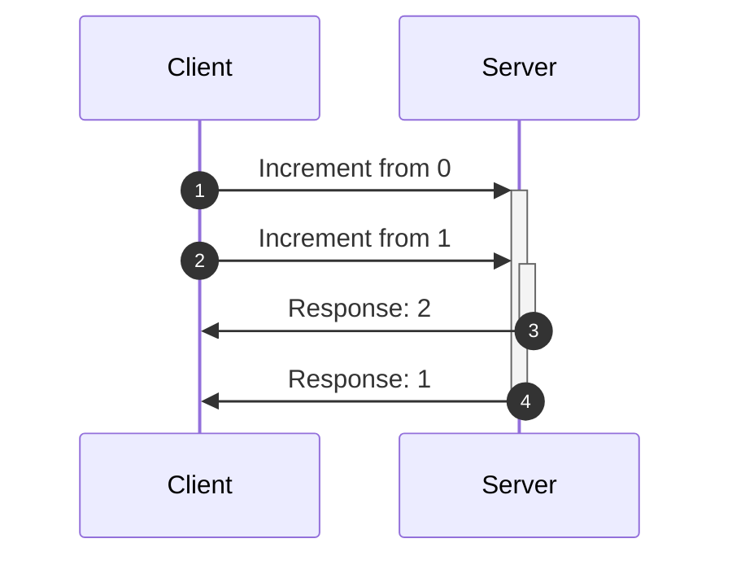
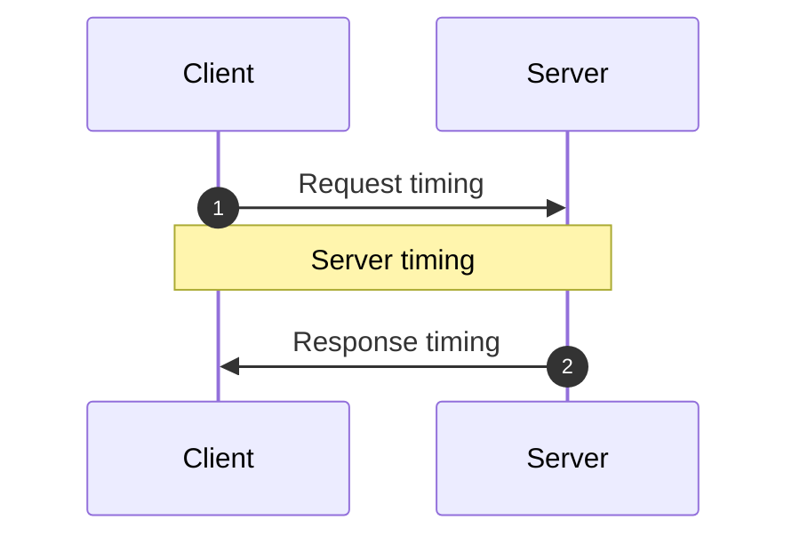

<head>
  <meta name="docsearch:pagerank" content="40"/>
</head>

import FrameworkPlayground from '@site/src/components/FrameworkPlayground';
import {RestEndpoint} from '@data-client/rest';
import { todoFixtures } from '@site/src/fixtures/todos';
import OptimisticTransform from '../shared/\_optimisticTransform.mdx';

# Actualizaciones optimistas

Las actualizaciones optimistas permiten interfaces muy receptivas y rápidas al evitar los tiempos de espera de la red.
Una actualización es optimista porque asume que la red tendrá éxito.

Hacerlo amplifica y crea nuevas condiciones de carrera; por suerte, Reactive Data Client las
maneja automáticamente por ti.

## Resources {#resources}

[resource()](../api/resource.md) se puede configurar estableciendo [optimistic: true](../api/resource.md#optimistic).

<FrameworkPlayground defaultOpen="n" row fixtures={todoFixtures}>

```ts title="TodoResource" {16}
import { Entity, resource } from '@data-client/rest';

export class Todo extends Entity {
  id = 0;
  userId = 0;
  title = '';
  completed = false;

  static key = 'Todo';
}
export const TodoResource = resource({
  urlPrefix: 'https://jsonplaceholder.typicode.com',
  path: '/todos/:id',
  searchParams: {} as { userId?: string | number } | undefined,
  schema: Todo,
  optimistic: true,
});
```

:::react

```tsx title="TodoItem" collapsed
import { useController } from '@data-client/react';
import { TodoResource, type Todo } from './TodoResource';

export default function TodoItem({ todo }: { todo: Todo }) {
  const ctrl = useController();
  const handleChange = e =>
    ctrl.fetch(
      TodoResource.partialUpdate,
      { id: todo.id },
      { completed: e.currentTarget.checked },
    );
  const handleDelete = () =>
    ctrl.fetch(TodoResource.delete, {
      id: todo.id,
    });
  return (
    <div className="listItem nogap">
      <label>
        <input
          type="checkbox"
          checked={todo.completed}
          onChange={handleChange}
        />
        {todo.completed ? <s>{todo.title}</s> : todo.title}
      </label>
      <CancelButton onClick={handleDelete} />
    </div>
  );
}
```

```tsx title="CreateTodo" collapsed
import { useController } from '@data-client/react';
import { TodoResource } from './TodoResource';

export default function CreateTodo({ userId }: { userId: number }) {
  const ctrl = useController();
  const handleKeyDown = async e => {
    if (e.key === 'Enter') {
      ctrl.fetch(TodoResource.getList.push, {
        userId,
        title: e.currentTarget.value,
      });
      e.currentTarget.value = '';
    }
  };
  return (
    <div className="listItem nogap">
      <label>
        <input type="checkbox" name="new" checked={false} disabled />
        <TextInput size="small" onKeyDown={handleKeyDown} />
      </label>
      <CancelButton />
    </div>
  );
}
```

```tsx title="TodoList" collapsed
import { useSuspense } from '@data-client/react';
import { TodoResource } from './TodoResource';
import TodoItem from './TodoItem';
import CreateTodo from './CreateTodo';

function TodoList() {
  const userId = 1;
  const todos = useSuspense(TodoResource.getList, { userId });
  return (
    <div>
      {todos.map(todo => (
        <TodoItem key={todo.pk()} todo={todo} />
      ))}
      <CreateTodo userId={userId} />
    </div>
  );
}
render(<TodoList />);
```

:::

:::vue

```html title="TodoItem.vue" collapsed
<script setup lang="ts">
  import { useController } from '@data-client/vue';
  import { TodoResource, type Todo } from './TodoResource';

  const props = defineProps<{ todo: Todo }>();
  const ctrl = useController();
  const handleChange = e =>
    ctrl.fetch(
      TodoResource.partialUpdate,
      { id: props.todo.id },
      { completed: e.currentTarget.checked },
    );
  const handleDelete = () =>
    ctrl.fetch(TodoResource.delete, {
      id: props.todo.id,
    });
</script>

<template>
  <div class="listItem nogap">
    <label>
      <input type="checkbox" :checked="todo.completed" @change="handleChange" />
      <s v-if="todo.completed">{{ todo.title }}</s>
      <template v-else>{{ todo.title }}</template>
    </label>
    <CancelButton @click="handleDelete" />
  </div>
</template>
```

```html title="CreateTodo.vue" collapsed
<script setup lang="ts">
  import { useController } from '@data-client/vue';
  import { TodoResource } from './TodoResource';

  const props = defineProps<{ userId: number }>();
  const ctrl = useController();
  const handleKeyDown = async e => {
    if (e.key === 'Enter') {
      ctrl.fetch(TodoResource.getList.push, {
        userId: props.userId,
        title: e.currentTarget.value,
      });
      e.currentTarget.value = '';
    }
  };
</script>

<template>
  <div class="listItem nogap">
    <label>
      <input type="checkbox" name="new" :checked="false" disabled />
      <TextInput size="small" @keydown="handleKeyDown" />
    </label>
    <CancelButton />
  </div>
</template>
```

```html title="TodoList.vue" collapsed
<script setup lang="ts">
  import { useSuspense } from '@data-client/vue';
  import { TodoResource } from './TodoResource';
  import TodoItem from './TodoItem.vue';
  import CreateTodo from './CreateTodo.vue';

  const userId = 1;
  const todos = await useSuspense(TodoResource.getList, { userId });
</script>

<template>
  <div>
    <TodoItem v-for="todo in todos" :key="todo.pk()" :todo="todo" />
    <CreateTodo :userId="userId" />
  </div>
</template>
```

:::

</FrameworkPlayground>

Esto hace que todas las mutaciones sean optimistas usando algunas implementaciones por defecto razonables que cubren la mayoría de los casos.

### update/getList.push/getList.unshift {#updategetlistpushgetlistunshift}

```ts
function optimisticUpdate(
  snap: SnapshotInterface,
  params: any,
  body: any,
) {
  return {
    ...params,
    ...ensureBodyPojo(body),
  };
}

function ensureBodyPojo(body: any) {
  return body instanceof FormData
    ? Object.fromEntries((body as any).entries())
    : body;
}
```

En las creaciones (push/unshift) esto normalmente da como resultado que la respuesta no tenga `id` con el que calcular una pk.
<abbr title="Reactive Data Client">Data Client</abbr> creará una `pk` aleatoria para que esto funcione.

Hasta que el objeto se crea realmente, hacer mutaciones sobre ese objeto generalmente no funciona.
Por lo tanto, en estos casos puede ser prudente deshabilitar nuevas mutaciones hasta que el
`POST` real se complete. Una forma de determinarlo es simplemente comprobar la existencia de
un `id` real en la entidad.

### partialUpdate {#partialupdate}

```ts
function optimisticPartial(schema: Queryable) {
  return function (snap: SnapshotInterface, params: any, body: any) {
    const data = snap.get(schema, params);
    if (!data) throw snap.abort;
    return {
      ...params,
      ...data,
      // even tho we don't always have two arguments, the extra one will simply be undefined which spreads fine
      ...ensurePojo(body),
    };
  };
}
```

Las actualizaciones parciales no envían el cuerpo completo, por lo que podemos usar la entidad del
store para calcular la respuesta esperada. Los [Snapshots](/docs/api/Snapshot)
nos dan acceso seguro al valor existente del store, a prueba de cualquier
condición de carrera.

### delete {#delete}

```ts
function optimisticDelete(snap: SnapshotInterface, params: any) {
  return params;
}
```

Si no quieres que todos los endpoints sean optimistas, o si tienes diseños de API poco habituales,
puedes definir [getOptimisticResponse()](../api/RestEndpoint.md#getoptimisticresponse) usando
[Resource.extend()](../api/resource.md#extend)

## Transformaciones optimistas {#optimistic-transforms}

A veces las acciones del usuario deben producir transformaciones de datos que dependen del estado anterior de los datos.
Los ejemplos más simples son alternar un booleano o incrementar un contador; pero el mismo principio se aplica a
transformaciones más complicadas. Para que sea más evidente, aquí usamos un contador simple.

<OptimisticTransform />

Reactive Data Client maneja automáticamente todas las condiciones de carrera debidas a los tiempos de red. Reactive Data Client
registra los tiempos de los fetches, empareja las respuestas con su respectiva actualización optimista y la revierte cuando se resuelve o
se rechaza/falla.

Puedes ver lo problemático que esto resulta para otras librerías incluso sin actualizaciones optimistas;
pero las actualizaciones optimistas lo empeoran aún más.

### Ejemplo de condición de carrera {#example-race-condition}

Este es un ejemplo de la condición de carrera. Aquí solicitamos un incremento dos veces; pero la primera respuesta llega al
cliente después de la segunda.



Con otras librerías y sin actualizaciones optimistas, esto daría como resultado mostrar 0, luego 2 y luego 1.

Si la otra librería sí tiene actualizaciones optimistas, mostraría 0, 1, 2, 2 y luego 1.

En ambos casos terminamos mostrando un estado incorrecto y, por el camino, vemos actualizaciones de estado extrañas y entrecortadas.

### Compensar las variaciones de tiempo del servidor {#server-timings}



Hay tres tiempos que pueden variar en una mutación asíncrona.

1. Tiempo de la petición
1. Tiempo del servidor
1. Tiempo de la respuesta

Reactive Data Client es capaz de manejar automáticamente los tiempos de red, es decir, los tiempos de la petición y de la respuesta. Normalmente esto
es suficiente, ya que los servidores tienden a procesar primero las peticiones que reciben antes. Sin embargo, si el orden de persistencia
en el servidor varía respecto al orden de las peticiones, esto podría causar otra condición de carrera.

Esto se puede resolver manteniendo un [orden total](https://en.wikipedia.org/wiki/Total_order). Como los
servidores y los clientes pueden tener relojes distintos, necesitamos registrar el tiempo desde una perspectiva consistente.
Dado que realizamos actualizaciones optimistas, esto significa que debemos usar el reloj del cliente. Es decir, enviaremos el tiempo
de la petición al servidor en un header `updatedAt` mediante [getRequestInit()](../api/RestEndpoint.md#getRequestInit). El servidor debe entonces garantizar el procesamiento según ese orden y
luego almacenar este `updatedAt` en la entidad para devolverlo en cualquier petición.

Sobrescribiendo [shouldReorder](../api/Entity.md#shouldreorder), podemos reordenar las respuestas que llegan desordenadas según la
marca de tiempo del servidor.

Usamos [snap.fetchedAt](/docs/api/Snapshot#fetchedat) en nuestro [getOptimisticResponse](../api/RestEndpoint.md#getoptimisticresponse). Esto representa el momento en que se dispara el fetch, que será el mismo instante en que se calcula el header `updatedAt`.

<FrameworkPlayground fixtures={[
{
endpoint: new RestEndpoint({path: '/api/count'}),
args: [],
response: { count: 0, updatedAt: Date.now() }
},
{
endpoint: new RestEndpoint({
path: '/api/count/increment',
method: 'POST',
body: undefined,
}),
fetchResponse(input, init) {
return ({
"count": (this.count = this.count + 1),
"updatedAt": JSON.parse(init.body).updatedAt,
});
},
delay: () => 200 + Math.random() * 4500,
delayCollapse:true,
}
]}
getInitialInterceptorData={() => ({ count: 0 })}
row
>

```ts title="count" {11-13} collapsed
import { Entity, RestEndpoint } from '@data-client/rest';

export class CountEntity extends Entity {
  count = 0;
  updatedAt = 0;

  pk() {
    return `SINGLETON`;
  }

  static shouldReorder(existingMeta, incomingMeta, existing, incoming) {
    return incoming.updatedAt < existing.updatedAt;
  }
}
export const getCount = new RestEndpoint({
  path: '/api/count',
  schema: CountEntity,
  name: 'get',
});
```

```ts title="increment" {10-16,22}
import { RestEndpoint } from '@data-client/rest';
import { CountEntity } from './count';

export const increment = new RestEndpoint({
  path: '/api/count/increment',
  method: 'POST',
  body: undefined,
  name: 'increment',
  schema: CountEntity,
  getRequestInit() {
    // this is a substitute for super.getRequestInit()
    // since we aren't in a class context
    return RestEndpoint.prototype.getRequestInit.call(this, {
      updatedAt: Date.now(),
    });
  },
  getOptimisticResponse(snap) {
    const data = snap.get(CountEntity, {});
    if (!data) throw snap.abort;
    return {
      count: data.count + 1,
      updatedAt: snap.fetchedAt,
    };
  },
});
```

:::react

```tsx title="CounterPage" collapsed
import React from 'react';
import { useController, useSuspense, useLoading } from '@data-client/react';
import { getCount } from './count';
import { increment } from './increment';

function CounterPage() {
  const ctrl = useController();
  const { count } = useSuspense(getCount);
  const [n, setN] = React.useState(count);
  const [clickHandler, loading, error] = useLoading(() => {
    setN(n => n + 1);
    return ctrl.fetch(increment);
  });
  return (
    <div>
      <p>
        Click the button multiple times quickly to trigger the
        potential race condition. This time our vector clock protects
        us.
      </p>
      <div>
        Data Client: {count} Should be: {n}
        <br />
        <button onClick={clickHandler}>+</button>
        {loading ? ' ...loading' : ''}
      </div>
    </div>
  );
}
render(<CounterPage />);
```

:::

:::vue

```html title="CounterPage.vue" collapsed
<script setup lang="ts">
  import { ref } from 'vue';
  import { useController, useSuspense, useLoading } from '@data-client/vue';
  import { getCount } from './count';
  import { increment } from './increment';

  const ctrl = useController();
  const data = await useSuspense(getCount);
  const n = ref(data.value.count);
  const [clickHandler, loading, error] = useLoading(() => {
    n.value += 1;
    return ctrl.fetch(increment);
  });
</script>

<template>
  <div>
    <p>
      Click the button multiple times quickly to trigger the
      potential race condition. This time our vector clock protects
      us.
    </p>
    <div>
      Data Client: {{ data.count }} Should be: {{ n }}
      <br />
      <button @click="clickHandler">+</button>
      {{ loading ? ' ...loading' : '' }}
    </div>
  </div>
</template>
```

:::

</FrameworkPlayground>
