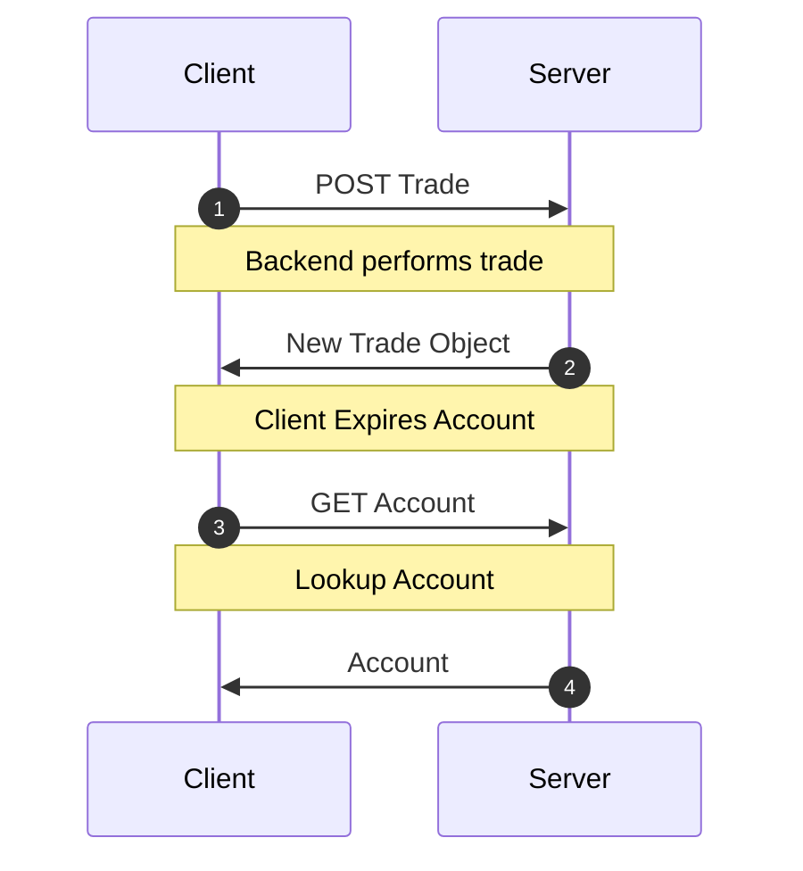
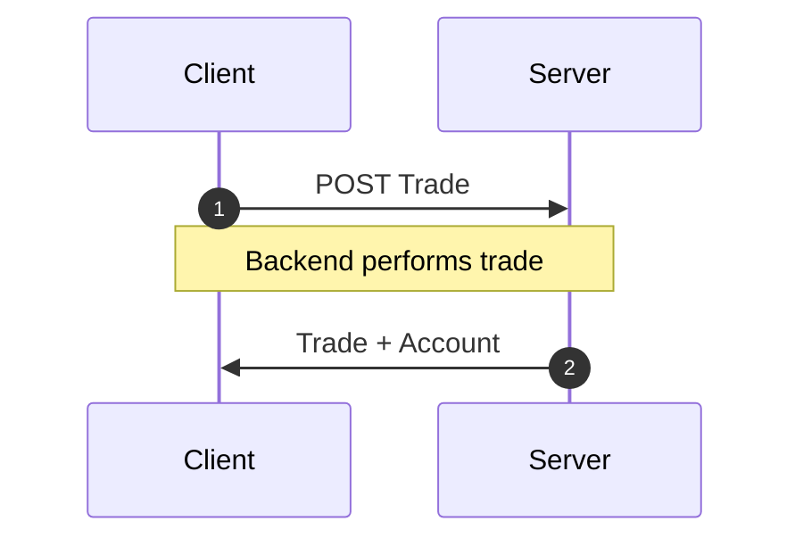

Cuando las mutaciones actualizan más de un recurso, puede resultar tentador
[caducar todos](/docs/api/Controller#expireAll) los demás recursos.

Sin embargo, aún podemos lograr mutaciones atómicas de alto rendimiento si
simplemente agrupamos _todos_ los recursos actualizados en la respuesta de la mutación; así
evitamos esta lenta cascada de red.

<div style={{display: 'grid', gridTemplateColumns: '1fr 1fr', columnGap: '15px'}}>

<div>
<h4 style={{textAlign: 'center'}}>Cascada de red</h4>



</div>
<div>
<h4 style={{textAlign: 'center'}}> Agrupación de respuestas</h4>



</div>

</div>

## Ejemplo {#example}

Estás a cargo de una plataforma de trading de criptomonedas llamada `dogebase`. Cada vez que
un usuario crea una operación, necesitas actualizar cierta información de saldo
en su objeto de cuentas. Por eso, al hacer `POST` al endpoint `/trade/`,
anidas tanto el objeto de cuentas actualizado como la operación que acabas de
crear.

```json title="POST /trade/"
{
  "trade": {
    "id": 2893232,
    "user": 1,
    "amount": "50.2335324",
    "coin": "doge",
    "created_at": ""
  },
  "account": {
    "id": 899,
    "user": 1,
    "balance": "1337.00",
    "coin_value": "3.50"
  }
}
```

Para manejar esto, solo necesitamos actualizar el `schema` para incluir el endpoint
personalizado.

```typescript title="resources/Trade.ts"
import { resource, Entity } from '@data-client/rest';
import { Account } from './Account';

export class Trade extends Entity {
  id = 0;
  user = 0;
  amount = '0';
  coin = '';
  created_at = '';
}

export const TradeResource = resource({
  path: '/trade/:id',
  schema: Trade,
}).extend(Base => ({
  create: Base.getList.push.extend({
    schema: {
      trade: Base.getList.push.schema,
      account: Account,
    },
  }),
}));
```

Ahora, cuando usemos el método generador de Endpoint [getList.push](../api/resource.md#push),
tendremos la tranquilidad de saber que tanto la información de la operación como la de la cuenta
se actualizarán en la caché una vez que se complete la petición `POST`.

:::react

```typescript title="CreateTrade.tsx"
export default function CreateTrade() {
  const ctrl = useController();
  const handleSubmit = payload =>
    ctrl.fetch(TradeResource.create, payload);
  //...
}
```

:::

:::vue

```html title="CreateTrade.vue"
<script setup lang="ts">
  import { useController } from '@data-client/vue';
  import { TradeResource } from './resources/Trade';

  const ctrl = useController();
  const handleSubmit = payload =>
    ctrl.fetch(TradeResource.create, payload);
  //...
</script>
```

:::

:::note

Siéntete libre de crear métodos [RestEndpoint](../api/RestEndpoint.md) completamente nuevos para cualquier
endpoint personalizado que tengas. Este endpoint le indica a `Reactive Data Client` cómo procesar cualquier
petición.

:::
