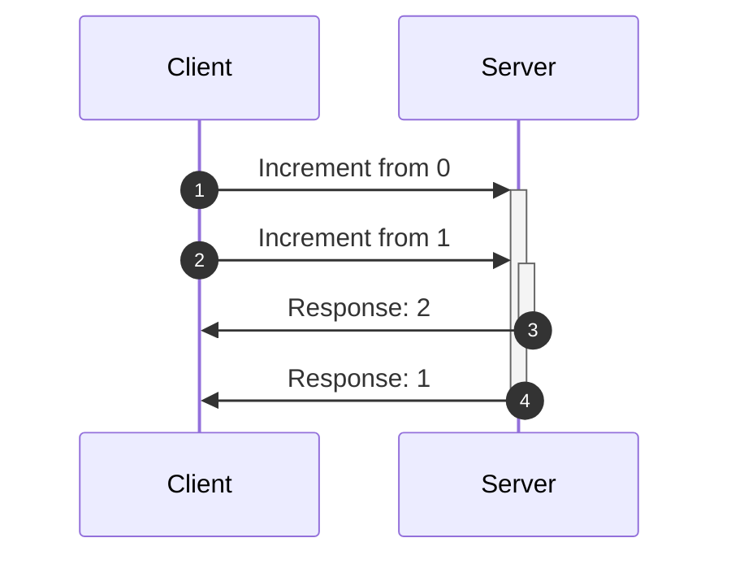
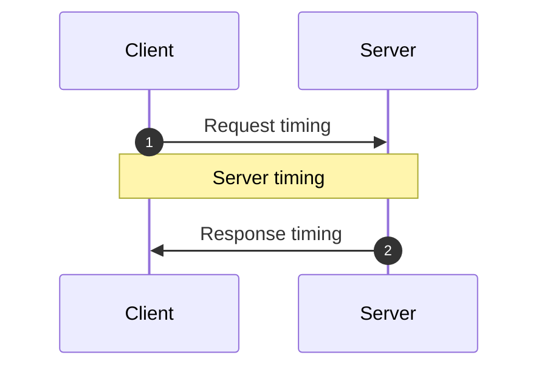

<head>
  <meta name="docsearch:pagerank" content="40"/>
</head>

import FrameworkPlayground from '@site/src/components/FrameworkPlayground';
import {RestEndpoint} from '@data-client/rest';
import { todoFixtures } from '@site/src/fixtures/todos';
import OptimisticTransform from '../shared/\_optimisticTransform.mdx';

# Atualizações otimistas

As atualizações otimistas permitem interfaces muito responsivas e rápidas ao evitar os tempos de espera da rede.
Uma atualização é otimista por presumir que a rede terá sucesso.

Fazer isso amplifica e cria novas race conditions; felizmente, o Reactive Data Client
cuida delas automaticamente para você.

## Resources {#resources}

[resource()](../api/resource.md) pode ser configurado definindo [optimistic: true](../api/resource.md#optimistic).

<FrameworkPlayground defaultOpen="n" row fixtures={todoFixtures}>

```ts title="TodoResource" {16}
import { Entity, resource } from '@data-client/rest';

export class Todo extends Entity {
  id = 0;
  userId = 0;
  title = '';
  completed = false;

  static key = 'Todo';
}
export const TodoResource = resource({
  urlPrefix: 'https://jsonplaceholder.typicode.com',
  path: '/todos/:id',
  searchParams: {} as { userId?: string | number } | undefined,
  schema: Todo,
  optimistic: true,
});
```

:::react

```tsx title="TodoItem" collapsed
import { useController } from '@data-client/react';
import { TodoResource, type Todo } from './TodoResource';

export default function TodoItem({ todo }: { todo: Todo }) {
  const ctrl = useController();
  const handleChange = e =>
    ctrl.fetch(
      TodoResource.partialUpdate,
      { id: todo.id },
      { completed: e.currentTarget.checked },
    );
  const handleDelete = () =>
    ctrl.fetch(TodoResource.delete, {
      id: todo.id,
    });
  return (
    <div className="listItem nogap">
      <label>
        <input
          type="checkbox"
          checked={todo.completed}
          onChange={handleChange}
        />
        {todo.completed ? <s>{todo.title}</s> : todo.title}
      </label>
      <CancelButton onClick={handleDelete} />
    </div>
  );
}
```

```tsx title="CreateTodo" collapsed
import { useController } from '@data-client/react';
import { TodoResource } from './TodoResource';

export default function CreateTodo({ userId }: { userId: number }) {
  const ctrl = useController();
  const handleKeyDown = async e => {
    if (e.key === 'Enter') {
      ctrl.fetch(TodoResource.getList.push, {
        userId,
        title: e.currentTarget.value,
      });
      e.currentTarget.value = '';
    }
  };
  return (
    <div className="listItem nogap">
      <label>
        <input type="checkbox" name="new" checked={false} disabled />
        <TextInput size="small" onKeyDown={handleKeyDown} />
      </label>
      <CancelButton />
    </div>
  );
}
```

```tsx title="TodoList" collapsed
import { useSuspense } from '@data-client/react';
import { TodoResource } from './TodoResource';
import TodoItem from './TodoItem';
import CreateTodo from './CreateTodo';

function TodoList() {
  const userId = 1;
  const todos = useSuspense(TodoResource.getList, { userId });
  return (
    <div>
      {todos.map(todo => (
        <TodoItem key={todo.pk()} todo={todo} />
      ))}
      <CreateTodo userId={userId} />
    </div>
  );
}
render(<TodoList />);
```

:::

:::vue

```html title="TodoItem.vue" collapsed
<script setup lang="ts">
  import { useController } from '@data-client/vue';
  import { TodoResource, type Todo } from './TodoResource';

  const props = defineProps<{ todo: Todo }>();
  const ctrl = useController();
  const handleChange = e =>
    ctrl.fetch(
      TodoResource.partialUpdate,
      { id: props.todo.id },
      { completed: e.currentTarget.checked },
    );
  const handleDelete = () =>
    ctrl.fetch(TodoResource.delete, {
      id: props.todo.id,
    });
</script>

<template>
  <div class="listItem nogap">
    <label>
      <input type="checkbox" :checked="todo.completed" @change="handleChange" />
      <s v-if="todo.completed">{{ todo.title }}</s>
      <template v-else>{{ todo.title }}</template>
    </label>
    <CancelButton @click="handleDelete" />
  </div>
</template>
```

```html title="CreateTodo.vue" collapsed
<script setup lang="ts">
  import { useController } from '@data-client/vue';
  import { TodoResource } from './TodoResource';

  const props = defineProps<{ userId: number }>();
  const ctrl = useController();
  const handleKeyDown = async e => {
    if (e.key === 'Enter') {
      ctrl.fetch(TodoResource.getList.push, {
        userId: props.userId,
        title: e.currentTarget.value,
      });
      e.currentTarget.value = '';
    }
  };
</script>

<template>
  <div class="listItem nogap">
    <label>
      <input type="checkbox" name="new" :checked="false" disabled />
      <TextInput size="small" @keydown="handleKeyDown" />
    </label>
    <CancelButton />
  </div>
</template>
```

```html title="TodoList.vue" collapsed
<script setup lang="ts">
  import { useSuspense } from '@data-client/vue';
  import { TodoResource } from './TodoResource';
  import TodoItem from './TodoItem.vue';
  import CreateTodo from './CreateTodo.vue';

  const userId = 1;
  const todos = await useSuspense(TodoResource.getList, { userId });
</script>

<template>
  <div>
    <TodoItem v-for="todo in todos" :key="todo.pk()" :todo="todo" />
    <CreateTodo :userId="userId" />
  </div>
</template>
```

:::

</FrameworkPlayground>

Isso torna todas as mutações otimistas usando algumas implementações padrão sensatas que cobrem a maioria dos casos.

### update/getList.push/getList.unshift {#updategetlistpushgetlistunshift}

```ts
function optimisticUpdate(
  snap: SnapshotInterface,
  params: any,
  body: any,
) {
  return {
    ...params,
    ...ensureBodyPojo(body),
  };
}

function ensureBodyPojo(body: any) {
  return body instanceof FormData
    ? Object.fromEntries((body as any).entries())
    : body;
}
```

Em criações (push/unshift), isso normalmente resulta em nenhum `id` na resposta para calcular uma pk.
O <abbr title="Reactive Data Client">Data Client</abbr> criará uma `pk` aleatória para fazer isso funcionar.

Até que o objeto seja de fato criado, fazer mutações nesse objeto geralmente não funciona.
Por isso, pode ser prudente nesses casos desabilitar novas mutações até que o
`POST` real seja concluído. Uma maneira de determinar isso é simplesmente verificar a existência de
um `id` real na entity.

### partialUpdate {#partialupdate}

```ts
function optimisticPartial(schema: Queryable) {
  return function (snap: SnapshotInterface, params: any, body: any) {
    const data = snap.get(schema, params);
    if (!data) throw snap.abort;
    return {
      ...params,
      ...data,
      // even tho we don't always have two arguments, the extra one will simply be undefined which spreads fine
      ...ensurePojo(body),
    };
  };
}
```

Atualizações parciais não enviam o corpo inteiro, então podemos usar a entity do
store para calcular a resposta esperada. Os [Snapshots](/docs/api/Snapshot)
nos dão acesso seguro ao valor existente no store, de forma robusta contra quaisquer
race conditions.

### delete {#delete}

```ts
function optimisticDelete(snap: SnapshotInterface, params: any) {
  return params;
}
```

Caso você não queira que todos os endpoints sejam otimistas, ou se tiver designs de API incomuns,
pode definir [getOptimisticResponse()](../api/RestEndpoint.md#getoptimisticresponse) usando
[Resource.extend()](../api/resource.md#extend)

## Transformações otimistas {#optimistic-transforms}

Às vezes, ações do usuário devem resultar em transformações de dados que dependem do estado anterior dos dados.
Os exemplos mais simples disso são alternar um booleano ou incrementar um contador; mas o mesmo princípio vale para
transformações mais complicadas. Para deixar isso mais evidente, usamos aqui um contador simples.

<OptimisticTransform />

O Reactive Data Client trata automaticamente todas as race conditions causadas pelos tempos de rede. Ele acompanha
os tempos dos fetches, associa as respostas à respectiva atualização otimista e faz rollback em caso de resolução ou
rejeição/falha.

Você pode ver como isso é problemático para outras bibliotecas mesmo sem atualizações otimistas;
mas as atualizações otimistas pioram ainda mais a situação.

### Exemplo de race condition {#example-race-condition}

Eis um exemplo da race condition. Aqui solicitamos um incremento duas vezes, mas a primeira resposta volta para o
cliente depois da segunda.



Com outras bibliotecas e sem atualizações otimistas, isso resultaria em exibir 0, depois 2, depois 1.

Se a outra biblioteca tiver atualizações otimistas, ela exibiria 0, 1, 2, 2 e depois 1.

Nos dois casos acabamos exibindo um estado incorreto e, pelo caminho, vemos atualizações de estado estranhas e travadas.

### Compensando variações de tempo do servidor {#server-timings}



Existem três tempos que podem variar em uma mutação assíncrona.

1. Tempo da requisição
1. Tempo do servidor
1. Tempo da resposta

O Reactive Data Client consegue lidar automaticamente com os tempos de rede, ou seja, o tempo da requisição e o da resposta. Normalmente isso
é suficiente, pois os servidores tendem a processar primeiro as requisições recebidas antes. No entanto, caso a ordem de persistência
varie em relação à ordem das requisições no servidor, isso pode causar outra race condition.

Isso pode ser resolvido mantendo uma [ordem total](https://en.wikipedia.org/wiki/Total_order). Como
servidores e clientes podem ter horários diferentes, precisamos acompanhar o tempo a partir de uma perspectiva consistente.
Como estamos fazendo atualizações otimistas, isso significa que devemos usar o relógio do cliente. Isso quer dizer que enviaremos o tempo
da requisição ao servidor em um header `updatedAt` por meio de [getRequestInit()](../api/RestEndpoint.md#getRequestInit). O servidor deve então garantir o processamento com base nessa ordem e
armazenar esse `updatedAt` na entity para retorná-lo em qualquer requisição.

Sobrescrevendo [shouldReorder](../api/Entity.md#shouldreorder), podemos reordenar respostas fora de ordem com base no
timestamp do servidor.

Usamos [snap.fetchedAt](/docs/api/Snapshot#fetchedat) em nosso [getOptimisticResponse](../api/RestEndpoint.md#getoptimisticresponse). Ele representa o momento em que o fetch é disparado, que será o mesmo momento em que o header `updatedAt` é calculado.

<FrameworkPlayground fixtures={[
{
endpoint: new RestEndpoint({path: '/api/count'}),
args: [],
response: { count: 0, updatedAt: Date.now() }
},
{
endpoint: new RestEndpoint({
path: '/api/count/increment',
method: 'POST',
body: undefined,
}),
fetchResponse(input, init) {
return ({
"count": (this.count = this.count + 1),
"updatedAt": JSON.parse(init.body).updatedAt,
});
},
delay: () => 200 + Math.random() * 4500,
delayCollapse:true,
}
]}
getInitialInterceptorData={() => ({ count: 0 })}
row
>

```ts title="count" {11-13} collapsed
import { Entity, RestEndpoint } from '@data-client/rest';

export class CountEntity extends Entity {
  count = 0;
  updatedAt = 0;

  pk() {
    return `SINGLETON`;
  }

  static shouldReorder(existingMeta, incomingMeta, existing, incoming) {
    return incoming.updatedAt < existing.updatedAt;
  }
}
export const getCount = new RestEndpoint({
  path: '/api/count',
  schema: CountEntity,
  name: 'get',
});
```

```ts title="increment" {10-16,22}
import { RestEndpoint } from '@data-client/rest';
import { CountEntity } from './count';

export const increment = new RestEndpoint({
  path: '/api/count/increment',
  method: 'POST',
  body: undefined,
  name: 'increment',
  schema: CountEntity,
  getRequestInit() {
    // this is a substitute for super.getRequestInit()
    // since we aren't in a class context
    return RestEndpoint.prototype.getRequestInit.call(this, {
      updatedAt: Date.now(),
    });
  },
  getOptimisticResponse(snap) {
    const data = snap.get(CountEntity, {});
    if (!data) throw snap.abort;
    return {
      count: data.count + 1,
      updatedAt: snap.fetchedAt,
    };
  },
});
```

:::react

```tsx title="CounterPage" collapsed
import React from 'react';
import { useController, useSuspense, useLoading } from '@data-client/react';
import { getCount } from './count';
import { increment } from './increment';

function CounterPage() {
  const ctrl = useController();
  const { count } = useSuspense(getCount);
  const [n, setN] = React.useState(count);
  const [clickHandler, loading, error] = useLoading(() => {
    setN(n => n + 1);
    return ctrl.fetch(increment);
  });
  return (
    <div>
      <p>
        Click the button multiple times quickly to trigger the
        potential race condition. This time our vector clock protects
        us.
      </p>
      <div>
        Data Client: {count} Should be: {n}
        <br />
        <button onClick={clickHandler}>+</button>
        {loading ? ' ...loading' : ''}
      </div>
    </div>
  );
}
render(<CounterPage />);
```

:::

:::vue

```html title="CounterPage.vue" collapsed
<script setup lang="ts">
  import { ref } from 'vue';
  import { useController, useSuspense, useLoading } from '@data-client/vue';
  import { getCount } from './count';
  import { increment } from './increment';

  const ctrl = useController();
  const data = await useSuspense(getCount);
  const n = ref(data.value.count);
  const [clickHandler, loading, error] = useLoading(() => {
    n.value += 1;
    return ctrl.fetch(increment);
  });
</script>

<template>
  <div>
    <p>
      Click the button multiple times quickly to trigger the
      potential race condition. This time our vector clock protects
      us.
    </p>
    <div>
      Data Client: {{ data.count }} Should be: {{ n }}
      <br />
      <button @click="clickHandler">+</button>
      {{ loading ? ' ...loading' : '' }}
    </div>
  </div>
</template>
```

:::

</FrameworkPlayground>
