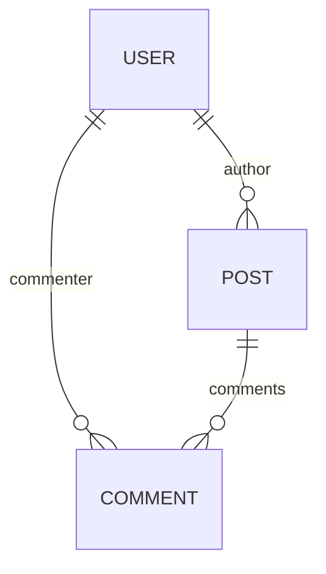

import FrameworkPlayground from '@site/src/components/FrameworkPlayground';
import { Collection, RestEndpoint } from '@data-client/rest';
import StackBlitz from '@site/src/components/StackBlitz';

# Dados relacionais

O Reactive Data Client lida com relacionamentos um-para-um, muitos-para-um e muitos-para-muitos em [entities][1]
usando [Entity.schema][3]

## Aninhamento {#nesting}

Os membros aninhados são extraídos (hoisted) durante a normalização quando [Entity.schema][3] é definido.
Eles são então reunidos novamente durante a desnormalização

<details>
<summary><b>Diagrama</b></summary>

<div style={{float:'left'}}>



</div>
<div style={{clear: 'both'}}>&nbsp;</div>
</details>

<FrameworkPlayground groupId="schema" defaultOpen="y" fixtures={[
{
endpoint: new RestEndpoint({ path: '/posts' }),
response: [
{
"id": "1",
"title": "My first post!",
"author": {
"id": "123",
"name": "Paul"
},
"comments": [
{
"id": "249",
"content": "Nice post!",
"commenter": {
"id": "245",
"name": "Jane"
}
},
{
"id": "250",
"content": "Thanks!",
"commenter": {
"id": "123",
"name": "Paul"
}
}
]
},
{
"id": "2",
"title": "This other post",
"author": {
"id": "123",
"name": "Paul"
},
"comments": [
{
"id": "251",
"content": "Your other post was nicer",
"commenter": {
"id": "245",
"name": "Jane"
}
},
{
"id": "252",
"content": "I am a spammer!",
"commenter": {
"id": "246",
"name": "Spambot5000"
}
}
]
}
],
delay: 150,
},
]}>

```typescript title="resources/Post"
import { Collection, Entity, resource } from '@data-client/rest';

export class User extends Entity {
  id = '';
  name = '';
}

export class Comment extends Entity {
  id = '';
  content = '';
  commenter = User.fromJS();

  static schema = {
    commenter: User,
  };
}

export class Post extends Entity {
  id = '';
  title = '';
  author = User.fromJS();
  comments: Comment[] = [];

  static schema = {
    author: User,
    comments: new Collection([Comment], {
      nestKey: (parent, key) => ({
        postId: parent.id,
      }),
    }),
  };
}

export const PostResource = resource({
  path: '/posts/:id',
  schema: Post,
});
```

:::react

```tsx title="PostPage" collapsed
import { useSuspense } from '@data-client/react';
import { PostResource } from './resources/Post';

function PostPage() {
  const posts = useSuspense(PostResource.getList);
  return (
    <div>
      {posts.map(post => (
        <div key={post.pk()}>
          <h4>
            {post.title} - <cite>{post.author.name}</cite>
          </h4>
          <ul>
            {post.comments.map(comment => (
              <li key={comment.pk()}>
                {comment.content}{' '}
                <small>
                  <cite>
                    {comment.commenter.name}
                    {comment.commenter === post.author ? ' [OP]' : ''}
                  </cite>
                </small>
              </li>
            ))}
          </ul>
        </div>
      ))}
    </div>
  );
}
render(<PostPage />);
```

:::

:::vue

```html title="PostPage.vue" collapsed
<script setup lang="ts">
  import { useSuspense } from '@data-client/vue';
  import { PostResource } from './resources/Post';

  const posts = await useSuspense(PostResource.getList);
</script>

<template>
  <div>
    <div v-for="post in posts" :key="post.pk()">
      <h4>{{ post.title }} - <cite>{{ post.author.name }}</cite></h4>
      <ul>
        <li v-for="comment in post.comments" :key="comment.pk()">
          {{ comment.content }}
          <small>
            <cite>
              {{ comment.commenter.name }}{{ comment.commenter ===
              post.author ? ' [OP]' : '' }}
            </cite>
          </small>
        </li>
      </ul>
    </div>
  </div>
</template>
```

:::

</FrameworkPlayground>

## Joins no lado do cliente {#client-side-joins}

Aninhando dados quando o seu endpoint não aninha.

Mesmo que as respostas da rede não aninhem os dados, podemos realizar joins no lado do cliente especificando
o relacionamento em [Entity.schema](../api/Entity.md#schema)

<FrameworkPlayground>

```ts title="resources/User" collapsed
import { Entity, resource } from '@data-client/rest';

export class User extends Entity {
  id = 0;
  username = '';
  name = '';
  email = '';
  website = '';
}
export const UserResource = resource({
  urlPrefix: 'https://jsonplaceholder.typicode.com',
  path: '/users/:id',
  schema: User,
});
```

```ts title="resources/Todo"
import { Entity, resource } from '@data-client/rest';
import { User } from './User';

export class Todo extends Entity {
  id = 0;
  userId = 0;
  user? = User.fromJS();
  title = '';
  completed = false;
  static schema = {
    user: User,
  };
  static process(todo) {
    return { ...todo, user: todo.userId };
  }
}
export const TodoResource = resource({
  urlPrefix: 'https://jsonplaceholder.typicode.com',
  path: '/todos/:id',
  schema: Todo,
});
```

:::react

```tsx title="TodoJoined" collapsed
import { useFetch, useSuspense } from '@data-client/react';
import { TodoResource } from './resources/Todo';
import { UserResource } from './resources/User';

function TodosPage() {
  useFetch(UserResource.getList);
  const todos = useSuspense(TodoResource.getList);
  return (
    <div>
      {todos.slice(17, 24).map(todo => (
        <div key={todo.pk()}>
          {todo.title} by <small>{todo.user?.name}</small>
        </div>
      ))}
    </div>
  );
}
render(<TodosPage />);
```

:::

:::vue

```html title="TodoJoined.vue" collapsed
<script setup lang="ts">
  import { useFetch, useSuspense } from '@data-client/vue';
  import { TodoResource } from './resources/Todo';
  import { UserResource } from './resources/User';

  useFetch(UserResource.getList);
  const todos = await useSuspense(TodoResource.getList);
</script>

<template>
  <div>
    <div v-for="todo in todos.slice(17, 24)" :key="todo.pk()">
      {{ todo.title }} by <small>{{ todo.user?.name }}</small>
    </div>
  </div>
</template>
```

:::

</FrameworkPlayground>

### Joins baseados em chave {#key-based-joins}

Para cenários mais complexos em que as entities relacionadas são buscadas separadamente, use [Entity.process()](/rest/api/Entity#process)
para criar uma chave de referência que aponte para outra Entity. Isso é útil quando:

- Os dados relacionados vêm de endpoints de API diferentes
- Você quer evitar buscar dados aninhados em excesso
- O relacionamento é opcional ou varia conforme o contexto

```typescript
import { Entity, resource } from '@data-client/rest';

class Stats extends Entity {
  product_id = '';
  volume = 0;
  price = 0;

  pk() {
    return this.product_id;
  }

  static key = 'Stats';
}

class Currency extends Entity {
  id = '';
  name = '';
  // Default value allows Currency to exist without Stats loaded
  stats = Stats.fromJS();

  pk() {
    return this.id;
  }

  static key = 'Currency';

  // Create a reference key that links to Stats entity
  static process(input: any, parent: any, key: string, args: any[]) {
    // The stats field becomes a reference to Stats with pk `${id}-USD`
    return { ...input, stats: `${input.id}-USD` };
  }

  static schema = {
    // Stats will be looked up by the key from process()
    stats: Stats,
  };
}
```

Quando `CurrencyResource.getList` e `StatsResource.getList` são ambos buscados, o campo `stats`
será resolvido automaticamente para a entity `Stats` correspondente.

### Exemplo de preço de criptomoedas {#crypto-price-example}

Aqui queremos ordenar `Currencies` pelo volume de negociação. No entanto, o volume de negociação só está disponível na Entity
`Stats`. Embora o fetch de `CurrencyResource.getList` não inclua `Stats` na resposta, podemos adicionalmente
chamar `StatsResource.getList`, adicionando-o ao `Currency's` [Entity.schema](../api/Entity.md#schema), o que permite
incluir `Stats` na Entity `Currency` e, assim, ordenar com:

```ts
entries.sort((a, b) => {
  return b?.stats?.volume_usd - a?.stats?.volume_usd;
});
```

<StackBlitz app="coin-app" file="src/pages/Home/CurrencyList.tsx,src/resources/Stats.ts,src/resources/Currency.ts" height="700" view="editor" />

## Buscas reversas {#reverse-lookups}

Aninhando dados quando o seu endpoint não aninha (parte 2).

Mesmo que uma resposta aninhe os dados em apenas uma direção, o Reactive Data Client consegue lidar com relacionamentos reversos
sobrescrevendo [Entity.process](../api/Entity.md#process). Além disso, pode ser necessário sobrescrever [Entity.merge](../api/Entity.md#merge)
para garantir o merge profundo desses campos esperados.

Isso permite percorrer o relacionamento após processar apenas uma requisição de fetch, em vez de precisar buscar
toda vez que você quiser acessar uma visão diferente.

<FrameworkPlayground groupId="schema" defaultOpen="y" fixtures={[
{
endpoint: new RestEndpoint({ path: '/posts' }),
response: [
{
"id": "1",
"title": "My first post!",
"author": {
"id": "123",
"name": "Paul"
},
"comments": [
{
"id": "249",
"content": "Nice post!",
"commenter": {
"id": "245",
"name": "Jane"
}
},
{
"id": "250",
"content": "Thanks!",
"commenter": {
"id": "123",
"name": "Paul"
}
}
]
},
{
"id": "2",
"title": "This other post",
"author": {
"id": "123",
"name": "Paul"
},
"comments": [
{
"id": "251",
"content": "Your other post was nicer",
"commenter": {
"id": "245",
"name": "Jane"
}
},
{
"id": "252",
"content": "I am a spammer!",
"commenter": {
"id": "246",
"name": "Spambot5000"
}
}
]
}
],
delay: 150,
},
]}>

```typescript title="resources/Post"
import { Entity, resource, type Schema } from '@data-client/rest';

export class User extends Entity {
  id = '';
  name = '';
  posts: Post[] = [];
  comments: Comment[] = [];

  static merge(existing, incoming) {
    return {
      ...existing,
      ...incoming,
      posts: [...(existing.posts || []), ...(incoming.posts || [])],
      comments: [
        ...(existing.comments || []),
        ...(incoming.comments || []),
      ],
    };
  }

  static process(value, parent, key) {
    switch (key) {
      case 'author':
        return { ...value, posts: [parent.id] };
      case 'commenter':
        return { ...value, comments: [parent.id] };
      default:
        return { ...value };
    }
  }
}

export class Comment extends Entity {
  id = '';
  content = '';
  commenter = User.fromJS();
  post = Post.fromJS();

  static schema: Record<string, Schema> = {
    commenter: User,
  };
  static process(value, parent, key) {
    return { ...value, post: parent.id };
  }
}

export class Post extends Entity {
  id = '';
  title = '';
  author = User.fromJS();
  comments: Comment[] = [];

  static schema = {
    author: User,
    comments: [Comment],
  };
}

// with cirucular dependencies we must set schema after they are all defined
User.schema = {
  posts: [Post],
  comments: [Comment],
};
Comment.schema = {
  ...Comment.schema,
  post: Post,
};

export const PostResource = resource({
  path: '/posts/:id',
  schema: Post,
  dataExpiryLength: Infinity,
});
export const UserResource = resource({
  path: '/users/:id',
  schema: User,
});
```

:::react

```tsx title="UserPage" collapsed
import { useSuspense } from '@data-client/react';
import { UserResource } from './resources/Post';

export default function UserPage({ setRoute, id }) {
  const user = useSuspense(UserResource.get, { id });
  return (
    <div>
      <h4>
        <a onClick={() => setRoute('page')} style={{ cursor: 'pointer' }}>
          &lt;
        </a>{' '}
        {user.name}
      </h4>
      {user.posts.length ? (
        <>
          <h5>Posts</h5>
          <ul>
            {user.posts.map(post => (
              <li>{post.title}</li>
            ))}
          </ul>
        </>
      ) : null}
      <h5>Comments</h5>
      <ul>
        {user.comments.map(comment => (
          <li>{comment.content}</li>
        ))}
      </ul>
    </div>
  );
}
```

```tsx title="PostPage" collapsed
import { useSuspense } from '@data-client/react';
import { PostResource } from './resources/Post';

export default function PostPage({ setRoute }) {
  const posts = useSuspense(PostResource.getList);
  return (
    <div>
      {posts.map(post => (
        <div key={post.pk()}>
          <h4>
            {post.title} -{' '}
            <cite
              onClick={() => setRoute(`user/${post.author.id}`)}
              style={{ cursor: 'pointer', textDecoration: 'underline' }}
            >
              {post.author.name}
            </cite>
          </h4>
          <ul>
            {post.comments.map(comment => (
              <li key={comment.pk()}>
                {comment.content}{' '}
                <small>
                  <cite
                    onClick={() =>
                      setRoute(`user/${comment.commenter.id}`)
                    }
                    style={{
                      cursor: 'pointer',
                      textDecoration: 'underline',
                    }}
                  >
                    {comment.commenter.name}
                    {comment.commenter === post.author ? ' [OP]' : ''}
                  </cite>
                </small>
              </li>
            ))}
          </ul>
        </div>
      ))}
    </div>
  );
}
```

```tsx title="Navigation" collapsed
import React from 'react';
import PostPage from './PostPage';
import UserPage from './UserPage';

function Navigation() {
  const [route, setRoute] = React.useState('posts');
  if (route.startsWith('user'))
    return <UserPage setRoute={setRoute} id={route.split('/')[1]} />;

  return <PostPage setRoute={setRoute} />;
}
render(<Navigation />);
```

:::

:::vue

```html title="UserPage.vue" collapsed
<script setup lang="ts">
  import { useSuspense } from '@data-client/vue';
  import { UserResource } from './resources/Post';

  const props = defineProps<{ id: string }>();
  const emit = defineEmits<{ setRoute: [route: string] }>();
  const user = await useSuspense(UserResource.get, () => ({
    id: props.id,
  }));
</script>

<template>
  <div>
    <h4>
      <a @click="emit('setRoute', 'page')" style="cursor: pointer">&lt;</a>
      {{ user.name }}
    </h4>
    <template v-if="user.posts.length">
      <h5>Posts</h5>
      <ul>
        <li v-for="post in user.posts" :key="post.pk()">
          {{ post.title }}
        </li>
      </ul>
    </template>
    <h5>Comments</h5>
    <ul>
      <li v-for="comment in user.comments" :key="comment.pk()">
        {{ comment.content }}
      </li>
    </ul>
  </div>
</template>
```

```html title="PostPage.vue" collapsed
<script setup lang="ts">
  import { useSuspense } from '@data-client/vue';
  import { PostResource } from './resources/Post';

  const emit = defineEmits<{ setRoute: [route: string] }>();
  const posts = await useSuspense(PostResource.getList);
</script>

<template>
  <div>
    <div v-for="post in posts" :key="post.pk()">
      <h4>
        {{ post.title }} -
        <cite
          @click="emit('setRoute', `user/${post.author.id}`)"
          style="cursor: pointer; text-decoration: underline"
        >
          {{ post.author.name }}
        </cite>
      </h4>
      <ul>
        <li v-for="comment in post.comments" :key="comment.pk()">
          {{ comment.content }}
          <small>
            <cite
              @click="emit('setRoute', `user/${comment.commenter.id}`)"
              style="cursor: pointer; text-decoration: underline"
            >
              {{ comment.commenter.name }}{{ comment.commenter ===
              post.author ? ' [OP]' : '' }}
            </cite>
          </small>
        </li>
      </ul>
    </div>
  </div>
</template>
```

```html title="Navigation.vue" collapsed
<script setup lang="ts">
  import { ref } from 'vue';
  import PostPage from './PostPage.vue';
  import UserPage from './UserPage.vue';

  const route = ref('posts');
</script>

<template>
  <UserPage
    v-if="route.startsWith('user')"
    :id="route.split('/')[1]"
    @setRoute="route = $event"
  />
  <PostPage v-else @setRoute="route = $event" />
</template>
```

:::

</FrameworkPlayground>

### Dependências circulares {#circular-dependencies}

Como imports circulares e definições circulares de classes não são permitidos, às vezes
será necessário definir o [schema][3] depois da definição das [Entities][1].

```typescript title="resources/Post"
import { Collection, Entity } from '@data-client/rest';
import { User } from './User';

export class Post extends Entity {
  id = '';
  title = '';
  author = User.fromJS();

  static schema = {
    author: User,
  };
}

// both User and Post are now defined, so it's okay to refer to both of them
// highlight-start
User.schema = {
  // ensure we keep the 'createdAt' member
  ...User.schema,
  posts: [Post],
};
// highlight-end
```

```typescript title="resources/User"
import { Collection, Entity } from '@data-client/rest';
import type { Post } from './Post';
// we can only import the type else we break javascript imports
// thus we change the schema of UserResource above

export class User extends Entity {
  id = '';
  name = '';
  posts: Post[] = [];
  createdAt = Temporal.Instant.fromEpochMilliseconds(0);

  static schema: Record<string, Schema | Date> = {
    createdAt: Temporal.Instant.from,
  };
}
```

:::tip

Para relacionamentos bidirecionais que não precisam de desnormalização antecipada,
[Lazy](../api/Lazy.md) adia a resolução e permite resolvê-la sob demanda
por meio de [useQuery](/docs/api/useQuery), evitando recursão profunda e melhorando
o isolamento da memoização.

:::

[1]: ../api/Entity.md
[2]: /docs/api/useCache
[3]: ../api/Entity.md#schema
