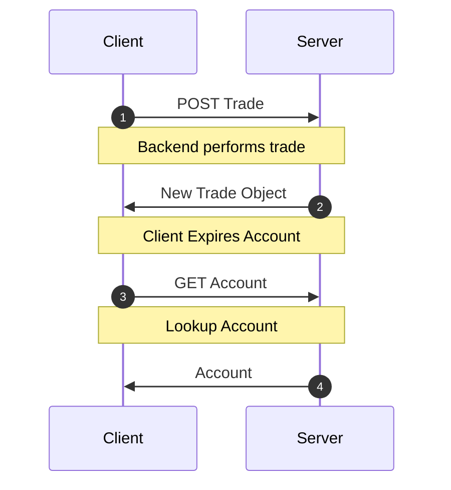
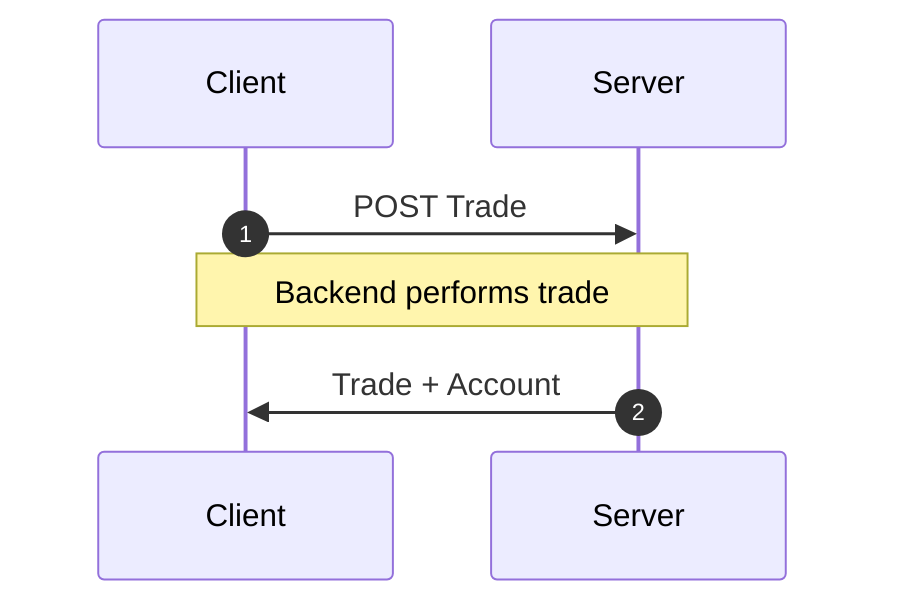

Quando mutações atualizam mais de um resource, pode ser tentador simplesmente
[expirar todos](/docs/api/Controller#expireAll) os outros resources.

No entanto, ainda podemos obter mutações atômicas de alto desempenho se
simplesmente agruparmos _todos_ os resources atualizados na resposta da mutação, evitando
essa lenta cascata de requisições de rede.

<div style={{display: 'grid', gridTemplateColumns: '1fr 1fr', columnGap: '15px'}}>

<div>
<h4 style={{textAlign: 'center'}}>Cascata de rede</h4>



</div>
<div>
<h4 style={{textAlign: 'center'}}> Agrupamento de resposta</h4>



</div>

</div>

## Exemplo {#example}

Você administra uma plataforma de negociação de criptomoedas chamada `dogebase`. Toda vez que
um usuário cria uma negociação, você precisa atualizar algumas informações de saldo
no objeto de contas dele. Assim, ao fazer `POST` no endpoint `/trade/`,
você aninha tanto o objeto de contas atualizado quanto a negociação que acabou de
ser criada.

```json title="POST /trade/"
{
  "trade": {
    "id": 2893232,
    "user": 1,
    "amount": "50.2335324",
    "coin": "doge",
    "created_at": ""
  },
  "account": {
    "id": 899,
    "user": 1,
    "balance": "1337.00",
    "coin_value": "3.50"
  }
}
```

Para lidar com isso, basta atualizar o `schema` para incluir o endpoint
personalizado.

```typescript title="resources/Trade.ts"
import { resource, Entity } from '@data-client/rest';
import { Account } from './Account';

export class Trade extends Entity {
  id = 0;
  user = 0;
  amount = '0';
  coin = '';
  created_at = '';
}

export const TradeResource = resource({
  path: '/trade/:id',
  schema: Trade,
}).extend(Base => ({
  create: Base.getList.push.extend({
    schema: {
      trade: Base.getList.push.schema,
      account: Account,
    },
  }),
}));
```

Agora, ao usarmos o método gerador de Endpoint [getList.push](../api/resource.md#push),
podemos ficar tranquilos sabendo que tanto as informações da negociação quanto as da conta
serão atualizadas no cache assim que a requisição `POST` for concluída.

:::react

```typescript title="CreateTrade.tsx"
export default function CreateTrade() {
  const ctrl = useController();
  const handleSubmit = payload =>
    ctrl.fetch(TradeResource.create, payload);
  //...
}
```

:::

:::vue

```html title="CreateTrade.vue"
<script setup lang="ts">
  import { useController } from '@data-client/vue';
  import { TradeResource } from './resources/Trade';

  const ctrl = useController();
  const handleSubmit = payload =>
    ctrl.fetch(TradeResource.create, payload);
  //...
</script>
```

:::

:::note

Sinta-se à vontade para criar métodos de [RestEndpoint](../api/RestEndpoint.md) completamente novos para quaisquer
endpoints personalizados que você tenha. Esse endpoint diz ao `Reactive Data Client` como processar qualquer
requisição.

:::
