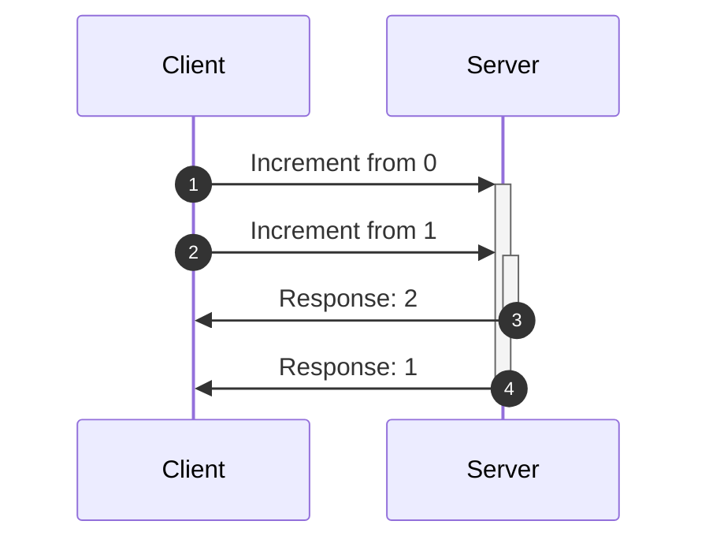
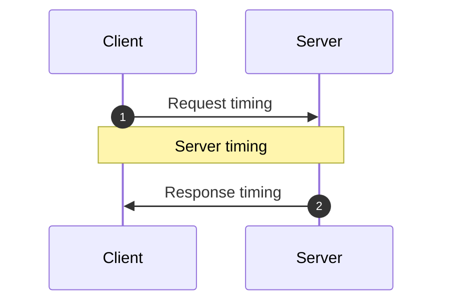

<head>
  <meta name="docsearch:pagerank" content="40"/>
</head>

import FrameworkPlayground from '@site/src/components/FrameworkPlayground';
import {RestEndpoint} from '@data-client/rest';
import { todoFixtures } from '@site/src/fixtures/todos';
import OptimisticTransform from '../shared/\_optimisticTransform.mdx';

# 乐观更新

乐观更新通过避免等待网络，实现响应迅速、速度飞快的界面。
所谓乐观，是指更新时假定网络请求会成功。

这样做会放大已有的竞态条件并带来新的竞态条件；幸运的是，Reactive Data Client 会自动
为你处理它们。

## Resources {#resources}

可以通过设置 [optimistic: true](../api/resource.md#optimistic) 来配置 [resource()](../api/resource.md)。

<FrameworkPlayground defaultOpen="n" row fixtures={todoFixtures}>

```ts title="TodoResource" {16}
import { Entity, resource } from '@data-client/rest';

export class Todo extends Entity {
  id = 0;
  userId = 0;
  title = '';
  completed = false;

  static key = 'Todo';
}
export const TodoResource = resource({
  urlPrefix: 'https://jsonplaceholder.typicode.com',
  path: '/todos/:id',
  searchParams: {} as { userId?: string | number } | undefined,
  schema: Todo,
  optimistic: true,
});
```

:::react

```tsx title="TodoItem" collapsed
import { useController } from '@data-client/react';
import { TodoResource, type Todo } from './TodoResource';

export default function TodoItem({ todo }: { todo: Todo }) {
  const ctrl = useController();
  const handleChange = e =>
    ctrl.fetch(
      TodoResource.partialUpdate,
      { id: todo.id },
      { completed: e.currentTarget.checked },
    );
  const handleDelete = () =>
    ctrl.fetch(TodoResource.delete, {
      id: todo.id,
    });
  return (
    <div className="listItem nogap">
      <label>
        <input
          type="checkbox"
          checked={todo.completed}
          onChange={handleChange}
        />
        {todo.completed ? <s>{todo.title}</s> : todo.title}
      </label>
      <CancelButton onClick={handleDelete} />
    </div>
  );
}
```

```tsx title="CreateTodo" collapsed
import { useController } from '@data-client/react';
import { TodoResource } from './TodoResource';

export default function CreateTodo({ userId }: { userId: number }) {
  const ctrl = useController();
  const handleKeyDown = async e => {
    if (e.key === 'Enter') {
      ctrl.fetch(TodoResource.getList.push, {
        userId,
        title: e.currentTarget.value,
      });
      e.currentTarget.value = '';
    }
  };
  return (
    <div className="listItem nogap">
      <label>
        <input type="checkbox" name="new" checked={false} disabled />
        <TextInput size="small" onKeyDown={handleKeyDown} />
      </label>
      <CancelButton />
    </div>
  );
}
```

```tsx title="TodoList" collapsed
import { useSuspense } from '@data-client/react';
import { TodoResource } from './TodoResource';
import TodoItem from './TodoItem';
import CreateTodo from './CreateTodo';

function TodoList() {
  const userId = 1;
  const todos = useSuspense(TodoResource.getList, { userId });
  return (
    <div>
      {todos.map(todo => (
        <TodoItem key={todo.pk()} todo={todo} />
      ))}
      <CreateTodo userId={userId} />
    </div>
  );
}
render(<TodoList />);
```

:::

:::vue

```html title="TodoItem.vue" collapsed
<script setup lang="ts">
  import { useController } from '@data-client/vue';
  import { TodoResource, type Todo } from './TodoResource';

  const props = defineProps<{ todo: Todo }>();
  const ctrl = useController();
  const handleChange = e =>
    ctrl.fetch(
      TodoResource.partialUpdate,
      { id: props.todo.id },
      { completed: e.currentTarget.checked },
    );
  const handleDelete = () =>
    ctrl.fetch(TodoResource.delete, {
      id: props.todo.id,
    });
</script>

<template>
  <div class="listItem nogap">
    <label>
      <input type="checkbox" :checked="todo.completed" @change="handleChange" />
      <s v-if="todo.completed">{{ todo.title }}</s>
      <template v-else>{{ todo.title }}</template>
    </label>
    <CancelButton @click="handleDelete" />
  </div>
</template>
```

```html title="CreateTodo.vue" collapsed
<script setup lang="ts">
  import { useController } from '@data-client/vue';
  import { TodoResource } from './TodoResource';

  const props = defineProps<{ userId: number }>();
  const ctrl = useController();
  const handleKeyDown = async e => {
    if (e.key === 'Enter') {
      ctrl.fetch(TodoResource.getList.push, {
        userId: props.userId,
        title: e.currentTarget.value,
      });
      e.currentTarget.value = '';
    }
  };
</script>

<template>
  <div class="listItem nogap">
    <label>
      <input type="checkbox" name="new" :checked="false" disabled />
      <TextInput size="small" @keydown="handleKeyDown" />
    </label>
    <CancelButton />
  </div>
</template>
```

```html title="TodoList.vue" collapsed
<script setup lang="ts">
  import { useSuspense } from '@data-client/vue';
  import { TodoResource } from './TodoResource';
  import TodoItem from './TodoItem.vue';
  import CreateTodo from './CreateTodo.vue';

  const userId = 1;
  const todos = await useSuspense(TodoResource.getList, { userId });
</script>

<template>
  <div>
    <TodoItem v-for="todo in todos" :key="todo.pk()" :todo="todo" />
    <CreateTodo :userId="userId" />
  </div>
</template>
```

:::

</FrameworkPlayground>

这会使用一些能处理大多数情况的合理默认实现，让所有变更都变成乐观的。

### update/getList.push/getList.unshift {#updategetlistpushgetlistunshift}

```ts
function optimisticUpdate(
  snap: SnapshotInterface,
  params: any,
  body: any,
) {
  return {
    ...params,
    ...ensureBodyPojo(body),
  };
}

function ensureBodyPojo(body: any) {
  return body instanceof FormData
    ? Object.fromEntries((body as any).entries())
    : body;
}
```

对于创建操作（push/unshift），响应中通常没有可用于计算 pk 的 `id`。
<abbr title="Reactive Data Client">Data Client</abbr> 会创建一个随机的 `pk` 来解决这个问题。

在对象真正创建之前，对它进行变更通常是行不通的。
因此在这种情况下，比较稳妥的做法是在实际的
`POST` 完成之前禁止进一步的变更。一种判断方法是直接检查
该 Entity 中是否存在真实的 `id`。

### partialUpdate {#partialupdate}

```ts
function optimisticPartial(schema: Queryable) {
  return function (snap: SnapshotInterface, params: any, body: any) {
    const data = snap.get(schema, params);
    if (!data) throw snap.abort;
    return {
      ...params,
      ...data,
      // even tho we don't always have two arguments, the extra one will simply be undefined which spreads fine
      ...ensurePojo(body),
    };
  };
}
```

部分更新不会发送完整的 body，因此我们可以使用 store 中的
Entity 来计算预期的响应。[Snapshots](/docs/api/Snapshot)
让我们能够安全地访问 store 中的现有值，并且不受任何
竞态条件的影响。

### delete {#delete}

```ts
function optimisticDelete(snap: SnapshotInterface, params: any) {
  return params;
}
```

如果你不希望所有 endpoint 都是乐观的，或者你的 API 设计比较特殊，
可以通过 [Resource.extend()](../api/resource.md#extend) 设置
[getOptimisticResponse()](../api/RestEndpoint.md#getoptimisticresponse)

## 乐观变换 {#optimistic-transforms}

有时用户操作引起的数据变换依赖于数据之前的状态。
最简单的例子是切换一个布尔值或递增一个计数器；但同样的原则也适用于
更复杂的变换。为了更直观，这里我们使用一个简单的计数器。

<OptimisticTransform />

Reactive Data Client 会自动处理所有由网络时序引起的竞态条件。Reactive Data Client 既会跟踪
请求的时序，也会将响应与对应的乐观更新配对，并在请求 resolve 或
reject/失败时回滚。

你可以看到，即使没有乐观更新，这对其他库来说也是个问题；
而乐观更新会让情况更糟。

### 竞态条件示例 {#example-race-condition}

下面是一个竞态条件的例子。我们请求了两次递增；但第一个响应
比第二个响应更晚回到客户端。



使用其他库且没有乐观更新时，界面会先显示 0，然后是 2，最后是 1。

如果其他库支持乐观更新，界面会依次显示 0、1、2、2，最后是 1。

两种情况下，我们最终都显示了错误的状态，而且过程中还会看到古怪、卡顿的状态更新。

### 补偿服务器时序差异 {#server-timings}



在异步变更中，有三种时序可能发生变化。

1. 请求时序
1. 服务器时序
1. 响应时序

Reactive Data Client 能够自动处理网络时序，也就是请求时序和响应时序。通常这
已经足够，因为服务器往往会先处理先收到的请求。然而，如果服务器中的持久化顺序
与请求顺序不同，就可能引发另一种竞态条件。

这可以通过维护一个[全序](https://en.wikipedia.org/wiki/Total_order)来解决。由于
服务器和客户端的时间可能不同，我们需要从一个一致的视角来记录时间。
既然我们执行的是乐观更新，就必须使用客户端的时钟。也就是说，我们会通过 [getRequestInit()](../api/RestEndpoint.md#getRequestInit) 在 `updatedAt` header 中把请求
时序发送给服务器。服务器随后应确保按照该顺序进行处理，并
把这个 `updatedAt` 存储在 Entity 中，以便在任何请求中返回。

通过覆盖 [shouldReorder](../api/Entity.md#shouldreorder)，我们可以根据
服务器时间戳对乱序的响应重新排序。

我们在 [getOptimisticResponse](../api/RestEndpoint.md#getoptimisticresponse) 中使用了 [snap.fetchedAt](/docs/api/Snapshot#fetchedat)。它表示触发获取的时刻，与计算 `updatedAt` header 的时间相同。

<FrameworkPlayground fixtures={[
{
endpoint: new RestEndpoint({path: '/api/count'}),
args: [],
response: { count: 0, updatedAt: Date.now() }
},
{
endpoint: new RestEndpoint({
path: '/api/count/increment',
method: 'POST',
body: undefined,
}),
fetchResponse(input, init) {
return ({
"count": (this.count = this.count + 1),
"updatedAt": JSON.parse(init.body).updatedAt,
});
},
delay: () => 200 + Math.random() * 4500,
delayCollapse:true,
}
]}
getInitialInterceptorData={() => ({ count: 0 })}
row
>

```ts title="count" {11-13} collapsed
import { Entity, RestEndpoint } from '@data-client/rest';

export class CountEntity extends Entity {
  count = 0;
  updatedAt = 0;

  pk() {
    return `SINGLETON`;
  }

  static shouldReorder(existingMeta, incomingMeta, existing, incoming) {
    return incoming.updatedAt < existing.updatedAt;
  }
}
export const getCount = new RestEndpoint({
  path: '/api/count',
  schema: CountEntity,
  name: 'get',
});
```

```ts title="increment" {10-16,22}
import { RestEndpoint } from '@data-client/rest';
import { CountEntity } from './count';

export const increment = new RestEndpoint({
  path: '/api/count/increment',
  method: 'POST',
  body: undefined,
  name: 'increment',
  schema: CountEntity,
  getRequestInit() {
    // this is a substitute for super.getRequestInit()
    // since we aren't in a class context
    return RestEndpoint.prototype.getRequestInit.call(this, {
      updatedAt: Date.now(),
    });
  },
  getOptimisticResponse(snap) {
    const data = snap.get(CountEntity, {});
    if (!data) throw snap.abort;
    return {
      count: data.count + 1,
      updatedAt: snap.fetchedAt,
    };
  },
});
```

:::react

```tsx title="CounterPage" collapsed
import React from 'react';
import { useController, useSuspense, useLoading } from '@data-client/react';
import { getCount } from './count';
import { increment } from './increment';

function CounterPage() {
  const ctrl = useController();
  const { count } = useSuspense(getCount);
  const [n, setN] = React.useState(count);
  const [clickHandler, loading, error] = useLoading(() => {
    setN(n => n + 1);
    return ctrl.fetch(increment);
  });
  return (
    <div>
      <p>
        Click the button multiple times quickly to trigger the
        potential race condition. This time our vector clock protects
        us.
      </p>
      <div>
        Data Client: {count} Should be: {n}
        <br />
        <button onClick={clickHandler}>+</button>
        {loading ? ' ...loading' : ''}
      </div>
    </div>
  );
}
render(<CounterPage />);
```

:::

:::vue

```html title="CounterPage.vue" collapsed
<script setup lang="ts">
  import { ref } from 'vue';
  import { useController, useSuspense, useLoading } from '@data-client/vue';
  import { getCount } from './count';
  import { increment } from './increment';

  const ctrl = useController();
  const data = await useSuspense(getCount);
  const n = ref(data.value.count);
  const [clickHandler, loading, error] = useLoading(() => {
    n.value += 1;
    return ctrl.fetch(increment);
  });
</script>

<template>
  <div>
    <p>
      Click the button multiple times quickly to trigger the
      potential race condition. This time our vector clock protects
      us.
    </p>
    <div>
      Data Client: {{ data.count }} Should be: {{ n }}
      <br />
      <button @click="clickHandler">+</button>
      {{ loading ? ' ...loading' : '' }}
    </div>
  </div>
</template>
```

:::

</FrameworkPlayground>
