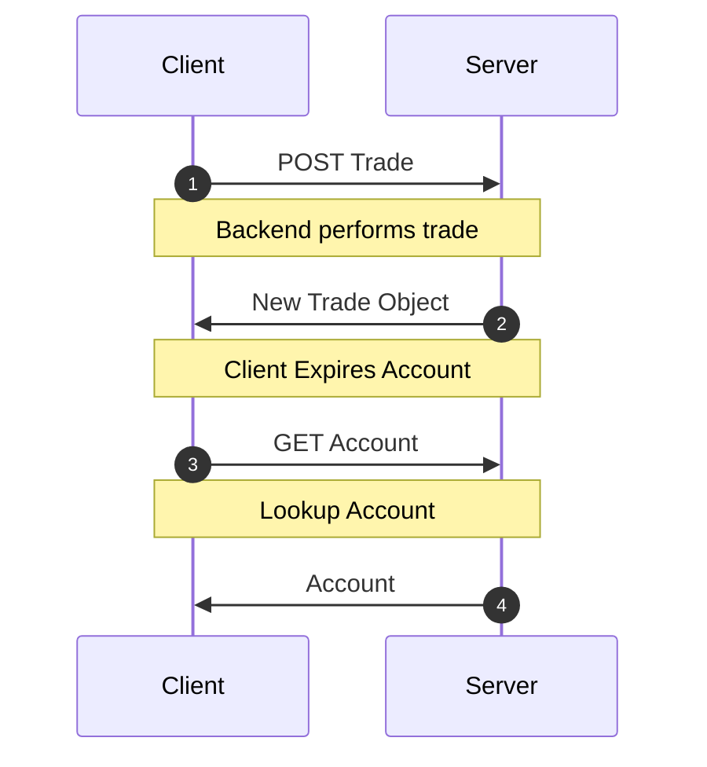
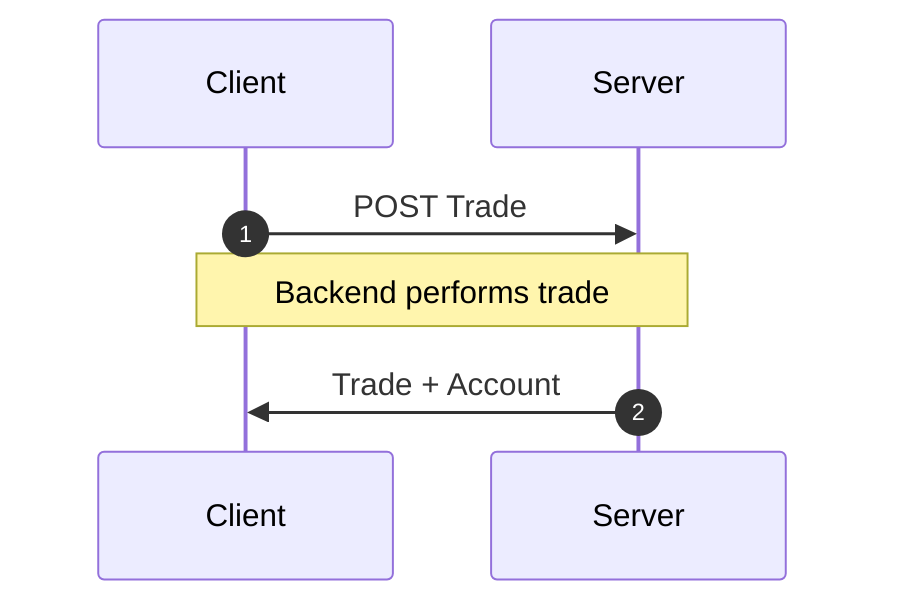

当变更会更新多个资源时，你可能会想直接
[让其他所有资源过期](/docs/api/Controller#expireAll)。

然而，只要在变更的响应中打包_所有_被更新的资源，
我们仍然可以实现高性能的原子变更，
并避免这种缓慢的网络级联请求。

<div style={{display: 'grid', gridTemplateColumns: '1fr 1fr', columnGap: '15px'}}>

<div>
<h4 style={{textAlign: 'center'}}>网络级联</h4>



</div>
<div>
<h4 style={{textAlign: 'center'}}> 响应打包</h4>



</div>

</div>

## 示例 {#example}

假设你在运营一个名为 `dogebase` 的加密货币交易平台。每当
用户创建一笔交易时，你都需要更新其账户对象中的
一些余额信息。因此在向 `/trade/` endpoint 发送 `POST` 请求时，
响应中会同时嵌套更新后的账户对象和刚刚创建的
交易。

```json title="POST /trade/"
{
  "trade": {
    "id": 2893232,
    "user": 1,
    "amount": "50.2335324",
    "coin": "doge",
    "created_at": ""
  },
  "account": {
    "id": 899,
    "user": 1,
    "balance": "1337.00",
    "coin_value": "3.50"
  }
}
```

要处理这种情况，只需更新 `schema`，让它包含这个自定义
endpoint。

```typescript title="resources/Trade.ts"
import { resource, Entity } from '@data-client/rest';
import { Account } from './Account';

export class Trade extends Entity {
  id = 0;
  user = 0;
  amount = '0';
  coin = '';
  created_at = '';
}

export const TradeResource = resource({
  path: '/trade/:id',
  schema: Trade,
}).extend(Base => ({
  create: Base.getList.push.extend({
    schema: {
      trade: Base.getList.push.schema,
      account: Account,
    },
  }),
}));
```

现在，当我们使用 [getList.push](../api/resource.md#push) Endpoint 生成方法时，
可以放心：`POST` 请求完成后，交易和账户信息都会
在缓存中得到更新。

:::react

```typescript title="CreateTrade.tsx"
export default function CreateTrade() {
  const ctrl = useController();
  const handleSubmit = payload =>
    ctrl.fetch(TradeResource.create, payload);
  //...
}
```

:::

:::vue

```html title="CreateTrade.vue"
<script setup lang="ts">
  import { useController } from '@data-client/vue';
  import { TradeResource } from './resources/Trade';

  const ctrl = useController();
  const handleSubmit = payload =>
    ctrl.fetch(TradeResource.create, payload);
  //...
</script>
```

:::

:::note

你可以为任何自定义 endpoint 随意创建全新的 [RestEndpoint](../api/RestEndpoint.md) 方法。
endpoint 会告诉 `Reactive Data Client` 如何处理任意
请求。

:::
